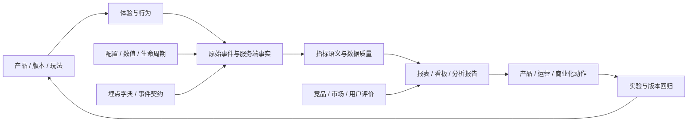

# Waje Analyst 项目背景与知识图谱快速上手

> 本文是其他 Agent 进入项目后的首要上下文。它描述项目目标、知识库结构、数据边界、核心口径、自动化流程和当前缺口；不替代各专题文档中的详细定义。

## 0. Agent 使用说明

### 先读什么

1. 先读本文，确认分析对象、数据源边界和证据等级。
2. 再读 [[项目首页]]、[[知识地图]] 和目标主题文档。
3. 涉及指标时，先读 [[分析方法与证据规范]] 和对应的数据口径文档。
4. 涉及版本、游戏数值、RTP、支付、风控或埋点时，必须先确认版本、包体、数据窗口和证据状态。
5. 涉及TC异常、提现增长或羊毛风险时，必须先读 [[../02-数据/Waje-TC异常、RTP与资产流水诊断框架-2026-08-28]]；按宏观资金、游戏/奖励拆分、尾部贡献、受限资产流水推进，禁止仅凭高TC或平均RTP给出Bug/刷子结论。
6. 产出分析报告前，先读 [[../05-运行/飞书原生文档与图表发布SOP-2026-08-11]]，默认飞书主报告、Markdown存档，HTML/PDF按需生成。

### Agent 的基本原则

- 把**事实、推断、建议**分开写，不能把日志描述、配置候选或一次体验直接写成线上事实。
- 新包是当前产品的主分析对象；老包只作历史机制参考，不能混入新包的 KPI、RTP、留存、LTV、支付或风控统计。
- 完整日、成熟 cohort、服务端事实和可复算的汇总优先；不完整日、0 值、未成熟数据和异常数据必须显式标记。
- 金融、概率、结算、风控和合规结论优先使用服务端/BQ/账务事实，客户端事件只用于路径和体验诊断。
- 默认分析报告交付飞书云文档 + Markdown 两份；HTML/PDF只在用户明确要求时生成。
- 不读取、保存或传播账号、密码、Cookie、Token、手机号码、支付账户和用户个人明细。

### 相关文档默认入库

与 Waje 项目密切相关的飞书文档、网页、PDF、Excel、图片和会议资料，完成拆解后默认写入对应 `knowledge/` 专题 Markdown，并登记来源、revision/content hash、证据状态和待确认项；随后刷新知识图谱。除非用户明确要求“只回答、不入库”，否则不要只把结论留在当前聊天窗口。详细规则见 [[../04-方法/相关文档拆解与知识入库默认工作流]]。

## 1. 项目背景与目标

Waje Analyst 是围绕 Waje Nigeria 真金/社交游戏产品建立的产品、业务、数据和竞品分析知识库。产品形态包括 H5/Web、Android、iOS，以及不同国家、渠道和分包版本；业务包含多玩法游戏、Coin/金币场、充值、提现、生命周期和风控流程。

项目不是单一报表项目，而是一条可追溯的分析链路：

```text
产品与版本变化
  → 用户体验/游戏行为/交易事实
  → 指标口径与数据质量
  → 产品、运营、商业化、风控和竞品判断
  → 实验/版本回归/优化动作
  → 结果复盘并回写知识库
```

### 主要分析问题

| 方向 | 要回答的问题 | 主要产出 |
|---|---|---|
| 产品体验 | 新用户能否完成注册、首局、首充、任务和提现路径？ | 体验报告、漏斗、问题清单、优化建议 |
| 用户与商业化 | 新包不同平台/渠道的留存、付费、LTV、TC 比、TX 率如何？ | cohort 报告、渠道/版本对比、经营看板需求 |
| 游戏与数值 | 各玩法参与、下注、结算、真实 RTP 和收益是否正常？ | 游戏/RTP 分析、数值变更验证、异常排查 |
| 支付与风控 | 充值、提现、KYC、风险拦截、资产入账是否闭环？ | 交易漏斗、对账、风险规则验证 |
| 数据治理 | 埋点、事件、版本、来源和指标是否可信？ | 事件字典、GAMEEND 修复、数据质量监控 |
| 竞品与市场 | Waje 与竞品在玩法、活动、支付、提现、舆情和监管方面如何变化？ | 日报、周报、竞品拆解、产品动作建议 |

## 2. 知识库结构与知识图谱

### 2.1 顶层目录

| 目录 | 内容 | 首要入口 |
|---|---|---|
| `knowledge/00-索引/` | 项目首页、知识地图、资产关系和 Agent 上下文 | [[项目首页]]、[[知识地图]] |
| `knowledge/01-产品/` | 产品总览、H5/App 体验、用户评价、玩法、PRD 和新手路径 | [[Waje产品总览]]、[[Waje正式版H5新手体验与数据分析报告-2026-08-14]] |
| `knowledge/02-数据/` | 数据平台、埋点、指标、生命周期、RTP、配置、看板和验收 | [[数据平台与报表]]、[[Waje全链路数据需求与埋点设计总表-2026-08-11]] |
| `knowledge/03-竞品/` | Waje/竞品动态、市场资讯、Google Play 之外的公开情报和周报 | [[Waje竞品分析]]、[[每日产品与竞品情报管道]] |
| `knowledge/04-方法/` | 证据分级、分析模板、报告和图谱方法 | [[分析方法与证据规范]] |
| `knowledge/05-运行/` | 自动化、发版、体验、Lark 采集和报告交付 SOP | [[工作日志]]、[[分析报告交付与HTML渲染规范-2026-08-14]] |
| `knowledge/_generated/` | 自动生成的代码与资产图谱，不手工编辑 | [[代码与资产图谱]] |

### 2.2 概念图



### 2.3 物理资产层

| 层级 | 路径 | 用途 |
|---|---|---|
| 原始快照 | `data/raw/YYYY-MM-DD/` | 外部公开来源、授权导出和版本原始输入；不可覆盖 |
| 标准化数据 | `data/processed/YYYY-MM-DD/` | 清洗、去重、结构化后的分析输入 |
| 分析结果 | `data/outputs/YYYY-MM-DD/` | 分析 JSON、质量回执、运行日志和交付工件 |
| 配置索引 | `data/processed/waje_config/current/` | 配置工作簿的 revision、Sheet、配置键和差异索引 |
| 报告知识库 | `knowledge/` | 可读、可搜索、可追溯的 Markdown/HTML 报告和专题笔记 |
| 图谱产物 | `knowledge/_generated/` | `code-graph.json` 与 `代码与资产图谱.md` |

截至 2026-08-17，代码与资产图谱记录 1,642 个节点、246 条关系；其中项目资产节点较多，图谱也会包含部分运行环境依赖。Agent 应优先关注 `knowledge/`、`config/`、`scripts/`、`jobs/`、`data/processed/` 和 `data/outputs/`，不要把第三方依赖当作项目逻辑。

## 3. 数据架构与系统职责

### 3.1 当前边界

```text
产品客户端 / 服务端 / 配置后台
              ↓
      原始事件与业务事实
              ↓
     BigQuery 统一统计层
              ↓
       认证指标 / 汇总 View
        ↙        ↓        ↘
     Ares      GM      Metabase / BI
```

| 系统 | 当前职责 | 使用边界 |
|---|---|---|
| 起源 / Ares | 埋点管理、行为分析、报表集市、质量、用户/页面/模块分析 | 正式业务分析和埋点语义；以 BQ 认证指标为底座 |
| BigQuery | 事件事实、订单、游戏、下注、派奖、生命周期、RTP、质量和汇总 | 统计事实和认证指标的首选；大范围查询要带分区/日期条件 |
| MySQL | 事件定义、游戏/版本/渠道字典、权限、配置和系统元数据 | 作为配置/元数据源，不在报表中硬编码配置 |
| GM | 用户维护、生命周期池、实时/历史 RTP 查询和运营排障 | 作为现有查询/排障入口；趋势分析逐步迁移到统一数据层 |
| Metabase | 受控数据访问、验证和敏捷专题看板 | 连接授权数据集；不建议直接跨 MySQL/BQ 临时关联生产明细 |
| Firebase | Android/iOS Analytics、Crash、ANR、Performance 等 | 用于设备、稳定性和性能线索；与业务事实分开核验 |
| Impala | 旧统计引擎 | 迁移并行期用于对账；新分析优先 BQ |

### 3.2 关键事实

- 报表集市中 `BQ-` 版本使用 BigQuery 新引擎；非 BQ 同名版本属于旧引擎，迁移期间必须记录数据源、刷新时间和口径差异。
- 配置工作簿是产品设计/数值证据，不自动等于线上生效配置；`current_candidate` 仍需服务端快照或命中日志验证。
- GM Lifecycle Pool V2 的基础真实回报比与新包 cohort 的终身、TC 比、TX 率不是同一指标，不能直接替代或混算。
- 最终推荐形态是：BigQuery 统一统计底座 + Ares 正式业务入口 + Metabase 受控分析/验证层；GM 保留排障和历史回溯能力。

## 4. 核心数据域与口径

### 4.1 数据域总表

| 数据域 | 主要事实 | 典型粒度 | 主来源 | 关键注意 |
|---|---|---|---|---|
| 用户/新手 | 注册、登录、首进大厅、首进游戏、首局、首充、任务和留存 | 用户 × 日期/生命周期 | BQ、Ares、H5/App 体验 | 区分注册日、首登日、首局日和首充日 |
| 游戏/玩法 | 游戏、供应商、玩法、模式、牌桌、下注、完局、派奖 | 用户 × 局/回合 | BQ、GM、游戏服务端 | `game_id + play_id + mode_id + room_id` 才能稳定拆玩法 |
| RTP/生命周期 | 基础/完全下注额、真实/预期回报比、人数、生命周期天数 | 日期 × 游戏 × 生命周期 | GM V2、BQ | 完整日、汇总方式、基础/完全口径必须同时记录 |
| 资产/支付 | 充值订单、支付结果、资产变动、提现/TX、审核和到账 | 订单/流水/账户事件 | BQ、GM、支付服务端 | 资产类型、币种、退款/冲正和账本必须可追溯 |
| 版本/投放 | 平台、版本、包名、分包、渠道、归因媒体、campaign | 用户/事件 × 版本/渠道 | Ares、BQ、配置 | H5/Android/iOS、新包/老包不能混合 |
| 风控/KYC | 风险命中、OTP、KYC/BVN、审核、拦截原因 | 用户/订单/TX × 规则版本 | BQ、GM | 只记录状态和规则 ID，不采集证件原文或生物信息 |
| 性能/稳定性 | 首屏、白屏、接口、进局、下注、充值、TX、Crash、ANR、弱网 | 设备/会话/请求 | Firebase、Ares、服务端 | 作为体验诊断，不替代交易和结算事实 |
| 竞品/舆情 | 官网、商店、活动、支付提现、公开评论、市场/监管 | 来源 × 时间 × 主题 | 公开网页/商店 | D 级线索必须标记人工核验，不直接当内部事实 |

### 4.2 核心指标口径

| 指标 | 当前使用原则 |
|---|---|
| DAU/活跃用户 | 明确用户 ID、设备 ID、日期时区和去重规则；不要把设备 UV 当用户 UV |
| D1/D3/D7 留存 | 只用成熟 cohort；数据未成熟时标记 `immature`，不以 0 代替 |
| 新增付费率 | 先确认分母是新用户、注册成功用户还是完成首登用户；源表分母未确认时不能直接命名为转化率 |
| LTV/终身 | 明确净收益、回报、奖励、退款和完整日；负值可能是业务口径或冲正，不直接判为埋点错误 |
| TC 比 / TX 率 | 沿用源报表字段，但必须记录公式、分母、资产口径和完整日；暂不自行推导新公式 |
| 实际 RTP | 优先服务端结算事实，通常按统一异常/退款规则计算 `SUM(reward_amount) / SUM(bet_amount)`；不能用配置目标值替代 |
| 基础/完全下注额 | 记录两者定义、适用范围和差额；不能把完全下注额当作基础下注额的重复统计 |
| 支付成功率 | 服务端订单状态为准，客户端点击只用于漏斗；要按支付方式、版本、渠道和失败码拆分 |
| 数据异常率 | 记录窗口、事件、来源、接收/入库/异常/丢弃/重复口径；不要跨窗口直接比较 |

### 4.3 当前已知数据快照（非实时基线）

- 新包分析 2026-08-05 快照：8 个工作表/渠道、2,370 条日期记录，新增人数合计约 548.5 万；这是当前新包分析的历史资料快照，不代替最新 BQ 查询。
- 该快照中，App 的留存、付费和 LTV 整体高于 H5；H5 Facebook 是相对弱渠道。示例值：iOS App Store 新增付费率约 31.5%、终身值约 2,948；H5 Facebook 约 7.9%、终身值约 123。必须结合数据窗口、渠道和分母阅读。
- 起源数据质量 2026-08-04 至 2026-08-10 的历史快照：总接收 490,448,347、异常属性 7,443,993、总异常率 1.51779%；`GAMEEND` 异常 7,030,603 / 112,635,044，约 6.24%，当时列为 P0。此数值有明确窗口，不是当前实时指标。
- 最近一次本地情报运行（2026-08-16）13 个来源均成功抓取、原始 69 条、去重后 53 条，但公众号授权采集为 0，整体状态 `degraded`；该状态不能理解为所有信息完整。

详细字段、公式和 SQL 见 [[Waje埋点事件与属性字典-2026-08-11]]、[[Waje数据指标看板映射与研发验收清单-2026-08-11]] 和 [[新包分析报告-2026-08-05]]。

## 5. 埋点、事件链路与质量重点

### 5.1 统一事件信封

核心事件至少应包含：

```text
event_name, event_version, event_uid
event_time_client, event_time_server, received_at
source, platform, app_version/web_version, package_name
channel, attribution_media, user_id, uuid, session_id, trace_id
country, currency, asset_type, game_id, play_id, mode_id, room_id
lifecycle_day, is_robot, experiment_id, config_version
is_retry, retry_count, is_duplicate, schema_version, source_version
error_code, error_message, raw_payload_hash
```

必须区分客户端时间、服务端时间和入库时间；用户 ID、起源 ID 和设备 ID；事件次数、用户数和设备数；真金、Coin 和奖励资产。

### 5.2 关键业务链路

```text
INSTALL/AL
  → REGISTER → LOGIN
  → PV/MV/MC（页面/模块/功能）
  → GAMESTART
  → BET 尝试/成功/失败
  → GAMEEND
  → BETREWARD
  → ASSET
  → ORDER / WITHDRAW / AUDIT
  → D1/D7 / 生命周期
```

### 5.3 GAMEEND：当前 P0 治理对象

当前已盘点的 `GAMEEND` 属性包括 `game_type`、`game_time`、`status`、`battle_id`、`unique_id`、`room_id`、`play_id`、`mode_id`、`bet_num`、`cash_settlement`、`is_robot` 等。研发和分析必须补齐：

- `status`、`end_reason`、`end_action_state` 的类型、枚举、默认值和空值策略；
- `unique_id`、`unique_id_bar`、`battle_id` 的唯一性、重试幂等和关联规则；
- 金额最小单位、币种、资产类型和负值/退款规则；
- `game_time`、`bet_count`、`player_num` 等非负约束；
- 客户端/服务端、版本、包、渠道、`trace_id` 和 `config_version`；
- `is_robot` 是否进入业务报表，机器人与真人的分母必须明确。

基本对账链：`GAMESTART → GAMEEND → BETREWARD → ASSET`；金融链：`ORDER/WITHDRAW/AUDIT → ASSET`。

### 5.4 质量阈值

| 规则 | 处置 |
|---|---|
| GAMEEND 异常率 > 1% | 预警，按版本/包/渠道/游戏拆分 |
| GAMEEND 异常率 > 3% | P1，暂停将该窗口作为稳定业务基线 |
| 核心事件入库率 < 99% | P1，检查客户端、服务端、采集和丢弃链路 |
| 下注/结算/资产无法对账 | P0，优先修复并冻结相关金额结论 |
| 金融事实金额差异 > 0.1% | P0，检查订单、回调、账本、退款和汇率 |
| 新版本核心事件量较基线下降 > 30% | P1，检查版本、包、埋点、发布和流量变化 |

## 6. 新包、老包与配置资料边界

### 6.1 包体规则

| 标识 | 定义 | 可用于 | 禁止用于 |
|---|---|---|---|
| `new_current_primary` | 新包工作表/当前上线产品主分析对象 | 新包 KPI、版本对比、RTP、留存、LTV、支付和风控分析 | 将日志描述直接当作现网配置 |
| `old_historical_reference` | 老包/历史上线产品 | 机制演进、历史问题模式、假设和字段设计 | 新包统计分母、基线、加权结果和现行阈值 |
| `current_candidate` | 配置工作簿中可能当前使用的配置 | 提出验证任务、解释配置线索 | 直接认定为线上生效规则 |
| `historical_reference` / `obsolete` | 历史、旧版或作废配置 | 历史参考和清理审计 | 当前产品结论和现行数值 |

新包与老包出现同类策略时，只能写成“机制演进对照”，不能推导因果或默认复用旧数值。配置工作簿当前基线为 revision `17313`，67 个 Sheet、14 个隐藏页、24,305 条配置索引记录；其中 39 个 Sheet 为 `current_candidate`，27 个为 `historical_reference`，1 个为 `obsolete`。这些是资料证据状态，不是生产状态证明。

关联资料：[[Waje新老包游戏记录与数值设定资料库-2026-08-13]]、[[Waje产品游戏配置资料库]]。

### 6.2 数据清洗硬规则

- 不完整天不进入趋势、RTP、生命周期和付费结论，除非报告明确标为实时或未结算。
- 未成熟 cohort 的 D7/D15/D30/D60 不能以 0 代表流失。
- 全 0、负值、重复值和回补值先查口径、退款、冲正、缺失和数据延迟，再决定是否排除。
- 一份工作簿内不同 Sheet 不可直接相加；先确认粒度、分母、汇总方式和来源。
- 版本、平台、分包、渠道、归因媒体、国家和时区必须能拆分，否则标记口径风险。

## 7. 自动化任务与运行流程

### 7.1 每日产品与竞品情报

当前项目自动化主任务采用 Codex Spark（`gpt-5.3-codex-spark`）执行脚本驱动流程，时区 Asia/Hong_Kong。核心计划为：工作日 10:15 晨会纪要、每日 20:20 Google Play 评价、周一 08:00 Play 专项周报、周一 10:00 总周报 HTML、周五 15:00 情报采集/配置资料库、周五 17:00 总周报。主要入口：

```bash
cd /Users/robin/Documents/wajetan_analyst
python3 scripts/run_release_experience_watch.py
python3 scripts/run_daily_pipeline.py
```

执行链路：公开产品/竞品来源 → 原始快照 → 清洗标准化 → 去重 → 主题分析 → 质量回执 → Markdown/HTML 报告 → 知识库与图谱刷新。运行日志位于 `data/outputs/YYYY-MM-DD/run-log.json`，质量回执位于 `data/outputs/YYYY-MM-DD/quality.json`。

### 7.2 版本体验监控

只有 `release-watch.json` 的 `status=release_detected` 才能创建版本体验/数据对比任务；配置 revision 变化只能标为待确认，不能视为已发布。

实际体验必须在用户已打开并授权的测试/沙盒会话中，采用单账号、正常用户路径。禁止保存凭据、真实外部支付/提现、绕过资格/KYC/风控、并发重试和批量领取。福利/数值测试只验证一次性领取、资格隔离、资产类型、版本切换、结算和账本对账。

### 7.3 Google Play 评价

- 日采集和分析：`robin-google-play-spark` → `scripts/run_play_reviews_pipeline.py --period daily`，计划每日 20:20。
- 周报：`robin-google-play-spark-2` → `--period weekly --skip-collect`，计划每周一 08:00。
- 总周报 HTML：`robin-waje-html-spark` → `scripts/build_weekly_intelligence_html.py`，计划每周一 10:00。
- 原始评价：`data/raw/play_reviews/YYYY-MM-DD/`；标准化和索引：`data/processed/play_reviews/`；报告：`knowledge/01-产品/Google Play用户评价/日报/` 和 `周报/`。
- 评价是公开 D 级证据，只能支持用户线索和运营优先级；支付、结算和故障要回到内部事实核验。

### 7.4 公众号文章专项

公众号阶段只接受授权只读 API 或研发提供的 HTML/JSON/ZIP 导出；不通过安装爬虫绕过平台访问限制，不根据链接参数猜测正文。当前 2026-08-16 运行的授权采集状态为 0 篇、`no_authorized_export_found`，因此情报管道整体标记 `degraded`。认证信息只通过环境变量或密钥管理注入。

### 7.5 配置工作簿每周更新

当前 `robin-waje-2`（Codex Spark）每周五 15:00 读取配置工作簿：先比对 revision，未变化则记录 `skipped_no_revision`；变化则遍历全部 Sheet（包括隐藏页），输出新增/修改/删除差异，刷新 `data/processed/waje_config/` 和配置专题知识库。

### 7.6 图谱刷新

新增或修改知识文件后执行：

```bash
python3 tools/build_graph.py
```

`knowledge/_generated/` 是生成目录，不手工修改。图谱是导航和血缘辅助，不是业务指标来源。

## 8. Agent 标准工作流

### 8.1 接到分析任务后的步骤

1. 判断任务属于产品、数据、游戏数值、支付风控、版本、竞品还是运行维护。
2. 读取本文、[[项目首页]]、[[知识地图]] 和对应专题文档。
3. 查找输入的原始快照、标准化结果、质量回执和来源定位；不要只看已有结论。
4. 固定分析窗口、时区、包体、版本、平台、渠道、游戏、生命周期和数据成熟度。
5. 先定义指标公式和分母，再计算或调用现有查询；BQ 查询优先使用只读、聚合和最小范围。
6. 输出“事实 → 解释/推断 → 风险 → 建议动作 → 验证指标”，并标出待人工确认项。
7. 需要改变系统配置、发送消息、发起支付/提现、绕过权限或外部发布时，停止并请求明确授权。
8. 报告落地后更新相关索引，必要时刷新图谱；保留历史文件，不覆盖原始快照。

### 8.2 推荐输出结构

```text
标题 / 日期 / 数据窗口
执行摘要
范围与证据边界
核心指标与口径
事实发现
分群/版本/渠道/玩法拆解
异常与可能原因
产品/运营/数据动作
验收指标与回归标准
来源、数据质量和待确认项
```

## 9. 当前项目缺口与交接事项

| 缺口 | 影响 | Agent 处理方式 |
|---|---|---|
| BQ/MySQL 物理表名和部分正式公式未完全映射 | SQL 只能提供模板，无法直接认证所有结果 | 标记“待研发映射”，不要虚构表名和公式 |
| 配置候选缺少完整服务端生效快照 | 变更日志不能证明当前线上规则 | 请求 `config_version`、生效区间和命中日志 |
| 页面/模块/部分属性页面曾返回“暂无数据” | 不能据此认定没有配置 | 标记“平台实测待补证” |
| 生命周期日期存在非连续窗口，重复充值字段曾全 0 | 生命周期长度和复购结论可能失真 | 过滤不完整窗口，核对计算逻辑和回补情况 |
| 公众号授权导出/API 尚未稳定提供 | 公众号专项周报可能为空或降级 | 保留失败状态，不猜测文章正文 |
| 情报源可能有重复或 transport fallback | 公开资讯需去重和人工核验 | 读取 quality.json 的去重率、失败源和人工复核数 |
| 老包和新包存在同名游戏/机制 | 容易造成错误对比 | 始终使用 `package_scope` 和 `evidence_state` 过滤 |

## 10. 关键文档索引

### 项目与产品

- [[项目首页]]
- [[知识地图]]
- [[资产地图]]
- [[Waje产品总览]]
- [[产品部门知识库总览-2026-08-11]]
- [[Waje产品与体验分析报告]]
- [[Waje正式版H5新手体验与数据分析报告-2026-08-14]]
- [[WajeGame PRD分级规范-试运行版v1.0-2026-08-04]]

### 数据、埋点与看板

- [[数据平台与报表]]
- [[起源三大数据模块架构盘点-2026-08-07]]
- [[Ares与Metabase看板建设方案对比分析-2026-08-05]]
- [[Waje数据平台架构梳理和优化整合方案-2026-08-07]]
- [[埋点与数据上报地图]]
- [[Waje全链路数据需求与埋点设计总表-2026-08-11]]
- [[Waje埋点事件与属性字典-2026-08-11]]
- [[Waje数据指标看板映射与研发验收清单-2026-08-11]]
- [[GAMEEND埋点异常修复清单-2026-08-03]]
- [[Waje产品游戏配置资料库]]
- [[Waje新老包游戏记录与数值设定资料库-2026-08-13]]
- [[Waje-TC异常、RTP与资产流水诊断框架-2026-08-28]]
- [[KYC人脸识别核心设计逻辑与机制拆解-2026-08-17]]
- [[金币包与金币场产品机制、指标与埋点设计-2026-08-17]]
- [[真金内嵌Ludo金币场-APP-H5数据指标与埋点设计-V2-2026-08-19]]
- [[ForYou游戏推荐数据指标与埋点设计-2026-08-20]]
- [[Waje原始数据资产目录-2026-08-04]]
- `data/processed/waje_config/current/configuration-index.json`

### 竞品、体验与运行

- [[Waje竞品分析]]
- [[每日产品与竞品情报管道]]
- [[分析方法与证据规范]]
- [[Waje版本体验与福利风控验证SOP-2026-08-14]]
- [[分析报告交付与HTML渲染规范-2026-08-14]]
- [[Lark只读静默采集实施指南-2026-08-11]]
- `jobs/manifest.json`
- `config/intel_sources.json`
- `config/play_reviews.json`
- `config/release_experience_watch.json`
- `config/waje_config_workbook.json`

## 11. 一句话交接

> 这是一个以 Waje 新包为当前分析主线、以 BigQuery 服务端事实为统计底座、以起源/Ares 为正式分析入口、以 GM/Metabase 为查询和验证补充、以埋点质量和版本回归保证可信度的产品与业务分析项目；任何结论都必须带时间窗口、数据口径、包体/版本和证据等级。
