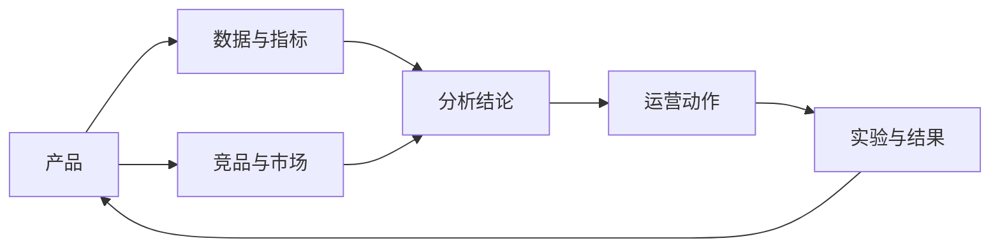

# 知识地图

## 知识域

- [[00-索引/Agent项目背景与知识图谱快速上手-2026-08-17]]：其他 Agent 的项目背景、数据边界、核心口径、自动化和当前缺口。
- [[01-产品/Waje产品总览]]：玩法、用户路径、商业化逻辑和产品问题。
- [[01-产品/Waje产品与体验分析报告]]：注册、玩法、充值、提现、促销和用户体验观察。
- [[01-产品/WajeGame PRD分级规范-试运行版v1.0-2026-08-04]]：需求分级、数据系统专项附录、发布验证和风险治理。
- [[01-产品/轻量化游戏分析-研究结论与产品建议-2026-08-04]]：新手点击、0 局/非 0 局、渠道差异、COLOR GAME 和 JADE 改造结论。
- [[02-数据/数据平台与报表]]：起源、GM、Metabase、指标口径和报表资产。
- [[02-数据/GM与起源报表平台重构方案-2026-08-06]]：GM与起源统一信息架构、10个核心指标、筛选机制、下钻和实施路线。
- [[02-数据/起源三大数据模块架构盘点-2026-08-07]]：起源、ARES、BI三端定位、页面结构、数据边界、问题和整合路线。
- [[02-数据/数据平台开发侧现状与治理待办-2026-08-07]]：Google Cloud/BigQuery、Gemini、Metabase、GM定位，以及平台治理、迁移和权限待办。
- [[02-数据/Waje数据平台架构梳理和优化整合方案-2026-08-07]]：数据平台现状、目标架构、系统与权限边界、报表重组、实施路线和验收标准。
- [[02-数据/版本数据分析资料入库-2026-08-04]]：Lark 版本数据分析目录的文档清单、主题拆解、字段线索和统一口径要求。
- [[02-数据/发版报告资料入库-2026-08-04]]：APP/H5/Android/iOS 发版版本线、功能配置变更和发布后验证清单。
- [[02-数据/飞书埋点方案-事件模型概念介绍-2026-08-04]]：客户端六类基础事件、预置属性、业务参数和指标口径。
- [[02-数据/起源埋点设计细节-元事件清单-2026-08-04]]：起源平台当前元事件清单、MC 字段样本、新手生命周期和付费链路映射。
- [[02-数据/Waje-H5起源埋点上报全量盘点-2026-08-28]]：基于历史资料和 Ares 当前只读配置/质量页的 H5 页面、元事件、字段、来源和质量状态盘点。
- [[02-数据/埋点与数据上报地图]]：事件分层、上报链路、数据质量和后续补齐清单。
- [[02-数据/轻量化游戏分析-指标口径与数据验证清单-2026-08-04]]：轻量化漏斗、指标定义、口径风险和验证优先级。
- [[02-数据/Waje-TC异常、RTP与资产流水诊断框架-2026-08-28]]：提充比异常、RTP、Bonus、资产流水和受限玩家核查的统一诊断路径。
- [[02-数据/GAMEEND埋点异常修复清单-2026-08-03]]：GAMEEND 异常排查路径、事件级监控、验收 SQL 和回归标准。
- [[03-竞品/Waje竞品分析]]：竞品能力、市场信号、用户反馈和借鉴结论。
- [非洲真金博彩市场报告](../../africa-real-money-gambling-market-report.html)：国家市场、监管约束和产品机会。
- [[04-方法/分析方法与证据规范]]：证据等级、分析模板、数据质量和结论写法。
- [[05-运行/工作日志]]：权限、学习、分析任务和阶段性进展。
- [[05-运行/Codex Spark自动化任务矩阵与调度规范-2026-08-21]]：脚本驱动定时任务、模型选择、手动浏览器边界和失败回执规范。
- [[05-运行/2026-08-24-生命周期价值飞书在线更新复盘与采集优化SOP]]：GM 生命周期数据采集、飞书在线写入、类型校验和本次失败节点复盘。
- [[05-运行/Android发版流程与职责拆解-2.17.0-2026-08-11]]：Android 从分支与测试服验证、提审、生产发布、渠道包回归到发布后监控的流程、职责与控制点。
- [[05-运行/iOS发版流程与职责拆解-2.17.0-2026-08-11]]：iOS 从 TestRelease、苹果提审与 TestFlight 到 App Store 回归的流程、职责与控制点。

## 维护规则

1. 新知识先落到具体主题笔记，再补一条到本地图谱的链接。
2. 结论必须区分“事实、推断、建议”，并附来源或验证计划。
3. 指标先写口径，再写数值；变更口径时保留旧版本说明。
4. 工作日志只记录过程，成熟结论回填到产品、数据或竞品笔记。
