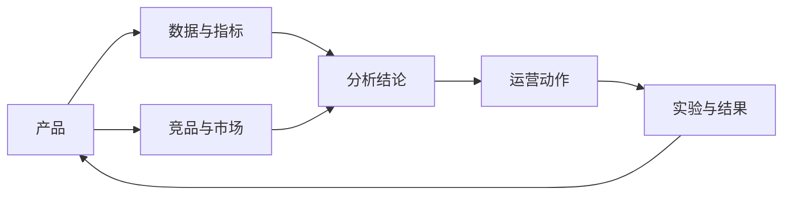

# 知识地图

## 知识域

- [[01-产品/Waje产品总览]]：玩法、用户路径、商业化逻辑和产品问题。
- [[02-数据/数据平台与报表]]：起源、GM、Metabase、指标口径和报表资产。
- [[03-竞品/Waje竞品分析]]：竞品能力、市场信号、用户反馈和借鉴结论。
- [[04-方法/分析方法与证据规范]]：证据等级、分析模板、数据质量和结论写法。
- [[05-运行/工作日志]]：权限、学习、分析任务和阶段性进展。

## 维护规则

1. 新知识先落到具体主题笔记，再补一条到本地图谱的链接。
2. 结论必须区分“事实、推断、建议”，并附来源或验证计划。
3. 指标先写口径，再写数值；变更口径时保留旧版本说明。
4. 工作日志只记录过程，成熟结论回填到产品、数据或竞品笔记。
