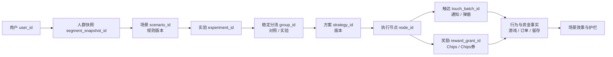

# 用户分层与场景运营 V1.0–V1.1：数据观测与埋点设计

> 版本：V1.0｜文档状态：待产品、研发、数据、QA 评审｜创建日期：2026-08-11  
> 适用范围：规则型场景运营（V1.0）及其单场景多实验组升级（V1.1）。  
> 不代表需求、接口、模型服务或生产环境已经上线。

## 1. 目标与边界

### 1.1 需要解决的问题

用户分层不是“给一批用户送奖励”的后台配置能力，而应形成可复盘的经营实验闭环：**谁在何时因何种规则进入场景、被分配到哪个方案、收到何种动作、是否完成目标、增量收益是否覆盖成本、是否带来风险**。

V1.0 已定义规则型场景、奖励、通知和 H5/APP 领取体验；V1.1 将“场景”升级为实验容器，增加对照组、多个实验方案、稳定分流、执行节点、全流程对比和执行中心。本设计将二者统一为一套可追溯的数据模型。

### 1.2 本期范围

| 纳入 | 说明 |
|---|---|
| 规则场景 | 新注册未首充、首充后未游戏、首充未复充、活跃未充值、充值未游戏、当日输赢、历史高价值沉默 |
| 实验能力 | 用户级稳定分流、对照组、实验组、方案与节点版本、一次性场景生效控制 |
| 运营动作 | 奖励、Chips 券、通知、站内弹窗及其送达/展示/领取/失败记录 |
| 结果回收 | 游戏、充值、复充、留存、奖励成本、风险与运营效率 |
| 数据治理 | 事件版本、服务端事实、数据质量、对账、权限和审计 |

| 不纳入 | 处理原则 |
|---|---|
| V1.2 预测模型、固定人群 | 仅预留 `model_batch_id`、`segment_snapshot_id` 等扩展字段，不列为 V1.1 上线阻断项 |
| KYC 人脸生物信息 | 不采集、不传输、不分析；本期不将 KYC 用于人群规则。未来若接入，仅允许经合规审批的认证状态枚举 |
| 财务利润核算 | 场景经营效果使用支付/账务事实和奖励成本；财务计提、分摊和总账以财务语义层为准 |

## 2. 产品对象与数据闭环

### 2.1 对象层级



**关键原则：** 用户、场景、实验组、策略版本和触达批次必须共同出现在可关联的事实记录中。只记录“某奖励被领取”无法证明其来自哪个场景，也无法与对照组比较。

### 2.2 标准数据流程

```text
服务端规则计算
→ 记录每次评估、命中或排除原因
→ 冻结人群快照
→ 按 user_id Hash 稳定分流
→ 执行方案节点
→ 发奖 / 请求通知 / 展示弹窗
→ 记录送达、展示、点击、到账、领取与失败
→ 关联服务端游戏、支付、账务和留存事实
→ 在 D0、D1、D7 成熟窗口内比较实验组与对照组
```

### 2.3 实验分流规则（统一标准）

1. 以登录后的 `user_id` 为唯一分流单位；匿名设备仅可用于漏斗诊断，不得进入付费效果分母。
2. `hash(user_id + experiment_id + allocation_version)` 决定组别，同一用户在实验有效期内必须稳定进入同一组。
3. 默认保留 10% 对照组；场景可配置比例，但调整比例、开关、规则或奖励后必须生成新 `allocation_version` / `strategy_version`。
4. 同一 `scenario_id + rules_version + user_id` 的一次性场景只允许成功进入一次；重试使用同一幂等键，不能重复发奖。
5. 主分析采用 ITT（按分配组分析）；实际触达、展示、领取作为过程漏斗，不得替代分组结果。

## 3. 指标体系与口径

### 3.1 共用漏斗

| 层级 | 指标 | 公式 / 口径 | 主要用途 |
|---|---|---|---|
| 规则 | 评估用户数 | 有 `SCENE_EVALUATED` 的去重 `user_id` | 规则运行规模与异常发现 |
| 人群 | 场景命中率 | 命中用户数 ÷ 评估用户数 | 判断阈值是否过宽/过窄 |
| 实验 | 分流完整率 | 有实验分组用户数 ÷ 场景命中用户数 | 检查分流漏数 |
| 执行 | 节点执行成功率 | 成功节点数 ÷ 应执行节点数 | 检查规则/任务稳定性 |
| 触达 | 可触达率 / 送达率 | 请求成功用户 ÷ 应触达用户；送达成功 ÷ 请求成功 | 判断渠道与权限问题 |
| 响应 | 展示率、点击率、领取率 | 各阶段用户 ÷ 上一阶段用户 | 解释触达和奖励体验 |
| 业务 | 场景主转化率 | 在预定义窗口完成目标的用户 ÷ 分组用户 | 衡量经营目标 |
| 增量 | 绝对增量 / 相对提升 | `rate_treatment - rate_control`；`Δ / rate_control` | 判断是否继续、扩大或停止方案 |
| 经济 | 单转化成本、净收益 | 奖励成本 ÷ 增量转化；增量净收入 − 奖励成本 | 判断经营效率 |
| 护栏 | 风险、投诉、提现、异常率 | 指标须同时比较实验组与对照组 | 防止“转化好但质量差” |

### 3.2 场景—目标指标矩阵

| 场景 | 入组条件（概述） | 主指标 | 观察窗口 | 关键护栏 |
|---|---|---|---|---|
| 新注册未首充 | 注册后 N 分钟未充值 | 首充转化率、首充时延 | D0 / D1 | 奖励成本、支付失败、提现风险 |
| 首充后未游戏 | 首次充值后 N 分钟未投注 | 充值后首局率、首局时延 | D0 | 首局失败、结算有效性、奖励后未开局 |
| 首充未复充 | 首充后 M 分钟未二次充值 | 7 日复充率、复充时延 | D1 / D7 | 净收入、退款/冲正、过度激励 |
| 活跃未充值 | 当日登录/游戏后仍未充值 | 当日付费转化率 | D0 | 打扰频次、投诉、取消订阅 |
| 充值未游戏 | 当日充值后 M 分钟未投注 | 充值后下注率、首局率 | D0 | 加载/下注/结算失败、余额异常 |
| 当日赢钱 / 亏损 | 累计投注与回收达到条件 | 复投率、D1 活跃率 | D0 / D1 | 用户收益率口径、RTP、奖励成本 |
| 历史高价值沉默 | 历史充值/投注高且近期未活跃 | 召回率、回归后付费、D7 活跃 | D1 / D7 | 触达成本、退订、封禁/提现风险 |

> 用户级当日收益率 `P = 当日累计回收 / 当日累计投注` 仅是场景规则或用户行为指标；不得与游戏理论 RTP、实测 RTP、GM 回报比或平台利润混用。

### 3.3 归因与成熟规则

| 规则 | 设计要求 |
|---|---|
| 归因起点 | `assigned_at` 为 ITT 效果观察起点；触达、展示、领取分别作为过程起点，不覆盖分组事实 |
| 转化归因 | 订单、有效局、奖励流水保留 `scenario_id`、`experiment_id`、`group_id`、`touch_batch_id`；未带上下文的事实只进入自然行为，不计场景直接归因 |
| 时间窗口 | D0：当天自然日；D1/D7：按用户所在业务时区的完整自然日 cohort。未达到窗口者显示“未成熟”，不得补 0 |
| 重叠场景 | 必须记录 `scenario_priority` 与 `conflict_policy`；一个用户同一时段触达多个场景时，按优先级或互斥规则处理 |
| 效果判断 | 输出样本量、对照组基线、绝对增量、相对提升、95% 区间和护栏差异；样本不足只能显示方向，不下业务结论 |

## 4. 数据源与事实边界

| 主题 | 正式事实源 | 起源现有事件 / 数据对象 | 本期要求 |
|---|---|---|---|
| 场景与分流 | 运营后台服务端、BigQuery 运营事实层 | 现无完整标准事件 | 新建场景、分流、执行、审计事实表与事件 |
| 页面/弹窗交互 | H5 / APP 客户端 | `PV`、`MV`、`MC`、`PUSHCLICK` | 扩展场景、实验、触达和奖励上下文 |
| 游戏与下注 | 游戏服务端结算 | `GAMESTART`、`GAMEEND`、`BETREWARD` | 以服务端 `round_id`、下注/派奖事实为准；修复 `GAMEEND` 异常后方可作辅助校验 |
| 充值/复充 | 支付与账务服务端 | `ORDER`、`ASSET` | 明确创建、提交、成功、失败、退款、冲正状态；成功支付/账务为正式口径 |
| 奖励/券 | 奖励服务端与资产流水 | `TRIGGERGIFT`、`GETITEM`、`USEITEM`、`RECEIVETASK` | 奖励发放、到账、领取、使用、过期可逐笔对账 |
| 推送/通知 | 通知服务、客户端回调 | `PUSHRECEIVED`、`PUSHCLICK` | 记录请求、供应商接收、送达、展示、点击、失败原因 |

## 5. 统一字段契约

### 5.1 所有新增运营事件必填字段

| 字段 | 类型 | 说明 |
|---|---|---|
| `event_uid` | string | 单条事件唯一键；服务端重试必须复用或可追溯 |
| `event_name` / `event_version` | string | 大写事件编码及契约版本，如 `SCENE_EVALUATED` / `v1` |
| `server_ts` / `client_ts` | timestamp | 服务端事实时间优先；客户端时间用于体验诊断 |
| `user_id` | string | 经营、付费、留存和实验唯一用户口径 |
| `scenario_id` / `rules_version` | string | 场景与规则版本 |
| `segment_snapshot_id` | string | 此次场景计算所用人群快照；规则场景可由系统自动生成 |
| `experiment_id` / `group_id` | string | 实验与对照/实验组标识 |
| `allocation_version` | string | 稳定分流算法和比例版本 |
| `strategy_id` / `strategy_version` / `node_id` | string | 方案、版本、执行节点 |
| `touch_batch_id` / `reward_grant_id` | string | 触达与奖励链路键；无对应对象时明确为 `null` |
| `status` / `reason_code` / `error_code` | string | 成功、失败、跳过及原因；禁止只记录“失败” |
| `channel` / `client_type` / `app_or_h5_version` | string | Push、站内信、弹窗等渠道及端/版本 |
| `request_id` / `trace_id` | string | 服务调用和故障排查关联键 |

### 5.2 新增事件需求

| 优先级 | 事件编码 | 触发方与时机 | 核心专有字段 | 目的 |
|---|---|---|---|---|
| P0 | `SCENE_EVALUATED` | 服务端每次规则评估完成 | `evaluation_id`、`evaluation_result`、`exclusion_reason`、`rule_inputs_hash` | 解释未入组原因、核验规则规模 |
| P0 | `SCENE_ENTERED` | 用户命中场景且完成幂等入组 | `entry_id`、`entry_rank`、`conflict_policy`、`eligible_at` | 冻结场景入组事实 |
| P0 | `EXPERIMENT_ASSIGNED` | 场景入组后完成稳定分流 | `assignment_id`、`group_type`、`allocation_bucket`、`allocation_hash_version` | 对照/实验可复算 |
| P0 | `OPERATION_NODE_EXECUTED` | 每个方案节点执行完毕 | `execution_id`、`action_type`、`execution_result`、`skip_reason` | 执行中心、失败定位、频控检查 |
| P0 | `TOUCH_REQUESTED` | 系统请求发送通知/站内信/弹窗 | `touch_id`、`template_id`、`send_provider`、`scheduled_at` | 统计应触达与渠道请求 |
| P0 | `TOUCH_DELIVERED` | 通知服务返回最终送达/失败状态 | `touch_id`、`provider_message_id`、`delivery_status`、`provider_error_code` | 送达率及渠道故障 |
| P0 | `REWARD_GRANTED` | 奖励服务完成发放并写入账本 | `reward_id`、`reward_type`、`asset_type`、`amount`、`expire_at`、`ledger_id` | 奖励成本、到账及重复发放对账 |
| P0 | `REWARD_CLAIMED` | 用户成功领取或激活奖励 | `reward_grant_id`、`claim_result`、`claim_channel` | 领取率和领取失败原因 |
| P1 | `REWARD_PRESENTED` | 客户端弹窗/奖励入口真实展示 | `touch_id`、`reward_grant_id`、`page_id`、`module_id`、`display_ms` | 区分“已送达”与“用户实际看到” |
| P1 | `REWARD_CLAIM_CLICKED` | 用户点击领取 | `reward_grant_id`、`element_id`、`ui_result` | 定位 UI 点击/接口失败 |
| P0 | `SCENE_CONFIG_CHANGED` | 后台创建、修改、启停、复制、回滚 | `change_id`、`operator_id`、`change_type`、`before_version`、`after_version`、`approval_id` | 审计、回放和风险控制 |

### 5.3 既有事件的强制扩展

| 既有事件 / 事实 | 必须补齐字段 | 规则 |
|---|---|---|
| `ORDER` / 支付事实 | `order_id`、`order_status`、`paid_at`、`refund_at`、`reversal_at`、金额/币种、场景实验上下文 | 拆分创建、支付成功、支付失败、退款、冲正；支付成功与账务一致才进入转化 |
| `ASSET` / 奖励账本 | `ledger_id`、`asset_type`、`change_type`、`amount`、`source_type`、`reward_grant_id` | `REWARD_GRANTED` 与资产流水一一或可解释地多对一关联 |
| `GAMESTART` / 游戏事实 | `round_id`、`game_id`、`play_id`、场景实验上下文 | 用于“充值后未游戏”“首局”转化 |
| `GAMEEND` / 结算事实 | `round_id`、`end_reason`、有效结算状态、下注/派奖、异常标记 | 当前异常修复前，不得作为唯一事实源 |
| `PUSHCLICK` | `touch_id`、`template_id`、`scenario_id`、`experiment_id`、落地页 | 与服务端送达记录关联，避免把自然打开误算为触达点击 |
| `MC` / `MV` / `PV` | `scenario_id`、`experiment_id`、`reward_grant_id`、固定 `element_id` | 支持弹窗/入口曝光、点击、领取 UI 漏斗 |

## 6. 建议事实表与看板

| 数据集 / 表 | 粒度 | 核心主键 | 用途 |
|---|---|---|---|
| `fact_scene_evaluation` | 一次用户规则评估 | `evaluation_id` | 规则规模、排除原因、数据质量 |
| `fact_scene_entry` | 一次成功场景入组 | `entry_id` | 人群快照、互斥、一次性生效 |
| `fact_experiment_assignment` | 一次用户分组 | `assignment_id` | 稳定分流与 ITT 分母 |
| `fact_operation_execution` | 一个节点一次执行 | `execution_id` | 执行中心、频控、失败原因 |
| `fact_touch_delivery` | 一次触达状态流转 | `touch_id` | 请求、送达、展示、点击、失败 |
| `fact_reward_ledger` | 一笔运营奖励账本 | `reward_grant_id` / `ledger_id` | 成本、到账、领取、使用、过期 |
| `fact_scene_outcome_daily` | 用户—场景—实验—日期 | 复合键 | D0/D1/D7 游戏、支付、留存和护栏结果 |
| `dim_scenario_version` | 场景/策略版本 | `scenario_id + rules_version` | 规则、优先级、频控、owner、状态 |

**运营实验看板最小页面**

1. **场景总览：** 评估、命中、分流、节点成功、触达、领取、主转化、增量、奖励成本、护栏。
2. **实验对比：** 对照组与各实验组的样本量、转化率、绝对/相对增量、置信区间、D0/D1/D7。
3. **执行中心：** 任务状态、输入人数、成功/失败/跳过人数、失败原因、耗时、重试与批次。
4. **奖励与渠道：** 奖励到账/领取/过期、Push/站内信/弹窗送达和点击、按模板与版本对比。
5. **风险与质量：** 奖励重复、订单/资产对账差异、`GAMEEND` 异常、数据延迟、投诉/提现/封禁风险。

## 7. 数据质量、权限与验收

### 7.1 上线阻断项

| 类别 | 验收条件 |
|---|---|
| 主键 | `user_id`、`scenario_id`、`experiment_id`、`group_id`、`strategy_version`、`touch_batch_id` 可在全链路关联；无空值漏斗分母 |
| 分流 | 同一用户同一实验稳定归组；组别比例误差在配置容忍范围内；对照组没有运营动作 |
| 幂等 | 场景进入、节点执行、奖励发放、资产流水可按幂等键去重；重试不产生重复奖励 |
| 资金与奖励 | 支付成功订单、奖励账本、资产流水可对账；退款/冲正从转化和净收益中正确扣除 |
| 游戏 | `round_id` 完整；有效局与异常局可分开；`GAMEEND` 异常未修复时自动降级为服务端结算事实 |
| 留存 | D1/D7 只统计成熟 cohort；未成熟日期为 `N/A`，不显示为 0% |
| 审计 | 所有配置变更有操作人、审批、前后版本和生效时间；高风险奖励可追踪与回滚 |

### 7.2 安全与权限

- 数据看板默认展示聚合数据；用户、订单、奖励和资产明细按最小权限在受控环境下下钻。
- 埋点、日志和看板不得写入人脸图像、人脸特征、证件号、手机号、密码、Token 或支付凭证。
- `operator_id`、`user_id` 等标识进入明细层时须继承 Metabase / 数据平台访问、导出和审计规则。
- 场景配置、奖励金额、分流比例和模板变更视为高风险运营操作，必须保留变更记录和审批关联。

## 8. 实施优先级与责任划分

| 阶段 | 交付 | 主要责任 | 验收人 |
|---|---|---|---|
| P0A：数据契约 | 事件字典、字段字典、场景/实验/奖励主键、订单状态定义 | 数据产品 + 后端 + 数据开发 | 产品、研发、数据 |
| P0B：服务端闭环 | 场景评估、入组、分流、节点、奖励、配置审计和事实表 | 运营后台/奖励/支付/游戏后端 | QA、数据 |
| P0C：客户端交互 | 弹窗展示、点击、领取与 Push 上下文 | H5/APP 客户端 | QA、产品 |
| P0D：对账与看板 | BigQuery 事实表、场景总览、实验对比、质量告警 | 数据开发 + 数据分析 | 运营、财务、产品 |
| P1：优化扩展 | 模型人群字段、固定人群、自动显著性、运营效率专题 | 数据开发 + 算法 + 运营 | 数据平台负责人 |

## 9. 评审待确认项

1. 每个场景的 N/M 阈值、频控、优先级、互斥策略、奖励档位和最低样本量。
2. D0 的业务时区、订单成功定义、退款/冲正回溯规则及净收益公式。
3. Push、站内信、H5/APP 弹窗的真实可用渠道和“送达/展示”回调能力。
4. 场景配置是否允许按日更新同一场景；如允许，`segment_snapshot_id` 与策略版本的生效/回溯规则。
5. `GAMEEND` 修复、`ORDER` 状态拆分和 H5 自动埋点接入的明确上线验收时间。

## 10. 依据与已知风险

- V1.1 PRD 状态为 P0、产品定义与交互原型、L1 需求与原型验证；因此本文是实现和验收设计，不能视为生产能力清单。
- 现有起源事件中，`ORDER` 说明可能混合订单创建与支付成功；支付转化必须使用服务端支付/账务事实。
- `GAMEEND` 已出现异常问题；游戏完成、下注和用户收益场景需要服务端结算兜底和数据质量监控。
- H5 自动事件近期入库量极低，页面体验或弹窗行为不能只依赖自动采集，必须为关键节点补充显式事件与错误字段。

## 11. 关联资料

- [[Waje产研业务版本规划与需求树拆解-2026-08-10]]
- [[起源埋点设计细节-元事件清单-2026-08-04]]
- [[埋点与数据上报地图]]
- [[GAMEEND埋点异常修复清单-2026-08-03]]
- [[Waje数据平台架构梳理和优化整合方案-2026-08-07]]
