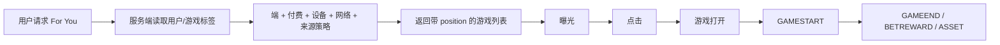
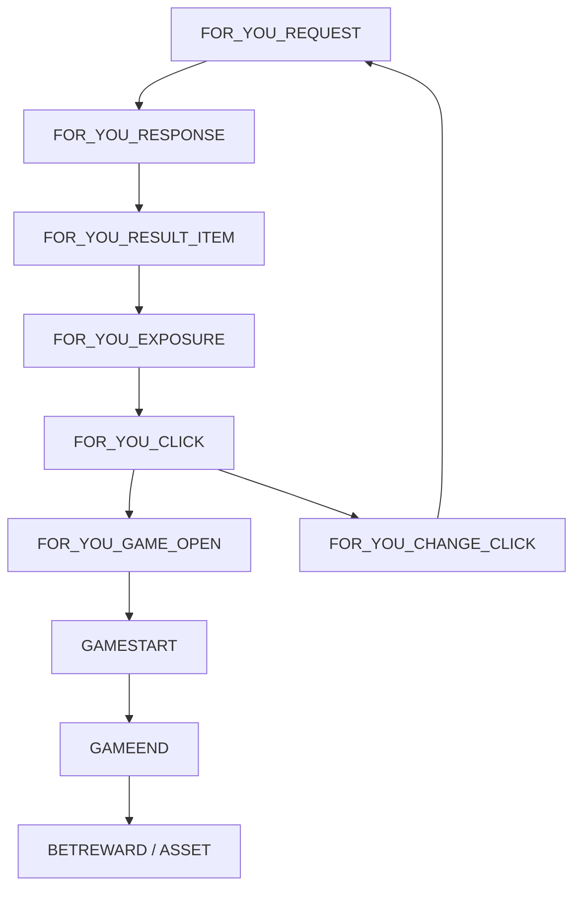

# For You 游戏推荐｜数据指标与埋点设计

> 本文依据《游戏曝光[For You]功能需求v1》设计，复用真金内嵌 Ludo V2 的事件信封和游戏事实链。目标是观测“推荐是否命中规则、用户是否看到并点击、是否真正进入游戏，以及是否改善后续活跃”。

## 1. 产品链路与范围

本方案覆盖 H5、Android、iOS 的推荐链路；Android/H5 为本轮主要实施端，iOS 保留同一契约并标记实际映射待补证。推荐结果由服务端决定，客户端不得重新排序或自行补位。

## 2. 用户与游戏标签

| 维度 | 字段/取值 | 规则 |
|---|---|---|
| 用户端 | `platform` | `h5/android/ios`；端规则独立计算 |
| 付费状态 | `user_paid_status` | `paid/unpaid`；以服务端付费事实为准 |
| 设备等级 | `device_level` | `high: RAM≥8GB`；`medium: 3GB<RAM<8GB`；`low: RAM≤3GB` |
| 网络等级 | `network_level` | `good: 请求延迟≤500ms`；`bad: >500ms` |
| 用户来源 | `user_source` | `ad/non_ad`；广告来源另带 `ad_game` |
| 资源大小 | `resource_size` | `large/medium/small` |
| 连接方式 | `connection_type` | `long/short` |
| 游戏来源 | `game_source` | `self_developed/third_party` |
| APP 资源状态 | `in_package` | `true/false`；仅 APP 使用 |

## 3. 核心指标定义与算法

### 3.1 推荐链路指标

| 指标名称 | 指标编码 | 定义/算法 | 主要拆分 |
|---|---|---|---|
| 推荐请求数 | `foryou_request_count` | `COUNT(DISTINCT recommend_request_id)` | 端、请求类型、版本 |
| 推荐请求成功率 | `foryou_request_success_rate` | `response_status=success 的请求 / 请求数` | 端、网络、版本 |
| 推荐返回填充率 | `foryou_fill_rate` | `returned_count>0 的请求 / 成功请求` | 端、付费、设备、网络 |
| 空结果率 | `foryou_empty_rate` | `returned_count=0 的请求 / 成功请求` | 端、规则版本、游戏池 |
| 推荐接口 P50/P95 | `foryou_latency_p50/p95` | `response_server_ts - request_server_ts` 分位数 | 端、网络、版本 |
| 曝光用户数 | `foryou_exposure_uv` | 有效卡片曝光的去重真人用户数 | 端、位置、来源 |
| 卡片点击率 | `foryou_card_ctr` | 点击卡片数 / 有效曝光数 | 位置、游戏、来源、付费 |
| 位置点击率 | `foryou_position_ctr` | 某 position 点击数 / 该 position 曝光数 | position、端、策略 |
| 点击后打开率 | `foryou_click_open_rate` | 成功打开游戏数 / 点击数 | 游戏、端、版本 |
| 推荐到开局率 | `foryou_start_rate` | 推荐点击后 30 分钟内有效 GAMESTART 用户 / 点击用户 | 游戏、端、付费 |
| 推荐结果重复率 | `foryou_duplicate_rate` | 同一批次重复 game_id 数 / 返回游戏数 | 端、请求类型、版本 |
| 规则命中率 | `foryou_rule_match_rate` | 满足用户标签约束的返回游戏数 / 返回游戏数 | 端、设备、网络 |
| 兜底率 | `foryou_fallback_rate` | 使用 position/整体兜底的请求或 item / 请求或 item 总数 | 兜底类型、端、策略 |

### 3.2 活跃与后续游戏指标

For You cohort 以“首次通过 For You 点击并成功 `GAMESTART` 的真人用户”作为起点；Ludo 游戏继续复用 Coin Ludo 的 `session_id/match_id/round_id`，机器人不进入用户留存分母。

| 指标名称 | 指标编码 | 定义/算法 | 成熟规则 |
|---|---|---|---|
| 推荐游戏 DAU | `foryou_game_dau` | 当日由 For You 入口进入并有效 GAMESTART 的去重真人用户 | 完整日 |
| 推荐游戏对局数 | `foryou_game_rounds` | For You 点击归因下 `COUNT(DISTINCT round_id)` | 30 分钟归因窗口 |
| 推荐后 D1/D3/D7 复玩率 | `foryou_d1/d3/d7_replay_rate` | `cohort_date+N` 再次有效 GAMESTART 用户 / cohort 用户 | N=1/3/7，未成熟标 `immature` |
| 推荐后七日对局深度 | `foryou_7d_rounds_per_user` | cohort 后 7 日有效 round_id / cohort 用户 | 仅成熟 D7 cohort |
| 推荐游戏完局率 | `foryou_completion_rate` | 有 GAMEEND 的推荐归因 round_id / 推荐归因 GAMESTART round_id | 按游戏和端拆分 |
| 推荐后真金回流率 | `foryou_real_game_return_rate` | 推荐 cohort 在 D1/D3/D7 进入真金游戏用户 / cohort 用户 | 不把推荐事件计入真金游戏分母 |

### 3.3 策略与业务护栏

| 指标名称 | 指标编码 | 定义/算法 | 目标/异常 |
|---|---|---|---|
| 非付费自研占比 | `foryou_unpaid_self_rate` | 非付费返回自研游戏数 / 非付费返回数 | 规则违例需告警 |
| 广告来源首位命中率 | `foryou_ad_first_slot_rate` | 广告来源非付费用户 position=1 为 `ad_game` 的请求 / 广告来源请求 | 首次请求按需求应命中；换一批不强制 |
| APP 包内优先率 | `foryou_in_package_priority_rate` | APP 返回中包内游戏占比 | 按设备/网络/包版本拆分 |
| 连接规则命中率 | `foryou_connection_match_rate` | 游戏 connection_type 满足 network_level 规则的 item / item 数 | 不满足即策略质量问题 |
| 资源规则命中率 | `foryou_resource_match_rate` | resource_size 满足设备规则的 item / item 数 | H5/APP 分开计算 |
| 同批无重复率 | `foryou_no_duplicate_rate` | 无重复 game_id 的批次数 / 批次数 | 目标 100% |
| 返回数量达成率 | `foryou_slot_fill_rate` | 实际返回数量 / 配置曝光位数量 | 不足需记录兜底或资源池不足 |

## 4. 埋点事件设计

### 4.1 事件链

### 4.2 公共事件信封

| 字段 | 类型 | 必填 | 说明 |
|---|---|---|---|
| `event_name` | STRING | 是 | 推荐事件或既有游戏事件 |
| `event_version` | STRING | 是 | 例如 `v1` |
| `event_uid` | STRING | 是 | 事件幂等键 |
| `event_time_client` | TIMESTAMP | 条件 | 客户端事件时间 |
| `event_time_server` | TIMESTAMP | 服务端事件必填 | 服务端事实时间 |
| `received_at` | TIMESTAMP | 是 | 入库时间 |
| `source` | ENUM | 是 | `client/server/bridge/retry` |
| `platform` | ENUM | 是 | `h5/android/ios/server` |
| `app_version/web_version` | STRING | 端条件 | APP/H5 版本 |
| `package_name/channel` | STRING | 条件 | 包名、渠道 |
| `user_id/uuid` | STRING | 条件 | 用户/匿名设备身份 |
| `session_id/trace_id` | STRING | 条件/建议 | 会话、链路追踪 |
| `recommend_request_id` | STRING | 推荐事件必填 | 一次推荐请求唯一键 |
| `recommend_batch_id` | STRING | 返回/曝光/点击必填 | 一批结果唯一键 |
| `algorithm_version` | STRING | 返回必填 | 推荐算法版本 |
| `strategy_version` | STRING | 返回必填 | 端/付费/设备/网络策略版本 |
| `config_version` | STRING | 返回必填 | 后台曝光位和兜底配置 |
| `user_paid_status` | ENUM | 请求必填 | `paid/unpaid` |
| `device_level/network_level` | ENUM | 请求必填 | `high/medium/low`；`good/bad` |
| `user_source` | ENUM | 请求条件 | `ad/non_ad` |

### 4.3 推荐事件字段

| 事件 | 触发 | 事件专属字段 | 类型/枚举 |
|---|---|---|---|
| `FOR_YOU_REQUEST` | 前端首次进入或点击换一批发起请求 | request_type、page_id、requested_slot_count、previous_batch_id | ENUM=`initial/change_batch`；page_id STRING；数量 INT64 |
| `FOR_YOU_RESPONSE` | 服务端返回一批结果 | response_status、returned_count、configured_slot_count、latency_ms、fallback_type | ENUM=`success/empty/error`；数量/耗时 INT64；fallback=`none/position/overall` |
| `FOR_YOU_RESULT_ITEM` | 每个返回游戏一条服务端 item 记录 | batch_id、position、game_id、game_source、game_category、resource_size、connection_type、in_package、selection_reason | ID STRING；position INT64；其余 ENUM/STRING；in_package BOOL |
| `FOR_YOU_EXPOSURE` | 游戏卡片进入有效可视区域 | exposure_id、position、game_id、visible_ms、exposure_rule | STRING/INT64；规则版本 STRING |
| `FOR_YOU_CLICK` | 用户点击推荐游戏 | exposure_id、position、game_id、click_action、click_ts | STRING；action=`open_game/see_all/other` |
| `FOR_YOU_GAME_OPEN` | 点击后游戏打开成功/失败 | position、game_id、open_status、load_duration_ms、error_code | status=`success/fail/timeout`；耗时 INT64 |
| `FOR_YOU_CHANGE_CLICK` | 点击换一批 | previous_batch_id、visible_game_ids、change_reason | STRING；game_ids JSON；reason=`manual/refresh` |
| `FOR_YOU_FALLBACK` | 触发位置或整体兜底 | position、fallback_type、original_filter、fallback_game_id、reason | ENUM；过滤条件 JSON；reason=`no_match/error/insufficient_pool` |

### 4.4 与 Ludo 游戏事件关联

当推荐游戏为 Coin Ludo 时，`FOR_YOU_CLICK`、`FOR_YOU_GAME_OPEN` 必须把 `recommend_request_id`、`recommend_batch_id`、`position` 传入后续 `GAMESTART`；之后复用 Ludo V2 的 `GAMESTART → GAMEEND → BETREWARD → ASSET`，不新增平行游戏生命周期事件。

Ludo 关联字段：`recommend_request_id`、`recommend_batch_id`、`recommend_position`、`session_id`、`match_id`、`round_id`、`game_id`、`room_id`、`currency_type`。

## 5. 实现与看板

| 层级 | 实现 |
|---|---|
| H5/APP 客户端 | 上报 REQUEST、EXPOSURE、CLICK、CHANGE_CLICK、GAME_OPEN；只展示服务端顺序 |
| 推荐服务端 | 记录 REQUEST、RESPONSE、RESULT_ITEM、FALLBACK；落 algorithm/strategy/config 版本 |
| Ares | PV/PD/MV/MC 承载页面、卡片曝光和点击；实际 event_id 待平台回填 |
| BQ | 推荐请求/结果明细与游戏事实关联，认证指标和质量监控 |
| Metabase | 请求质量、曝光点击、策略命中、换一批、游戏开始、留存和 Ludo 回流看板 |

看板筛选：日期、platform、app/web_version、package_name、channel、user_paid_status、device_level、network_level、user_source、game_id、game_source、resource_size、connection_type、in_package、request_type、strategy_version、algorithm_version。

## 6. 验收标准

1. 首次加载和换一批可用 `recommend_request_id`、`recommend_batch_id` 串联。
2. 同一批无重复游戏；返回位置、游戏标签和兜底原因可追溯。
3. H5/APP 按服务端返回顺序展示，不自行排序。
4. 非付费用户、自研游戏、广告来源首位、APP 包内优先和设备/网络规则可验证。
5. 推荐点击可关联 GAMESTART；Coin Ludo 点击可继续关联 Ludo V2 的 GAMEEND、BETREWARD、ASSET。
6. D1/D3/D7 推荐后复玩率使用成熟 cohort，机器人不进入用户分母。
7. 推荐接口失败、空结果、资源池不足、position 兜底和重复结果均有事件和告警。
8. 实际 Ares event_id、BQ 物理表名和线上策略版本在发布前回填；未回填项标 `actual_validation_pending`。

## 7. 来源与关联资料

- [游戏曝光[For You]功能需求v1](https://ksg964l11fam.sg.larksuite.com/wiki/V7yxwT516icdOCkT7wWlyizMg1e?from=from_copylink)
- [真金内嵌 Ludo 金币场 V2 数据与埋点设计](https://ksg964l11fam.sg.larksuite.com/docx/SmDndnMovoLCTfxSYrVl6bEDgEf)
- 本地 Ludo V2：`knowledge/02-数据/真金内嵌Ludo金币场-APP-H5数据指标与埋点设计-V2-2026-08-19.md`
- 证据边界：本文基于策划案和历史埋点设计；Ares 实际 ID、BQ 物理表和线上算法命中结果待实测。
