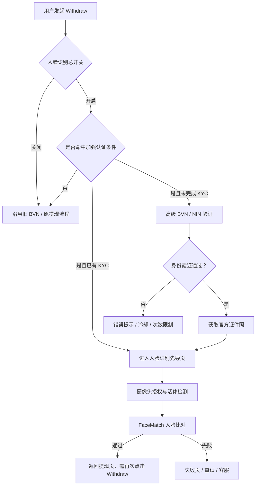
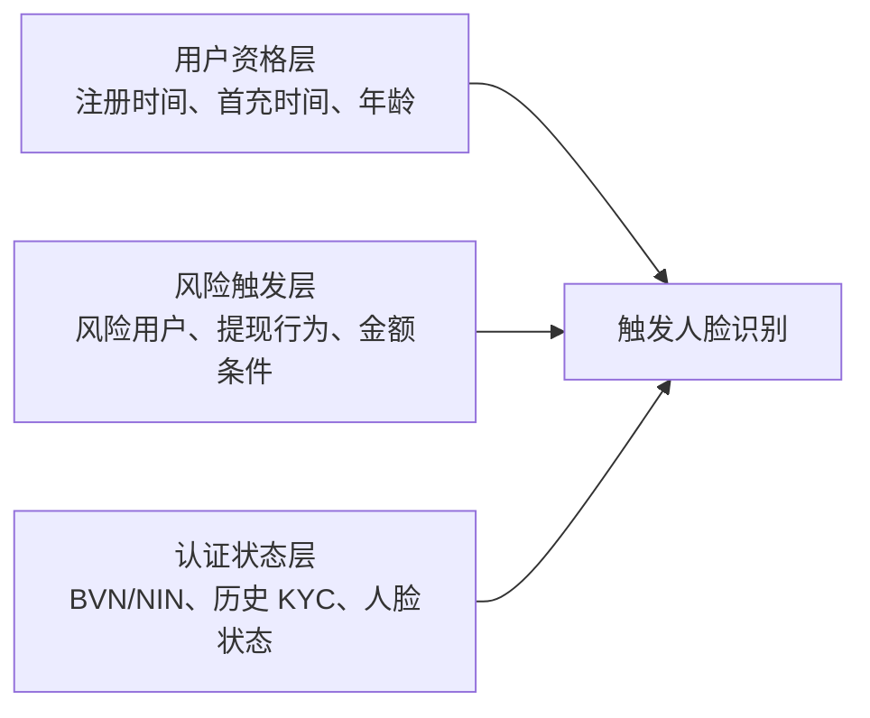
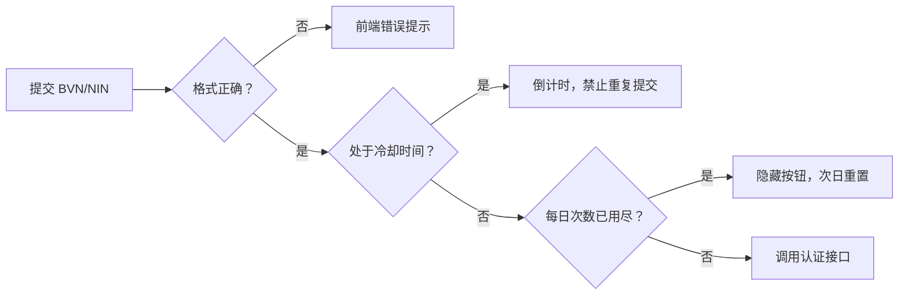

# KYC 人脸识别核心设计逻辑与机制拆解

> 本文基于飞书原文拆解，保留机制、流程、配置类别和数据需求；原文中的测试证件号、调试值、用户标识和带授权码的图片资源未复制。

## 1. 一句话结论

这不是单一的人脸识别功能，而是一套由“提现风险触发、BVN/NIN 身份认证、官方人像获取、活体检测、FaceMatch 人证比对、次数/计费/唯一绑定控制”组成的分层提现风控机制。

```text
提现行为
  → 风险用户识别
  → BVN/NIN 确认身份
  → 获取官方证件照
  → 活体确认真人
  → FaceMatch 确认人证一致
  → 放行或拦截提现
```

## 2. 主流程



## 3. 三类条件的交集



只有用户资格、风险触发和认证状态三类条件共同满足时，才进入加强认证；已完成 KYC 的用户可跳过高级 BVN/NIN，直接进入人脸识别先导页。

## 4. 各环节职责

| 环节 | 解决的问题 | 主要输出 |
|---|---|---|
| BVN/NIN | 用户是否是真实身份 | 身份、年龄及官方认证结果 |
| 官方人像 | 获取权威比对基准 | 官方证件照 |
| 活体检测 | 当前是否为真人操作 | 实时人像及活体结果 |
| FaceMatch | 当前真人是否属于该身份 | 匹配通过/失败 |
| GM 状态 | 后台识别认证状态 | KYC/人脸完成标记 |

## 5. 核心控制机制

### 身份唯一性

- 同一个 BVN 只能绑定一个 UID。
- BVN 与 NIN 通过姓名、生日、性别关联校验。
- 已绑定的 BVN/NIN 不允许被其他账号重复使用。
- 已完成旧 BVN 认证的用户，在满足条件时可跳过高级 IDV。
- 高级 BVN 成功后，历史失败的低级 BVN 记录需要清理或降级。

### 年龄限制

从 BVN/NIN 返回年龄后，未满 18 岁的用户认证失败并限制相关活动。该结果应由服务端记录，不应只依赖前端弹窗。

### 次数与冷却



控制项包括 BVN/NIN 每日次数、两次校验间隔、人脸每日次数、失败重试和次日重置。所有计数都应以服务端幂等记录为准。

### 计费边界

原文明确：请求活体采集 URL 会产生费用，FaceMatch 对比标记为不收费。因此必须防止重复点击、超时重试和前端状态丢失造成重复计费。

## 6. H5 与 APP 差异

| 项目 | H5 | APP |
|---|---|---|
| 摄像头授权 | 自定义说明/授权弹窗后跳转活体 H5 | 自定义说明后继续触发系统真实权限 |
| 活体入口 | 调用活体 H5 URL，并携带 selfie 参数 | 进入 APP 人脸识别流程 |
| 版本控制 | 原文未重点定义 | 人脸流程前检查底包版本，必要时强制更新 |
| 主动认证 | 认证通过后不自动弹出人脸，提现风险时再触发 | 同样由提现风险触发 |
| 失败处理 | 失败、重试、客服、每日限额 | 失败、重试、客服、每日限额 |

H5 与 APP 必须使用相同的服务端认证状态和风险规则，不能因为客户端路径不同而产生不同的放行口径。

## 7. 数据漏斗与埋点建议

原文已明确的前端行为包括：进入身份认证页、进入人脸先导页、拒绝/同意摄像头授权、失败后联系客服。

建议补齐服务端事件：

```text
KYC_RISK_DECISION
KYC_PAGE_VIEW
KYC_IDV_SUBMIT / KYC_IDV_RESULT
KYC_PORTRAIT_RESULT
FACE_GUIDE_VIEW
FACE_PERMISSION_RESULT
FACE_LIVENESS_REQUEST / FACE_LIVENESS_RESULT
FACE_MATCH_RESULT
FACE_RETRY
FACE_DAILY_LIMIT
WITHDRAW_RECHECK
KYC_FACE_STATUS_UPDATE
```

核心指标：

| 漏斗阶段 | 指标 |
|---|---|
| 风险识别 | 风险用户数、触发率、规则命中分布 |
| IDV | 进入率、提交率、通过率、失败码分布 |
| 人像 | 官方人像获取成功率、失败原因 |
| 活体 | 授权同意率、活体成功率、单次成本 |
| 人脸 | FaceMatch 通过率、重试率、限额触发率 |
| 提现 | 认证后再次提现率、提现成功率、拦截率 |

核心事件必须带：`platform`、`app_version/web_version`、`package_name`、`config_version`、`risk_rule_version`、`user_id`、`withdraw_id`、`trace_id` 和 `result_code`。

## 8. 主要风险与验收重点

1. 自定义摄像头授权弹窗应与系统权限清晰区分，避免用户误解授权状态。
2. 总开关、首充时间戳、匹配阈值、每日次数和年龄限制必须带配置版本及生效时间。
3. 测试环境 debug 开关和测试身份规则必须与生产配置隔离。
4. 人脸成功后返回提现页但要求再次点击 Withdraw，需要明确状态提示并验证状态恢复。
5. 活体请求计费必须有幂等键，避免重复生成 URL 或重试重复扣费。
6. 前端事件只用于路径诊断，最终提现放行必须依赖服务端认证状态和账本状态。
7. H5/APP、新老包、不同版本和渠道必须可拆分，避免把不同规则人群混为一个漏斗。

## 9. 来源与证据边界

- 来源文档：[KYC 人脸识别](https://ksg964l11fam.sg.larksuite.com/wiki/V3oPwswUni1A7BkKur9ld0QmgQg?from=from_copylink)
- 来源 revision：`4789`
- 证据状态：`source_document_read`
- 本文仅为需求机制拆解，不等同于生产配置、线上实际生效规则或真实认证通过率。
- 原文包含测试身份数据、调试配置和图片授权资源，均未复制入项目知识库。
