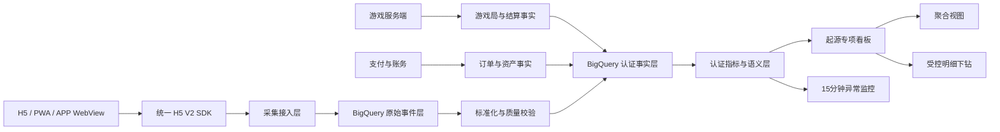

# Waje H5/PWA 设备—性能—转化专项分析与监控方案

## 0. 结论先行

当前起源“设备监控”已经具备完整的页面框架，但尚未形成可用于决策的 H5 数据产品。2026-08-13 对 Waje Special 的实际盘点显示：八个页签和大部分指标名称已经配置，默认近 15 天以及 `终端=H5` 查询后仍全部显示 `-` 或 `No Data`；同时 Web 自动采集事件几乎没有有效入库，`PAGELOAD` 也缺少真正的加载阶段耗时字段。

因此，当前首要问题不是增加更多图表，而是先解决四件事：

1. **接通数据**：修复 H5 SDK 和关键业务事件的采集、传输、入库及关联。
2. **统一口径**：以 BigQuery 为事实和指标层，起源只展示认证指标。
3. **形成链路**：把设备、网络、性能与登录、游戏、下注、结算、首充和留存关联起来。
4. **建立反馈闭环**：看板异常必须能下钻到版本、设备、网络、游戏和脱敏请求，并关联责任人和处置状态。

专项重构后应回答三个管理问题：

- H5/PWA 今天是否稳定、流畅、可玩？
- 哪类设备、网络、版本或游戏正在造成用户流失和付费转化下降？
- 优化性能后，首局、首充和付费用户长期留存是否改善？

> 战略结果仍是付费用户留存。设备与性能指标是解释转化和留存变化的诊断变量，不替代业务结果指标。

---

## 1. 分析范围与原则

### 1.1 范围

| 项目 | 方案口径 |
|---|---|
| 产品 | Waje Special |
| 市场 | 尼日利亚 |
| 主分析端 | H5 浏览器、PWA 独立运行 |
| 对照端 | Android/iOS APP 及 APP WebView |
| 核心链路 | 访问 → 登录 → 游戏点击 → 加载 → 可下注 → 首次下注 → 首局结算 → 首充 → D7 留存 |
| 主要使用者 | Ryan、Robin、管理层、产品、数据、研发、QA |
| 事实层 | BigQuery 认证事实与指标层 |
| 展示层 | 起源“设备监控”专项入口 |

### 1.2 设计原则

- **先证数据可用，再解释业务变化**：数据未接入、延迟或质量不合格时，明确显示阻断原因。
- **用户 UV 与设备 UV 分离**：登录后以 `user_id` 为经营口径；登录前保留 `uuid + session_id` 路径。
- **客户端解释体验，服务端确认事实**：支付、下注、结算和资产以服务端订单/账务为准。
- **H5、PWA、APP WebView 显式区分**：禁止仅靠 URL 或用户代理事后猜测运行形态。
- **相关性不写成因果**：在未进行实验前，只描述性能异常组与转化/留存差异。
- **默认聚合、受控下钻**：普通角色只看聚合；授权角色查看脱敏请求、用户、局和订单。
- **不采集账号密码、Cookie、Token、人脸或证件原文**，不使用设备指纹补齐浏览器不支持的字段。

### 1.3 原需求拆解与 H5 适配结论

原需求定义了八个设备监控页签。H5 不应机械复制 APP 的温度、崩溃、ANR 等能力，而应以同一页面结构承接“可观测的体验事实”，将不支持项明确显示为 `不适用` 或 `未知`。这既保留管理层的统一入口，也避免把采集缺口误读为稳定。

| 原需求页签 | H5/PWA 交付内容 | 不能直接复用的 APP 指标 | 第一阶段结论 |
|---|---|---|---|
| 设备健康总览 | 有效会话、白/黑屏、核心链路、游戏可玩、版本异常、告警 | 原生崩溃率、高温占比 | H5 健康首页，保留统一筛选和数据状态 |
| 核心业务链路 | 访问→登录→游戏→可下注→首局→支付的过程与服务端结果关联 | 无 | P0，服务端是下注、结算和资金最终事实 |
| 页面性能分析 | 路由性能、核心内容 ready、Web Vitals、资源和核心请求 | 原生启动耗时 | P0，SPA 路由和冷启动分别计量 |
| 稳定性分析 | JS/资源错误、白/黑屏、长任务、异常重载和恢复结果 | Crash/ANR、原生内存回收 | P0，H5 不展示“无崩溃率”替代稳定性结论 |
| 网络质量分析 | 关键请求、超时、重试、离/上线和恢复 | 无 | P1，运营商/网络字段缺失时不出排行结论 |
| 设备与版本分析 | `surface_type`、H5 版本、发布批次、浏览器、可选设备档位 | 稳定 RAM、温度和精确机型能力 | P0，未知值单列；设备档位不是 H5 硬必填 |
| 游戏体验分析 | 容器打开、游戏 ready、可下注、首局、黑屏、中断、厂家 | 无 | P0，第三方游戏须提供回调或 `postMessage` 契约 |
| 异常告警概览 | 5 分钟评估、影响用户、单维度集中对象、恢复状态 | 外部平台实时通知承诺 | P1，仅内部告警实例，不建设工单流转 |

**第一期聚合边界**：国家、终端、版本、渠道、浏览器、设备、网络等可以同时作为筛选条件；问题排行、告警对象和接口返回只能选择一个分析维度，不能生产“设备 × 网络”或“版本 × 渠道”联合分组、联合热力图或联合告警。需要交叉分析时，先以一个维度排行，再附加另一个维度筛选。

---

## 2. 起源“设备监控”报表现状

### 2.1 当前八个页签

| 页签 | 当前已配置指标/表格 | 2026-08-13 H5 查询状态 | 判断 |
|---|---|---|---|
| 设备健康总览 | 高温用户占比、白屏率、严重告警、低端机占比、DAU、P95 首页/启动耗时、游戏进入/充值/投注成功率、崩溃率 | 卡片为 `-`，表格 `No Data` | 只有骨架，不能证明无异常 |
| 核心业务链路 | 登录、启动首页、充值到账、投注、游戏首局可玩率、重复提交率、链路 P95/成功率/超时率 | `- / No Data` | 缺事件与步骤关联 |
| 页面性能分析 | 访问人数、白屏用户、页面 P50/P95/P99、资源大小、接口失败、页面退出 | `- / No Data` | `PAGELOAD` 数据和字段不足 |
| 稳定性分析 | 高温崩溃、内存异常、白屏、无崩溃用户、启动崩溃、异常排行 | `- / No Data` | APP `CRASH` 不能覆盖 H5 |
| 网络质量分析 | 运营商/国家质量、弱网、不可用、断线、请求成功、重试、P95 网络耗时 | `- / No Data` | 缺核心请求与网络变化事件 |
| 设备与版本分析 | 低端机可玩率、设备/内存档位、版本和渠道异常 | `- / No Data` | 设备档位和 H5 版本未形成维表 |
| 游戏体验分析 | 点击用户、黑白屏、加载失败、可玩率、厂家/游戏体验排行、首局可玩率 | `- / No Data` | 缺 `game_id + session_id + stage` |
| 异常告警概览 | 当前值、基线、影响用户/国家、集中维度、告警等级 | `- / No Data` | 无可用指标与基线输入 |

### 2.2 当前筛选器

现有筛选器：手机品牌、浏览器品牌、APP 版本、终端、时间周期、分包渠道。

主要问题：

- `终端`、时间周期等下拉存在原始编码，缺少稳定字典展示。
- H5 仍使用“APP版本”筛选，缺少独立 `web_version/release_id`。
- 没有 PWA、APP WebView、游戏、厂家、页面、设备档位、RAM 档位、网络、运营商、国家和用户分层。
- 当前可见品牌、浏览器、版本和分包候选值很少，需核验是维度数据缺失、过滤条件错误还是只接入了少量样本。
- “口径说明”入口指向失效文档，指标公式、分母、刷新频率和数据源不可追溯。

### 2.3 当前无数据状态的语义缺陷

当前统一使用 `- / No Data`，无法区分：

| 状态 | 应展示文案 | 看板行为 |
|---|---|---|
| 真实为零 | `0` | 可参与计算和对比 |
| 未接入 | `数据源未接入` | 阻断指标，显示责任人与计划时间 |
| 数据延迟 | `数据延迟至 HH:mm` | 保留上次更新时间，不触发业务异常 |
| 字段缺失 | `关键字段缺失` | 显示完整率与缺失字段 |
| 权限不足 | `无明细权限` | 可展示授权后的聚合值 |
| 留存未成熟 | `N/A·未成熟` | 不补零，不参与同比和排名 |
| 筛选无样本 | `当前筛选无样本` | 提供重置筛选入口 |
| 指标已停用 | `口径已停用` | 指向替代指标 |

---

## 3. 当前埋点与字段盘点

### 3.1 可复用事件

| 数据域 | 现有事件 | 当前价值 | 当前限制 |
|---|---|---|---|
| 页面/模块 | `PV`、`PD`、`MV`、`MC` | APP/H5 页面和模块基础访问 | 需固定 H5 页面、模块、入口和游戏 ID |
| Web 自动采集 | `PAGELOAD`、`AUTOPV`、`AUTOPD`、`AUTOMC`、`AUTOWEBSTAY` | 可作为兼容层 | 入库量接近 0，不能支撑分析 |
| 账号 | `REGISTER`、`LOGIN`、`LOGOUT` | 注册、登录和用户关联 | 需补端、会话、结果和失败原因 |
| 游戏 | `GAMESTART`、`GAMEEND`、`BETREWARD` | 局和结算的已有基础 | 需补 `round_id`、来源、版本并与服务端对账 |
| 支付/资产 | `ORDER`、`ASSET`、`WITHDRAW`、`AUDIT` | 连接付费、提现和资产 | `ORDER` 描述混合创建与成功，必须拆状态 |
| 稳定性 | `CRASH` | APP 崩溃参考 | 不能代表 H5 白屏、JS 和页面重载 |

### 3.2 实际入库快照

2026-08-13 在起源元事件管理页读取到的“昨日入库量”如下。该值是平台页面快照，不等于质量认证结果。

| 事件 | 昨日入库量 | 判断 |
|---|---:|---|
| `PAGELOAD` | 0 | 未形成可用 H5 加载数据 |
| `AUTOWEBSTAY` | 0 | 未形成可用停留数据 |
| `AUTOMC` | 0 | 未形成可用 Web 点击数据 |
| `AUTOPD` | 1 | 样本不足 |
| `AUTOPV` | 1 | 样本不足 |
| `CRASH` | 388 | APP 稳定性参考，非 H5 结论 |
| `GAMESTART` | 455,159 | 可作为游戏事实候选，需关联与对账 |
| `GAMEEND` | 2,381,977 | 可作为结算候选，需完成异常治理 |
| `ORDER` | 98,478 | 需拆订单状态后使用 |

### 3.3 `PAGELOAD` 当前字段

平台事件详情当前可见：

- `url`
- `url_host`
- `screen_title`
- `page_height`
- `url_path`
- `referrer_host`
- `event_duration`
- `page_resource_size`

虽然事件说明写明使用 Performance API，但当前字段中没有 DNS、TCP/TLS、TTFB、DOM、FCP、LCP、INP、TBT、`game_ready`、`bet_ready` 等加载和交互阶段指标；`event_duration` 的说明仍是页面停留/APP时长，不能直接当作页面加载耗时。

### 3.4 可复用公共属性

当前平台已存在以下基础属性，可直接映射或治理：

- 身份：`user_id`、`uuid`、`xl_id`
- 终端：`client_type`（1 iOS、2 Android、3 H5 等）、`os_type`
- 设备：`device_brand`、`device_model`
- 网络：`network`
- 浏览器：`last_browser`、`last_browser_version`
- 版本：`last_app_version`、`first_app_version`
- 渠道：`download_channel`、`download_subchannel`、`first_channel`、`first_sub_channel`、`last_channel`、`last_sub_channel`

当前可见字典未形成可直接支撑专项看板的事件级 RAM、CPU档位、温度、JS Heap、RTT、重试、白/黑屏、错误码和核心请求字段。历史方案中提及的内存、电量、运营商等预置属性，仍需通过 SDK payload 和 BigQuery 实际字段复核，不能仅凭文档视为已接入。

### 3.5 关键缺口

| 目标 | 当前缺口 | 后果 |
|---|---|---|
| H5/PWA识别 | 无 `surface_type` | PWA和浏览器H5混在一起，无法比较 |
| 会话漏斗 | 无稳定 `session_id` | 页面、加载、游戏和支付难以串联 |
| 跨端事实 | 缺 `event_uid/trace_id/request_id` | 客户端失败无法关联服务端原因 |
| 发布回归 | 缺 `web_version/release_id/commit_id` | 无法确认某版本是否导致异常 |
| 页面性能 | 缺 Web Vitals 和阶段耗时 | 只有“页面慢”，不能定位慢在哪里 |
| 游戏可玩 | 缺 `game_ready/bet_ready` | `GAMESTART` 不能代表用户已经可下注 |
| H5稳定性 | 缺 JS、资源、白黑屏、重载事件 | `CRASH` 低也不能证明 H5稳定 |
| 弱网恢复 | 缺断网、切网、重试、恢复结果 | 无法判断失败是否可恢复 |
| 付费转化 | 客户端意图与服务端订单未关联 | 无法区分无点击、接口失败、渠道失败 |
| 数据质量 | 无接收—入库—异常—丢弃监控 | 看板空值无法判断原因 |

### 3.6 H5 浏览器能力与字段降级

H5 只采集浏览器或已授权容器能够稳定提供的数据；所有能力均随事件携带 `measurement_state`，用于将“没有观测到”与“无法观测”分开。

| 维度/指标 | H5 采集方式 | 状态与降级规则 |
|---|---|---|
| `web_version`、`release_id`、`sdk_version`、`surface_type` | 构建时注入；APP WebView 由容器显式注入 | 核心必填。不能从 URL、User-Agent 或缓存版本事后猜测 |
| 浏览器、OS、品牌/型号 | 受控的运行环境解析与维表映射 | 仅保存规范化结果；解析失败为 `unknown`，不保存完整 User-Agent |
| RAM、设备档位、CPU 核数 | 浏览器能力允许时采集，或用认证设备维表映射 | 条件字段；未知不进入低端机分母，不能用 0、正常或默认机型补齐 |
| 网络类型、有效网络、RTT、下行估计 | Network Information 等浏览器能力；服务端/边缘日志补充国家和运营商 | 条件字段；无法读到时只保留请求结果，不把用户标为弱网 |
| 导航、资源和路由性能 | Navigation/Resource Timing、Web Vitals、业务 ready 标记 | 跨域资源未开放 Timing-Allow-Origin 时标记 `cross_origin_restricted`，不把资源大小或耗时写为 0 |
| JS/资源错误、未处理拒绝、长任务、页面重载 | 前端错误边界、全局错误监听、Long Task 观测、`visibilitychange/pagehide` | 错误全量；同一会话内相同错误指纹限次上报，保留计数 |
| 白屏/黑屏 | 页面或游戏容器的核心内容/渲染 ready 规则 | 必须命中 `perf_page_rule` 中的核心标识和等待阈值；不能仅以 DOM 空白推断 |
| 温度、原生崩溃、ANR、原生内存回收 | H5 不稳定或无通用能力 | 固定 `not_applicable` 或 `unknown`；不得参与 H5 分母、排行或告警 |

`measurement_state` 枚举固定为：`complete`、`partial`、`not_supported`、`cross_origin_restricted`、`not_observable`、`not_applicable`。任何非 `complete` 值均不能被渲染为零或正常。

---

## 4. 目标数据架构



### 4.1 BigQuery事实表

| 数据集 | 粒度 | 主键/关联键 | 主要用途 |
|---|---|---|---|
| `fact_h5_session` | 一次会话 | `session_id` | 端形态、设备、网络、入口、最终节点 |
| `fact_h5_performance` | 页面/游戏加载 | `event_uid`、`session_id` | Web Vitals、资源量、ready耗时 |
| `fact_h5_error` | 一次异常 | `event_uid`、`trace_id` | JS、资源、接口、白黑屏、内存、重载 |
| `fact_h5_core_request` | 一次核心请求 | `request_id`、`trace_id` | 登录、初始化、余额、下注、结算、充值 |
| `fact_game_round` | 一局 | `round_id` | 开局、下注、结果、结算、RTP |
| `fact_payment_order` | 一笔订单 | `order_id` | 发起、成功、失败、退款、冲正、到账 |
| `fact_user_lifecycle` | 用户×cohort日 | `user_id + cohort_date + lifecycle_day` | D1/D3/D7/D15/D30、首充后留存 |

### 4.2 认证指标状态

| 状态 | 含义 | 看板行为 |
|---|---|---|
| `certified` | 口径、质量和对账均通过 | 正式展示并可用于告警 |
| `provisional` | 正在并行对账 | 显示“试运行”，不用于管理结论 |
| `immature` | 留存/生命周期未成熟 | 显示 `N/A·未成熟` |
| `blocked` | 接入、质量或权限阻断 | 显示原因、责任人和计划时间 |
| `deprecated` | 旧事件或旧口径 | 只读历史，不增加新依赖 |

### 4.3 H5 数据源优先级与责任边界

外部产品只用于补充或核验，不能成为内部实时 SLA、业务成功率或体验告警的唯一事实。所有正式指标先在 BigQuery 认证层完成同源分子、分母、去重和规则版本计算，再供起源展示。

| 指标域 | H5 主来源 | 辅助/核验来源 | 认证与排除规则 |
|---|---|---|---|
| 有效访问、路由、页面 ready | H5 V2 SDK → `fact_h5_session/performance` | Firebase Analytics/Performance | 自研 `session_id + page_visit_id` 为主键；第三方仅核验趋势 |
| Web 性能与资源 | 浏览器性能 API + H5 V2 SDK | Firebase Performance Web | `measurement_state=complete` 才可参与对应分位数；第三方平台延迟不纳入内部 SLA |
| JS、资源、白黑屏、重载 | H5 V2 SDK → `fact_h5_error` | 前端错误监控 | 白黑屏按业务规则，不用 Crashlytics 或“无错误”替代 |
| 关键接口网络质量 | H5 核心请求事件 + 服务端/网关日志 | Firebase Performance、CDN 日志 | 按 `request_id/trace_id` 去重；业务拒绝、客户端取消、系统失败分列 |
| 游戏可玩、首局与中断 | H5 容器事件 + 游戏侧确认 | 服务端游戏映射 | `game_load_id` 贯穿；没有游戏侧 ready/首局回调时相应指标为 `blocked` |
| 注册、登录、投注、充值、提现 | 服务端业务/订单事实 | H5 过程事件 | 过程用于定位；注册/登录 30 秒、投注 10 秒、进局 20 秒、充值最终到账 24 小时、提现受理 30 秒按规则版本计算 |
| 国家、渠道、运营商 | 入口参数/服务端与边缘标准化维表 | 前端网络能力 | 运营商无法可靠映射时 `unknown`；不得以 IP/浏览器结果擅自填充为具体运营商 |
| 设备档位、温度、原生崩溃 | H5 仅对可观测字段输出 | APP SDK、Crashlytics、Android vitals | APP 指标仅用于 APP 对照；禁止与 H5 分子/分母混算 |

### 4.4 H5 页面与游戏规则配置

页面、游戏、关键请求的阈值由 MySQL 配置层维护并版本化；H5 SDK 只读取下发版本，BigQuery 事实和聚合均保存 `rule_version`。这符合“配置在 MySQL、统计事实在 BigQuery、起源消费认证指标”的既有架构。

| `rule_type` | 对象 | 成功/异常判定 | 第一阶段冻结阈值 | 关键字段 |
|---|---|---|---:|---|
| `perf_page_rule` | 首页、体育首页、个人中心 | 核心内容标识已出现 | 8 秒 | `page_id`、`ready_signal`、`page_visit_id` |
| `perf_page_rule` | 游戏首页、充值、提现、注册、登录 | 核心内容/可操作表单已出现 | 10 秒 | `page_id`、`ready_signal`、`page_visit_id` |
| `game_container_rule` | 游戏容器 | 容器已打开并收到游戏初始化确认 | 20 秒进入可操作状态 | `game_id`、`provider_id`、`game_load_id` |
| `game_black_screen_rule` | 游戏画面 | 容器初始化后连续无有效渲染 | 5 秒 | `game_load_id`、`detection_method` |
| `core_request_rule` | 登录、余额、下注、结算、支付等白名单请求 | 按请求/业务状态定义 | 按业务规则，不在 SDK 硬编码 | `request_kind`、`timeout_ms`、`rule_version` |

白屏、黑屏、页面退出和游戏加载失败必须保留 `rule_version`、`page_visit_id/game_load_id` 与原始阶段；后台短暂切换后返回、用户主动关闭、缺少进入事件的样本不进入白屏分母。第三方游戏没有确认回调时只能得出“容器已打开”，不得宣称“已可下注”。

---

## 5. H5/PWA V2 埋点设计

### 5.1 新增事件

| 事件 | 触发时机 | 核心字段 | 采样要求 |
|---|---|---|---|
| `H5_SESSION_START` | 页面进入并初始化 SDK | 会话、入口、形态、版本、设备、网络 | 100% |
| `H5_NAVIGATION_PERF` | 页面可见且性能指标稳定/退出前 | navigation、FCP/LCP/INP/CLS、长任务、资源 | 100%核心页 |
| `H5_GAME_LOAD` | 游戏加载开始/成功/失败 | `game_id`、`status`、`stage`、资源、耗时 | 100% |
| `H5_GAME_READY` | 游戏画面和基础配置就绪 | `game_ready_ms`、游戏/厂家/版本 | 100% |
| `H5_BET_READY` | 余额、币种、限额、连接和按钮就绪 | `bet_ready_ms`、不可用原因 | 100% |
| `H5_CORE_REQUEST` | 核心接口结束 | API类型、状态码、耗时、重试、请求关联 | 错误全量；成功可配置采样 |
| `H5_CLIENT_ERROR` | JS/资源/接口/白屏/黑屏/内存/重载 | 错误类型、阶段、脱敏错误、影响页面 | 100% |
| `H5_NETWORK_CHANGE` | 断网、恢复、网络类型切换 | 前后网络、时间、会话、当前步骤 | 100% |
| `H5_RECOVERY_RESULT` | 重试/重连/恢复完成 | 原始错误、动作、次数、最终结果 | 100% |
| `H5_SESSION_END` | 退出、后台、页面卸载 | 最后成功节点、退出原因、停留、异常数 | 100%可发送样本 |

现有 `PAGELOAD/AUTOPV/AUTOPD/AUTOMC/AUTOWEBSTAY` 保留为兼容事件，不再直接承担认证性能指标。V2 接入稳定后，按版本统计使用量并制定停用计划。

### 5.1.1 事件粒度、终态与上报规则

| 事件 | 记录粒度 / 去重键 | 必填的结果字段 | 终态或枚举约束 |
|---|---|---|---|
| `H5_SESSION_START/END` | 一次 H5 会话 / `session_id` | `surface_type`、版本、入口、`last_stage`、`close_reason` | 结束是尽力上报；未收到结束不反推为崩溃 |
| `H5_NAVIGATION_PERF` | 一次路由访问 / `page_visit_id` | `page_id`、`navigation_type`、`measurement_state`、核心内容 ready 耗时 | `navigate`、`reload`、`back_forward`；SPA 路由另有业务开始点 |
| `H5_GAME_LOAD` | 一次游戏启动 / `game_load_id` | `game_id`、`provider_id`、`stage`、`status`、耗时、失败码 | `start`、`success`、`fail`、`timeout`、`abandon`；一条链路只归一个主失败原因 |
| `H5_GAME_READY` | 一次游戏启动的可展示状态 / `game_load_id` | `ready_source`、`game_ready_ms` | 仅 `success`；`ready_source` 必须为容器或游戏方确认，非推测 |
| `H5_BET_READY` | 一次游戏启动的可下注状态 / `game_load_id` | `balance_ready`、`currency_ready`、`connection_ready`、`bet_ready_ms` | `success`、`fail`、`timeout`；任一前置条件缺失要带原因 |
| `H5_CORE_REQUEST` | 一次初始请求链路 / `request_id` | `request_kind`、`status_class`、`duration_ms`、`retry_count` | `success`、`timeout`、`network_fail`、`server_fail`、`business_reject`、`client_cancel`；不记录请求/响应正文 |
| `H5_CLIENT_ERROR` | 一次错误指纹 / `event_uid` | `error_type`、`stage`、脱敏错误指纹、`measurement_state` | `js_error`、`unhandled_rejection`、`resource_error`、`white_screen`、`black_screen`、`long_task`、`reload`、`memory_pressure` |
| `H5_NETWORK_CHANGE` | 一次网络状态变化 / `event_uid` | 前后网络、当前阶段、离线时长 | `offline`、`online`、`changed`；无 Network API 时仅上报可检测的离/上线 |
| `H5_RECOVERY_RESULT` | 一次恢复尝试 / `recovery_id` | 原始 `request_id/game_load_id`、动作、次数、结果 | `retry`、`reconnect`、`reload`、`return` × `success/fail/abandon` |

错误、超时、资金相关过程事件全量采集；成功的高频核心请求可以按 `request_kind + release_id` 设置采样率，但采样率、抽样键和抽样权重必须写入事件，正式分位数只使用可还原且达到覆盖门槛的样本。禁止用点击、`GAMESTART` 或 iframe 创建替代“可下注”。

### 5.2 公共字段

#### 身份与治理

| 字段 | 类型 | 必填 | 规则 |
|---|---|---:|---|
| `event_name` | string | 是 | 使用事件字典编码 |
| `event_version` | string | 是 | V2事件固定 `v2` 起步 |
| `event_uid` | string | 是 | 一次业务事件唯一；重试复用 |
| `session_id` | string | 是 | 页面进入生成；登录前后保持 |
| `trace_id` | string | 条件 | 核心业务链路必填 |
| `request_id` | string | 条件 | 核心接口必填 |
| `page_visit_id` | string | 条件 | 一次路由/页面访问唯一键；页面性能与白屏必填 |
| `game_load_id` | string | 条件 | 一次游戏加载唯一键；容器、ready、可下注、首局事件必填 |
| `recovery_id` | string | 条件 | 一次重试/重连/恢复动作唯一键 |
| `user_id` | string | 条件 | 登录后必填 |
| `uuid` | string | 条件 | 匿名阶段必填，不等价于用户ID |
| `event_time_client` | timestamp | 是 | 保留原始时区 |
| `event_time_server` | timestamp | 条件 | 服务端事实必填 |
| `received_at` | timestamp | 是 | 平台接收时间 |
| `is_retry/retry_count` | bool/int | 是 | 用于去重、重试和质量监控 |
| `measurement_state` | enum | 条件 | `complete/partial/not_supported/cross_origin_restricted/not_observable/not_applicable` |
| `rule_version` | string | 条件 | 页面、游戏、请求、白黑屏与告警规则版本 |
| `sample_rate/sample_weight` | number | 条件 | 高频成功事件采样时必填；错误、超时、资金相关过程为 1 |

#### 端、版本与投放

| 字段 | 类型 | 说明 |
|---|---|---|
| `client_type` | enum | 与起源现有端枚举兼容 |
| `surface_type` | enum | `h5_browser`、`pwa_standalone`、`app_webview`、`app_native` |
| `web_version` | string | H5/PWA版本，不使用APP版本替代 |
| `release_id` | string | 发布批次/灰度版本 |
| `commit_id` | string | 与构建、资源账单关联 |
| `sdk_version` | string | H5埋点SDK版本 |
| `channel/sub_channel` | string | 一级/分包渠道 |
| `attribution_media/campaign_id` | string | 归因媒体/活动 |
| `country` | string | 当前主市场 `NG` |

#### 设备与网络

| 字段 | 类型 | 说明 |
|---|---|---|
| `device_brand/device_model` | string | 浏览器可提供或容器注入时采集 |
| `device_tier` | enum | `low`、`mid`、`high`、`unknown`，由认证维表映射 |
| `device_memory_gb` | number | 仅浏览器支持时采集；否则为空 |
| `memory_tier` | enum | `<2GB`、`2–3GB`、`4GB+`、`unknown` |
| `hardware_concurrency` | int | 支持时采集，不作为指纹 |
| `os_name/os_version` | string | OS及版本 |
| `browser_name/browser_version` | string | 浏览器/WebView信息 |
| `screen_width/height/dpr` | number | 页面适配和设备分层 |
| `network_type/effective_type` | string | Wi-Fi/蜂窝及2G/3G/4G等 |
| `rtt_ms/downlink_mbps/save_data` | number/bool | Network API支持时采集 |
| `carrier` | string | 有合法数据源时填充 |
| `network_change_count` | int | 会话内网络变化次数 |

#### 性能与业务

| 字段 | 类型 | 说明 |
|---|---|---|
| `fcp_ms/lcp_ms/inp_ms/cls` | number | Web Vitals |
| `long_task_total_ms/long_task_max_ms` | number | 线上 RUM 的主线程长任务观测；实验室 TBT 单独保存，不混为同一指标 |
| `encoded_body_size/transfer_size` | int | 压缩资源量/实际流量，单位bytes |
| `request_count/critical_request_count` | int | 总请求/关键路径请求 |
| `game_ready_ms/bet_ready_ms` | int | 从 navigationStart 计算 |
| `navigation_type/ready_signal` | enum/string | 路由类型及页面/游戏就绪信号 |
| `game_id/provider_id/page_id` | string | 游戏、厂家和页面 |
| `round_id/order_id` | string | 与服务端事实关联 |
| `stage/status` | enum | 当前步骤和结果 |
| `error_type/error_code` | string | 统一错误字典 |

### 5.3 关键事件状态机

```text
H5_SESSION_START
  → LOGIN_SUCCESS / LOGIN_FAIL
  → GAME_CLICK
  → H5_GAME_LOAD(start)
  → H5_GAME_READY
  → H5_BET_READY
  → BET_SUBMIT
  → SERVER_BET_CONFIRMED
  → RESULT_RECEIVED
  → SETTLEMENT_UI_STABLE
  → GAMEEND / 服务端结算事实
  → PAYMENT_SUBMIT / PAYMENT_SUCCESS / PAYMENT_FAIL
  → H5_SESSION_END
```

每个失败节点必须保留 `stage + status + error_code + request_id + trace_id + retry_count + final_result`。重复点击、超时重试和断线恢复不得产生重复扣款、重复下注或重复派彩。

### 5.4 H5 SDK 实施细则

1. **会话与路由**：SDK 在应用初始化前启动，首个 `H5_SESSION_START` 生成 `session_id`；SPA 每次路由生成 `page_visit_id`，但不重置会话。登录后只补关联 `user_id`，不得切换会话或重写匿名事件。
2. **性能采集**：导航与资源指标由性能 API/观察器采集；业务页面性能以 `route_start → ready_signal` 为准。`FCP/LCP/INP/CLS`、资源时序和长任务均允许 `partial/not_supported`，不能把实验室 TBT 当作线上 RUM 指标。
3. **核心请求**：只包装配置白名单中的 `fetch/XHR`；生成或透传 `request_id/trace_id`，只记录请求类别、时长、状态和重试，不记录 URL 查询串、请求体、响应体、授权头、Cookie 或支付参数。
4. **第三方游戏**：宿主先上报容器打开；游戏方通过约定的回调或 `postMessage` 上报 `GAME_READY`、`BET_READY`、首局及中断。回调来源、`game_id` 和 `game_load_id` 不匹配时丢弃并记录质量异常。
5. **页面卸载与离线**：`visibilitychange/pagehide` 仅作为尽力的会话结束信号。因浏览器回收而未发出的结束事件标为缺失，不将其自动归类为崩溃、白屏或用户退出。
6. **错误抑制与缓存**：同一 `session_id + page_id + error_fingerprint` 首次全量、后续只累计次数；离线队列须设置 TTL、容量和删除策略，补发保留原 `event_uid` 和 `is_retry=true`。

---

## 6. 指标字典

### 6.1 首屏十项指标

| # | metric_id | 指标 | 公式与口径 | 主要维度 | 认证条件 |
|---:|---|---|---|---|---|
| 1 | `h5_valid_session` | 有效会话数与数据覆盖率 | 有效 `SESSION_START`；覆盖率=含必填字段会话/应采集会话 | 端、版本、渠道 | 会话和版本完整率达标 |
| 2 | `page_load_success_rate` | 页面加载成功率 | 页面进入后达到可见/ready的会话 ÷ 页面进入会话 | 页面、设备、网络 | 失败和超时阈值固定 |
| 3 | `game_playable_rate` | 游戏可玩率 | 到达 `BET_READY` 的游戏加载尝试 ÷ `GAME_LOAD start` | 游戏、厂家、设备 | start/end关联≥98% |
| 4 | `bet_ready_p75_p90` | 可下注耗时 | `navigationStart → BET_READY` 分位数 | 游戏、版本、设备、网络 | 样本数和分位算法登记 |
| 5 | `blank_black_screen_rate` | 白/黑屏率 | 被确认白/黑屏会话 ÷ 页面/游戏进入会话 | 页面、游戏、版本 | 检测逻辑和误报复核通过 |
| 6 | `error_free_session_rate` | 无严重异常会话率 | 无P0/P1客户端异常会话 ÷ 有效会话 | 版本、设备、网络 | 异常字典稳定 |
| 7 | `first_bet_success_rate` | 首次下注成功率 | 首次下注被服务端确认用户 ÷ 发起首次下注用户 | 游戏、渠道、设备 | 与服务端幂等键关联 |
| 8 | `first_round_settle_rate` | 首局结算成功率 | 首局成功结算用户 ÷ 首局成功下注用户 | 游戏、厂家、版本 | 以服务端结算为事实 |
| 9 | `first_pay_success_rate` | 首充成功转化率 | 窗口内首充成功用户 ÷ 目标H5/PWA用户 | 渠道、游戏、性能组 | 订单成功且扣除冲正 |
| 10 | `payer_retention_d7` | 首充后D7留存 | 首充后第7日有效活跃用户 ÷ 成熟首充cohort | 端、版本、渠道、设备 | cohort成熟，用户口径固定 |

### 6.2 辅助诊断指标

- FCP/LCP/INP/CLS 与长任务总耗时/最大耗时的 P50/P75/P90/P95；实验室 TBT 单列
- 资源 `encodedBodySize`、`transferSize`、请求数和最大资源
- 核心接口成功率、P95耗时、超时率、重试率
- 断网率、网络切换率、重连恢复率、恢复耗时
- 低端机和弱网用户占比、游戏可玩率、首充率
- 退出阶段分布：加载前、ready前、首注前、结算前、首充前
- D1/D3/D15/D30留存、7日复充率
- H5/PWA与APP同渠道、同版本窗口的转化和留存对照
- 健康会话与性能降级会话的转化差，仅描述关联，不写成因果
- 高风险羊毛用户、正常付费用户分层对比；默认只展示聚合结果

---

## 7. 六层专项看板

### 7.1 全局筛选

日期/小时｜H5/PWA/APP WebView/APP｜Web版本/发布版本｜渠道/媒体/活动｜游戏/厂家｜页面｜设备/RAM档位｜浏览器/WebView｜网络/运营商｜国家/地区｜新老/付费用户｜风险分层｜数据质量状态。H5 不支持的温度、原生崩溃/ANR、RAM 等筛选必须显示 `不适用/未知`，不可默认选中或替换为零。

### 7.2 页面结构

#### 一、数据可用性

- V2事件入库趋势、接收—入库—有效量对账
- 必填字段完整率、重复率、异常率、P95入库延迟
- 版本覆盖、SDK覆盖和端形态识别率
- 指标状态：认证、试运行、未成熟、阻断、停用
- 空看板的具体阻断原因和责任人

#### 二、设备与网络

- H5/PWA/APP WebView用户与会话结构
- 低端机、RAM档位、品牌/型号、浏览器/WebView排行
- Wi-Fi/2G/3G/4G、运营商和网络切换分布
- 设备、网络、运营商、浏览器各自的**单维度**异常排行；其他字段只作为筛选上下文

#### 三、性能体验

- 页面和游戏的 FCP/LCP/INP/CLS、线上长任务、`game_ready`、`bet_ready`
- 资源量、关键请求数、最大资源和缓存命中
- 白屏、黑屏、JS、资源、接口和页面重载异常排行
- 新旧版本、低端机和弱网性能回归对比

#### 四、核心链路

```text
有效访问 → 登录成功 → 游戏点击 → 加载成功 → GAME_READY
        → BET_READY → 首次下注确认 → 首局结算稳定
```

每一步展示：尝试人数、成功人数、成功率、P75/P90耗时、超时率、失败用户、Top错误码。

#### 五、转化与留存影响

- 健康/慢加载/错误/弱网/低端机人群的首局、首充和留存对比
- H5与PWA对比；APP同渠道/同cohort作为参考基线
- 首充后D1/D3/D7/D15/D30和7日复充
- PWA→APP下载、安装、登录、奖励和后续留存实验（P2）

#### 六、告警与根因

- 告警时间、名称、当前值、基线、影响用户、集中维度、等级
- 下钻：版本 → 设备/网络 → 页面/游戏 → 错误码 → 脱敏请求/局/订单
- 责任人、处理状态、首次发现、恢复时间和复盘链接

### 7.3 首屏线框

```text
┌──────────────────────────────────────────────────────────────────┐
│ 日期  端形态  Web版本  渠道  游戏  设备  网络  用户分层  数据状态 │
├──────────┬──────────┬──────────┬──────────┬─────────────────────┤
│数据覆盖率│游戏可玩率│BET P90   │白/黑屏率│无严重异常会话率     │
├──────────┼──────────┼──────────┼──────────┼─────────────────────┤
│首注成功率│首局结算率│首充转化率│D7付费留存│P0/P1告警            │
├────────────────────────────────┬─────────────────────────────────┤
│访问→登录→加载→可下注→首注→结算│性能趋势：H5/PWA/APP、版本、设备│
├────────────────────────────────┼─────────────────────────────────┤
│单维度体验排行（设备/网络/版本） │异常集中维度与影响用户排行       │
├────────────────────────────────┴─────────────────────────────────┤
│待处理事项：数据阻断｜白屏｜可玩率｜下注/结算｜支付｜版本回归     │
└──────────────────────────────────────────────────────────────────┘
```

---

## 8. 性能门禁与线上告警

### 8.1 发布前实验室门禁

沿用《轻量化游戏标准》V1.2。弱网固定为下行1.5Mbps、上行750Kbps、RTT 150ms、随机丢包1%，每个设备/环境完成10次有效冷启动。

| 指标 | 简单玩法P75目标 | 简单玩法P90红线 | 动效玩法P75目标 | 动效玩法P90红线 |
|---|---:|---:|---:|---:|
| navigationStart→game_ready | ≤2.0s | ≤3.5s | ≤2.8s | ≤4.5s |
| navigationStart→bet_ready | ≤3.0s | ≤5.0s | ≤4.0s | ≤6.5s |
| bet_submit→服务端确认 | ≤1.2s | ≤2.0s | ≤1.2s | ≤2.0s |
| result_received→结算UI稳定 | ≤0.8s | ≤1.5s | ≤1.5s | ≤2.5s |
| bet_ready前TBT | ≤300ms | ≤600ms | ≤450ms | ≤800ms |

资源红线：简单玩法完整核心资源≤300KB，动效玩法≤500KB；到可下注前分别≤200KB/300KB；完成第一局累计分别≤300KB/400KB。

出现重复扣款、重复派彩、结算状态错误、不可恢复白屏、P90超线、500ms以上Long Task或iOS内存警告/页面重载，发布验收失败。

### 8.2 线上告警

实验室门禁用于发布；线上告警使用固定SLO与近7日同小时基线结合。

| 等级 | 场景 | 默认动作 |
|---|---|---|
| P0 | 重复扣款/下注/派彩、错误结算、大面积不可恢复白屏、支付状态不清 | 立即告警，暂停灰度/回滚评估，资金链路核验 |
| P1 | 可玩率、首注/结算/充值成功率明显下降；P90性能恶化；单版本异常集中 | 15分钟内告警，定位版本/设备/网络/游戏 |
| P2 | 局部设备、浏览器、渠道或运营商体验持续偏差 | 纳入日报和版本优化池 |

告警引擎每5分钟评估一次，目标在异常发生后15分钟内生成可下钻告警。阈值在首批14天稳定样本后由数据、产品和研发共同校准，变更必须留版本记录。

### 8.3 第一阶段 H5 告警判定矩阵

普通告警仅使用已结束的、按市场业务时区对齐的 15 分钟窗口。连续两个窗口同时满足“最小样本 + 基线偏离 + 绝对影响用户”才触发；硬阈值允许在完整 5 分钟子窗口立即触发，但仍须满足规定样本和影响人数。没有合格基线时使用冷启动固定阈值并标注规则状态，不伪造历史对比。

| 指标 | 最小样本 | 基线偏离 | 影响门槛 | 最高级硬阈值 |
|---|---:|---|---:|---|
| 登录成功率 | 有效提交 ≥200 | 下降 ≥5pp 且相对 ≥20% | ≥20 用户 | <70% 且 ≥100 用户 |
| 投注成功率 | 有效订单 ≥200 | 下降 ≥3pp 且相对 ≥10% | ≥20 用户 | <70% 且 ≥100 用户 |
| 游戏可玩率 | 有效游戏启动 ≥200 | 下降 ≥5pp 且相对 ≥15% | ≥20 用户 | <50% 且 ≥100 用户 |
| 首局可玩率 | 已进游戏启动 ≥200 | 下降 ≥5pp 且相对 ≥15% | ≥20 用户 | <50% 且 ≥100 用户 |
| 白屏/黑屏/游戏加载失败 | 页面白屏用户 ≥100；游戏链路 ≥200 | 上升 ≥2pp 且相对 ≥50% | ≥20 用户 | ≥30% 且 ≥100 用户 |
| 核心请求超时率 | 有效请求 ≥500 | 上升 ≥3pp 且相对 ≥50% | ≥50 用户 | ≥30% 且 ≥200 用户 |

充值 24 小时最终到账成功率只用于成熟后的日级趋势、对账与回补；实时支付告警改用支付跳转失败、回调失败和系统错误等过程指标，且不得把未满 24 小时订单提前记为到账失败。告警实例键固定为 `market + rule_id + single_dimension_type + single_dimension_value + metric_id`；恢复需连续两个完整 15 分钟窗口不再满足条件且数据质量合格，恢复后 30 分钟内复发只重开同一实例。

---

## 9. 权限与数据安全

| 层级 | 默认可见内容 | 使用者 |
|---|---|---|
| 聚合层 | 指标、趋势、分层、告警和脱敏错误码 | 产品、研发、QA、授权运营 |
| 诊断层 | 脱敏会话、请求、版本、设备、游戏和局关联 | Robin、Ryan、数据和指定研发 |
| 敏感层 | 用户、订单、资产和风险明细 | 单独授权，记录审计日志 |

- 一线执行角色不默认获得具体收入、用户资产或风险标签明细。
- 看板导出继承当前筛选和权限；禁止通过导出绕过字段脱敏。
- Agent只读取认证聚合数据集；访问明细时继承用户权限并记录审计。
- 错误信息、URL和请求参数必须脱敏，不保存Token、Cookie和完整个人信息。

---

## 10. RPD任务拆分

| ID | 优先级 | 任务 | 主要交付 | 责任角色 | 前置 | 验收摘要 |
|---|---|---|---|---|---|---|
| H5-PERF-001 | P0 | H5 V2 SDK与端形态识别 | 10类事件、公共字段、`surface_type` | H5前端/客户端 | 事件字典冻结 | H5/PWA/WebView准确区分 |
| H5-PERF-002 | P0 | 事件接入与质量链路 | 接收、入库、异常、延迟、重复监控 | 数据开发 | 001 | 终态完整≥98%、标识完整≥99.5%、重复≤1%、P95延迟≤15分钟 |
| H5-PERF-003 | P0 | BigQuery事实层 | 7类事实表、关联键和认证状态 | 数据开发/数据产品 | 001/002 | 起源与BQ可复算 |
| H5-PERF-004 | P0 | 游戏/下注/结算关联 | ready、首注、首局、服务端结算链路 | 游戏前后端 | 001/003 | 关键关联率≥98% |
| H5-PERF-005 | P0 | 支付与资产关联 | 客户端意图、订单状态、到账/冲正 | 支付/数据开发 | 003 | D+1与账务一致 |
| H5-PERF-006 | P1 | 六层专项看板 | 首屏、六专题、统一筛选和状态语义 | 数据产品/BI | 003–005 | 十项首屏指标可下钻 |
| H5-PERF-007 | P1 | 转化与留存分析 | 首充、复充、D1/D7及APP对照 | 数据产品 | 005/006 | cohort成熟规则正确 |
| H5-PERF-008 | P1 | 告警与处置闭环 | P0/P1告警、责任人、状态、复盘 | 数据/研发运维 | 006 | 15分钟内生成告警 |
| H5-PERF-009 | P1 | 权限与审计 | 聚合、诊断、敏感三级权限 | 平台/安全 | 006 | 越权测试通过 |
| H5-PERF-010 | P2 | PWA→APP实验 | 下载、安装、登录、奖励和留存闭环 | 产品/增长/数据 | P1稳定 | 可评估增量，不混淆自然转化 |
| H5-PERF-011 | P2 | 羊毛分层与Agent摘要 | 风险分层聚合、每日异常摘要 | 风控/数据/Agent | 指标认证 | 不暴露敏感明细 |

### 10.1 建议实施顺序

```text
第1阶段：001 → 002 → 003
第2阶段：004 + 005 → 006
第3阶段：007 + 008 + 009
第4阶段：010 + 011
```

P0阶段未通过前，不以现有设备监控空看板输出业务好坏结论；P1上线前必须完成至少7个完整日并行对账。

---

## 11. 测试与验收

### 11.1 功能场景

- 正常网络、2G/3G、弱Wi‑Fi、高延迟、1%丢包、断网、重连、Wi‑Fi/蜂窝切换。
- 低端Android、不同Chrome/WebView、iOS Safari/WKWebView、PWA独立运行。
- 冷启动、缓存命中、长时间运行、后台恢复、页面重载、资源加载失败。
- 登录失败、游戏加载超时、余额未就绪、重复点击、下注超时重试、结算失败、支付回调延迟。
- H5/PWA/APP WebView识别，匿名转登录后会话连续。
- 无数据、延迟、字段缺失、权限不足和留存未成熟状态。

### 11.2 数据质量门槛

| 验收项 | 标准 |
|---|---:|
| 核心链路终态完整率 | ≥98%；按登录、投注、进局、首局、支付分别计算 |
| 关键标识完整率 | ≥99.5%；`event_uid`、链路/订单键、事件时间缺失不参与指标 |
| 重复事件率 | ≤1%；超标时冻结受影响指标的正式排行与业务告警 |
| 核心事件P95入库延迟 | ≤15分钟 |
| 国家、终端、H5版本覆盖率 | ≥98%；不足时不得输出对应维度排行 |
| 运营商覆盖率 | 移动网络可判定样本 ≥90%；未知单列 |
| 匿名→登录身份关联成功率 | ≥98%；不足时转化类指标标记风险 |
| SESSION_START→BET_READY关联率 | ≥98% |
| 下注与服务端确认关联率 | ≥98% |
| 首局与服务端结算关联率 | ≥98% |
| 游戏局数对账差异 | >0.5%触发告警 |
| 支付金额/状态 | D+1关账后与认证账务一致 |
| 起源与BQ认证查询 | 相同筛选结果一致 |

### 11.3 看板验收

- 首屏不超过十项核心指标，默认显示数据状态和更新时间。
- 全局筛选可以贯穿六层页面，下钻时不丢失上下文。
- H5、PWA、APP WebView和APP原生分母互不混用。
- 筛选条件可叠加，但数据库、接口、导出和页面均不生成第一期联合维度分组或联合告警。
- 所有率指标可查看分子、分母、去重键、时间窗和口径版本。
- `0`、无样本、未接入、延迟、未成熟和权限不足分别展示。
- P0/P1异常可以定位集中版本、设备、网络、游戏和脱敏错误。
- 一般用户不能通过查询、下钻或导出访问未授权的订单、资产和风险明细。

---

## 12. 项目决策清单

在进入研发排期前，由产品、数据和研发确认：

1. H5 Web版本、发布批次和Commit的生成与维护责任人。
2. H5/PWA/APP WebView的检测与容器注入方案。
3. 十项指标的业务Owner、刷新频率和默认统计窗口。
4. 首充转化窗口及付费留存的正式cohort口径。
5. 核心请求成功事件的采样比例和成本预算；错误/超时/资金异常保持全量。
6. 低端机和弱网的正式分层字典。
7. P0/P1线上阈值在首批14天样本后的校准与审批流程。
8. Robin、Ryan及其他角色的下钻权限和导出权限。

以上决策未确认的指标可以试运行，但不得标记为 `certified`。

---

## 13. 来源与交叉引用

- 需求主源：[设备监控及性能优化指标系统开发需求](https://ksg964l11fam.sg.larksuite.com/wiki/QsplwWjnHi0J1PksQJQl3SrDgce)，本次对齐 revision `2649`；原型与 APP 规则是设计输入，不等同 H5 已接入事实。
- 平台现状与通用事件：[[起源分析平台盘点-2026-08-03]]、[[埋点与数据上报地图_副本]]、[[Waje埋点事件与属性字典-2026-08-11]]、[[Waje数据指标看板映射与研发验收清单-2026-08-11]]。
- 浏览器计时与长任务字段按 [Navigation Timing](https://www.w3.org/TR/navigation-timing-2/) 和 [Long Tasks API](https://www.w3.org/TR/longtasks-1/) 的能力探测实现；第三方跨域资源时序必须遵从 `Timing-Allow-Origin` 等浏览器限制。
- Firebase Web Performance 只作辅助观测与趋势核验，详见 [官方接入文档](https://firebase.google.com/docs/perf-mon/get-started-web)；其控制台处理延迟不能替代内部 BigQuery 的认证指标和告警 SLA。
