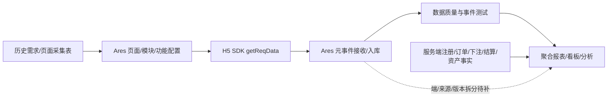

# Waje H5 起源埋点上报全量盘点

> 本文以历史文档和 Ares 当前只读配置/上报页为主证据，GA4/BigQuery 仅作辅助。结论按“历史设计 → Ares 已配置 → H5 实际调用 → 起源已接收 → 可用于分析”分层；没有下一层证据时标记为待补证。

> 范围：Waje Special 的 H5 浏览器、PWA、APP WebView；页面/模块/功能事件、元事件、事件属性、上报质量。
> 隐私：不保存密码、Cookie、Token、请求正文、用户明细、完整设备指纹或 Ares 测试页事件载荷。

## 1. 结论先行

| 结论 | 当前证据 | 状态 |
|---|---|---|
| Ares 当前产品空间为 Waje Special | 当前页面顶部产品选择器 | 已确认 |
| 元事件 | Ares 元事件列表 34 个 | 已确认 |
| H5 页面配置 | 页面列表 107 条，其中 H5 67 条、安卓H5 7 条，共 74 条 | 已确认 |
| H5 页面配置量 | 74 条页面合计显示 178 个模块/事件；49 条非 0，25 条为 0/0 | 配置统计，非调用量 |
| Web 自动采集 | PAGELOAD=0；AUTOPV/AUTOPD=1；AUTOMC/AUTOWEBSTAY=0 | 弱/低可用 |
| H5 实际上报 | 页面进入质量行来源包含 js；其他 H5 来源未拆分 | 部分确认 |
| H5 性能事件 | 历史表列出 10 个逻辑事件，实际 event_id 均待创建 | 设计存在，未证实落地 |
| 模块/功能明细 | 模块列表、功能参数页当前返回空结果 | 平台未返回，不等于不存在 |
| 核心质量风险 | 7日整体错误率 1.40806%；游戏结束异常率约 6.1284% | P0 |

### 1.1 ID 口径纠偏

历史文档将 PV=2855092、PD=2184105、MV=1589607、MC=2199814 记为“实际 event_id”。但 Ares 当前元事件列表该列标题是“昨日入库量”，元事件详情页也没有展示这些数字作为事件 ID。故本报告将其标记为历史记录/昨日入库量，**不能直接写入 H5 代码的 event_id 字段**；研发需从 Ares 功能埋点详情或导出取得真实 event_id。

## 2. 证据等级

| 状态 | 含义 | 可否用于结论 |
|---|---|---|
| historical_design | 历史需求/方案中定义 | 只还原设计，不代表当前上线 |
| ares_config_observed | Ares 当前页面可见 | 只证明配置存在 |
| ares_ingestion_observed | Ares 质量页有接收/入库聚合 | 需确认端和业务语义 |
| h5_source_observed | 质量表来源含 js | 证明存在 H5/JS线索，不等于具体页面调用 |
| actual_validation_pending | 明细、来源拆分、关联键未回读 | 不得写成已配置/已上报 |
| platform_no_rows | 页面返回空表/暂无数据 | 不等于没有配置 |

## 3. H5 埋点总体链路

页面层 PV/PD → 模块层 MV/MC → 功能/业务层 → 服务端事实层。PV/PD/MV/MC 只能说明页面和模块行为；点击、HTTP 200、iframe 创建不能证明充值、下注、结算或提现成功。

## 4. Ares 现网对象

### 4.1 元事件 34 个

> 下表“昨日入库量”沿用 Ares 当前列名，不是事件 ID，也不是本次质量窗口接收量。

| 分组 | 事件 | 展示名 | 昨日入库量 | 说明 |
|---|---|---|---:|---|
| 页面/模块 | `MC` | 模块点击 | 2199814 | 用点击页面中某个模块，上报MC事件 |
| 页面/模块 | `MV` | 模块曝光 | 1589607 | 模块被展现在屏幕上，上报MV事件。模块露出屏幕1px即上报曝... |
| 页面/模块 | `PV` | 页面进入 | 2855092 | 页面被展现在屏幕上，上报PV事件。一般情况下回退到上一页面后... |
| 页面/模块 | `PD` | 页面退出 | 2184105 | 页面从屏幕上消失，上报PD事件，计算页面的时长 |
| 游戏生命周期 | `GAMEEND` | 游戏结束 | 2381977 | 当玩家单局结束玩法时上报，涵盖中途退出，完成但失败和完成且成... |
| 用户与账号 | `APPONLINE` | APP账号在线 | 2856 | 每分钟上报一次APP在线人数/账号数 |
| 用户与账号 | `REGISTER` | 用户注册 | 11832 | 用户生成登录ID时进行上报 |
| 资金/资产 | `ORDER` | 商城订单 | 98478 | 用户创建成功订单时上报 用户支付成功时上报, |
| 用户与账号 | `LOGOUT` | 用户登出 | 213636 | 用户由登出行为时进行上报 |
| H5/Web自动采集 | `PAGELOAD` | Web页面加载时长 | 0 | 使用performanceAPI计算页面加载时长，监听页面加... |
| H5/Web自动采集 | `AUTOWEBSTAY` | Web视区停留 | 0 | 有效停留：关注网页区域不滚动，期间鼠标可以移动、点击等操作。... |
| H5/Web自动采集 | `AUTOMC` | Web元素点击 | 0 | 点击一个元素/控件/按钮（可扩展）时自动采集 |
| 用户与账号 | `LOGIN` | 用户登录APP/游戏 | 247633 | 用于用户登录完成、切换账号时，报送应用登录事件 |
| H5/Web自动采集 | `AUTOPD` | Web页面浏览时长 | 1 | 页面的「活跃状态切换」(页面失去焦点/获得焦点、切换窗口最小... |
| H5/Web自动采集 | `AUTOPV` | Web浏览页面 | 1 | 打开一个页面时自动采集，根据autoTrack的触发进行上报... |
| 资金/资产 | `TRIGGERGIFT` | 礼包触发显示 | 0 | 服务器下发礼包显示的次数 |
| 任务/物品 | `USEITEM` | 物品消耗 | 25888 | 获得道具/消耗道具立即上报 物品包含了礼包,积分,道具等 |
| 任务/物品 | `GETITEM` | 物品获得 | 16699 | 获得道具/消耗道具立即上报 物品包含了礼包,积分,道具等 |
| 游戏生命周期 | `GAMESTART` | 游戏开始 | 455159 | 当玩家匹配结束 开始单局玩法时上报 |
| 资金/资产 | `AUDIT` | 提现审核 | 13216 | 后台审核用户提现 |
| 资金/资产 | `WITHDRAW` | 提现申请 | 13217 | 用户在应用内申请提现 |
| 游戏生命周期 | `BETREWARD` | 下注结算奖励 | 280228 | 当玩家单局结算结束时，分别上报不同位置奖励结算 : |
| 应用/故障/配置 | `INSTALL` | APP初始化事件（预置事件，投放必传） | 17130 | App安装后首次启动SDK初始化上报 |
| 应用/故障/配置 | `APPSHARE` | 客户端分享 | 27 | — |
| 应用/故障/配置 | `PUSHCLICK` | push点击事件 | 5209 | 推送被点击时触发 |
| 应用/故障/配置 | `CRASH` | 崩溃事件 | 388 | APP崩溃时统一触发该事件 |
| 应用/故障/配置 | `CHANGED` | 远程控制配置变化 | 0 | 获取远程配置更改，SDK加载配置生效 |
| 应用/故障/配置 | `AQ` | APP退出 | 264599 | APP关闭，包括关闭APP和调入后台，同时收集启动的时长 |
| 应用/故障/配置 | `AL` | APP启动 | 286234 | APP启动，包括打开APP和从后台唤醒 |
| 应用/故障/配置 | `PUSHRECEIVED` | Push 通知送达 | 0 | 谷歌推送服务GCM 返回成功 |
| 用户与账号 | `BINDACCOUNT` | 账号绑定 | 1108 | 用户绑定其他类型帐号时上报此事件。分析用户的登录习惯，有针对... |
| 任务/物品 | `RECEIVETASK` | 任务领取奖励 | 12872 | 用户领取任务奖励 上报此事件。 |
| 任务/物品 | `FINISHTASK` | 任务完成 | 22578 | 用户完成任务时/任务进度值满了，上报此事件 |
| 资金/资产 | `ASSET` | 资产流水 | 4423709 | 当玩家获得/消耗游戏虚拟货币，导致游戏币增加时上报 |

### 4.2 H5 页面配置 74 条

| 页面名 | page_id | 端类型 | 模块数/事件数 | 最后更新时间 |
|---|---|---|---:|---|
| 人脸识别次数达上限界面 | `co9se20iws` | 安卓H5 | 1/1 | 2026-06-03 13:53:00 |
| 人脸识别先导页 | `g84r9j1vdc` | 安卓H5 | 2/2 | 2026-06-01 13:41:32 |
| 身份认证界面 | `cb7mdh5g2j` | 安卓H5 | 0/0 | 2026-06-01 13:40:11 |
| easywin体彩 | `jaoy4s0vv0` | H5 | 32/32 | 2026-05-15 11:14:15 |
| 联运-MB-主页tab-体彩介绍落地页 | `euu7y0intp` | H5 | 1/1 | 2026-03-24 21:01:24 |
| 联运-opay-push | `g5r74klxee` | H5 | 1/1 | 2026-03-12 14:59:21 |
| 联运-opay-transfer页ban | `pa7sqn7jtl` | H5 | 1/1 | 2026-03-12 14:58:38 |
| 联运-opay-betting页弹窗 | `evjqfx3udh` | H5 | 1/1 | 2026-03-12 14:57:56 |
| 联运-opay-betting页 hot | `uxkrd1cyjs` | H5 | 1/1 | 2026-03-12 14:57:02 |
| 联运-opay-data页banner | `lppuw7ihmg` | H5 | 1/1 | 2026-03-12 14:56:21 |
| Moviebox联运落地页分流测试 | `1k4dmarpu6` | H5 | 2/2 | 2026-03-10 14:08:37 |
| 转盘抽奖落地页 | `i8mwcy5zhu` | 安卓H5 | 1/1 | 2026-03-10 01:02:28 |
| Palmpay联运落地页 | `uyrjxoghl2` | 安卓H5 | 1/1 | 2026-01-14 15:29:06 |
| 推荐好友一起玩 | `u3fvz9yduf` | 安卓H5 | 4/4 | 2025-12-26 01:43:18 |
| 分奖励活动--活动结束--分奖 | `wbsa1d1uwm` | H5 | 0/0 | 2025-12-26 01:30:19 |
| 外呼系统 | `2kz7z07g1t` | H5 | 6/6 | 2025-12-26 00:42:19 |
| 转盘抽奖活动-引导参加游戏1 | `6n0sfsvzjo` | H5 | 1/1 | 2025-12-19 11:41:42 |
| 转盘抽奖活动-中奖结果页1 | `rvj6all0nz` | H5 | 1/1 | 2025-12-19 11:41:27 |
| 转盘抽奖活动-邀请好友页1 | `g7nonu3o09` | H5 | 4/4 | 2025-12-19 11:41:14 |
| 转盘抽奖活动-活动已结束1 | `ofcyt4rai6` | H5 | 1/1 | 2025-12-19 11:41:02 |
| 转盘抽奖活动-活动未开始1 | `65wods7hwk` | H5 | 1/1 | 2025-12-19 11:40:47 |
| 转盘抽奖活动-抽奖次数用完了 | `pi5zantqo4` | H5 | 1/1 | 2025-12-19 11:40:13 |
| 转盘抽奖活动-抽奖页 | `74fwtdczq3` | H5 | 7/7 | 2025-12-19 11:37:42 |
| 分奖励活动--接受邀请--活动提示页 | `sv7i5uwsbv` | H5 | 3/3 | 2025-12-18 16:41:48 |
| 分奖励活动--任务--任务页 | `84ff2qzu80` | H5 | 3/3 | 2025-12-18 16:38:08 |
| 分奖励活动--预测比赛-预测列表页 | `qvcy2ec8lx` | H5 | 8/8 | 2025-12-18 16:27:53 |
| 分奖励活动--邀请好友-奖励提醒页 | `asaunjb104` | H5 | 2/2 | 2025-12-18 16:26:35 |
| 分奖励活动--邀请好友-邀请明细页 | `d5rqtenwgh` | H5 | 0/0 | 2025-12-18 16:23:31 |
| 分奖励活动--邀请好友-邀请规则页 | `rni0fv4v0l` | H5 | 4/4 | 2025-12-18 16:22:51 |
| 分奖励活动--分奖计算页 | `8rg41p3li8` | H5 | 2/2 | 2025-12-18 16:19:43 |
| 分奖励活动--活动已结束页 | `argll5v02z` | H5 | 3/3 | 2025-12-18 16:19:13 |
| 分奖励活动--活动未开始页 | `mu1qa6h9v5` | H5 | 2/2 | 2025-12-18 16:18:37 |
| 分奖励活动--已参加页 | `kequody7dx` | H5 | 2/2 | 2025-12-18 16:18:04 |
| 分奖励活动--未参加页 | `xy12707ajv` | H5 | 2/2 | 2025-12-18 16:17:29 |
| 分奖励活动--活动介绍页 | `84ecvz9jz7` | H5 | 2/2 | 2025-12-18 16:16:51 |
| 转盘抽奖活动-获得抽奖次数 | `10mhgc6g8o` | H5 | 0/0 | 2025-12-18 16:09:03 |
| h5资金满500/1000弹窗页面 | `g472ezsp5x` | H5 | 0/0 | 2025-11-27 14:40:37 |
| h5下载app的网页 | `mtzz2cagfz` | H5 | 2/2 | 2025-11-27 14:16:29 |
| H5 User页 | `bw4p3900nu` | H5 | 1/1 | 2025-10-30 16:09:18 |
| h5-忘记密码第四页再次确认密码 | `xmbod6wzbj` | H5 | 0/0 | 2025-08-27 10:11:44 |
| h5-忘记密码第三页密码设置 | `n7xyik3w4m` | H5 | 0/0 | 2025-08-27 10:11:09 |
| h5-忘记密码第二页验证码校验 | `p0pkkreu3l` | H5 | 0/0 | 2025-08-27 10:09:40 |
| h5-忘记密码第一页 | `cpd4pyx737` | H5 | 0/0 | 2025-08-27 10:08:47 |
| h5-登录界面 | `x8asb2sqh7` | H5 | 5/5 | 2025-08-26 19:44:34 |
| h5-玩家游戏内提现引导 | `skl5qwru6n` | H5 | 1/1 | 2025-08-26 17:33:54 |
| h5-注册第三步收取验证码界面 | `hhlzz0fs3h` | H5 | 1/1 | 2025-08-26 17:26:07 |
| h5-注册第二步输入密码 | `odnbn5xq12` | H5 | 0/0 | 2025-08-26 17:25:27 |
| h5-注册第一步输入手机号 | `2w52yelknv` | H5 | 0/0 | 2025-08-26 17:24:58 |
| h5-促销 | `dp2fjjxryr` | H5 | 3/3 | 2025-08-26 17:19:06 |
| h5-tx界面 | `vue16bnq1d` | H5 | 8/8 | 2025-08-26 16:55:15 |
| 商城界面 | `ijkbaricdx` | H5 | 3/3 | 2025-08-26 16:39:38 |
| h5-首页 | `n9pixal64m` | H5 | 23/23 | 2025-08-26 15:59:11 |
| opay落地页(playnow) | `ftk969kpmf` | 安卓H5 | 1/1 | 2024-11-20 11:39:45 |
| h5前置落地页 | `6nv8gzpnkd` | H5 | 0/0 | 2024-08-23 16:38:56 |
| 登陆失败 | `5v38rv4906` | H5 | 0/0 | 2024-07-17 16:22:29 |
| 首次启动 | `w1b2wyz02z` | H5 | 0/0 | 2024-07-15 17:12:56 |
| 首次加载资源 | `8epe1jhsza` | H5 | 0/0 | 2024-07-15 16:48:32 |
| 首次注册登录 | `9xsbyqxy59` | H5 | 0/0 | 2024-07-15 16:48:05 |
| 获取设备id | `6wy0khnx5n` | H5 | 0/0 | 2024-07-12 16:19:32 |
| 新手奖励页面 | `ssy3aj3wym` | H5 | 0/0 | 2024-07-08 14:58:56 |
| 配置加载开始结束 | `7oy3shn5ps` | H5 | 0/0 | 2024-07-08 14:56:27 |
| 登录注册开始结束 | `u3p6xxocln` | H5 | 0/0 | 2024-07-08 14:55:51 |
| 资源加载开始结束 | `g6b0ynfyra` | H5 | 0/0 | 2024-07-08 14:55:38 |
| 收藏不支持提示 | `82wyo0hdz6` | H5 | 0/0 | 2024-06-24 17:44:53 |
| 收藏引导弹窗 | `ne5sydxolh` | H5 | 1/1 | 2024-06-24 17:44:16 |
| whot结算1000促销 | `yjkxpx18xg` | H5 | 1/1 | 2024-06-24 17:43:38 |
| 破产提示 | `sigltbiobt` | H5 | 1/1 | 2024-06-24 17:42:46 |
| 付费用户whot结算促销 | `4t73agvr90` | H5 | 1/1 | 2024-06-24 17:41:47 |
| 免费用户付费引导弹窗 | `te6pomgtd7` | H5 | 1/1 | 2024-06-24 17:40:44 |
| h5个人中心页面 | `agyjh6h9f3` | H5 | 0/0 | 2024-06-24 17:37:56 |
| 促销集合页 | `0n23r6awd5` | H5 | 0/0 | 2024-06-24 17:35:02 |
| h5主页 | `77938r3ga5` | H5 | 19/19 | 2024-06-24 17:30:54 |
| h5加载页 | `x1zs0uele2` | H5 | 2/2 | 2024-06-24 17:30:17 |
| h5启动页 | `xbb4jeltkh` | H5 | 0/0 | 2024-06-24 17:29:55 |

> 页面 owner 展示名不进入本知识库；模块数/事件数是配置侧统计，不是实时上报次数。

### 4.3 模块、功能参数与页面日志

| 对象 | 当前状态 | 解释 |
|---|---|---|
| 模块列表 | 暂无数据 | 不能判定没有模块；需核查接口、产品上下文和权限 |
| 功能埋点参数 | 暂无数据 | 不能判定没有功能参数；历史表仍有功能登记 |
| 页面管理日志 | H5 首页可见新增与二次修改 | 只证明配置变更，不证明线上上报 |

## 5. 历史 H5 页面采集表对照

Lark H5 页面采集表 revision=93，工作表为说明、页面埋点方式、通用参数、自定义参数。

| page_id | 页面 | 历史登记功能事件 | 当前页面 | 证据状态 | 备注 |
|---|---|---|---|---|---|
| `n9pixal64m` | h5-首页 | `n9pixal64m_pv` / `n9pixal64m_pd` | 已见 | 页面当前可见 + 历史表登记 | 功能明细未在当前页面回读 |
| `ijkbaricdx` | 商城界面 | `ijkbaricdx_pv` / `ijkbaricdx_pd` | 已见 | 页面当前可见 + 历史表登记 | 订单/资产成功必须接服务端事实 |
| `vue16bnq1d` | h5-TX界面 | `vue16bnq1d_pv` / `vue16bnq1d_pd` | 已见 | 页面当前可见 + 历史表登记 | TX页面行为不等于TX结果 |
| `x8asb2sqh7` | h5-登录界面 | `x8asb2sqh7_pv` / `x8asb2sqh7_pd` | 已见 | 页面当前可见 + 历史表登记 | 登录请求需与服务端结果关联 |
| `2w52yelknv` | h5-注册第一步 | `2w52yelknv_pv` / `2w52yelknv_pd` | 已见 | 页面当前可见 + 历史表登记 | 后续注册步骤page_id待补齐 |

### 5.1 H5 性能逻辑事件

| 逻辑编码 | 触发时机 | 关联键 | 实际 event_id | 优先级 |
|---|---|---|---|---|
| `H5_SESSION_START` | SDK初始化完成 | `session_id` | **待创建** | P0 |
| `H5_NAVIGATION_PERF` | 关键内容ready或页面结束前 | `page_visit_id` | **待创建** | P0 |
| `H5_CORE_REQUEST` | 白名单fetch/XHR达到终态 | `request_id` | **待创建** | P0 |
| `H5_GAME_LOAD` | 开始、阶段、失败、超时或放弃 | `game_load_id + stage` | **待创建** | P0 |
| `H5_GAME_READY` | 游戏方或容器确认画面/配置就绪 | `game_load_id` | **待创建** | P0 |
| `H5_BET_READY` | 余额、币种、限额、连接和控件进入终态 | `game_load_id` | **待创建** | P0 |
| `H5_CLIENT_ERROR` | JS、资源、接口、白黑屏、长任务、重载 | `event_uid` | **待创建** | P0 |
| `H5_NETWORK_CHANGE` | offline、online或可识别切网 | `network_change_id` | **待创建** | P1 |
| `H5_RECOVERY_RESULT` | retry/reconnect/reload/return进入终态 | `recovery_id` | **待创建** | P1 |
| `H5_SESSION_END` | pagehide/visibilitychange尽力结束 | `session_id` | **待创建** | P1 |

10 个事件仍属于历史设计，当前未观察到 Ares 实际编码或 ID，不能纳入当前性能看板。

## 6. Ares 事件属性与 H5 可复用字段

Ares 事件属性目录当前去重观察到 111 个字段；下表列出与 H5 页面、游戏、资产和性能分析直接相关的 31 个安全字段。身份、广告标识、网络硬件标识和原始崩溃载荷类字段不展开，也不保存字段值。

| 分组 | 字段 | 展示名 | 类型 | 属性类型 | 维度表 | 平台说明 |
|---|---|---|---|---|---|---|
| 游戏/资产 | `game_type` | 游戏类型 | String | 系统属性 | 有 | 游戏分类(小写)，需产品定义好同步业务侧不可更改，如 ”majiang", "doudizhu","puyu" "rummy"等 |
| 游戏/资产 | `mode_id` | 游戏模式ID | Integer | 系统属性 | 有 | 游戏模式ID，具体定义如下：0:金币场、01:比赛场、02:排位、03:闯关、04:房卡场、05:爬塔赛（目前小游戏在用）、06:休闲游戏(拜神类)、07:好友房/私人场、08:真金场09:俱乐部场 |
| 游戏/资产 | `play_id` | 玩法id | Integer | 系统属性 | 有 | 标识游戏类型；whot的话一般需要 9110000+gameId |
| 游戏/资产 | `bet_count` | XZ次数 | Integer | 自定义属性 | 无 | 平台未配置说明 |
| 通用H5可复用 | `goal_times` | XZ目标倍数 | Double | 自定义属性 | 无 | XZ目标倍数 |
| 游戏/资产 | `bet_times` | XZ金额倍数 | Double | 自定义属性 | 无 | XZ倍数 |
| 游戏/资产 | `room_id` | 场次ID | Integer | 自定义属性 | 有 | 场次ID不是房间id，金币场类:1001–1009象棋场:3001–3009捕鱼场:4001–4004rummy:5001-500N |
| 页面/DOM | `element_path` | DOM树结构的body后对应结点 | String | 系统属性 | 无 | 默认采集���优先从最近根路径中有id的元素取，所有根路径都没有id时取所有路径的拼接，中间加上’>‘。元素有id名称，在元素类型后加'#'。 |
| 页面/DOM | `element_target_url` | 元素链接地址 | String | 系统属性 | 无 | a标签默认采集 |
| 页面/DOM | `element_selector` | 元素叶子结点序号 | String | 系统属性 | 无 | 默认采集 |
| 页面/DOM | `element_position` | 页面路径 | String | 系统属性 | 无 | 页面li标签以及li标签内的子标签（即叶子结点为li标签或叶子结点的父节点或父父节点为li标签）时采集。 |
| 游戏/资产 | `cash_settlement` | 结算现金数 | Integer | 自定义属性 | 无 | 结算的现金数量（一把最后一局,发一次）资产有正负 |
| 游戏/资产 | `asset_id` | 资产类型 | Integer | 系统属性 | 有 | 资产中心对应货币分类标识，金币：1001，钻石：1002，房卡：1003，礼券：1004 红包券：1005 |
| 游戏/资产 | `bet_num` | 投注金额 | Integer | 自定义属性 | 无 | 每局1次投注金额 |
| 通用H5可复用 | `event_duration` | 页面停留时长 | Integer | 系统属性 | 无 | 单位：秒 启动时候:本次 App 启动到 App退出的时长，单位为 秒 |
| 游戏/资产 | `change_balance` | 变动后余额 | Integer | 系统属性 | 无 | 变动后的资产余额 |
| 通用H5可复用 | `app_key` | 联运游戏id | String | 自定义属性 | 无 | 第三方联运项目统一标识 |
| 页面/DOM | `url_path` | 页面路径 | String | 自定义属性 | 无 | 平台未配置说明 |
| 配置/会话 | `app_remote_config` | 远程控制配置信息 | String | 系统属性 | 无 | 获取远程配置，SDK 加载配置生效后，采集该事件，并采集对应的控制信息，用于问题排查 后端控制那些内容：限制条件 根据 appid 和 app版本（非必传） 是否关闭 AutoTrack，默认开启 是否关闭 SDK，默认开启 禁用代码埋点列表 , PV/MV/MC /PD 埋点事件不上报 根据event_id 控制 ，上限200个埋点 控制事件 禁用event_type |
| 页面/DOM | `latest_referrer` | 最近一次站外地址 | String | 系统属性 | 无 | 平台未配置说明 |
| 页面/DOM | `latest_referrer_host` | 最近一次站外域名 | String | 系统属性 | 无 | 平台未配置说明 |
| 页面/DOM | `path_name` | 页面路径 | String | 系统属性 | 无 | 平台未配置说明 |
| 配置/会话 | `resume_from_background` | 是否从后台唤醒 | Boolean | 系统属性 | 无 | 平台未配置说明 |
| 页面/DOM | `referrer_host` | 前向域名 | String | 系统属性 | 无 | 如果直接打开页面，值为空String |
| 页面/DOM | `referrer` | 前向地址 | String | 系统属性 | 无 | 如果直接打开页面，值为空String |
| 页面/DOM | `page_resource_size` | 页面资源大小 | Integer | 系统属性 | 无 | 页面资源大小，单位是kb，大小限制大于0，小于10G采集，不满足则不采集。 |
| 通用H5可复用 | `elements` | 元素类型 | String | 系统属性 | 无 | 默认采集 |
| 页面/DOM | `element_class_name` | 元素样式名 | String | 系统属性 | 无 | 元素有class属性的时候才采集 |
| 页面/DOM | `url` | 页面地址 | String | 系统属性 | 无 | 平台未配置说明 |
| 页面/DOM | `url_host` | 页面地址域名 | String | 系统属性 | 无 | 平台未配置说明 |
| 页面/DOM | `page_height` | 页面高度 | Integer | 系统属性 | 无 | 平台未配置说明 |

### 6.1 能力边界

| 分析对象 | 现有字段/对象 | 可回答 | 不能直接回答 |
|---|---|---|---|
| 页面/模块行为 | page_id、功能 ID、event_duration、元素字段 | 页面进入、离开、停留、曝光、点击候选 | Web Vitals、白屏原因、真实 ready |
| 游戏上下文 | game_type、play_id、mode_id、room_id、下注/结算字段 | 游戏、玩法、场次条件分析候选 | H5页面来源、逐阶段加载原因 |
| 交易/资产 | asset_id、金额/余额、订单/商品字段 | 服务端交易和资产辅助分析 | 订单成功、到账、提现终态可靠关联 |
| H5 DOM/来源 | DOM、路径、来源域名、资源大小字段 | 自动 Web事件结构分析 | 当前自动 Web覆盖是否稳定 |
| 端/版本 | 页面端类型；历史表设计了 surface_type/web_version/release_id | 配置侧 H5/安卓H5区分 | 实际上报按端、包、版本、渠道拆分 |

## 7. 配置、上报与可分析矩阵

| 对象 | Ares配置 | 上报证据 | H5拆分 | 当前结论 |
|---|---|---|---|---|
| PV | 元事件与 H5页面可见 | 质量表来源包含 js | 部分 | 页面访问候选可用，端/版本需补 |
| PD | 元事件与 H5页面可见 | 可见质量源未含 js | 未证 | 停留候选可用，H5单独上报待证 |
| MV | 元事件与 H5页面可见 | 可见质量源未含 js | 未证 | 配置存在，H5调用待证 |
| MC | 元事件与 H5页面可见 | 可见质量源未含 js | 未证 | 入口转化待证 |
| PAGELOAD | 元事件可见 | 昨日入库量 0 | 否 | 不支持性能结论 |
| AUTOPV/AUTOPD | 元事件可见 | 昨日入库量 1；AUTOPV质量为1接收/0入库 | 极弱 | 只作异常线索 |
| AUTOMC/AUTOWEBSTAY | 元事件可见 | 昨日入库量 0 | 否 | 不支持 Web点击/停留 |
| GAMESTART/GAMEEND | 服务端元事件可见 | 质量窗口有 server 接收；GAMEEND异常较高 | 不足 | 游戏事实候选，H5入口关联待补 |
| ORDER/WITHDRAW/AUDIT/ASSET | 服务端元事件可见 | 质量窗口有接收/入库 | 不足 | 服务端结果事实，不等同 H5行为 |
| 10个H5性能事件 | 历史需求 | 未观察到实际 Ares ID | 否 | 未落地 |

## 8. 最近 7 天数据质量

窗口：2026-08-21 至 2026-08-27；产品：Waje Special。

| 指标 | 数值 |
|---|---:|
| 接收条数 | 518,240,641 |
| 入库条数 | 510,943,478 |
| 异常属性条数 | 7,297,163 |
| 抛弃条数 | 0 |
| 错误率 | 1.40806% |

### 8.1 事件质量明细

| 事件 | 上报源 | 接收 | 入库 | 异常 | 异常率 |
|---|---|---:|---:|---:|---:|
| 资产流水 | server | 145,590,288 | 145,590,249 | 39 | 0.0000% |
| 游戏结束 | server | 112,564,153 | 105,665,781 | 6,898,372 | 6.1284% |
| 页面进入 | ios,-,Android,js | 62,570,862 | 62,193,350 | 377,512 | 0.6033% |
| 页面退出 | Android,ios,- | 50,321,005 | 50,321,005 | 0 | 0.0000% |
| 模块点击 | ios,-,Android | 49,249,756 | 49,249,756 | 0 | 0.0000% |
| 模块曝光 | -,Android,ios | 32,011,505 | 31,995,800 | 15,705 | 0.0491% |
| APP启动 | -,ios,Android | 22,954,891 | 22,954,891 | 0 | 0.0000% |
| APP退出 | ios,Android,- | 10,253,881 | 10,253,881 | 0 | 0.0000% |
| 游戏开始 | server | 7,625,413 | 7,625,413 | 0 | 0.0000% |
| 用户登出 | server,Android,ios | 6,451,499 | 6,451,499 | 0 | 0.0000% |
| 用户登录APP/游戏 | Android,server,ios | 6,343,431 | 6,343,431 | 0 | 0.0000% |
| 下注结算奖励 | server | 5,799,449 | 5,799,449 | 0 | 0.0000% |
| 商城订单 | server | 2,874,053 | 2,874,053 | 0 | 0.0000% |
| 任务完成 | server | 753,472 | 753,472 | 0 | 0.0000% |
| 提现申请 | server | 522,041 | 522,041 | 0 | 0.0000% |
| 提现审核 | server | 521,076 | 521,076 | 0 | 0.0000% |
| APP初始化事件（预置事件，投放必传） | Android,ios | 503,194 | 503,194 | 0 | 0.0000% |
| server | server | 484,217 | 484,217 | 0 | 0.0000% |
| 任务领取奖励 | server | 398,644 | 398,644 | 0 | 0.0000% |
| 用户注册 | server | 247,520 | 247,520 | 0 | 0.0000% |
| push点击事件 | Android | 786,870 | 786,870 | 0 | 0.0000% |
| 物品消耗 | server | 609,140 | 609,140 | 0 | 0.0000% |
| 账号绑定 | server | 403,260 | 347,925 | 55,335 | 13.7219% |
| APP账号在线 | server | 19,859 | 19,859 | 0 | 0.0000% |
| 崩溃事件 | Android,ios | 504 | 504 | 0 | 0.0000% |
| Web浏览页面 | js | 1 | 0 | 1 | 100.0000% |

### 8.2 质量结论

- GAMEEND 异常率约 6.1284%，阻断完局、收益、RTP、人机和游戏深度的直接结论，列 P0。
- 页面进入异常率约 0.6034%，来源混合 js、Android、iOS 和 -，H5分母不能直接拆出。
- 模块曝光异常率约 0.0491%；资产流水约 0.0000%，仍需按字段/来源/版本核验。
- Web浏览页面只有 1 条接收且未入库；自动 Web事件不能替代性能事实。
- “昨日入库量”和最近7天质量窗口不是同一口径，不做趋势对比。

## 9. 当前支持的分析层面

| 层面 | 当前判断 | 使用边界 |
|---|---|---|
| H5页面访问 | 条件可用 | PV、page_id存在；H5来源混合 |
| 页面停留 | 条件可用 | PD与event_duration；需确认H5来源和单位 |
| 模块曝光/点击 | 待补证 | 模块明细页未返回，H5来源未独立核验 |
| 注册/登录路径 | 条件可用 | REGISTER/LOGIN为服务端或混合事件，步骤关联不足 |
| 游戏入口→开局 | 条件可用 | MC/MV→GAMESTART缺session/entry/game_load关联 |
| 游戏局级事实 | 质量阻断 | GAMEEND异常；需金额与链路对账 |
| 充值/提现行为 | 条件可用 | 页面行为与服务端状态未统一关联 |
| 活动/联运 | 条件可用 | 页面/虚拟事件目录存在，条件未逐一核验 |
| H5性能 | 不可用 | 专属事件未落地，自动 Web量接近0 |
| 版本/包/渠道 | 待补证 | 当前未回读稳定上报维度 |

## 10. 虚拟事件：H5相关目录

当前 Ares 虚拟事件列表共 41 个；以下仅列常用目录，组合条件仍待逐项展开。

| ID | 事件标识 | 展示名 | 状态 |
|---:|---|---|---|
| 102 | `view_metaevent_audit_fail` | TX失败 | 目录已见，规则待核 |
| 94 | `view_metaevent_order_fisrtpay` | 用户首充 | 目录已见，规则待核 |
| 28 | `user_events` | 新增用户 | 目录已见，规则待核 |
| 101 | `view_metaevent_register` | 账号注册 | 目录已见，规则待核 |
| 98 | `active_events` | 用户活跃事件 | 目录已见，规则待核 |
| 97 | `view_metaevent_pv` | 页面进入 | 目录已见，规则待核 |
| 96 | `view_metaevent_mc` | 模块点击 | 目录已见，规则待核 |
| 95 | `view_metaevent_mv` | 模块曝光 | 目录已见，规则待核 |
| 93 | `view_metaevent_loginlogout` | 账号登录/登出 | 目录已见，规则待核 |
| 92 | `view_metaevent_order_success` | 创建订单 | 目录已见，规则待核 |
| 90 | `view_metaevent_order_pay` | 支付成功 | 目录已见，规则待核 |
| 87 | `view_metaevent_pageload` | Web页面加载时长 | 目录已见，规则待核 |
| 86 | `view_metaevent_autowebstay` | Web视区停留 | 目录已见，规则待核 |
| 85 | `view_metaevent_automc` | Web元素点击 | 目录已见，规则待核 |
| 83 | `view_metaevent_pd` | 页面退出 | 目录已见，规则待核 |
| 79 | `view_metaevent_gameend` | 游戏结束 | 目录已见，规则待核 |
| 78 | `view_metaevent_autopd` | Web页面浏览时长 | 目录已见，规则待核 |
| 77 | `view_metaevent_autopv` | Web浏览页面 | 目录已见，规则待核 |
| 59 | `view_metaevent_audit` | TX发放 | 目录已见，规则待核 |
| 58 | `view_metaevent_gamestart` | 游戏开始 | 目录已见，规则待核 |
| 57 | `view_metaevent_withdraw` | TX申请 | 目录已见，规则待核 |

## 11. 缺口与优先级

### P0

1. 纠正 PV/PD/MV/MC 数字字段误标，从 Ares 功能埋点详情/导出确认真实 event_id。
2. 修复 GAMEEND 必填、类型、枚举、版本、来源和重试异常，建立 GAMESTART → GAMEEND → BETREWARD → ASSET 对账。
3. H5页面、模块和功能事件补齐 surface_type、H5/web版本、发布批次、包体/渠道、session/page_visit/entry关联键。
4. 注册、订单、下注、结算、资产和提现以服务端事实确认。

### P1

1. 创建10个H5性能逻辑事件并回填实际event_id；critical_ready_ms登记到事件属性目录。
2. 修复模块列表、功能参数、事件属性关联查询，区分权限、筛选、空配置和无样本。
3. 建立 session_id → page_visit_id → game_load_id → request_id → server result 关联。
4. 补齐游戏ready、可下注、白/黑屏、JS/资源错误、断网/恢复和请求耗时。

### P2

1. 归档或标识 0/0 历史页面；2. 将配置、质量聚合和上报抽样纳入发版核验；3. 建立版本/包/渠道覆盖率看板。

## 12. 研发验收清单

- [ ] Ares当前产品为 Waje Special。
- [ ] 每个H5页面保留 page_id，功能事件取得真实 Ares event_id。
- [ ] 逻辑编码、实际 event_id、昨日入库量三列分开。
- [ ] PV/PD/MV/MC 与页面/模块映射可回读。
- [ ] 10个性能事件创建完成并可在埋点测试查询。
- [ ] H5 PV/PD/MV/MC可按 session/page_visit去重。
- [ ] 游戏加载→ready→可下注可按关联键连接。
- [ ] 服务端事实与客户端行为可对账。
- [ ] 7个完整日可拆 H5/Android/iOS/PWA/WebView。
- [ ] 必填完整率≥99.5%，核心入库率≥99%，GAMEEND异常率<1%。
- [ ] 不支持性能能力不以 0 上报，未知枚举进入隔离。

## 13. 后续刷新流程

读取历史 Markdown/Lark 页面采集表 → 读取 Ares 元事件、页面、模块、功能参数、事件属性 → 读取 Ares 数据质量与埋点测试聚合 → 按对象+实际ID+revision/hash去重 → 输出新增、修改、下线、无样本、权限阻塞 → 更新本地 Markdown/安全索引 → 更新飞书阅读版 → 刷新知识图谱和运行回执。

## 14. 来源

Ares元事件：https://datagrowth.trackares.com/tracking-web/burying/eventPoint/tupleEvent
Ares页面：https://datagrowth.trackares.com/tracking-web/burying/buryingPoint/pageManagement
Ares模块：https://datagrowth.trackares.com/tracking-web/burying/buryingPoint/moduleList
Ares功能参数：https://datagrowth.trackares.com/tracking-web/burying/buryingPoint/paramList
Ares事件属性：https://datagrowth.trackares.com/tracking-web/burying/buryingPoint/param
Ares用户属性：https://datagrowth.trackares.com/tracking-web/burying/buryingPoint/paramUser
Ares数据质量：https://datagrowth.trackares.com/tracking-web/burying/buryingPoint/dataQuality
Ares埋点测试：https://datagrowth.trackares.com/tracking-web/burying/buryingPoint/trajectoryDetail
H5历史采集表：https://ksg964l11fam.sg.larksuite.com/sheets/YBwksyRY2hRHiwtThD8l86EzgXe?sheet=Sw06fl（revision 93；说明/页面埋点方式/通用参数/自定义参数）
关联本地资料：Waje-H5设备与性能补充埋点需求 V3、Waje-H5补充埋点事件定义、起源埋点设计细节、埋点与数据上报地图、GA4-H5设备与性能分析报告。

**交付判定：partial_actual_ares_with_historical_baseline。** 已完成 Ares Waje Special 元事件、H5页面、虚拟事件、事件属性和质量页只读盘点；模块/功能明细、H5来源拆分、真实功能event_id和10个性能事件落地状态仍需补证。
