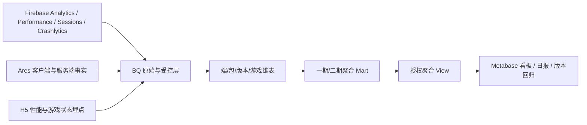

# Waje 多端设备与性能报表/看板需求 V3（六模块）

> 执行日期：`2026-09-02`。本版把原有 8 页设计重组为六个模块，区分一期可落地内容与二期建设内容。数据示例来自 `analysis/multiplatform_device_performance_dashboard_v1_2026_08_27/actual_baseline.json` 的聚合快照，窗口为 2026-08-20 至 2026-08-26，业务时区为 `Africa/Lagos`；不是实时生产看板数值。

> 交付定位：本地 Markdown 为主文档，HTML 为阅读版，飞书为团队协作版；Metabase 本轮只输出设计、View/Model 合同和本地示例，不修改远端对象。

## 模块一｜总体设计、框架、维度与核心指标

### 1.1 目标

回答四个问题：数据是否到达、哪个端/包/版本变慢、用户在哪个阶段受阻、哪些问题需要补埋点或补服务端事实。



### 1.2 统一维度和状态

| 维度组 | 字段/取值 | 规则 |
|---|---|---|
| 端侧 | Android / iOS / H5 / PWA / APP WebView | 端侧分开统计；未认证不跨端相加 |
| 版本与包 | app_version、web_version、package_name、release_id、发布批次 | 版本对比必须使用可比完整日 |
| 设备 | 品牌、型号桶、OS、内存档位、设备档位 | 未知单列；不输出设备唯一标识 |
| 网络 | Wi-Fi、蜂窝、运营商桶、effective_type | 网络 P95 按请求类别计算 |
| 数据状态 | 已认证 / 试运行 / 未成熟 / 延迟 / 数据缺口 / 已阻断 | 状态与数值同时展示；缺失不填 0 |

### 1.3 核心指标层级

```text
数据可信度 → 端侧健康 → 性能质量 → 稳定性 → 页面/游戏体验 → 核心业务结果
```

核心业务结果不由 Firebase 客户端行为替代：注册、登录、下注、结算、充值、提现和资产变动必须使用服务端事实。

## 模块二｜一期数据现状、可用范围与补充缺口

### 2.1 当前数据底座

| 数据源 | 观察窗口 | 覆盖 | 状态 | 一期可用范围 | 不能直接做 |
|---|---|---|---|---|---|
| Android Firebase Analytics | 2026-08-24 | 1 | 未成熟 | 事件结构观察 | 稳定趋势 |
| Android Firebase Performance | 2026-08-20..2026-08-26 | 7 | 试运行 | 原生性能基线 | 未经分类的业务接口结论 |
| Android Sessions | 2026-08-18..2026-08-26 | 9 | 质量警告 | 去标识化会话 | 替代 Performance 覆盖 |
| Android Crashlytics | 2026-08-13..2026-08-26 | 14 | 待字段认证 | 事件率/问题数 | 未经认证的崩溃率 |
| iOS Analytics | 2026-08-20..2026-08-24 | 5 | 未成熟 | 早期行为观察 | 跨端趋势 |
| iOS Performance | 2026-08-20..2026-08-25 | 6 | 未成熟 | 早期性能观察 | 正式版本排行 |
| H5 Firebase Analytics | 2026-08-14..2026-08-21 | 8 | 仅行为基线 | 四类行为事件 | 网页性能/游戏可玩结论 |

Android Performance 快照合计 `15.47M` 条，Android Sessions 合计 `535.2k` 个去标识化会话；H5 Analytics 合计 `9.05M` 条四类标准行为事件。上述数值只用于展示现有聚合底座，不代表用户数、成功率或实时状态。

### 2.2 一期急需补充的埋点

| 事件 | 实现对象 | 最低用途 | 当前状态 |
|---|---|---|---|
| H5_GAME_LOAD | H5 主框架 + 自研 iframe | 记录加载开始、阶段、失败、超时和放弃 | 尚未创建/待接入 |
| H5_GAME_READY | 各自研游戏回调 | 确认画面和必要配置真正可用 | 尚未创建/待接入 |
| H5_BET_READY | 各自研游戏/服务端确认 | 确认余额、币种、限额、连接和下注控件均可用 | 尚未创建/待接入 |

第三方/联运 iframe 没有合作方 SDK 或桥接回调时，只保留入口行为，不从 iframe onload 或页面打开推断内部状态。
会话建立成功率必须有“建立尝试”作为分母；优先复用已确认的会话初始化尝试事件，若当前不存在则补充 `SESSION_INIT_ATTEMPT`。分母未补齐时不输出比例，也不以单纯事件记录替代。

## 模块三｜一期看板和报表：指标、口径与示例

### 3.1 一期页面和报表

| 页面/报表 | 主要回答 | 一期指标 |
|---|---|---|
| 01 数据健康与端侧覆盖 | 数据是否到达、是否完整、是否延迟 | 覆盖率、完整日、最新时间、延迟、事件量、Performance 记录量、数据状态 |
| 02 Android/iOS 原生性能 | 哪个包/版本/设备/网络维度变慢 | 轨迹 P50/P95/P99、网络 P95、HTTP 成功率、慢帧、冻结帧、样本量 |
| 03 稳定性与 H5 行为基线 | 稳定性风险和 H5 行为是否有数据 | Fatal/Non-fatal 事件率、会话影响率、Issue 数和四类 H5 事件 |
| D+1 端侧健康日报 | 今天是否需要行动 | 端侧状态、异常候选、缺口、数据截止时间、次日动作 |

### 3.2 一期指标字典

| 指标 | 编码 | 定义 | 算法 | 分母/门槛 | 来源 | 状态 |
|---|---|---|---|---|---|---|
| 数据覆盖率 | data_coverage_rate | 实际到达的完整数据日 ÷ 请求数据日 | COUNT(complete_day) / COUNT(requested_day) | 请求数据日；当天不计入完整日 | mart_endpoint_coverage_daily | 一期可用 |
| 数据新鲜度 | source_freshness_lag_minutes | 当前时间与来源最新事件时间的差值 | TIMESTAMP_DIFF(now, MAX(event_time), MINUTE) | 有来源事件的端/包 | 覆盖聚合层 | 一期可用 |
| 会话建立成功率 | session_established_rate | 成功建立会话的去重会话数占建立尝试数的比例 | COUNT(DISTINCT successful_session_id) / COUNT(DISTINCT session_attempt_id) | 需要有效 session_attempt_id；当前缺少统一尝试分母，未补齐时显示 N/A | Sessions + SESSION_INIT_ATTEMPT | 一期补分母后可用 |
| 原生性能记录量 | native_performance_record_count | Firebase Performance 聚合记录数 | COUNT(*) | Performance 记录数 | mart_native_performance_daily | 一期可用 |
| 原生轨迹 P95 | duration_trace_p95_ms | 有效 DURATION_TRACE 时长的 95 分位 | APPROX_QUANTILES(duration_ms, 100)[OFFSET(95)] | 有效样本 ≥500；单位毫秒 | mart_native_performance_daily | 一期可用/待数值认证 |
| 网络 P95 | network_p95_ms | 网络请求响应完成耗时的 95 分位 | APPROX_QUANTILES(response_completed_ms, 100)[OFFSET(95)] | 有开始、完成和响应码；样本 ≥500 | mart_native_performance_daily | 一期可用/待请求分类 |
| 网络成功率 | network_success_rate | HTTP 200–399 响应数 ÷ 有响应码请求数 | COUNTIF(code BETWEEN 200 AND 399) / COUNTIF(code IS NOT NULL) | 有响应码的请求 | mart_native_performance_daily | 一期可用/待请求分类 |
| 慢帧/冻结帧比例 | frame_ratio_trace_mean | SCREEN_TRACE 比例字段的 trace 加权均值 | AVG(slow_frame_ratio), AVG(frozen_frame_ratio) | 有效 SCREEN_TRACE；不是用户占比 | mart_native_performance_daily | 一期可用 |
| Fatal/Non-fatal 事件率 | stability_event_rate_per_1k_sessions | 按 Fatal/Non-fatal 分开计算的每千有效会话事件率 | COUNT(DISTINCT event_id) / COUNT(DISTINCT eligible_session_id) × 1,000 | 同端、同包、同日有效会话；事件与会话关联键需认证 | mart_stability_daily + Sessions | 一期补分母后可用 |
| H5 行为事件量 | h5_behavior_event_count | H5 已接入标准行为事件的记录数 | COUNTIF(event_name IN (...)) | 事件记录数；不代表用户数 | H5 Analytics | 一期可用/仅行为基线 |
| 游戏真正可玩率 | h5_game_ready_rate | H5_GAME_READY success 的加载链路 ÷ LOAD start 链路 | COUNT(DISTINCT ready.game_load_id) / COUNT(DISTINCT load.game_load_id) | 有效 game_load_id；一期补充三事件后可用 | H5_GAME_LOAD + H5_GAME_READY | 一期补埋点后可用 |
| 进入可下注率 | h5_bet_ready_rate | 五项状态均为 true 的 BET_READY 链路 ÷ LOAD start 链路 | COUNT(DISTINCT valid_bet_ready.game_load_id) / COUNT(DISTINCT load.game_load_id) | balance/currency/limit/connection/bet_control 全 true | H5_BET_READY | 一期补埋点后可用 |

### 3.3 现有聚合示例

#### 原生 Performance 记录量（快照示例）

| 端/包 | Performance 记录 | DURATION_TRACE | 网络请求 | 窗口 |
|---|---|---|---|---|
| Android主包 | 7.11M | 1.93M | 4.14M | 2026-08-20 至 2026-08-26 |
| Android传音老包 | 4.47M | 582.0k | 3.59M | 2026-08-20 至 2026-08-26 |
| Android传音新包 | 3.89M | 351.8k | 3.35M | 2026-08-20 至 2026-08-26 |
| iOS现有来源 | 2.45M | 210.9k | 2.14M | 2026-08-20 至 2026-08-25 |

#### H5 Analytics 行为基线（快照示例）

| 事件 | 事件量 | 覆盖日数 |
|---|---|---|
| page_view | 3,960,784 | 8 |
| session_start | 3,029,904 | 8 |
| first_visit | 1,561,635 | 8 |
| user_engagement | 492,990 | 8 |

### 3.4 一期真实看板与报表示例（实际聚合）

> **实际聚合**：以下值来自已审阅的聚合快照，窗口为 `2026-08-20 至 2026-08-26`，业务时区为 `Africa/Lagos`。状态仍受字段、时效和口径认证约束。

| 看板卡片 | 示例值 | 口径/数据状态 |
|---|---|---|
| Performance 有效记录 | 15,466,848 | 聚合记录量；不代表用户数 |
| 端/包覆盖率 | 100.00% | 21/21 个日期×包体组合 |
| 网络成功率 | 99.90% | HTTP 200–399 ÷ 有响应码请求 |
| Analytics 覆盖 | 1 日 | Android Analytics 当前不足趋势窗口 |

#### 一期看板 B：原生性能对比

| 端/包 | 轨迹 P90 | 网络 P90 | 网络成功率 | 慢帧比例 | 冻结帧比例 | 轨迹样本 | 网络样本 |
|---|---|---|---|---|---|---|---|
| Android 主包 | 371,340 ms | 796 ms | 100.00% | 61.20% | 4.71% | 120,692 | 768,010 |
| Android 传音新包 | 259,560 ms | 879 ms | 99.97% | 61.04% | 10.17% | 14,507 | 297,149 |
| Android 传音老包 | 260,719 ms | 941 ms | 99.91% | 62.49% | 8.98% | 24,022 | 443,296 |

> 当前真实快照只有 P90 聚合结果；本表不将 P90 改写成 P95。正式 P95 需要后续真实聚合字段和样本门槛通过后启用。

#### 一期看板 A：端/包覆盖矩阵

| 包体 | 2026-08-20 | 2026-08-21 | 2026-08-22 | 2026-08-23 | 2026-08-24 | 2026-08-25 | 2026-08-26 |
|---|---|---|---|---|---|---|---|
| Android 主包 | 有数据 | 有数据 | 有数据 | 有数据 | 有数据 | 有数据 | 有数据 |
| Android 传音新包 | 有数据 | 有数据 | 有数据 | 有数据 | 有数据 | 有数据 | 有数据 |
| Android 传音老包 | 有数据 | 有数据 | 有数据 | 有数据 | 有数据 | 有数据 | 有数据 |

#### 一期看板 C：稳定性和 H5 行为基线

| 包体 | 活跃主体代理 | Fatal 受影响主体率 | Fatal 每万主体 |
|---|---|---|---|
| Android 传音老包 | 299,969 | 26 | 0.87 |
| Android 主包 | 557,502 | 27 | 0.48 |
| Android 传音新包 | 231,588 | 11 | 0.47 |

| H5 行为事件 | 事件量 | 覆盖日数 |
|---|---|---|
| page_view | 3,960,784 | 8 |
| session_start | 3,029,904 | 8 |
| first_visit | 1,561,635 | 8 |
| user_engagement | 492,990 | 8 |

> Fatal 指标使用去标识化主体代理，不等同账号用户崩溃率；H5 四类事件只证明行为数据到达，不证明 Web 性能或业务成功。

#### 一期报表 D：D+1 端侧健康日报格式

| 区域 | 输出内容 | 数据来源 | 状态规则 |
|---|---|---|---|
| 结论 | 可进入趋势比较的端/包/版本 | 覆盖聚合层 | 完整日和状态均满足才可用 |
| 性能 | 轨迹 P90、网络 P90、网络成功率、样本量 | Firebase Performance 聚合 | 样本不足显示 N/A |
| 稳定性 | Fatal 代理率、Issue、会话影响 | Crashlytics + Sessions | 分母/关联键未认证时不发布正式率 |
| H5 | 行为基线和性能数据缺口 | H5 Analytics + H5 埋点 | 缺失不填 0，显示数据缺口 |
| 行动 | 补字段、补埋点、补权限、补对账 | 质量检查回执 | 按 P0/P1/P2 排序 |

### 3.5 一期验收门槛

- P95/P99 仅在有效样本不少于 500 时展示；否则为 `N/A`。
- Android、iOS、H5 不把事件数、会话数和性能记录数直接相加。
- Crashlytics 一期主指标使用 Fatal/Non-fatal 事件率和会话影响率；分母或关联键未认证时显示 N/A，事件量只作为样本量和诊断信息。
- H5 三阶段事件接入后，`game_load_id` 链路关联率目标为 ≥98%；三类事件成功状态不能由 iframe onload 代替。
- 一期所有卡片同时显示数据截止时间、完整日数、样本量和质量状态。

## 模块四｜二期看板和报表：目标指标与复杂分析

| 二期主题 | 指标含义 | 计算方式 | 分母/门槛 | 需要的数据 | 状态 |
|---|---|---|---|---|---|
| H5 Web RUM | 页面性能、页面 ready 和白屏/黑屏情况 | 页面 ready 耗时计算 P50/P95/P99；异常链路 ÷ 有效链路 | 完整 page_visit_id；每组有效样本 ≥500 | H5_NAVIGATION_PERF、H5_CLIENT_ERROR | 二期缺埋点 |
| 核心请求体验 | 接口是否成功、超时、重试以及耗时 | 成功请求 ÷ 有效请求；超时请求 ÷ 有效请求；重试请求 ÷ 有效请求；计算耗时 P95 | request_id 有效；超时阈值按 endpoint_key 配置 | H5_CORE_REQUEST、request_id、endpoint_key | 二期缺埋点/需接口字典 |
| 网络恢复 | 断网或切网后能否恢复、恢复需要多久 | 恢复成功次数 ÷ 恢复尝试次数；恢复耗时计算 P50/P95 | recovery_id 有效；主动放弃单独统计 | H5_NETWORK_CHANGE、H5_RECOVERY_RESULT | 二期缺埋点 |
| 游戏体验与业务链路 | 可玩后是否进入真实开局，并完成结算和资产链路 | 有效 GAMESTART ÷ GAME_READY 成功；完局 ÷ 开局；资产对账差异率 | 优先使用直接 game_load_id；降级时间窗口单列 | 三阶段事件 + Origin 服务端事实 | 跨源链路待打通 |
| 性能影响归因 | 性能差异是否伴随首局、付费或留存差异 | 按性能分层比较结果率差异；无实验只做关联观察 | 成熟 cohort；同端、包、版本和窗口可比 | 性能事实、服务端业务事实、成熟 cohort | 复杂聚合 |

### 4.1 二期指标口径

| 指标 | 含义 | 计算方式 | 分母/门槛 | 来源 | 状态 |
|---|---|---|---|---|---|
| 页面加载 P50/P95/P99 | 页面从开始加载到业务内容 ready 的耗时分布 | P50/P95/P99(ready_at - start_at) | measurement_state=complete 且 page_visit_id 去重；每组有效样本 ≥500 | H5_NAVIGATION_PERF | 二期缺埋点 |
| 核心请求成功率 | 按接口类别统计请求进入业务成功终态的比例 | COUNT(success) / COUNT(valid_request) | 有效 request_id；HTTP 成功不能替代业务成功 | H5_CORE_REQUEST | 二期缺埋点 |
| 核心请求超时率 | 按接口类别统计超过阈值或进入 timeout 终态的比例 | COUNT(timeout) / COUNT(valid_request) | 有效 request_id；阈值按 endpoint_key 配置 | H5_CORE_REQUEST | 二期缺埋点 |
| 前端错误率 | 发生 JS、资源、白屏或黑屏错误的页面/游戏链路比例 | COUNT(DISTINCT error_flow_id) / COUNT(DISTINCT eligible_flow_id) | 页面/游戏有效链路；错误指纹去重 | H5_CLIENT_ERROR | 二期缺埋点 |
| 网络恢复成功率 | 网络异常后恢复到可用状态的比例 | COUNT(recovery_success) / COUNT(recovery_attempt) | 有效 recovery_id；主动放弃单独统计 | H5_NETWORK_CHANGE + H5_RECOVERY_RESULT | 二期缺埋点 |
| 可玩到服务端开局率 | 已经真正可玩的链路中，最终关联到服务端有效开局的比例 | COUNT(DISTINCT round_id) / COUNT(DISTINCT game_load_id) | 直接 game_load_id 关联；降级时间窗口单独展示 | H5 lifecycle + Origin server facts | 二期链路 |
| 性能异常影响的首局/付费变化 | 比较性能分层与首局、付费等结果的差异 | 分层 cohort 的结果率差异；无实验时只做关联观察 | 成熟 cohort；同端/包/版本/窗口可比 | H5 RUM + Origin + lifecycle | 二期复杂聚合 |

二期的复杂分析必须保留直接关联、降级时间窗口关联和仅行为代理三种状态，不能将时间窗口匹配当作服务端事实。

### 4.2 二期模拟看板与报表示例（模拟演示）

> **模拟演示**：以下数据使用固定演示场景 `phase2_dashboard_layout_v1`，仅用于验证布局、字段和计算公式，不对应任何生产日期、用户或真实性能结论。

#### 二期看板 E：H5 Web RUM

| 路由 | 有效页面访问 | ready P95 | FCP P95 | LCP P95 | 白屏率 | 黑屏率 |
|---|---|---|---|---|---|---|
| 首页 | 1,200 | 4,200 ms | 1,600 ms | 3,200 ms | 0.83% | 0.33% |
| 商城 | 920 | 5,100 ms | 1,900 ms | 3,800 ms | 1.63% | 0.54% |
| 游戏入口 | 760 | 6,800 ms | 2,300 ms | 4,700 ms | 2.89% | 1.18% |

公式：`页面 ready P95 = P95(ready_at - navigation_start_at)`；`白屏率 = 白屏链路 / 有效页面链路`。需要 `H5_NAVIGATION_PERF` 和 `H5_CLIENT_ERROR`。

#### 二期看板 F：核心请求体验

| 接口类别 | 有效请求 | 业务成功率 | 超时率 | 重试率 | 请求 P95 |
|---|---|---|---|---|---|
| 登录 | 10,000 | 98.00% | 1.50% | 3.00% | 1,200 ms |
| 余额 | 8,600 | 98.00% | 1.00% | 2.00% | 900 ms |
| 进入游戏 | 6,400 | 93.00% | 3.00% | 6.00% | 2,300 ms |
| 下注 | 4,200 | 99.00% | 1.00% | 2.00% | 760 ms |

公式：`业务成功率 = business_success / valid_request`；`超时率 = timeout / valid_request`；`重试率 = retried / valid_request`。HTTP 状态码不能替代业务成功。

#### 二期看板 G：网络恢复

| 指标 | 尝试次数 | 成功次数 | 恢复成功率 | 主动放弃率 | 恢复 P50 | 恢复 P95 |
|---|---|---|---|---|---|---|
| 网络恢复 | 1,000 | 860 | 86.00% | 9.00% | 1,800 ms | 7,800 ms |

需要 `H5_NETWORK_CHANGE` 记录断网/切网，需要 `H5_RECOVERY_RESULT` 记录重试、重连、重载和最终结果。

#### 二期看板 H：游戏加载到真实业务链路

| 阶段 | 演示数量 | 相对加载开始 |
|---|---|---|
| 加载开始 | 10,000 | 100.00% |
| 真正可玩 | 9,100 | 91.00% |
| 可下注 | 8,650 | 86.50% |
| 服务端开局 | 8,200 | 82.00% |
| 正常完局 | 7,700 | 77.00% |
| 结算完成 | 7,650 | 76.50% |

公式：`游戏真正可玩率 = GAME_READY 成功 / GAME_LOAD`；`进入可下注率 = BET_READY 有效 / GAME_LOAD`；`完局率 = GAMEEND / GAMESTART`；`结算完成率 = BETREWARD / GAMEEND`。

#### 二期看板 I：性能影响归因

| 性能分层 | 有效用户 | 首局率 | 付费率 | D1 留存率 |
|---|---|---|---|---|
| 正常性能组 | 10,000 | 36.00% | 7.80% | 25.00% |
| 性能异常组 | 3,200 | 30.00% | 6.00% | 21.00% |

本演示只展示分层结果率差异，不表达因果。实际落地必须保证同端、同包、同版本、同窗口和成熟 cohort。

### 4.3 示例指标—字段—埋点映射

| 看板主题 | 核心字段 | 公式 | 需要补充的埋点 | 实际/模拟 |
|---|---|---|---|---|
| H5 Web RUM | page_visit_id、route_key、ready_at、FCP/LCP/INP/CLS | P95(ready_at-start_at)；异常链路/有效链路 | H5_NAVIGATION_PERF、H5_CLIENT_ERROR | 模拟演示 |
| 核心请求 | request_id、endpoint_key、business_status、timeout_flag、retry_count | 成功/有效请求；超时/有效请求；重试/有效请求 | H5_CORE_REQUEST | 模拟演示 |
| 网络恢复 | network_change_id、recovery_id、result、duration_ms | 恢复成功/恢复尝试；P95(duration_ms) | H5_NETWORK_CHANGE、H5_RECOVERY_RESULT | 模拟演示 |
| 游戏业务链路 | game_load_id、round_id、status、end_reason、ledger_id | GAMESTART→GAMEEND→BETREWARD→ASSET | H5_GAME_LOAD、H5_GAME_READY、H5_BET_READY + 服务端事实 | 模拟演示 |
| 会话建立 | successful_session_id、session_attempt_id | 成功会话/建立尝试 | SESSION_INIT_ATTEMPT 或复用已确认事实 | 待补分母 |

## 模块五｜二期埋点、事实表与复杂聚合

### 5.1 二期事件

| 事件 | 主要字段 | 解锁内容 |
|---|---|---|
| H5_SESSION_START | session_id、surface_type、web_version、release_id | H5 会话和版本覆盖 |
| H5_NAVIGATION_PERF | page_visit_id、route_key、FCP/LCP/INP/CLS、ready_ms | 网页性能和页面回归 |
| H5_CORE_REQUEST | request_id、request_kind、endpoint_key、duration_ms、终态 | 登录/余额/充值/下注/结算请求体验 |
| H5_CLIENT_ERROR | error_type、stage、error_code、fingerprint、white/black screen | 前端错误、白屏和版本回归 |
| H5_NETWORK_CHANGE | network_change_id、前后网络、offline_duration_ms、stage | 断网和切网诊断 |
| H5_RECOVERY_RESULT | recovery_id、origin_id、action、result、duration_ms | 重试、重连、重载恢复能力 |
| H5_SESSION_END | session_duration_sec、last_stage、close_reason | 会话结束和异常退出辅助判断 |

### 5.2 逻辑事实层

```text
fact_h5_page_performance
fact_h5_core_request
fact_h5_client_error
fact_h5_game_lifecycle
fact_h5_network_recovery
fact_core_business_funnel
```

统一关联键：`session_id → page_visit_id → game_load_id → request_id → round_id/order_id`。物理表名必须由数据开发按真实 BQ/Ares 目录回填，不使用假定表名发布看板。

### 5.3 二期数据质量

| 质量项 | 门槛 | 失败处理 |
|---|---|---|
| 完整日 | 至少 7 个完整业务日 | 显示未成熟，不做正式趋势 |
| 必填字段 | ≥99.5% | 阻断对应指标，进入缺口队列 |
| 链路关联 | ≥98% | 区分直接关联与降级关联 |
| 未知枚举 | ≤0.1% | 保留 raw_value，不能映射为其他 |
| 迟到数据 | 原生诊断超过 45 分钟 | 状态改为延迟，不触发产品性能告警 |


### 5.4 示例字段索引

| 示例主题 | 关键字段 | 事件/事实来源 | 状态 |
|---|---|---|---|
| H5 Web RUM | page_visit_id、route_key、ready_at、FCP/LCP/INP/CLS | H5_NAVIGATION_PERF | 模拟演示/待补埋点 |
| 核心请求 | request_id、endpoint_key、business_status、timeout_flag、retry_count、duration_ms | H5_CORE_REQUEST | 模拟演示/待补埋点 |
| 网络恢复 | network_change_id、recovery_id、before_network、after_network、result、recovery_duration_ms | H5_NETWORK_CHANGE、H5_RECOVERY_RESULT | 模拟演示/待补埋点 |
| 游戏链路 | game_load_id、round_id、status、end_reason、reward_status、ledger_id | H5 三阶段事件 + Origin 服务端事实 | 模拟演示/跨源待打通 |
| 会话建立 | successful_session_id、session_attempt_id | Sessions + SESSION_INIT_ATTEMPT | 待补分母 |

示例字段只用于说明看板如何计算；缺失字段不填 0，真实看板显示 `N/A` 或“待补埋点”。

## 模块六｜Metabase 搭建方案、样式与数据链路

### 6.1 看板页面结构

```text
顶部：数据截止时间｜完整日｜口径版本｜状态
第一行：核心 KPI 卡（每卡一个主指标）
第二行：趋势/覆盖热条
第三行：单维度排行/异常分布
底部：聚合明细表与数据状态
```

Metabase 只消费授权聚合 View，不直接连接 Firebase、Ares、支付、订单或用户原始表。颜色仅表达状态：绿色已核验、琥珀试运行/未成熟、红色缺失/阻断、灰色延迟。

### 6.2 推荐 View 和 Model

| 逻辑 View | 粒度 | 一期/二期 | 主要用途 |
|---|---|---|---|
| vw_metabase_endpoint_health | 日期 × 端 × 来源 × 包 | 一期 | 数据覆盖和新鲜度 |
| vw_metabase_native_performance | 日期 × 端 × 包 × 版本 × 维度 | 一期 | 原生性能 |
| vw_metabase_native_performance_rank | 日期 × 单一排行维度 | 一期 | 设备/版本/网络排行 |
| vw_metabase_event_session | 日期 × 端 × 包 × 事件分类 | 一期 | 事件与会话行为 |
| vw_metabase_stability_and_quality | 日期 × 包 × 版本 × Issue | 一期 | 稳定性事件量和问题数 |
| vw_metabase_h5_game_lifecycle | 日期 × 游戏 × 端 × 版本 | 一期/二期 | 加载→可玩→可下注 |
| vw_metabase_h5_web_performance | 日期 × 页面 × 浏览器/网络 | 二期 | Web RUM 与核心请求 |
| vw_metabase_core_funnel | 日期 × 端 × 包 × 阶段 | 二期 | 客户端尝试与服务端成功 |

### 6.3 全局筛选器

日期范围、端侧、包体、应用/H5 版本、发布批次、国家、设备品牌/型号桶、系统、内存档位、浏览器、网络类型、运营商、页面/请求类别、游戏和数据状态。H5 没有对应字段时显示“未采集”，不能筛选成 0。

### 6.4 实施顺序

```text
权限/区域确认
  → BQ 聚合数据集与维表
  → 一期 D+1 刷新与质量检查
  → Metabase Model / Saved Question
  → 一期 Dashboard 与日报
  → H5 三阶段埋点接入
  → 二期 H5 RUM、请求、错误、恢复与业务链路
```

当前远端状态：BigQuery 聚合数据集和 Metabase 写入均未在本轮执行；本地已有 V1 SQL/合同/预览作为样式和实现参考。管理员后续需提供最小权限后再落地远端对象。

## 附录｜决策与资料边界

- 一期：当前 Firebase 聚合、现有 BQ 设计合同、少量 H5 三阶段事件。
- 二期：Web RUM、核心请求、前端错误、网络恢复、服务端业务链路和复杂版本/设备归因。
- 业务日：`Africa/Lagos`；文档执行时间：`Asia/Hong_Kong`。
- 历史 V2、起源五页版和 Firebase 清单保留为历史/证据资料；本 V3 作为新的主入口。
- [多端设备性能 V2](./Waje多端设备性能报表看板详细设计V2-2026-08-27.md)
- [起源设备监控五页版](./起源设备监控五页版优化需求与具体报表示例-V1-2026-08-31.md)
- [Firebase 设备与性能可实现报表清单](./Waje-Firebase设备与性能数据可实现报表、字段与埋点缺口清单-V1-2026-08-31.md)
- [现有本地 Metabase V4 示例](../../analysis/metabase_v4_visual_dashboard_2026_09_01/README.md)
