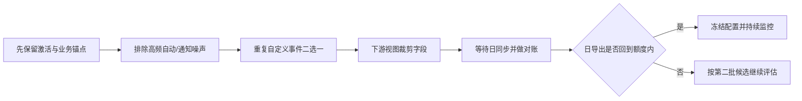
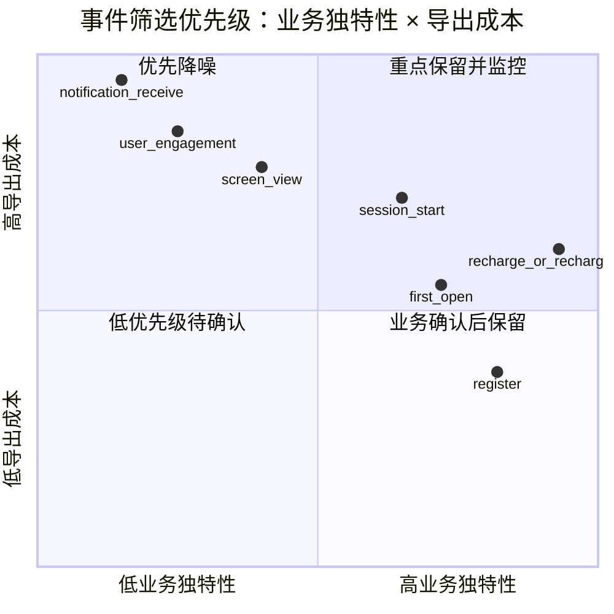

# Waje 安卓 Firebase Analytics → BigQuery 导出事件与字段筛选审计

> 本文先依据项目本地知识库、已有结构字典、历史审计、BigQuery 查询准备包、Metabase 元数据盘点和用户提供的 Firebase 截图形成。目标是降低 Android Firebase Analytics 的日导出事件量，同时保留对 Waje 业务真正有用的激活、留存、支付行为和版本/设备分析能力。

## 1. 先给结论

### 1.1 当前最可行的处理顺序



### 1.2 推荐动作

| 决策 | 事件/字段 | 建议 | 依据与边界 |
|---|---|---|---|
| 必须保留 | `first_open`、`session_start`、`register` | 暂不排除 | 分别承担首开 cohort、会话/活跃锚点和注册激活；仍需与服务端事实去重对账。 |
| 必须保留 | `recharge` 与 `rechargeDollar` 中的一个 | 先确认语义后只保留一个 | 本地截图中两者量几乎一致；不能在未确认金额/成功含义前把两者都当作独立指标。 |
| 默认第一批排除 | `notification_receive`、`notification_dismiss`、`user_engagement` | 若没有推送送达/互动或会话时长专项依赖，排除 | 本地历史审计显示它们属于高频事件，替代价值通常低于导出成本。 |
| 默认排除候选 | `rechargeAndWithdrawTotalTimes`、`rechargeFix` | 核对报表依赖后排除 | 合并计数、修正/兼容信号与服务端事实重叠，不能直接替代订单和提现终态。 |
| 条件处理 | `screen_view` | Ares 页面埋点已覆盖且无需 Firebase 独立路径时排除；否则保留 | 这是最大量级的页面行为信号之一，排除前要完成 Ares PV/PD 覆盖核验。 |
| 条件处理 | `app_remove`、`notification_open`、`withdraw` | 仅在明确有对应专题时保留 | 卸载、推送打开和提现意图不能默认等同于业务结果。 |
| 下游裁剪 | `event_params`、`user_properties`、`device`、`geo`、归因和商品结构 | 不在 Firebase 事件筛选中处理；在 BigQuery 视图/ETL 中做白名单投影 | Firebase 事件排除解决“行数”，字段投影解决“下游可见范围”和成本/隐私。 |

**当前结论：**先处理事件，不要把字段投影误认为 Firebase 导出筛选。Firebase 的事件排除可以减少导出行数；GA4 标准导出字段通常仍按固定 schema 产生，字段精简要在 BigQuery 下游模型完成。

### 1.3 当前不能得出的结论

- 用户截图只展示了事件选择页的一部分，不能当作全量事件清单；其中的事件量也没有同时给出完整筛选窗口、包体拆分和查询回执，不能据此精确计算可节省比例。
- 本地记录了 `waje-special` 的三包导出配置和官方参考 schema，但在 2026-08-24 的快照中 Analytics 实例数据集仍标记为首批 Daily 导出待生成。
- 2026-08-27 的 BigQuery API 验证为 `blocked_authentication`，没有执行真实事件/参数查询；候选表路径不能当作当前已验证表。
- Metabase 当前可见的 `whot_center` 目录未观察到 Firebase Analytics `events_*` 表；这只能说明“当前 Metabase 可见范围没有该表”，不等于 BigQuery 中不存在。

## 2. 证据范围与可信度

| 来源 | 本轮能确认的内容 | 状态 |
|---|---|---|
| 《Waje App Firebase Analytics 与关联 BigQuery 数据收集-2026-08-24》 | Firebase 项目、GA Property、三个 Android 包、Daily 导出设置、官方参考 schema | `local_observed + reference_schema` |
| 《Waje Android Firebase 接入与数据现状审计-2026-08-21》 | 项目级历史事件量级和事件业务边界 | `historical_aggregate_context`，不是本次日窗口实测 |
| Firebase 截图（用户提供） | 导出超限提示及局部事件/日事件量展示 | `screenshot_partial` |
| `analysis/app_firebase_analytics_bigquery_collection_2026_08_24/` | 导出状态回执与参考 schema | `local_artifact` |
| `analysis/android_bq_api_validation_2026_08_27/` | 8 条只读聚合/元数据 SQL 已静态校验；实时调用被认证阻断 | `static_ready_live_blocked` |
| Metabase `whot_center` 元数据 | 当前可见表/字段字典，没有观察到 Firebase Analytics 表 | `metabase_not_visible` |

### 2.1 三个 Android 包

| 分析角色 | 包名 | Stream ID | 使用规则 |
|---|---|---:|---|
| Waje Special 主包 | `com.hfhy.waje.special` | `10068369856` | 当前主包分析优先；仍必须按版本拆分。 |
| 传音旧包 | `com.hfhy.wajecasino.palmgame` | `11103507430` | 作为历史/兼容包单独观察，不与新包混算。 |
| 传音新包 | `com.hfhy.wajecasino.game` | `14405888142` | 作为新包单独观察；版本覆盖需与发版资料核对。 |

Firebase 项目为 `waje-special`，GA Property 为 `470712959`。本表只证明映射存在，不证明每个包的事件、版本和参数都有值。

## 3. 事件筛选与字段筛选的边界

| 层次 | 能解决什么 | 本次动作 | 不能解决什么 |
|---|---|---|---|
| Firebase 导出设置 | 控制哪些 Analytics 事件进入 BigQuery，直接降低事件行数 | 在“排除事件”页面按依赖核对后处理 | 不能替代服务端支付、下注、结算和提现事实；不能精细删单个标准 schema 字段。 |
| BigQuery 原始导出 | 保留 GA4 标准事件结构和历史追溯能力 | 只读、受控、禁止向普通分析用户暴露原始身份字段 | 原始事件量大时，单靠 BI 查询不能消除 Firebase 导出日限制。 |
| BigQuery 认证视图/ETL | 裁剪字段、标准化参数、统一包体和口径 | 建立安全投影和聚合层 | 不能把未上报的字段“补”出来，也不能把客户端成功当作服务端成功。 |
| Ares/服务端事实 | 页面/模块行为和注册、充值、游戏、资产、提现结果 | 作为交叉验证和正式业务口径 | 不能直接替代 Firebase 的安装来源和设备性能辅助信息。 |

## 4. 本地已知事件盘点与处理建议

> 事件状态按“本地历史证据 + 截图局部证据”整理。没有全量实例清单的事件标为“待核对”，不把未见到写成不存在。

### 4.1 第一批：优先处理高频、低业务独特性的事件

| 事件 | 本地/截图证据 | 主要价值 | 推荐动作 | 依赖核验 |
|---|---:|---|---|---|
| `notification_receive` | 历史项目级约 47M | 推送到达次数；不是用户数、订单或收入 | **默认排除** | 仅当需要 Firebase 推送送达诊断、且没有其他推送平台数据时保留。 |
| `notification_dismiss` | 历史项目级约 16M | 通知关闭次数 | **默认排除** | 只有推送内容/打扰度专项需要时保留。 |
| `user_engagement` | 历史项目级约 39M | 互动/停留辅助 | **默认排除** | 若正式报表用其 `engagement_time_msec` 计算会话时长，则转为条件保留。 |
| `screen_view` | 截图局部约 1,010,554；历史项目级约 24M | 页面/屏幕浏览 | **条件保留** | 先核对 Ares `PV/PD` 是否覆盖主路径，以及是否有 Firebase 独立页面分析需求。 |
| `app_remove` | 截图局部约 115,975 | 卸载/移除信号 | **默认排除** | 只有产品明确跟踪卸载 cohort，且接受该事件的近似性时保留。 |

### 4.2 第二批：保留业务锚点，清理重复/合并信号

| 事件 | 本地/截图证据 | 主要价值 | 推荐动作 | 关键风险 |
|---|---:|---|---|---|
| `session_start` | 截图局部约 658,507；历史项目级约 15M | 会话与活跃起点 | **保留** | 高频但属于 DAU/留存基础锚点；必须按包体、版本拆分。 |
| `first_open` | 截图局部约 201,261；历史项目级约 3.9M | 首次打开/安装 cohort | **保留** | 不等于注册用户；要与服务端注册事实区分。 |
| `register` | 历史项目级约 383K | 注册行为观察 | **保留** | 事件次数不是注册用户数；以服务端注册成功去重为正式口径。 |
| `recharge` | 截图局部约 111,606；历史审计约 3.2M 与 `rechargeDollar` 同属充值类 | 充值行为 | **与 `rechargeDollar` 二选一** | 需确认触发时机、金额单位、成功/失败和幂等键。 |
| `rechargeDollar` | 截图局部约 111,607；历史审计约 3.2M | 充值金额/行为候选 | **与 `recharge` 二选一** | 名称含金额暗示不等于金额已认证；订单/资产事实优先。 |
| `rechargeAndWithdrawTotalTimes` | 历史项目级约 4.7M | 充值/提现合并计数 | **默认排除** | 合并语义不能同时支撑充值和提现漏斗，且与服务端事实重叠。 |
| `rechargeFix` | 截图局部约 111,606 | 修正/兼容信号候选 | **核对依赖后排除** | 量级与充值事件接近，可能是重复或修正事件；不能未经依赖审计直接删除。 |
| `withdraw` | 在本地 SQL 方案中作为行为事件候选；截图未展示 | 提现意图/行为 | **条件保留** | 提现申请/审核/成功/失败必须以服务端订单终态为准。 |

### 4.3 低优先级或非本次 Android 主线事件

| 事件 | 处理建议 | 说明 |
|---|---|---|
| `notification_open` | 有推送营销专项才保留 | 作为点击/打开比 `receive` 更有决策价值，但仍不是付费结果。 |
| `page_view`、`form_start` | 按实际 Android 事件清单核对 | 主要出现在 H5/GA4 行为分析方案中，不自动视为三个 Android 包的现有事件。 |
| 其他未列出的自定义事件 | 先进入全量清单和依赖扫描 | 当前本地证据不足，不能凭命名判断保留或排除。 |

## 5. 建议保留的字段字典与下游投影

### 5.1 事件信封与包体字段

| 字段/字段组 | 类型（官方参考） | 下游策略 | 用途 |
|---|---|---|---|
| `event_date` | `STRING` | 保留并转 `DATE` | 日粒度分区和完整日判断。 |
| `event_timestamp` | `INT64` | 保留；规范化为 `TIMESTAMP` | 事件时间、迟到和顺序分析。 |
| `event_name` | `STRING` | 保留 | 事件筛选、事件量和质量监控。 |
| `platform` | `STRING` | 保留 | 过滤 `ANDROID`，避免跨端混算。 |
| `stream_id` | `STRING` | 保留 | 三个 Android 数据流隔离。 |
| `app_info.id` | `STRING` | 保留 | 包名隔离，是当前新/老包拆分主键之一。 |
| `app_info.firebase_app_id` | `STRING` | 保留 | Firebase App 精确归属。 |
| `app_info.version` | `STRING` | 保留 | 版本质量、发版前后对比。 |
| `app_info.install_source`、`app_info.install_store` | `STRING` | 条件保留 | 仅在需要安装来源/商店分析且实际填充时使用。 |
| `event_previous_timestamp`、`event_original_occurrence_timestamp`、`event_server_timestamp_offset` | `INT64` | 仅质量/延迟视图保留 | 上报顺序、原始发生时间和延迟诊断。 |
| `event_bundle_sequence_id`、`batch_event_index`、`batch_ordering_id`、`batch_page_id` | `INT64` | 仅质量视图保留 | 批次顺序诊断，不进入常规业务 KPI。 |
| `event_value_in_usd` | `FLOAT64` | 条件保留 | 仅作 Analytics 辅助金额，不能替代服务端收入。 |

### 5.2 事件参数、用户、设备和地域字段

| 字段/字段组 | 类型（官方参考） | 推荐策略 | 备注 |
|---|---|---|---|
| `event_params` | `ARRAY<STRUCT>` | 原始层可保留；认证视图只允许白名单参数 | 这是参数容器，不应把所有自定义 key 无差别暴露给 BI。 |
| `event_params.key` | `STRING` | 仅在受控字段审计中使用 | 实际 key 必须以实例表核验；不把命名推断当业务字段。 |
| `value`、`currency`、`method`、`status/result` | 联合值结构 | 条件白名单 | 只有在事件契约确认后进入充值/行为聚合；不直接认证支付成功。 |
| `screen_name`、`page_title` | `STRING` | 可保留 | 用于页面路径分析；避免把原始 URL 查询串带入视图。 |
| `ga_session_id`、`engagement_time_msec` | `INT64` | 条件保留 | 仅当会话时长/行为分析确实需要；必须和 `session_start` 口径一致。 |
| `user_id`、`user_pseudo_id` | `STRING` | **禁止进入普通 BI/导出** | 只允许受控伪标识模型或聚合计算，禁止输出原值。 |
| `user_properties` | `ARRAY<STRUCT>` | 普通视图不投影 | 自定义属性含义和隐私风险不透明；需要单独审批。 |
| `user_first_touch_timestamp`、`is_active_user`、`user_ltv` | `INT64` / `BOOLEAN` / `STRUCT` | 条件保留或聚合 | 仅用于 cohort/活跃辅助；LTV 不替代服务端账务，未认证前不进入经营结论。 |
| `device.category`、品牌、型号、OS | `STRUCT` | 仅保留聚合维度 | 支持头部设备/低端机分析；不带设备标识，不输出小样本组合。 |
| `device.advertising_id`、`vendor_id` | `STRING` | **禁止投影** | 本次导出已关闭广告标识符；不恢复、不拼接身份。 |
| `geo.country`、`geo.region` | `STRING` | 仅保留国家/大区聚合 | 城市、metro 等更细粒度仅在明确业务需要并满足最小样本时使用。 |
| `traffic_source` | `STRUCT` | 保留规范化 source/medium/group | 只服务获客分析；不把首次来源解释为每次转化来源。 |
| `session_traffic_source_last_click` | `STRUCT` | 规范化聚合视图条件保留 | 只保留来源/媒介/活动组等分析字段，不能把广告归因直接解释为充值归因。 |
| `collected_traffic_source`、`gclid/dclid` | `STRUCT/STRING` | 默认不进普通视图 | 原始点击标识、广告账户标识和完整归因不适合常规导出。 |
| `ecommerce`、`items`、`items.item_params` | `STRUCT/ARRAY` | 默认不投影 | Waje 充值/收入以服务端订单、资产与账务为准；商品级分析另立白名单。 |
| `privacy_info` | `STRUCT` | 进入合规/质量视图 | 不作为常规业务维度；用于同意状态和数据覆盖解释。 |

### 5.3 不能用字段筛选替代的业务事实

| 业务对象 | Firebase 事件能观察什么 | 正式事实来源 |
|---|---|---|
| 注册 | 客户端触发了 `register` | 服务端注册成功/用户事实；去重后作为注册口径 |
| 充值 | 发起或客户端上报 `recharge` 类事件 | 服务端订单成功、资产入账和账务流水 |
| 提现 | 提现页面/申请行为 | 服务端提现订单、审核和最终状态 |
| 下注/结算/RTP | 可能只有行为或自定义事件线索 | Ares/BQ/GM 服务端游戏、奖励、资产事实 |
| 性能/崩溃 | Analytics 参数中的辅助信号 | Firebase Performance / Crashlytics 专用数据集 |

## 6. 推荐的事件筛选分层

### 6.1 事件决策矩阵



> 图中位置是治理优先级示意，不是从完整数据计算出的散点图。正式排序要等全量事件日量、报表依赖和实际包体拆分回读后生成。

### 6.2 推荐的分批动作

| 批次 | 候选事件 | 操作 | 通过条件 |
|---|---|---|---|
| 第一批 | `notification_receive`、`notification_dismiss`、`user_engagement`、`app_remove` | 默认排除候选 | 没有 Firebase 报表、受众、推送专项依赖；Ares/其他系统无关键指标依赖。 |
| 第二批 | `rechargeAndWithdrawTotalTimes`、`rechargeFix` | 依赖核对后排除 | 已确认不是唯一业务口径；服务端/其他事件可支撑已有报表。 |
| 第三批 | `screen_view` | Ares 覆盖后再决定 | Ares 页面 PV/PD 能覆盖主路径；仍保留必要页面停留/异常诊断。 |
| 不排除 | `first_open`、`session_start`、`register` | 保留 | 继续用于 cohort、活跃和激活，但必须标注“事件次数”边界。 |
| 二选一 | `recharge` / `rechargeDollar` | 选一个作为客户端充值行为信号 | 完成触发时机、金额字段、状态和去重键确认。 |

## 7. 事件与字段清理的具体实施流程

1. **拿到完整事件清单。** 从 Firebase 导出设置页导出/截图全量列表，保留事件名、每日量、是否已标记关键事件；当前两张截图只作为局部证据。
2. **做依赖扫描。** 检查 Firebase/GA4 关键事件、受众、转化、报表、BigQuery 下游 SQL、Metabase/Ares 看板是否引用候选事件。
3. **先筛事件，再裁字段。** 事件排除直接解决行数；字段裁剪在 BigQuery 认证视图完成，不在 Firebase 页面中假设存在字段开关。
4. **优先处理高量级自动事件。** 先排除通知接收/关闭、互动和卸载候选，完成第一轮日导出额度验证。
5. **重复自定义事件二选一。** `recharge` 与 `rechargeDollar` 不能仅根据名称判断；先由研发确认事件契约和订单对账，再保留一个。
6. **等待同步窗口。** Firebase/GA4 Daily 导出不是即时切换；变更后等待下一次日同步，并按官方说明保留最长 48 小时的传播核验窗口。
7. **按包体×版本复核。** 不把三包项目级总量混算；至少按 `app_info.id`、`app_info.version`、`event_name`、`event_date` 聚合。
8. **验证业务覆盖。** 对 `register`、充值行为和提现行为分别与服务端事实对账；如果业务指标下降，优先判断是否误删事件或上报断流。
9. **冻结与回滚。** 每批变更保存设置前后回执；若核心事件覆盖下降或日报断流，按批次回滚，不一次性清空全部候选。

## 8. 只读验收 SQL 模板

> 以下 SQL 只做日级/事件级聚合，不返回用户、订单、设备标识或参数值。表路径来自历史准备包，当前仍标记为候选；需在真实 BigQuery 项目和授权恢复后先做 dry run，再执行。

### 8.1 事件量与包体拆分

```sql
-- candidate table: replace with the verified Firebase Analytics events_* table
SELECT
  PARSE_DATE('%Y%m%d', _TABLE_SUFFIX) AS event_day,
  COALESCE(NULLIF(app_info.id, ''), 'unknown') AS app_package,
  COALESCE(NULLIF(app_info.version, ''), 'unknown') AS app_version,
  event_name,
  COUNT(*) AS event_count
FROM `wajenigeria.waje_ng_firebase_android.events_*`
WHERE _TABLE_SUFFIX BETWEEN '20260820' AND '20260826'
  AND platform = 'ANDROID'
GROUP BY event_day, app_package, app_version, event_name
HAVING COUNT(*) >= 10
ORDER BY event_day, app_package, event_count DESC
LIMIT 3000;
```

### 8.2 候选事件过滤前后覆盖

```sql
-- Keep only aggregate counts; do not return identifiers or parameter values.
WITH event_policy AS (
  SELECT 'first_open' AS event_name, 'keep' AS policy UNION ALL
  SELECT 'session_start', 'keep' UNION ALL
  SELECT 'register', 'keep' UNION ALL
  SELECT 'notification_receive', 'exclude_candidate' UNION ALL
  SELECT 'notification_dismiss', 'exclude_candidate' UNION ALL
  SELECT 'user_engagement', 'exclude_candidate' UNION ALL
  SELECT 'app_remove', 'exclude_candidate'
), daily AS (
  SELECT
    PARSE_DATE('%Y%m%d', _TABLE_SUFFIX) AS event_day,
    event_name,
    COUNT(*) AS event_count
  FROM `wajenigeria.waje_ng_firebase_android.events_*`
  WHERE _TABLE_SUFFIX BETWEEN '20260820' AND '20260826'
    AND platform = 'ANDROID'
  GROUP BY event_day, event_name
)
SELECT
  d.event_day,
  COALESCE(p.policy, 'unclassified') AS policy,
  SUM(d.event_count) AS event_count
FROM daily d
LEFT JOIN event_policy p USING (event_name)
GROUP BY d.event_day, policy
ORDER BY d.event_day, policy;
```

### 8.3 参数 key 的受控审计

```sql
-- Use only in a controlled audit job. Do not export raw key/value lists.
SELECT
  PARSE_DATE('%Y%m%d', _TABLE_SUFFIX) AS event_day,
  event_name,
  COUNT(*) AS parameter_occurrences,
  COUNT(DISTINCT ep.key) AS parameter_key_count,
  COUNTIF(REGEXP_CONTAINS(LOWER(ep.key), r'(user|phone|email|token|device|advert|account|bank|id_card|face|biometric)')) AS restricted_key_candidate_count
FROM `wajenigeria.waje_ng_firebase_android.events_*`,
  UNNEST(event_params) AS ep
WHERE _TABLE_SUFFIX BETWEEN '20260820' AND '20260826'
  AND platform = 'ANDROID'
GROUP BY event_day, event_name
ORDER BY event_day, parameter_occurrences DESC
LIMIT 3000;
```

> 该审计 SQL 只返回受限 key 候选的数量，不返回 key 名和值；命中后由数据开发在受控环境核对契约并修复投影规则。

## 9. 质量门禁与回归标准

| 检查项 | 通过标准 | 失败处理 |
|---|---|---|
| 导出量 | 完整日事件量回到 Firebase 当前额度内；以控制台实际额度为准 | 不把空数据当成功；记录 `blocked/degraded` 并继续分批排查。 |
| 核心事件覆盖 | `first_open`、`session_start`、`register` 在三包中仍有数据；按包/版本核对 | 先排查误删、SDK 版本或上报断流，再考虑恢复。 |
| 充值行为 | 选定的一个充值事件与服务端订单行为方向一致 | 禁止将 Analytics 事件直接写成支付成功/收入。 |
| 页面分析 | 若排除 `screen_view`，Ares PV/PD 主路径覆盖通过 | 覆盖不足则恢复 `screen_view` 或补齐 Ares 页面埋点。 |
| 事件重复 | `recharge`/`rechargeDollar` 只保留一个作为统一行为信号；`rechargeFix` 无唯一报表依赖 | 保留修复事件或迁移下游后再排除。 |
| 包体隔离 | 新包、老包、主包不混入同一分母；所有日报带包名/版本 | 标记结果不可用并修正模型。 |
| 字段治理 | 普通视图没有用户 ID、广告 ID、原始 URL 查询串、支付账户和原始自定义属性 | 阻断发布并删除错误投影。 |
| 延迟与完整日 | Daily 表保留 `data_cutoff`、`complete_day`、迟到状态 | 未成熟日不得填 0。 |
| 回滚能力 | 每批变更有前后快照和可回滚记录 | 没有回执不得继续下一批。 |

## 10. 待人工确认项

1. Firebase 导出设置页的完整事件列表、当前完整日窗口和每个事件的实际日量。
2. `recharge`、`rechargeDollar`、`rechargeFix`、`rechargeAndWithdrawTotalTimes` 的研发契约、触发点、金额单位、状态、幂等键和下游依赖。
3. `screen_view` 是否仍被 Firebase/GA4 报表、受众或产品分析使用；以及 Ares `PV/PD` 对 Android 主路径的真实覆盖率。
4. 三个 Android 包当前线上版本、版本切换时间和 Firebase Analytics SDK/采集开关状态。
5. Firebase Analytics 实例数据集和 `events_YYYYMMDD` 是否已在实际 BigQuery 项目生成；恢复权限后只先做 `INFORMATION_SCHEMA` 和日级聚合核验。
6. 是否存在必须保留的推送送达、互动、卸载或会话时长专题；若没有，第一批排除候选可以执行。

## 11. 关联资料与可复跑资产

- [Waje App Firebase Analytics 与关联 BigQuery 数据收集](./Waje%20App%20Firebase%20Analytics与关联BigQuery数据收集-2026-08-24.md)
- [Waje Android Firebase 接入与数据现状审计](./Waje%20Android%20Firebase接入与数据现状审计-2026-08-21.md)
- [Waje Android Firebase BigQuery Sandbox 导入配置清单](./Waje%20Android%20Firebase%20BigQuery%20Sandbox导入配置清单-2026-08-21.md)
- [Waje H5 起源埋点上报全量盘点](./Waje-H5起源埋点上报全量盘点-2026-08-28.md)
- [Android BigQuery 查询准备包](../../analysis/android_bq_api_validation_2026_08_27/README.md)
- [本次事件与字段筛选审计工件](../../analysis/android_firebase_bq_export_filter_audit_2026_08_31/README.md)

### 官方参考

- [Firebase BigQuery Export](https://firebase.google.com/docs/projects/bigquery-export)
- [GA4 BigQuery Export Schema](https://support.google.com/analytics/answer/7029846?hl=en)
- [GA4 BigQuery Export data filtering](https://support.google.com/analytics/answer/9823238#datafiltering)

## 12. 本轮状态

`partial`：已完成本地知识库、历史事件证据、标准字段字典和 Metabase 可见范围的第一轮审计，并形成事件筛选/字段投影方案；未修改 Firebase 导出设置，未读取 BigQuery 业务行，未执行实时事件清单查询。待获得完整 Firebase 事件列表和可用 BigQuery 实例元数据后，按本文流程完成实际量级排序与最终排除清单。
