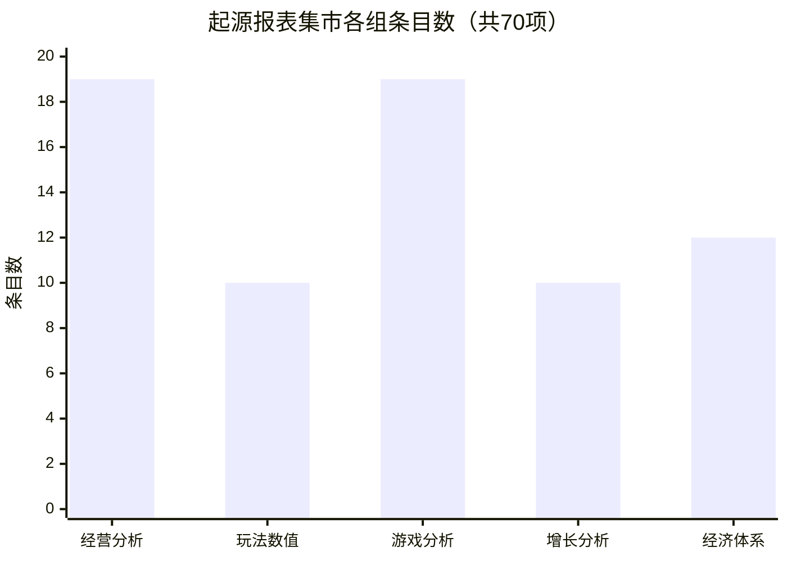
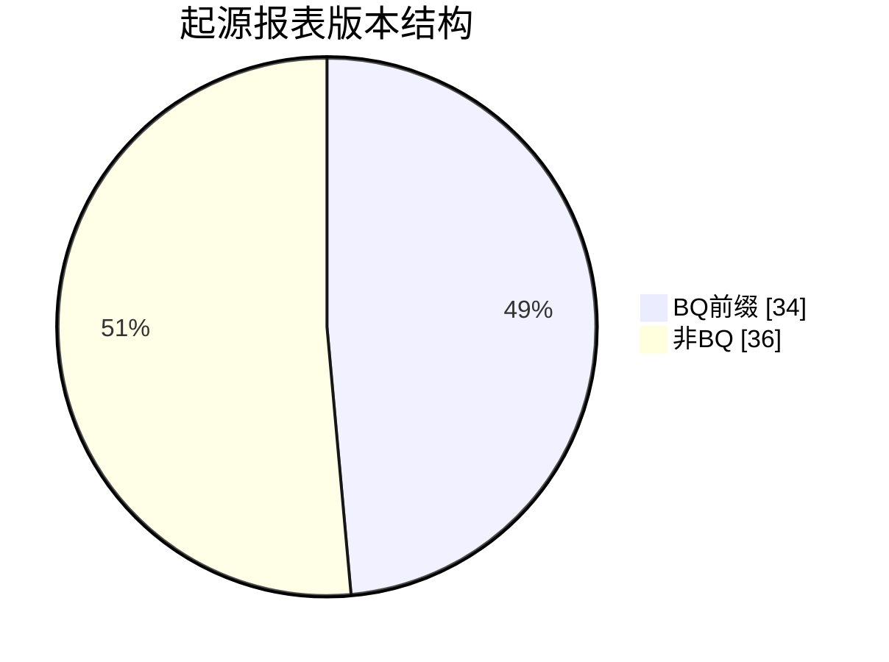
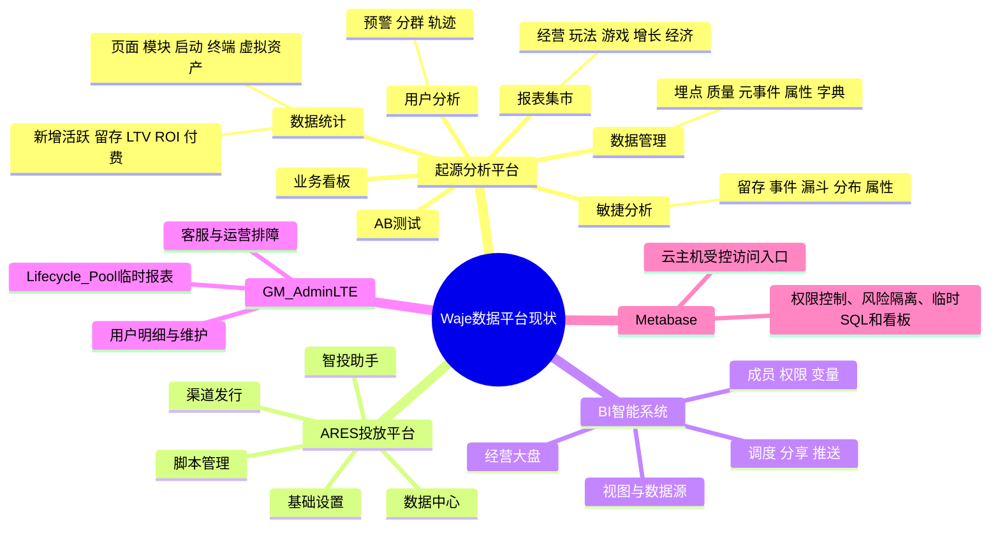
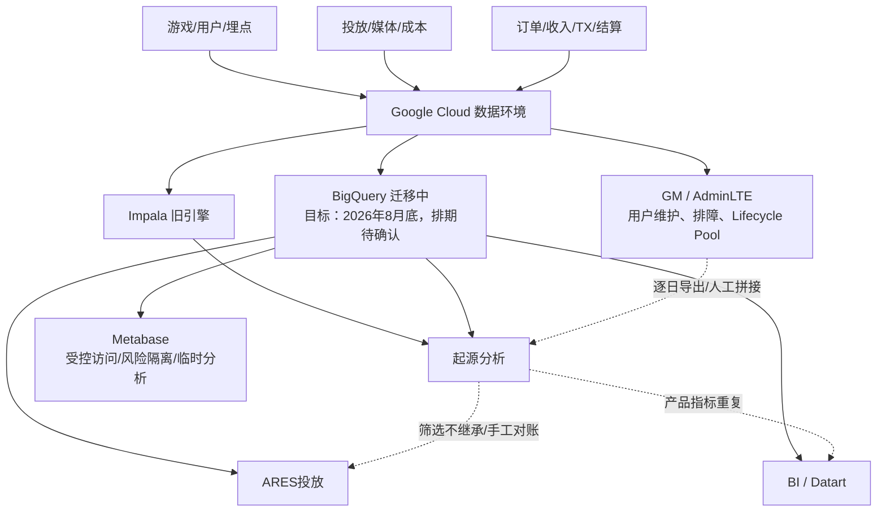
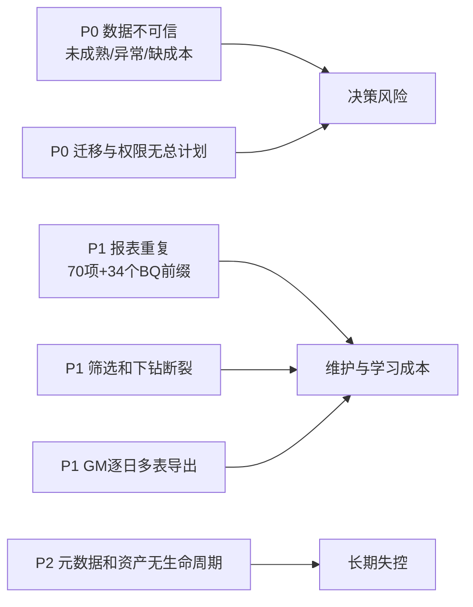
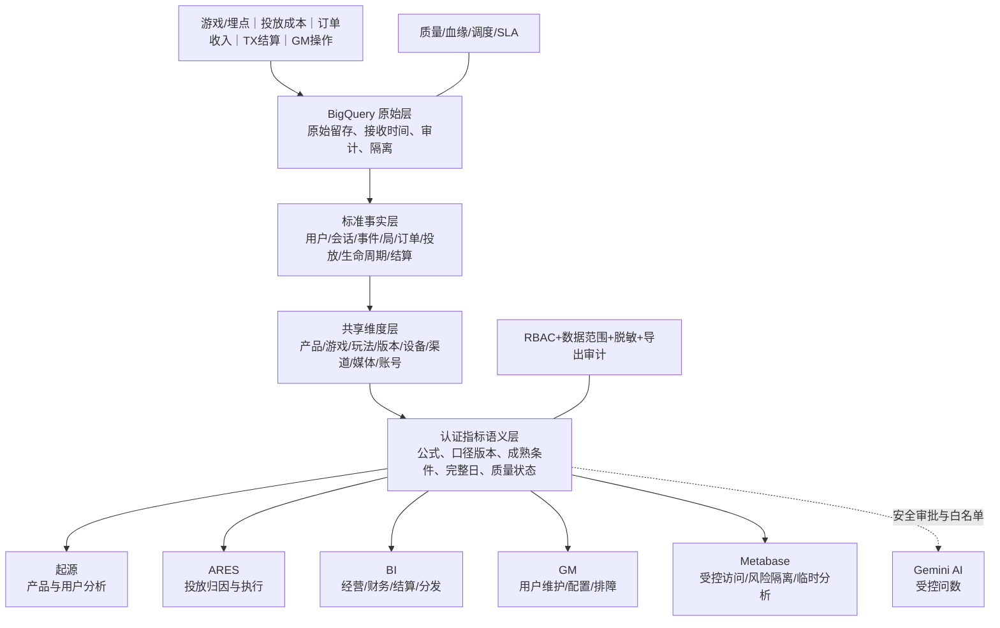
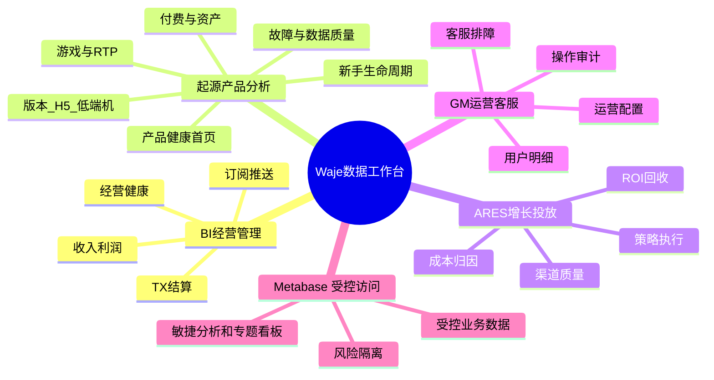

# Waje数据平台架构梳理和优化整合方案

## 一、结论

Waje：**Google Cloud 数据环境 + 3 个业务前台 + 2 个辅助工具**。起源管产品，ARES 管投放，BI 管经营；GM 管排障，云主机上的 Metabase 管受控业务数据访问、权限控制与风险隔离，同时支撑临时查询和看板。数据已集中，治理分散。

当前优化重点不是继续新增报表，而是借 Impala → BigQuery 切换完成一次治理重构：

1. **先建立可信数据层。** BigQuery 切换须完成指标对账、状态标记、统一 ID/维度和回滚。
2. **再明确边界。** 起源做产品，ARES 做投放，BI 做经营/财务/结算，GM 保留操作排障；Metabase 是受限业务数据的受控访问与风险隔离入口，临时分析是其附加能力而非唯一定位。
3. **报表按任务重组。** 起源 70 项报表收敛为新手、游戏/RTP、付费、版本体验、故障质量等专题。
4. **首页不超过 10 个指标。** 复杂字段下沉，指标显示口径、截止、成熟和质量状态。

### 2026-08-10 当前数据开发重点

1. **需求开发：** 用户分层、KYC 人脸识别认证。
2. **平台工程：** Impala → BigQuery 切换、旧新链路对账与验收。
3. **架构治理：** Brooks 规划并确定整体数据平台架构与权限控制；各系统 owner 按其方案落实系统边界、数据范围、导出和审计规则。

用户分层和 KYC 的字段、合规口径、上线时间及验收标准尚未确认，不能在本方案中预设具体实现或承诺排期。
5. **Gemini 后置。** 仅在数据与权限治理完成后接入认证数据集。

---

## 二、盘点范围与汇总数据

本方案综合平台实测、数据开发负责人沟通、埋点质量资料及 14 份历史专题。下列数字单位不同，不相加。

| 盘点对象 | 已确认规模 | 主要结论 |
|---|---:|---|
| 起源导航 | 8 个一级模块 | 功能齐全但入口按历史模块组织，业务看板当前未形成核心首页 |
| 起源报表集市 | 5 组、70 项 | 经营 19、玩法 10、游戏 19、增长 10、经济 12 |
| `BQ-` 前缀报表 | 34 项，占 48.6% | 迁移版本与旧版本大量并存；不等于 34 项均已确认一一重复 |
| BI 当前经营大盘 | 至少 32 个可见字段、7 个筛选 | 字段多、管理与产品指标混排；仅为当前页面可见下限 |
| GM Lifecycle Pool v2 | 7 张表、7 个独立导出 | 明细约 20 字段；单日约 4,536 个数据点 |
| GM 连续 7 日分析 | 约 28 次导出 | 4 张常用来源表 × 7 天，人工拼接成本高 |
| 起源元事件 | 34 个 | 已覆盖基础生命周期，但 H5 自动采集几乎无量 |
| 数据质量快照 | 总错误率 3.30164% | GAMEEND 异常 130,874/418,338，异常率 31.28% |
| 历史专题资料 | 14 份 | 10 份表格、4 份正文/附件，尚未全部产品化和口径化 |

---

## 三、当前架构、功能与报表内容

### 3.1 当前系统脑图

### 3.2 当前技术与数据拓扑

当前应用层没有共享的认证指标、权限、状态和下钻上下文；BigQuery 仍在迁移，不视为已完成。

### 3.3 各系统的真实功能与内容

| 系统 | 当前用户与功能 | 当前报表/字段内容 | 现状判断 |
|---|---|---|---|
| 起源 | 产品、策划、数据；行为、留存、轨迹、埋点 | 新增/活跃、留存、LTV/ROI、付费、页面/模块/终端及运营、TC、游戏报表 | 70 项堆叠、BQ/旧版并存、首页无重点 |
| ARES | 投放、发行；媒体成本、渠道、归因、ROI、策略执行 | 数据中心、智投助手、渠道发行、设置、脚本；理想链路为成本→归因用户→留存/付费→ROI→预算动作 | 应专注增长决策；本次出现“区服获取失败”，只能判断接口/权限依赖，不能解释为无投放数据 |
| BI | 管理、业务、财务；看板、模型、调度、分享 | 用户 7、游戏 4、收入付费 8、成本利润 3、充值 3、TX 7，至少 32 字段、7 个筛选 | 与起源重复；加载中或 `No Data` 不等于 0 |
| GM | 运营、客服、数值；用户维护、实时查询、配置和排障 | Lifecycle Pool 同页混合基础/完全、实际/预期、RTP、盈利调整、充值、TX、TC、留存等 7 张表 | 操作后台与分析报表混杂；分析视图应迁起源，修改/排障能力留 GM |
| Metabase | 数据与授权业务人员 | 云主机受控访问 GCP/BQ、权限控制、风险隔离、临时 SQL 与专题看板；部分业务数据仅经此入口访问 | 不是独立数据平台；需明确受限数据目录、角色、用途、导出规则、审计、有效期和转正/下线机制 |

### 3.4 起源报表目录的具体构成

| 报表组 | 数量 | 当前主题示例 | 优化归属 |
|---|---:|---|---|
| 经营分析 | 19 | 累计 TC 生命周期、运营周报、新增/首充/复充/大额付费、CT 渠道、累计留存、上次登录、H5 曝光 | 首页摘要 + 新手/付费专题；渠道结果转 ARES |
| 玩法数值 | 10 | TC 比、胜率区间、人机组局、玩法重合、新手期 | 游戏/RTP 专题；机器人/数值诊断下沉 |
| 游戏分析 | 19 | 体彩、设备重复、金币场、场次、局数留存、游戏概况、玩法、收益留存、百人乐、组局 | 游戏/RTP 与版本体验专题 |
| 增长分析 | 10 | 首充累计留存、自然新增、首充留存、Push、邀请 | 新手生命周期；投放归因部分进入 ARES |
| 经济体系 | 12 | TC 汇总、羊毛、付费曝光、任务、TX、TC 详情 | 付费资产/风控专题；经营摘要进入 BI |

34 个 `BQ-` 前缀条目占目录近一半。须逐项完成同筛选、同截止、同口径对账，再只读归档旧版。

### 3.5 数据可信度现状

| 证据 | 正确解释 | 影响 |
|---|---|---|
| D7 留存页面曾显示 0 | 观察窗口含未成熟 cohort，必须排除未达到 D7 的新增用户并显示 `N/A` | 现有留存卡不能直接用于产品判断 |
| ROI 汇总 CAC=0、ROI=NaN；LTV30=0 | 成本源、成熟窗口或计算链路未就绪，不能解释为真实 0 | ROI/LTV 暂不进入认证核心指标 |
| GAMEEND 异常率 31.28% | 完局、局数、玩法留存、RTP 归因存在污染风险 | P0 修复并建立事件级质量闸门 |
| H5 自动事件入库多为 0/1 | 可能未接入、另有链路或上报失败 | 无法用当前事件直接评估 H5 优化 |
| 用户分群、汇率等元数据停留在 2023–2024 | 仅能作为历史配置线索 | 需 owner、版本、生效/失效时间 |
| 设备品牌存在同品牌多写法 | 维度未标准化 | 低端机和终端排名可能被拆分 |

---

## 四、问题分层与根因

| 优先级 | 根因 | 业务后果 | 必须采取的动作 |
|---|---|---|---|
| P0 | 指标未绑定成熟窗口、完整日、权威事实和质量门槛 | 留存、ROI、LTV 可能错误 | 建认证指标层；未成熟/失败/补数分开；不合格指标阻断发布 |
| P0 | BigQuery 迁移缺总体计划、owner、权限和回滚 | 新旧报表差异无法解释，AI 接入扩大风险 | 7–14 个完整日并行对账；确定权限、血缘、SLA、验收人和回滚 |
| P1 | 系统按历史建设而非任务边界分工 | 起源/BI 重复，GM 临时报表长期化 | 固定五类系统边界，正式主题唯一主入口 |
| P1 | 报表目录和筛选器缺统一规范 | 用户跨平台重筛、手工对账 | 统一维度、筛选上下文、下钻键和导出元信息 |
| P2 | 报表、指标、埋点无 owner/版本/下线机制 | 资产越积越多且不能追责 | 建系统、指标、权限、报表、埋点五类治理目录 |

---

## 五、目标架构与功能边界

### 5.1 目标架构：一套可信数据与指标，多种任务工作台

### 5.2 系统职责边界

| 系统 | 目标职责 | 保留/新建 | 明确移出 |
|---|---|---|---|
| 起源 | 产品健康、新手、游戏/RTP、付费、版本体验、故障质量 | 敏捷分析、轨迹、埋点；接收 GM 分析视图 | 投放执行、财务大盘、GM 修改 |
| ARES | 成本、媒体/渠道归因、回收、ROI、止损和预算动作 | 数据中心、智投助手、渠道发行 | 完整产品行为分析、财务结算口径 |
| BI | 经营健康、利润/结算/TX、跨主题管理看板、订阅推送 | 经营大盘重做；保留管理聚合 | 产品明细和重复留存/事件报表 |
| GM | 用户查询维护、客服、策略配置、实时排障、操作审计 | 修改能力和实时明细 | 多日趋势、生命周期/RTP 正式分析报表 |
| Metabase | 受控业务数据访问、风险隔离、临时验证和专题看板 | 云主机受控入口、最小授权、访问审计、敏捷分析 | 绕过受控入口直连受限数据；单独定义非认证指标 |
| Gemini | 认证指标解释、自然语言筛选、异常线索 | 后续小范围试点 | 原始敏感库直连、绕过权限的自由问数 |

---

## 六、报表与指标重组设计

### 6.1 目标信息架构

### 6.2 统一首页 10 个核心指标

| # | 指标 | 统一口径与展示要求 | 主入口 |
|---:|---|---|---|
| 1 | DAU | 认证账号 ID 日去重；排除测试账号；显示完整日 | BI/起源 |
| 2 | 新增用户 | 首次满足注册/首登定义的账号；注册与安装分开 | 起源 |
| 3 | 有效游戏用户 | 发生有效 GAMESTART 且通过局事实质量门槛的用户 | 起源 |
| 4 | 成熟 D7 留存 | 仅纳入已达到 D7 的新增 cohort；显示分子/分母 | 起源 |
| 5 | 付费金额 | 服务端支付成功且扣除退款/冲正；统一币种与截止时间 | BI |
| 6 | 付费率 | 支付成功用户/认证活跃用户；分母不可隐含切换 | BI/起源 |
| 7 | D0/D1 首付费转化 | 新增 cohort 在 0/1 日完成首次成功支付的比例 | 起源 |
| 8 | 投放 ROI | 成熟窗口内认证收入/认证投放成本；CAC=0 时 `N/A` | ARES |
| 9 | RTP 健康度 | 实际 RTP 与理论/目标 RTP 同卡展示偏差；明确基础/完全口径 | 起源 |
| 10 | 数据可用率 | 按时且通过完整性、质量和对账门槛的认证指标/应产出指标 | BI/质量页 |

这是跨部门首页，不是完整指标库；利润、ARPPU、复购、TX、胜率、性能等进入专题。

### 6.3 旧报表迁移矩阵

| 当前资产 | 目标处理 | 目标位置 | 验收条件 |
|---|---|---|---|
| 运营周报、新增/留存/首充、新手期 | 合并 | 起源“产品健康+新手生命周期” | 成熟 cohort、用户 ID、付费状态统一 |
| 游戏概况、场次、玩法、收益留存、TC 比、胜率 | 合并 | 起源“游戏与 RTP” | GAMEEND 修复；游戏/玩法/局映射统一 |
| TC/TX、羊毛、任务、付费曝光 | 分层合并 | 起源“付费资产”；BI 仅保留经营摘要 | 账务权威事实、币种、退款/TX 状态统一 |
| CT、自然新增、渠道相关结果 | 迁移主入口 | ARES | 媒体/渠道/分包与起源用户映射通过 |
| Lifecycle Pool 7 张表 | 重组为 3 页 | 起源“RTP总览、游戏生命周期、留存分层” | 一次多日查询/导出；GM 7–14 日并行一致 |
| GM 修改与排障 | 保留 | GM | 分析只读与修改权限分离，操作可审计 |
| BI 产品明细 | 移除重复 | BI 只留经营、财务、结算、分发 | 可跳转起源并继承筛选条件 |
| 14 份历史飞书专题 | 入目录后评审 | 对应正式专题或归档库 | 数据可导出、口径可复现、owner 明确 |
| Metabase 受控专题/临时看板 | 保留受控入口；到期评审 | 云主机 Metabase 或转正式系统 | 受限数据必须经该入口；有角色、数据集、用途、导出规则、审计和有效期 |

### 6.4 统一筛选、状态和下钻

- **全局筛选：** 日期（默认 7 个完整日）、产品、游戏、用户范围、生命周期、H5/APP、版本、媒体/渠道、数据状态。
- **状态枚举：** `完整`、`实时未完结`、`cohort未成熟`、`补数中`、`质量阻断`、`接口失败`、`权限不足`、`无业务数据`；后四类不能统一显示为 0 或 `No Data`。
- **下钻：** 核心卡 → 排行 → 日期×维度 → 用户/订单/局/事件 → 轨迹/原始事件/GM 工单。
- **上下文：** 日期、产品、游戏、玩法、生命周期、渠道、版本、端、用户、订单、局随跳转继承；导出附筛选、口径、更新时间和质量状态。

---

## 七、权限与治理设计

权限按角色、数据范围、粒度和操作四层控制。

| 角色 | 默认权限 | 禁止/需审批 |
|---|---|---|
| 管理层 | BI 聚合看板、订阅 | 用户明细、原始订单、策略修改 |
| 产品/策划 | 起源聚合、脱敏下钻、保存视图 | 跨产品原始数据、大范围导出、GM 修改 |
| 投放/发行 | ARES 所辖渠道成本、归因、策略 | 非本渠道、完整支付/身份明细 |
| 运营/客服 | GM 所辖用户和工单、必要配置 | 跨范围导出、修改指标口径 |
| 数据/研发 | BQ 模型、调度、质量、受控原始层 | 无审批导出敏感信息、代替业务改策略 |
| 指标管理员 | 指标/维度/报表目录及发布流程 | 直接修改原始事实 |

查看、下钻、导出、建表、发布、改指标、改 GM 策略分别授权。系统、指标、权限、报表、埋点五张治理表均记录 owner、版本、有效期和审批。

---

## 八、实施路线、轻重缓急与验收

周期为建议；BigQuery、Gemini 缺正式排期，后续阶段按验收闸门启动。

| 阶段 | 核心工作 | 交付物 | 验收闸门 |
|---|---|---|---|
| P0A 0–2 周 | Brooks 规划并确定整体平台架构与权限控制；冻结重复报表新增；盘点 70 项报表和 BI/GM/Metabase 资产；补齐 Metabase 受限数据目录、角色矩阵、导出规则与审计责任 | 架构/权限决策稿、五张治理底表、保留/合并/迁移/下线清单 | 100% 正式资产有 owner、用途、来源和状态；受限数据访问边界可审计；架构与权限方案明确责任人 |
| P0B 0–4 周 | Impala/BQ 对账；统一 ID、时间、币种、支付/局事实；修 GAMEEND | 核心指标对账表、差异说明、质量闸门、回滚方案 | 7–14 个完整日无未解释差异；GAMEEND 达到研发提交版门槛后才解除阻断 |
| P0C 并行需求 | 开发用户分层、KYC 人脸识别认证需求；由 Brooks 的架构/权限方案约束数据访问和审计 | 需求规格、数据字段清单、角色与合规评审记录 | 用户范围、认证状态、最小权限、导出规则、审计责任与验收标准均明确 |
| P1 5–8 周 | 建认证指标层；重做起源首页和 BI 经营大盘；统一筛选/状态/下钻 | 10 指标首页、指标详情、统一 URL 上下文 | 同条件跨系统可对账；未成熟/失败/权限状态正确展示 |
| P2 9–12 周 | GM 7 表迁起源 3 页；上线新手、RTP、付费、H5/低端机/故障专题；ARES 映射 | 专题看板、GM 并行报告、旧报表只读归档 | GM 一次查询/导出多日；7–14 日一致；旧入口有迁移公告 |
| P3 12 周后 | 报表健康度、告警、元数据自动化；Gemini 白名单试点 | SLA/质量中心、受控问数试点 | 权限穿透、脱敏、审计、引用口径和数据状态均通过安全评审 |

### 关键验收标准

1. **数据：** 核心指标同口径、同截止可复现；非零差异均有原因、负责人和确认。
2. **留存：** Dn 仅使用成熟 cohort；未成熟显示 `N/A`；页面可见分子、分母、cohort 日期和截止时间。
3. **质量：** GAMEEND 建议门槛为无效率 <0.5%、主要切片 <1%、入库率 ≥99.5%；正式阈值待确认。
4. **报表：** 首页指标 ≤10；同一主题唯一主入口；34 个 BQ 前缀报表逐项对账后处置旧版。
5. **GM：** 支持日期范围、游戏、生命周期、自研/联运、数据状态筛选；一次导出当前结果，不再按日逐表操作。
6. **权限：** 查看、下钻、导出、发布、口径/策略修改分别授权并审计。
7. **体验：** H5/低端机专题支持按版本、机型、网络、页面、错误码、用户/会话定位。

### 负责人

Brooks 负责整体平台架构与权限控制的规划和确定；数据产品负责需求拆解、指标和报表目录；数据开发负责 BigQuery 切换、模型、质量、血缘以及用户分层/KYC 需求开发；起源/ARES、BI、GM 负责人分别承担页面整合；安全负责人参与 KYC、敏感数据、权限与 Gemini 审批。产品、投放、运营、客服、财务参与口径和验收。

---

## 九、待管理层确认

1. 确认 Brooks 的架构与权限定案范围、交付物、评审机制，并确认起源、ARES、BI、GM、财务/结算的业务 owner。
2. 确认 BigQuery 迁移里程碑、验收人、旧引擎并行与回滚期限。
3. 批准五类系统边界和“同一主题唯一主入口”，停止重复报表立项。
4. 指定 10 个核心指标的口径 owner；ROI、GAMEEND、H5 埋点未通过质量门槛前不作为正式决策依据。
5. 确认敏感字段分级、导出审批、审计保留期和 Gemini 可访问的白名单数据集。

## 十、事实边界与资料来源

资料来自 2026-08-03 至 08-07 平台盘点和负责人沟通。底层表、SQL、完整血缘、全量 BI/ARES 资产、权限流程和 Gemini 排期仍待确认。

- [[数据平台开发侧现状与治理待办-2026-08-07]]
- [[起源三大数据模块架构盘点-2026-08-07]]
- [[起源分析平台盘点-2026-08-03]]
- [[GM-Lifecycle-Pool-v2报表结构与整合优化分析-2026-08-06]]
