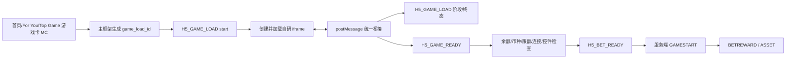

# Waje 自研游戏 H5 加载、可玩与可下注埋点上报需求 V2

> 交付对象：H5 主框架、各自研小游戏研发、数据开发、埋点管理员和 QA。  
> 本版仅设计当前真金产品 H5 内嵌的自研游戏，不覆盖第三方/联运游戏内部状态，不新增 `PV/PD/MV/MC` 元事件。三个专用事件当前均未创建，Ares 实际 `event_id` 待创建后回填。
>
> 飞书阅读版已精简正文；研发按独立的[标准埋点开发需求文档](https://ksg964l11fam.sg.larksuite.com/docx/A1FPdi3i3oU1nGxLpTJlYnPygrh)执行，字段类型、必填性、枚举和验收以该文档为准。

## 1. 结论先行

当前 H5 游戏通过 iframe 接入，主页面能够知道“用户点击了游戏卡片”和“容器开始加载”，但不能仅凭 iframe `onload`、HTTP 200、页面打开或 `GAMESTART` 判断游戏已经真正可玩，更不能判断已经进入可下注状态。

本需求将链路拆成三层：

```text
模块点击 MC
  → H5_GAME_LOAD：开始加载、阶段、失败/超时/放弃
  → H5_GAME_READY：游戏画面和配置真正就绪
  → H5_BET_READY：余额、币种、限额、连接、下注控件均可用
  → 服务端 GAMESTART / BETREWARD / ASSET：真实游戏和资金事实
```

核心实现方式是：H5 主框架生成并维护 `game_load_id`，通过受控 `postMessage` 与每个自研 iframe 游戏建立统一桥接；游戏方必须回调“游戏就绪”和“可下注就绪”，主框架校验后再调用 Ares 上报。

## 2. 当前问题与数据价值

### 2.1 当前缺口

| 事件 | 当前状态 | 现有方式能证明什么 | 不能证明什么 |
|---|---|---|---|
| `H5_GAME_LOAD` | 尚未创建 | 游戏卡片点击、iframe 创建或页面进入 | 游戏内部资源、脚本、服务连接是否完成 |
| `H5_GAME_READY` | 尚未创建 | 容器可能已打开 | 游戏画面/配置是否真正可用 |
| `H5_BET_READY` | 尚未创建 | 用户已进入游戏页 | 余额、币种、限额、连接和下注控件是否同时可用 |
| `MC` 游戏卡点击 | 可复用现有模块点击事件；当前实际 ID 需现网回读 | 用户点击了哪个游戏入口 | 点击后游戏是否可玩、是否能下注 |
| `GAMESTART` | 既有服务端游戏事实链 | 服务端已产生有效开局 | 加载慢、桥接失败、不可下注的前置损失 |

### 2.2 这三个埋点的业务价值

- **定位损失环节**：区分“点击后没有开始加载”“加载失败”“画面未就绪”“游戏已打开但不能下注”。
- **比较自研游戏质量**：按游戏、版本、分包、设备档位和网络环境比较可玩率与可下注率。
- **支持研发排障**：将错误阶段、桥接状态、超时和不可下注原因归因到主框架或具体游戏。
- **支持版本验收**：新版本上线后能快速判断是否出现“容器打开率不变、真正可玩率下降”的隐性回归。

这些事件只描述体验链路，不能替代下注、结算、支付、提现和资产的服务端事实。

## 3. 范围和排除项

### 3.1 本轮范围

- H5 浏览器、PWA 独立运行、APP WebView 中的当前真金产品内嵌自研游戏。
- 首批优先接入约 10 款自研游戏；最终名单、生产 `game_id` 和页面路由由游戏研发与产品确认。
- 主框架统一生成关联键和统一上报；每款游戏负责提供真实状态回调。

### 3.2 不在本轮范围

- 第三方/联运 iframe 的内部加载、可玩和可下注状态。没有对方 SDK 或桥接回调时，只能保留入口行为，不能伪造三类专用事件。
- 逐骰子、逐棋子、逐张牌、逐发子弹等高频玩法事件。
- 以 iframe `onload`、HTTP 200、按钮点击、页面打开或 `GAMESTART` 代替 ready。
- 修改公共属性、创建重复的 `PV/PD/MV/MC`、创建虚构的游戏容器页面或模块。
- 账号、密码、Cookie、Authorization、请求/响应正文、完整 URL 查询串和精确设备指纹。

## 4. 现网对象和创建状态

已有 `PV/PD/MV/MC` 继续复用；下列历史文档中记录的 ID 只作为待回读线索，不能直接当作本次现网生效证据。

| 对象 | 处理方式 | 历史文档记录 | 本次状态 |
|---|---|---:|---|
| H5 页面进入 `PV` | 复用 | `2855092` | 现网状态待回读 |
| H5 页面退出 `PD` | 复用 | `2184105` | 现网状态待回读 |
| 游戏/模块曝光 `MV` | 复用 | `1589607` | 现网状态待回读 |
| 游戏卡点击 `MC` | 复用并补关联参数 | `2199814` | 现网字段绑定待回读 |
| `H5_GAME_LOAD` | 新建专用事件 | 无 | **待创建** |
| `H5_GAME_READY` | 新建专用事件 | 无 | **待创建** |
| `H5_BET_READY` | 新建专用事件 | 无 | **待创建** |

> Ares 配置前，事件专属字段必须先登记到“事件属性”目录。仅存在于“功能埋点参数”目录的字段不能视为已经可以绑定到元事件。

## 5. 推荐技术架构



### 5.1 主框架职责

1. 在用户点击游戏卡片后生成唯一 `game_load_id`，并写入现有 `MC` 关联参数。
2. 在 iframe 创建前上报 `H5_GAME_LOAD(stage=start,status=start)`。
3. 向 iframe 传递 `game_load_id`、`game_id`、端形态、版本和桥接契约版本。
4. 只接受白名单 `origin`、合法 `schema_version` 和匹配的 `game_load_id`。
5. 将游戏回调转换成 Ares 三个专用事件，并按 `event_uid` 幂等上报。
6. 将 `game_load_id` 尽可能透传到首个服务端游戏请求和 `GAMESTART`，供体验链与真实开局对账。

### 5.2 自研游戏职责

1. 接收主框架传入的 `game_load_id`，不得自行生成另一套链路 ID。
2. 在真实达到对应状态时回调 `GAME_LOAD` 阶段、`GAME_READY` 和 `BET_READY`。
3. 不能判断状态时上报失败/超时或不回调，不得上报成功占位。
4. 对余额、币种、限额、服务连接和下注控件分别返回布尔状态。
5. 只回传标准化错误码和阶段，不回传响应正文、用户输入或完整 URL。

### 5.3 桥接消息最小契约

主框架 → iframe：

```json
{
  "type": "WAJE_GAME_CONTEXT",
  "schema_version": "v1",
  "game_load_id": "<opaque-id>",
  "game_id": "<game-dimension-id>",
  "surface_type": "h5_browser",
  "web_version": "<web-version>",
  "bridge_contract_version": "v1"
}
```

iframe → 主框架：

```json
{
  "type": "WAJE_GAME_STATE",
  "schema_version": "v1",
  "event": "GAME_READY",
  "game_load_id": "<same-id>",
  "status": "success",
  "stage": "game_ready",
  "elapsed_ms": 1234,
  "ready_source": "game_callback"
}
```

> 示例中的 ID 为占位格式，不是生产 ID。桥接层必须校验来源、契约版本、链路 ID 和字段类型；跨源 iframe 不允许通过 DOM 猜测内部状态。

## 6. 模块入口与关联规则

### 6.1 游戏卡片点击 `MC`

继续使用现有 `MC` 元事件，不新建 For You/Top Game 专用元事件。游戏卡片点击至少需要携带：

| 字段 | 类型 | 必填 | 说明 |
|---|---|---:|---|
| `game_load_id` | String | 是 | 点击后由主框架生成，贯穿三类专用事件 |
| `game_id` | String | 是 | 稳定游戏维表 ID，不使用展示名称替代 |
| `entry_source` | String | 是 | `top_game/game_card/recommendation/banner/deeplink/other` |
| `element_id` | String | 是 | 复用现有元素 ID |
| `element_offset` | Integer/String | 条件 | 复用现有推荐位置字段；按平台原类型传递 |
| `container_type` | String | 是 | 本轮固定为 `iframe` |

如果 `MC` 当前不支持绑定 `game_load_id`，应优先由埋点管理员补充事件属性；临时使用“同一 `session_id + game_id + 时间窗口`”只能标记为 `degraded_attribution`，不得将其当成完整链路。

### 6.2 关联键规则

```text
session_id
  → page_visit_id
    → game_load_id
      → H5_GAME_READY
        → H5_BET_READY
          → GAMESTART / BETREWARD / ASSET
```

- `game_load_id`：一次用户启动一次游戏容器的唯一键；重试同一加载链路继续复用，重新点击启动才生成新键。
- `event_uid`：事件级幂等键；重试必须复用，不得因为网络重试生成新事实。
- `round_id`：服务端对局唯一键；不能用 `game_load_id` 替代。
- 如果服务端暂时无法接收 `game_load_id`，只做受控的诊断归因，并在报表中区分 `direct_linked` 与 `degraded_attribution`。

## 7. 三个专用事件定义

### 7.1 事件登记总表

| 逻辑事件 | 展示名称 | 触发范围 | Ares 实际 `event_id` | 优先级 |
|---|---|---|---:|---|
| `H5_GAME_LOAD` | H5 游戏加载阶段 | 开始、阶段、终态 | 待创建 | P0 |
| `H5_GAME_READY` | H5 游戏真正就绪 | 游戏方/桥接确认画面和配置可用 | 待创建 | P0 |
| `H5_BET_READY` | H5 进入可下注状态 | 五项前置条件均检查完成 | 待创建 | P0 |

### 7.2 公共属性说明

平台/SDK 已有公共属性由公共契约自动继承，本需求不重复创建或逐事件绑定。包括：

```text
event_version、event_uid、client_time_ms、session_id、page_visit_id、page_id、
user_id/uuid、surface_type、web_version、release_id、sdk_version、package_name、
channel、country、device_tier、memory_tier、browser_name、os_name、network_type、
effective_type、measurement_state、is_retry、retry_count
```

下面只列三个专用事件的新增/专属字段。

### 7.3 `H5_GAME_LOAD`

**触发要求：** 在 iframe 创建前上报一次 `stage=start,status=start`；之后在关键阶段或终态上报。iframe `onload` 只能作为容器阶段，不能直接上报游戏成功。

| 字段名 | 类型 | 必填 | 枚举/规则 | 备注 |
|---|---|---:|---|---|
| `game_load_id` | String | 是 | 一次加载链路唯一键 | 由主框架生成；全链路不变 |
| `launch_source` | String | 是 | `top_game/game_card/recommendation/banner/deeplink/return/other` | 入口来源 |
| `container_type` | String | 是 | `iframe` | 本轮仅覆盖 iframe |
| `stage` | String | 是 | `start/container_created/shell_ready/assets_ready/script_ready/service_connected/game_ready/bet_ready` | 同一加载可多次上报 |
| `status` | String | 是 | `start/success/fail/timeout/abandon` | 阶段或整体终态 |
| `stage_duration_ms` | Integer | 条件 | 非负整数 | 阶段完成/失败时填写 |
| `elapsed_ms` | Integer | 条件 | 非负整数 | 从 `game_load_id` 开始计算 |
| `bridge_status` | String | 条件 | `not_started/connected/timeout/rejected/unknown` | 跨源 iframe 必须可识别桥接结果 |
| `cache_state` | String | 条件 | `cold/warm/cache_hit/cache_miss/sw_update/unknown` | 能确认时填写 |
| `timeout_threshold_ms` | Integer | 条件 | 非负整数 | 发生超时时填写阈值 |
| `error_code` | String | 失败/超时 | 标准化错误码；未知为 `unknown` | 不上传错误正文 |
| `error_stage` | String | 失败/超时 | `container/assets/script/service/bridge/network/game/unknown` | 与失败阶段一致 |

**成功判定：** `H5_GAME_LOAD` 的 `status=success` 只代表某个加载阶段完成；整体“可玩成功”必须由 `H5_GAME_READY` 确认。

### 7.4 `H5_GAME_READY`

**触发要求：** 游戏方或受信任桥接回调确认游戏画面、必要配置和基础交互已经可用。没有真实回调时，不得用容器打开或 `GAMESTART` 补报成功。

| 字段名 | 类型 | 必填 | 枚举/规则 | 备注 |
|---|---|---:|---|---|
| `game_load_id` | String | 是 | 必须匹配 `H5_GAME_LOAD` | 不允许另起链路键 |
| `status` | String | 是 | `success/fail/timeout/abandon` | 只允许标准枚举 |
| `game_scene_ready` | Boolean | 是 | 是否已展示可用游戏场景 | 失败/超时时为 false |
| `game_config_ready` | Boolean | 是 | 必要配置是否加载完成 | 不以默认值代替 |
| `elapsed_ms` | Integer | 是 | 非负整数 | 从加载开始到 ready 终态 |
| `game_ready_ms` | Integer | 成功/终态 | 非负整数 | 与 `elapsed_ms`一致时保留统一口径 |
| `ready_source` | String | 是 | `game_callback/container_callback/verified_dom` | 禁止 `assumed`；跨源优先 `game_callback` |
| `bridge_contract_version` | String | 是 | 已协商的桥接契约版本 | 用于版本兼容排查 |
| `not_ready_reason` | String | 失败/超时 | `bridge/game_config/assets/script/service/network/timeout/unknown` | 失败原因 |
| `error_code` | String | 失败/超时 | 标准化错误码 | 不上传堆栈或响应正文 |

**成功门槛：** `status=success` 且 `game_scene_ready=true`、`game_config_ready=true`，同时 `ready_source` 不能是 `assumed`。

### 7.5 `H5_BET_READY`

**触发要求：** 游戏已就绪，并且余额、币种、限额、连接和下注控件五项均完成检查。该事件只表示客户端进入可下注状态，不表示下注已成功；下注和资产变更仍以服务端事实为准。

| 字段名 | 类型 | 必填 | 枚举/规则 | 备注 |
|---|---|---:|---|---|
| `game_load_id` | String | 是 | 必须匹配前两个事件 | 全链路关联 |
| `status` | String | 是 | `success/fail/timeout/abandon` | 终态必须明确 |
| `balance_ready` | Boolean | 是 | 余额已获取且可用于判断 | 不可获取时 false |
| `currency_ready` | Boolean | 是 | 币种/资产类型已确认 | 不使用默认币种填充 |
| `limit_ready` | Boolean | 是 | 下注资格和限额已确认 | 包括最低/最高限制 |
| `connection_ready` | Boolean | 是 | 游戏服务连接已确认 | 不以 HTTP 200 单独判断 |
| `bet_control_ready` | Boolean | 是 | 下注控件已可操作 | 页面可见不等于可操作 |
| `elapsed_ms` | Integer | 是 | 非负整数 | 从加载开始到终态 |
| `bet_ready_ms` | Integer | 成功/终态 | 非负整数 | 到可下注或失败终态 |
| `readiness_source` | String | 是 | `game_callback/server_ack/container_callback` | 真金游戏优先游戏回调+服务端确认 |
| `not_ready_reason` | String | 失败/超时 | `balance/currency/limit/connection/game_config/asset/ui/network/bridge/user_qualification/unknown` | 可多原因时使用规范化主因，其余进入质量明细 |
| `error_code` | String | 失败/超时 | 标准化错误码 | 不上传错误正文 |

**成功门槛：** `status=success` 且上述五个布尔字段全部为 `true`；任一字段为 `false`，不得上报成功。

## 8. 事件顺序与异常规则

### 8.1 正常状态机

```text
MC(click)
  → H5_GAME_LOAD(start)
  → container_created
  → assets_ready / script_ready / service_connected
  → H5_GAME_READY(success)
  → H5_BET_READY(success)
  → GAMESTART
```

允许在任一阶段进入 `fail / timeout / abandon` 终态；失败后用户点击重试，生成新的 `recovery_id`，但是否复用 `game_load_id` 由“同一次加载重试”还是“重新打开游戏”决定：

- 同一次加载内重试：复用 `game_load_id`，递增 `retry_count`。
- 关闭游戏后重新打开：生成新的 `game_load_id`。
- 网络补发：复用 `event_uid`，不能制造新事件事实。

### 8.2 必须拦截的错误

| 错误 | 处理 |
|---|---|
| 没有 `game_load_id` | 不上报三类成功事件；记录客户端开发错误 |
| `GAME_READY` 未收到游戏/容器确认 | 只能上报 timeout/fail，不得补 success |
| `BET_READY` 五项不全为 true | 上报 fail 和主因，不得补 success |
| 回调来自非白名单 origin | 丢弃并记录 `bridge/rejected`，不进入有效数据 |
| 回调契约版本不兼容 | 上报失败/阻断，不降级成“可玩” |
| 重复回调 | 通过 `event_uid` 去重；重复率进入质量监控 |
| 只有 iframe `onload` | 只能写 `container_created` 或容器阶段，不得代替 ready |
| 只有 `GAMESTART` | 只能作为服务端结果链，不反向补写前置 ready |

## 9. 核心指标定义

所有指标默认按 Asia/Hong_Kong 日界线、完整日和新包/当前产品范围统计；未成熟日期、未覆盖日期和权限阻断显示 `N/A` 或 `partial`，不得填 0。

| 指标名称 | 指标编码 | 定义与算法 | 主要拆分 | 数据来源 |
|---|---|---|---|---|
| 游戏加载开始数 | `h5_game_load_start_count` | `COUNT(DISTINCT game_load_id)`，筛选 `H5_GAME_LOAD.stage=start AND status=start` | 游戏、入口、端、版本、包、渠道 | Ares `H5_GAME_LOAD` |
| 加载终态覆盖率 | `h5_game_load_terminal_rate` | 有 `success/fail/timeout/abandon` 终态的 `game_load_id` / 加载开始 `game_load_id` | 游戏、版本、设备、网络 | Ares |
| 游戏真正可玩率 | `h5_game_ready_rate` | `H5_GAME_READY.status=success` 的去重 `game_load_id` / 加载开始数 | 游戏、入口、版本、设备、网络 | Ares |
| 游戏就绪失败率 | `h5_game_ready_fail_rate` | `GAME_READY.status IN (fail,timeout,abandon)` / 有效加载开始数 | 失败阶段、错误码、游戏 | Ares |
| 进入可下注率 | `h5_bet_ready_rate` | `H5_BET_READY.status=success` 的去重 `game_load_id` / 有效加载开始数 | 游戏、版本、设备、网络、失败主因 | Ares |
| 就绪到可下注转化率 | `h5_ready_to_bet_ready_rate` | 可下注成功链路数 / 游戏真正可玩成功链路数 | 游戏、版本、端形态 | Ares |
| 游戏就绪耗时 P50/P95 | `h5_game_ready_latency_p50_p95` | 成功 `game_ready_ms` 的中位数/95 分位 | 游戏、版本、设备档位、网络 | Ares |
| 可下注耗时 P50/P95 | `h5_bet_ready_latency_p50_p95` | 成功 `bet_ready_ms` 的中位数/95 分位 | 游戏、版本、设备、网络 | Ares |
| 不可下注主因率 | `h5_bet_not_ready_reason_rate` | 各 `not_ready_reason` 的失败链路数 / `H5_BET_READY` 失败链路数 | 游戏、版本、设备、网络 | Ares |
| 桥接失败率 | `h5_bridge_reject_timeout_rate` | `bridge_status IN (timeout,rejected)` 的加载链路 / 加载开始数 | 游戏、版本、浏览器、WebView | Ares/客户端质量 |
| 点击到加载启动率 | `h5_click_to_load_start_rate` | 有效游戏卡 `MC` 后 30 秒内产生 `H5_GAME_LOAD.start` 的点击数 / 游戏卡点击数 | 入口模块、游戏、版本 | `MC` + Ares |
| 可玩到服务端开局率 | `h5_ready_to_gamestart_rate` | 具备直接 `game_load_id` 关联的有效 `GAMESTART` / `H5_GAME_READY.success` | 游戏、版本、端、包 | Ares + 服务端 |
| 真正可玩链路关联率 | `h5_lifecycle_link_rate` | 可按 `session_id + game_load_id` 串联三类事件的链路 / 加载开始链路 | 游戏、版本、端 | Ares |

### 9.1 指标口径约束

- `H5_GAME_READY` 不是有效局，`H5_BET_READY` 不是下注成功；二者不进入 RTP、下注额或资产流水分母。
- `GAMESTART → GAMEEND → BETREWARD → ASSET` 仍是游戏和资金结果的认证链路。
- `is_robot`、机器人座位或机器人账号不进入用户级活跃和复玩指标；游戏质量可另行观察人机拆分。
- 版本比较至少使用一个完整日；新版本首日若数据未成熟，显示 `immature`。

## 10. 数据模型和 SQL 验收模板

### 10.1 逻辑事实层

建议形成逻辑事实表 `fact_h5_game_lifecycle`，物理表名由数据开发按当前 BQ/Ares 映射回填：

```text
event_name
event_uid
event_time_server
session_id
page_visit_id
game_load_id
game_id
surface_type
web_version
package_name
channel
device_tier
memory_tier
network_type
stage
status
ready_source / readiness_source
game_ready_ms
bet_ready_ms
balance_ready
currency_ready
limit_ready
connection_ready
bet_control_ready
not_ready_reason
error_code
is_retry
retry_count
measurement_state
```

### 10.2 三类事件质量

```sql
SELECT
  target_day,
  game_id,
  surface_type,
  web_version,
  COUNT(DISTINCT IF(event_name = 'H5_GAME_LOAD'
                   AND stage = 'start'
                   AND status = 'start', game_load_id, NULL)) AS load_starts,
  COUNT(DISTINCT IF(event_name = 'H5_GAME_READY'
                   AND status = 'success', game_load_id, NULL)) AS game_ready_success,
  COUNT(DISTINCT IF(event_name = 'H5_BET_READY'
                   AND status = 'success'
                   AND balance_ready
                   AND currency_ready
                   AND limit_ready
                   AND connection_ready
                   AND bet_control_ready,
                   game_load_id, NULL)) AS bet_ready_success,
  COUNT(DISTINCT IF(event_name = 'H5_BET_READY'
                   AND status = 'success'
                   AND NOT (balance_ready
                           AND currency_ready
                           AND limit_ready
                           AND connection_ready
                           AND bet_control_ready),
                   game_load_id, NULL)) AS invalid_bet_ready_success,
  COUNTIF(game_load_id IS NULL) AS missing_game_load_id
FROM `project.dataset.fact_h5_game_lifecycle`
WHERE target_day BETWEEN @start_day AND @end_day
  AND measurement_state = 'complete'
GROUP BY target_day, game_id, surface_type, web_version;
```

> 上述 SQL 只作为验收模板，物理项目、数据集和表名必须以当前真实 BQ/Ares 映射为准；不能用假定表名直接发布生产看板。

### 10.3 状态机完整性伪代码

```text
for each game_load_id:
    require exactly_one load_start
    require at_most_one game_ready_success
    require at_most_one bet_ready_success

    if game_ready_success:
        require game_scene_ready == true
        require game_config_ready == true
        require ready_source != "assumed"

    if bet_ready_success:
        require balance_ready == true
        require currency_ready == true
        require limit_ready == true
        require connection_ready == true
        require bet_control_ready == true

    if status in [fail, timeout, abandon]:
        require error_code or not_ready_reason
```

## 11. 自研游戏清单

以下为当前知识库确认的自研游戏英文名和 `game_id`；本表用于埋点接入清单，不代表每款游戏已经完成 iframe 桥接或 Ares 事件接入。

| English game name | game_id |
|---|---:|
| Fish | 3001 |
| Whot | 6001 |
| New Roulette | 2002 |
| Pin Naira | 2008 |
| Roulette | 2001 |
| Bottle Spin | 2003 |
| Five Card | 2006 |
| 100-Player Whot | 6005 |
| Duel | 6007 |
| Dice | 6002 |
| Red or Green | 1003 |
| Football | 1004 |
| Blackjack | 2004 |
| ColorDice | 9003 |
| CoinFlip | 9001 |
| Limbo | 9008 |
| Keno | 9010 |

> `Limbo=9008`、`Keno=9010`采用技术部统一映射；产品表中相反的历史值不用于当前分析。轻量化变体代码另见《Waje 游戏代码与名称统一映射表》。

## 12. Ares 创建和研发实施任务

### P0：平台和主框架

| 任务 | 交付内容 | 验收证据 |
|---|---|---|
| 事件属性登记 | 登记本需求第 7 节专属字段；类型使用 Ares 支持的 String/Integer/Boolean/Double | 事件属性目录回读截图/导出和字段清单 |
| 创建三个元事件 | 创建 `H5_GAME_LOAD`、`H5_GAME_READY`、`H5_BET_READY`，不创建重复 PV/PD/MV/MC | 事件名称、展示名、分类、实际 `event_id` 回读 |
| 主框架生成链路键 | 生成 `game_load_id`，贯穿 MC、iframe 桥接、三类事件和服务端请求 | 链路样本与去重结果 |
| 桥接安全校验 | origin 白名单、契约版本、字段类型、链路 ID 校验 | 非白名单消息被拒绝；合法消息可入库 |
| 服务端透传 | 尽可能把 `game_load_id` 透传到 `GAMESTART` | 直接关联率和降级归因率 |

### P0：各自研游戏

每款游戏必须完成：

1. 接收 `WAJE_GAME_CONTEXT`；
2. 在真实阶段回调 `H5_GAME_LOAD` 状态；
3. 画面和配置完成后回调 `H5_GAME_READY`；
4. 五项前置条件完成后回调 `H5_BET_READY`；
5. 无法满足条件时回调失败/超时和标准错误码；
6. 不上传原始接口返回、用户输入、完整资源 URL 或设备指纹。

### P1：看板和质量监控

- 按游戏、端形态、H5 版本、包体、渠道、设备档位和网络类型建立加载→可玩→可下注漏斗。
- 对 `bridge_timeout/rejected`、`game_config`、`balance`、`currency`、`limit`、`connection` 和 `network` 设置错误分布。
- 与 `GAMESTART` 及后续服务端事实建立直接/降级关联标识。

## 13. 测试和回归标准

### 13.1 配置验收

- [ ] 三个事件均可在 Waje Special 元事件列表查询到。
- [ ] 实际 `event_id` 已回填本文件和研发登记表。
- [ ] 每个事件专属字段均有类型、必填条件、枚举和备注。
- [ ] 复用的 `MC`、`PV/PD` 未被改成新的公共事件或错误必填字段。
- [ ] 未创建第三方游戏的虚构页面/模块或客户端事件。

### 13.2 运行场景

| 场景 | 预期结果 |
|---|---|
| 冷缓存正常打开 | 有 `LOAD.start`、阶段、`GAME_READY.success`、`BET_READY.success` |
| 热缓存正常打开 | 阶段可减少，但仍有完整起点和 ready 终态 |
| iframe `onload` 但游戏无回调 | 不得出现 ready success；达到阈值后 timeout/fail |
| 游戏资源失败 | `LOAD.fail`，带 `error_stage=assets/script` 和错误码 |
| 游戏配置失败 | `GAME_READY.fail`，带 `not_ready_reason=game_config` |
| 余额不可用 | `BET_READY.fail`，`balance_ready=false` |
| 币种/限额不可用 | `BET_READY.fail`，带对应主因 |
| 网络断开/恢复 | 三类事件状态与网络事件可按 `game_load_id` 关联 |
| 非白名单 iframe 消息 | 被拒绝，不产生有效 ready success |
| 重复回调/网络重试 | `event_uid` 幂等，重复率进入质量监控 |
| 用户主动返回/关闭 | 终态为 `abandon`，不补写 ready success |
| 第三方 iframe 无桥接 | 标记 `not_in_scope/bridge_unavailable`，不造数据 |

### 13.3 数据质量门槛

| 检查项 | 门槛 |
|---|---:|
| 必填字段完整率 | ≥99.5% |
| `event_uid` 重复率 | ≤1% |
| `game_load_id` 链路关联率 | ≥98% |
| `H5_BET_READY.success` 五项布尔一致率 | 100% |
| 成功 ready 的 `ready_source=assumed` | 0 |
| Ares 入库延迟 P95 | ≤15 分钟 |
| 未知枚举率 | ≤0.1%，超出即阻断发布 |
| 无直接服务端关联的降级归因占比 | 单独展示，不得混入直接关联指标 |

## 14. 待确认和责任边界

| 待确认项 | 责任方 | 阻塞内容 |
|---|---|---|
| 首批自研游戏最终名单 | 产品/游戏负责人 | 决定本轮接入范围 |
| 游戏 ID 与路由映射 | 游戏研发/数据开发 | 决定 `game_id` 和链路能否汇总 |
| iframe origin 白名单 | H5 主框架/安全 | 决定桥接消息是否接受 |
| `GAME_READY` 回调实现方 | 各游戏研发 | 决定能否判断真正可玩 |
| `BET_READY` 五项状态来源 | 各游戏研发/服务端 | 决定能否判断进入可下注 |
| Ares 事件属性和元事件权限 | 埋点管理员 | 决定能否创建三个专用事件 |
| `game_load_id` 透传服务端 | 游戏服务端/数据开发 | 决定 ready→真实开局的直接关联率 |
| Keno/Limbo、FiveCard ID 冲突 | 产品/游戏负责人/数据开发 | 决定游戏维度统计是否可信 |

## 15. 最终验收结论规则

- 三类事件已配置，不等于 H5 已经实际调用；必须有每款游戏的运行样本和 Ares 入库证据。
- H5 已实际调用，不等于业务指标可认证；必须满足字段完整、状态机正确、链路可关联和完整日成熟。
- `H5_GAME_READY`、`H5_BET_READY` 只用于体验漏斗和链路诊断；游戏收益、下注、结算、RTP、资产和资金结果仍以服务端事实为准。
- 对第三方 iframe，若没有合作方桥接或服务端回调，结论只能是“入口可见、内部状态不可观测”，不能将缺少事件解释为游戏不可玩。

## 16. 来源与历史关系

- [[Waje-H5设备与性能补充埋点需求-V3-2026-08-24]]：H5 设备、页面性能、请求、游戏加载、ready 与错误事件的总体契约。
- [[Waje-H5起源埋点上报全量盘点-2026-08-28]]：历史文档与 Ares 配置/上报状态的证据边界。
- [[Waje现有小游戏埋点与可分析能力盘点-2026-08-25]]：现有游戏生命周期、入口、局级结果和具体玩法埋点能力。
- [[Waje自研游戏H5加载、可玩与可下注埋点上报需求-V1-2026-09-01]]：上一版范围和候选游戏清单；本 V2 补充 iframe 桥接、模块点击关联、三类事件字段和研发验收。
- 2026-09-01 研发沟通截图：确认当前游戏为 iframe 接入，三类状态需要各游戏独立回调后由主框架统一上报。
