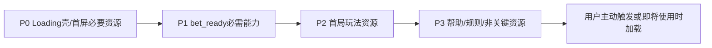
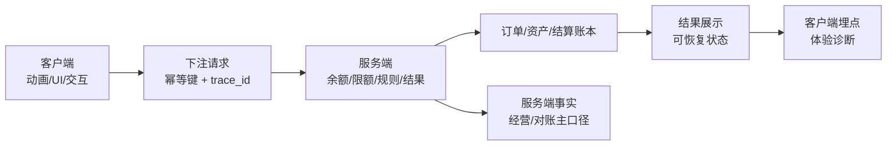
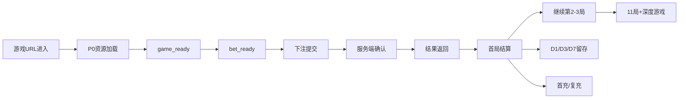
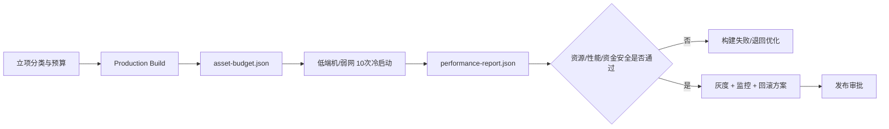

# Waje 轻量化游戏标准规范拆解与数据验收方案

> 本文基于《轻量化游戏标准规范》V1.2 整理，适用于 WajeGame H5 原生轻量小游戏。源文档状态为规范/执行要求；本文重点补充产品逻辑、数据观测、埋点契约和验收落地方式。

## 1. 核心结论

轻量化规范的本质不是单纯压缩资源，而是建立一条“低端设备/弱网下仍可安全完成游戏闭环”的发布门禁：

```text
资源预算
  → 冷启动/首局性能
  → bet_ready 可下注
  → 服务端下注与结算
  → 断线/重试/幂等恢复
  → 数据上报与账务对账
  → QA 10 次采样 + P75/P90 门禁
  → 灰度/发布/回滚
```

规范同时约束三类结果：

1. **体验结果：** 打开快、首局快、弱网可恢复、低端机不白屏。
2. **资金结果：** 客户端不决定输赢；重复点击、超时重试和断线恢复不重复扣款/派彩。
3. **发布结果：** 资源、性能或资金安全任一红线失败，构建或发布不得放行。

## 2. 规范红线与分级

### 2.1 玩法分类

| 类型 | 示例 | 完整核心资源红线 | 说明 |
|---|---|---:|---|
| 简单玩法 | Dice、Limbo、Mines、Keno、Hi-Lo、Coin Flip、Color Dice | 300KB | 新玩法默认归入此档 |
| 动效玩法 | Crash、Plinko、Wheel、Roulette、Tower、Bottle Spin | 500KB | 必须在美术开工前确认分类 |
| 不适用 | 大型 Slot、Live Video、重剧情/重角色动画 | 另立标准 | 不能用本规范放宽 |

### 2.2 关键门禁

| 阶段 | 简单目标/红线 | 动效目标/红线 |
|---|---|---|
| 冷启动 → 可以下注 | ≤150KB / ≤200KB | ≤220KB / ≤300KB |
| 完成第一局累计 | ≤250KB / ≤300KB | ≤350KB / ≤400KB |
| 全部核心静态资源 | ≤260KB / ≤300KB | ≤400KB / ≤500KB |

补充红线：

- Nigeria 主题目标 ≤18KB，红线 ≤24KB；首屏最多 3 个主题请求。
- 公共轻量游戏壳目标 ≤40KB，红线 ≤60KB，且必须保留登录态、余额、币种、限额、下注状态、幂等、断线恢复和基础埋点。
- 到可以下注前总请求不超过 12 个，关键路径不超过 6 个。
- 不使用 Cocos、Phaser、Pixi 等 2D 引擎运行时。
- 自定义字体和 Icon Font 不进入资源预算；使用系统字体。
- BGM 单首 ≤300KB，但必须计入 300KB/500KB 完整核心资源红线，不是额外配额。

### 2.3 资源加载分级



延迟加载、拆包、外部 CDN、iframe、Base64、Blob 和 Service Worker 预缓存都必须纳入完整核心资源统计；共享缓存只能作为补充数据，不能替代冷启动数据。

## 3. 业务安全机制拆解

### 3.1 客户端与服务端职责



必须保留：

- 服务端控制结果、赔率、余额、订单和结算；客户端动画不能决定输赢。
- 下注请求必须带幂等标识。
- 余额、限额和规则未就绪时，下注按钮不可用。
- 动画、主题、音效加载失败不得阻断下注、结果展示和结算。
- 断线恢复、重复点击、超时重试不能产生重复扣款或重复派彩。
- 轻量化不得删除风控、审计和必要埋点。

### 3.2 必须观测的业务状态

| 状态 | 进入条件 | 失败/异常处理 |
|---|---|---|
| `game_ready` | 游戏页面和基础资源可用 | 记录资源/接口错误，不代表可下注 |
| `bet_ready` | 余额、币种、限额、规则和连接就绪 | 未就绪时按钮保持禁用 |
| `bet_submit` | 用户提交首笔或后续下注 | 记录幂等键、请求状态和响应耗时 |
| `result_received` | 服务端返回结果 | 记录结果状态、错误码和 trace |
| `first_round_settled` | 首笔下注、结果、余额和订单状态完成展示 | 作为首局完成事实候选 |
| `reconnect_recovered` | 断线后状态和账本恢复一致 | 记录恢复时长与是否需要重试 |

## 4. 数据观测漏斗



### 4.1 核心指标

| 指标 | 定义 | 主要分母/限制 |
|---|---|---|
| 游戏进入 UV | 打开独立游戏 URL 的去重用户数 | `user_id` 优先，匿名仅作体验诊断 |
| `game_ready` 成功率 | 成功达到游戏可展示状态的用户/进入用户 | 按版本、设备、网络分层 |
| `bet_ready` 成功率 | 达到可下注状态的用户/进入用户 | 不得用页面打开代替 |
| 首局开始率 | 产生首笔 `bet_submit` 的用户/`bet_ready` 用户 | 服务端下注请求为主 |
| 首局完成率 | 完成 `first_round_settled` 用户/首局开始用户 | 需关联结果、余额和账本 |
| 首局时延 | `game_url → game_ready`、`game_ready → bet_ready`、`bet_submit → result` | 用同一 `performance.now()` 时钟域 |
| 深度游戏率 | 11 局以上用户/新用户或进入用户 | 固定 11 局+ 口径 |
| D1/D3/D7 留存 | 观察日仍活跃用户/cohort 用户 | 未成熟 cohort 不纳入分母 |
| 首付率/复充率 | 成功支付用户/cohort 用户 | 服务端订单成功为事实源 |
| 重复扣款率 | 重复请求导致多笔扣款的下注/总下注 | 目标为 0 |
| 重复派彩率 | 同一 round/幂等键产生多笔派奖的局数/总局数 | 目标为 0 |
| 结算恢复率 | 断线后最终账本与结果一致的局数/断线局数 | 服务端账本对账 |
| 数据完整率 | 关键事件必填字段完整事件/接收事件 | 监控缺失、异常和延迟 |

### 4.2 统一维度

所有指标至少支持：

```text
game_id / game_type / game_category
version / commit_id / package_name / channel
platform / browser_or_webview / device_model / device_tier / os_version
network_type / carrier / country / language
lightweight_version / theme_version / experiment_id / variant_id
```

## 5. 结合现有埋点的新增规划

### 5.1 现有事件复用

| 现有事件 | 轻量化用途 | 使用边界 |
|---|---|---|
| `PV` / `MV` / `MC` / `PD` | 游戏入口和页面/模块曝光、点击、退出 | 只能说明客户端行为，不能代替服务端下注事实 |
| `PAGELOAD` / `AUTOPV` / `AUTOPD` | H5 加载和页面停留 | 当前 H5 自动采集量偏低，关键节点需显式事件 |
| `GAMESTART` | 进入游戏或开始一局 | 必须统一 `game_id`、`round_id` 和 `session_id` |
| `GAMEEND` | 局结束、退出、失败、完成 | 当前存在异常治理问题，修复前不能作为唯一结算事实 |
| `BETREWARD` | 下注结算/奖励 | 必须与服务端订单、资产和 `round_id` 对账 |
| `ORDER` / `ASSET` | 充值、订单、余额和资产变化 | `ORDER` 需拆订单创建/支付成功/失败/退款/冲正 |
| `CRASH` / `AL` / `AQ` | 崩溃、启动、退出 | 增加版本、设备、网络和错误阶段 |

### 5.2 建议新增事件

| 优先级 | 事件 | 触发时机 | 关键字段 |
|---|---|---|---|
| P0 | `LIGHT_GAME_LOAD_START` | 进入游戏后开始加载 | `load_id`、URL、版本、设备、网络 |
| P0 | `LIGHT_GAME_READY` | 基础页面可展示 | `ready_ts`、`load_ms`、资源 bytes、失败原因 |
| P0 | `LIGHT_GAME_BET_READY` | 余额/限额/规则/连接就绪 | `balance_state`、`limit_state`、`rule_version` |
| P0 | `LIGHT_GAME_BET_SUBMIT` | 用户提交下注 | `bet_request_id`、`round_id`、`bet_amount`、`asset_type` |
| P0 | `LIGHT_GAME_RESULT_RECEIVED` | 服务端结果返回 | `round_id`、`result_status`、`result_ms`、`error_code` |
| P0 | `LIGHT_GAME_ROUND_SETTLED` | 首局或任一局账本完成 | `round_id`、`settlement_id`、`ledger_id`、`settlement_status` |
| P0 | `LIGHT_GAME_RECONNECT` | 断线、重连和恢复 | `disconnect_reason`、`recover_ms`、`reconcile_status` |
| P0 | `LIGHT_GAME_BUDGET_CHECK` | 构建或运行时资源账单生成 | `asset_budget_id`、阶段 bytes、红线、pass |
| P1 | `LIGHT_GAME_THEME_LOADED` | Nigeria 主题加载 | `theme_version`、`theme_bytes`、`fallback` |
| P1 | `LIGHT_GAME_MEDIA_FAILED` | 图片/音频/动画失败 | `asset_type`、URL hash、降级方式 |
| P1 | `LIGHT_GAME_RESOURCE_SUMMARY` | 首局/完整资源汇总 | `encoded_body_bytes`、`transfer_bytes`、request_count |
| P1 | `LIGHT_GAME_PERF_SAMPLE` | QA 或受控运行时性能采样 | `run_id`、P75/P90、TBT、Long Task、JS Heap |

### 5.3 统一事件信封

```text
event_name / event_version / event_uid
event_time_client / event_time_server / received_at
user_id / uuid / session_id / request_id / trace_id
game_id / round_id / game_version / commit_id
platform / device_model / device_tier / os_version / browser_or_webview
network_type / carrier / country / channel / package_name
status / reason_code / error_code / is_retry / retry_count
```

资金与结算事件额外必填：

```text
bet_request_id / order_id / settlement_id / ledger_id
asset_type / currency / bet_amount / payout_amount / balance_before / balance_after
idempotency_key / reconcile_status
```

## 6. 构建账单与运行报告

### 6.1 `asset-budget.json`

构建阶段必须输出：

- `schema_version`、`game_id`、`version`、`commit_id`、`generated_at`；
- `category`：简单玩法或动效玩法；
- `unit=KB_1024`；
- `compression_source=aws_cloudfront_default`；
- 冷启动、`bet_ready`、首局完成、完整核心资源各阶段 bytes、目标、红线和 `pass`；
- JS、CSS、图片、音频、字体、主题拆分；
- 最大 10 个资源、重复资源、本地化增量、资源 Hash 和加载等级。

### 6.2 `performance-report.json`

运行阶段必须输出：

- 设备、系统、浏览器/WebView、网络参数；
- 10 个有效冷启动 `run_id`；
- `game_ready`、`bet_ready`、`bet_submit`、`result_received`、`first_round_settled` 时间节点；
- `encodedBodySize`、`transferSize`、请求数、TBT、Long Task、Android JS Heap；
- P75、P90、最大资源量、异常记录和最终 `pass`。

`asset-budget.json` 与 `performance-report.json` 必须通过 `game_id + version + commit_id` 关联；缺字段、版本不一致或资源阶段归属不完整均判失败。

## 7. QA / 发布验收

### 7.1 固定环境

| 环境 | 规范要求 |
|---|---|
| Android 低端档 | 3GB RAM、Android 11+、A53/A55 同级 CPU、360 CSS px |
| Android WebView | 产品正式支持的最低 WebView 主版本 |
| iOS | iPhone 8/A11/2GB RAM 同级或更低性能设备、iOS 16，分别测 Safari/WKWebView |
| 弱网 | 下行 1.5Mbps、上行 750Kbps、RTT 150ms、随机丢包 1% |
| 采样 | 每组合 1 次预热 + 10 次有效冷启动；资源取最大值，时间/阻塞/内存取 P75/P90 |

### 7.2 性能门禁

| 指标 | 简单玩法 P75 | 简单玩法 P90 红线 | 动效玩法 P75 | 动效玩法 P90 红线 |
|---|---:|---:|---:|---:|
| `navigationStart → game_ready` | 2.0s | 3.5s | 2.8s | 4.5s |
| `navigationStart → bet_ready` | 3.0s | 5.0s | 4.0s | 6.5s |
| `bet_submit → 服务端确认` | 1.2s | 2.0s | 1.2s | 2.0s |
| `result_received → 结算 UI 稳定` | 0.8s | 1.5s | 1.5s | 2.5s |
| `bet_ready` 前 TBT | 300ms | 600ms | 450ms | 800ms |

额外失败条件：

- `bet_ready` 前任一 Long Task ≥500ms；
- Android JS Heap P90 >64MB；
- iOS 内存警告、页面重载或崩溃；
- 10 次内出现重复扣款、重复派彩、结算状态错误或无法恢复白屏；
- 任一资源完整核心红线超标；
- 主题、音频、动画失败不能降级而阻断主流程。

### 7.3 发布门禁流程



## 8. 看板与告警规划

### 8.1 轻量化游戏性能看板

- 资源：完整核心资源、`bet_ready` 前资源、请求数、主题增量、最大文件；
- 性能：`game_ready`、`bet_ready`、首局结算耗时 P50/P75/P90；
- 设备：Android 低端、WebView、iOS Safari/WKWebView、设备档位；
- 网络：网络类型、运营商、弱网固定环境；
- 体验：白屏、加载失败、下注失败、结果未返回、断线恢复；
- 业务：首局开始率、首局完成率、2–3 局率、11 局+、D1/D7、首充率。

### 8.2 P0 告警

| 告警 | 建议阈值 |
|---|---|
| 完整核心资源超红线 | 任一游戏、版本、构建超 300KB/500KB |
| `bet_ready` P90 超线 | 简单 >5.0s，动效 >6.5s |
| 重复扣款/重复派彩 | 任意非 0 |
| 结算对账差异 | 任意不可解释差异 |
| 无法恢复白屏/崩溃 | 10 次采样出现 1 次即失败 |
| `GAMEEND` 数据异常 | 按既有 GAMEEND 数据质量阈值触发阻断 |

## 9. 重点风险与产品判断

1. **资源红线必须与业务安全同级。** 只压缩 UI 而删除幂等、断线恢复、风控或审计，会把体验优化转化为资金风险。
2. **首局是核心经营节点。** 不能只看包体 KB；应同时看 `进入 → game_ready → bet_ready → 首局结算 → 第2/3局 → 11局+ → D1/D7/首充`。
3. **H5 自动采集不足时必须显式埋点。** `PAGELOAD/AUTOPV/AUTOPD` 只能作辅助，下注和结算必须有服务端事实。
4. **GAMEEND 不能独立承担结算口径。** 当前已有异常治理背景，需要以服务端结算/资产账本兜底。
5. **Nigeria 主题是轻量视觉层，不是独立玩法或规则层。** 不改变赔率、规则、状态和下注路径；文化元素必须由当地运营/设计/合规共同确认。
6. **BGM 规则容易产生误解。** 单首 ≤300KB 不是额外额度，仍必须计入完整核心资源总红线。

## 10. 实施优先级

| 优先级 | 事项 | 责任方 |
|---|---|---|
| P0 | 资源账单、冷启动 10 次采样、P75/P90 门禁 | 前端、平台、QA |
| P0 | 下注幂等、服务端结果、余额/限额、结算/资产对账 | 游戏后端、支付/账务、数据开发 |
| P0 | `LIGHT_GAME_*` 核心事件和 `asset-budget/performance-report` 结构化入库 | 数据产品、前端、QA |
| P1 | 设备档位、弱网、WebView、白屏/错误/断线恢复看板 | 数据开发、客户端、QA |
| P1 | 入口到首局、深度游戏、留存、首付漏斗 | 数据分析、产品、运营 |
| P2 | 主题、音频、动画资源自动优化和异常趋势分析 | 美术、前端、平台 |

## 11. 来源与关联资料

- 原始规范：[轻量化游戏标准规范](https://ksg964l11fam.sg.larksuite.com/wiki/MeOOwWh05iRtIRkSoGtlJXJBg1b?from=from_copylink)，V1.2，revision 3，生效日期 2026-08-12。
- [[轻量化游戏分析-指标口径与数据验证清单-2026-08-04]]
- [[../01-产品/轻量化游戏分析-研究结论与产品建议-2026-08-04]]
- [[Waje全链路数据需求与埋点设计总表-2026-08-11]]
- [[Waje埋点事件与属性字典-2026-08-11]]
- [[GAMEEND埋点异常修复清单-2026-08-03]]
- [[Waje-H5-PWA设备性能转化专项分析与监控方案-2026-08-13]]

> 证据边界：源规范中的资源红线、性能门禁、职责和验收要求是项目设计输入；实际是否达标必须以对应版本的 `asset-budget.json`、`performance-report.json`、服务端结算和资产对账结果为准。未提供上述报告时，不将“符合规范”写成已验证事实。
