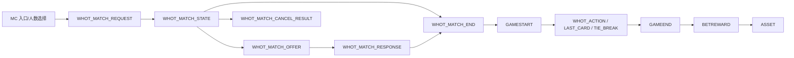

# Whot 新版玩法与旧版埋点对照及规划

> 目标：复用旧版 Whot 已有的跨游戏生命周期事件，补齐新版“自选 2/4 人、低峰同意降级、Last Card、牌堆耗尽同分决胜、双端同服和轻量化体验”所需的事件与指标。本文是策划、游戏服务端、客户端和数据团队的评审稿，不代表事件已上线。

## 执行结论

1. **旧版埋点能回答开局、完局、局时长、下注结算、托管和部分初始手牌问题，不能客观回答匹配失败。** 当前资料有 `MC / GAMESTART / GAMEEND / BETREWARD / ASSET` 通用链路、GAMEEND 字段、托管日统计和初始手牌历史统计需求；但没有证据证明现网已有“服务端受理匹配尝试—队列变化—降级建议—终态”的完整事件链。只看 GAMESTART 会漏掉取消、超时和建桌失败。
2. **新版最重要的新增测量对象是一次匹配尝试，而不是一局游戏。** 建议用 `root_match_id → match_attempt_id → queue_epoch / offer_id → game_round_id` 串联用户选择、服务端受理、队列变化、N1/N2 建议、用户响应、取消竞争、匹配终态和开局。
3. **4 人模式需要同时看两个结果。** “4 人原模式兑现率”衡量用户选择 4 人后实际开 4 人的比例；“任意人数开局率”衡量接受降级后实际开 2/3/4 人的比例。只看后者会掩盖 4 人体验被降级，只看前者会忽略降级挽回的开局。
4. **机器人的存在不能从主分母删除。** 分母是服务端受理的真人匹配尝试；在结果中按 `human_count / robot_count / opponent_mix` 拆分真人满桌、机器人辅助和同意降级。虚拟在线展示人数不得进入任何匹配分母。
5. **新旧版直接比较有三项前置条件。** 必须能识别 `ruleset_version`、端/包/版本；旧版也要有可重建的匹配尝试和失败终态；共享匹配池的并行版本会互相影响，发布评估应按房间×时间分批或分阶段，并对付费状态、房间、小时和端固定权重。
6. **新版玩法新增了独立分析域。** Last Card 宣告与抓罚、牌堆耗尽、同分决胜、取消与建桌竞争、记牌器延迟生效、弱网重连恢复、首包资源和低端机体验都需要状态型事件，不能塞进一个 GAMEEND 汇总字段。

## 1. 证据范围

| 来源 | 当前用途 | 证据状态 |
|---|---|---|
| 《Whot游戏H5竖版轻量化及app同步新增规则需求》revision 5641 | 新版玩法、匹配、Last Card、同分决胜、双端同服和轻量化要求 | 当前产品需求 |
| 《Whot 6001 真金博彩机器人策略》revision 69 | 机器人类型、出牌干预、宣告/抓罚概率和策略版本要求 | 当前候选策略，是否上线待验收 |
| 《whot3 4人玩法》《whot匹配策略》《Whot匹配时长》 | 旧版系统自动凑 4/3/2 人、机器人兜底和等待配置演进 | 历史参考，当前有效性待核 |
| 《托管打点需求》《托管数据统计》 | 托管人数、把数、局数、胜率和取消失败等历史统计目标 | 历史统计需求，不证明现网字段完整 |
| 《统计需求-whot初始手牌与对局时长》 | 初始手牌、起始牌、时长、抓牌/出牌量和 bet 的历史编码 | 历史草案；位置压缩编码不适合 2/3/4 人新版 |
| 《Waje埋点事件与属性字典》 | GAMESTART/GAMEEND/BETREWARD/ASSET 与通用字段 | 当前项目字典；GAMEEND 仍是质量治理对象 |
| 《Waje自研游戏H5加载、可玩与可下注埋点上报需求 V2》 | H5_GAME_LOAD/READY/BET_READY、性能和双端字段 | 设计基线，实际 event_id 待平台创建回读 |

当前分析没有执行生产查询。旧版“已埋点”来自策划沟通结论；本文进一步区分“需求曾提出、平台字段可见、现网实际完整上报”三种状态，研发验收时必须回读实际 schema 和样本聚合。

## 2. 新旧玩法差异对埋点的影响

| 环节 | 旧版资料 | 新版规则 | 新增测量要求 |
|---|---|---|---|
| 人数选择 | 系统优先 4 人，不足时按 3/2 人或机器人开局 | 用户在房间页只选择 2 或 4 人入口 | 记录 `requested_match_mode`，不能用实际人数反推用户意图 |
| 4 人低峰 | 达到阈值后系统决定按当前人数开局 | 1/2/3 名队列分别进入 N1/N2 建议与共同同意；可能实际开 2/3/4 人 | 记录初始真人数、每次 offer、每名用户响应、同意集合和实际人数 |
| 机器人 | 历史资料含机器人兜底与必赢/必输策略 | 队列只有本人时可准备 2 人候选真人或系统对手；其他分支边界待策划确认 | 每席位记录真人/机器人、补位原因、策略版本；不在客户端暴露风控细节 |
| 付费状态 | 旧版资料未形成当前可比口径 | 付费只配付费，非付费只配非付费 | 记录粗粒度 `payer_pool`，所有匹配指标按该分池拆分 |
| 取消匹配 | 客户端可取消 | 取消与创建牌局存在竞争，服务端先后决定是否返回房间或强制入局 | 分开记录取消请求和服务端结果，计算取消竞争失败率 |
| Last Card | 旧横版没有单牌宣告 | 宣告、漏宣告、对手依次抓罚、成功罚抽 2、无人抓罚后重新宣告 | 记录状态变化、宣告结果、每人抓罚机会与唯一成功请求 |
| 牌堆耗尽 | 历史资料记录抓牌耗尽和积分 | 最低分唯一直接结算；最低同分进入多轮洗牌、抽牌、决胜 | 记录耗尽原因、每人点数、同分集合、决胜轮次和最终原因 |
| 记牌器 | 旧功能存在 | 当局购买，下一局生效 | 记录购买结果、购买局、计划生效局和实际生效局 |
| 重连 | 恢复牌局状态 | 必须恢复 Last Card/抓罚、特殊牌、同分决胜和结算，不重复提交 | 记录快照版本、恢复状态、重复请求抑制结果和恢复耗时 |
| H5体验 | 横版 | 竖版轻量化，首局下载≤1.5MB、完整流程≤2.5MB | 复用 LOAD/READY/BET_READY，补资源字节、弱网、设备档位和阶段耗时 |

## 3. 建议事件架构

### 3.1 复用和新增清单

| 事件 | 触发源 | 触发时机 | 处理 |
|---|---|---|---|
| `MC` | 客户端 | 进入 Whot、选择 2/4 人、房间、Quick Match、Rules、Play Again、Change Room | 复用；补稳定 element_id、人数意图和入口 |
| `H5_GAME_LOAD` | H5 主框架 | 首次资源加载和阶段变化 | 复用设计；记录阶段、字节、缓存和错误 |
| `H5_GAME_READY` | H5/游戏桥 | 画面和配置可操作 | 复用设计；必须来自真实 ready 信号 |
| `H5_BET_READY` | H5/游戏桥 | 余额、币种、限额、连接和操作控件均可用 | 复用设计；不能由页面显示推断 |
| `WHOT_MATCH_REQUEST` | 服务端 | 服务端受理一次真人匹配请求 | **P0 新增**；匹配指标主分母 |
| `WHOT_MATCH_STATE` | 服务端 | 加入/离开、队列人数、epoch、建议关闭/重算等状态改变 | **P0 新增**；只在状态改变时上报 |
| `WHOT_MATCH_OFFER` | 服务端 | 生成 N1/N2 或失败后的 Try 2 Players 建议 | **P0 新增**；每个 offer 唯一 |
| `WHOT_MATCH_RESPONSE` | 服务端 | 接收同意、拒绝、继续等待、无响应终态 | **P0 新增**；记录服务端校验结果 |
| `WHOT_MATCH_CANCEL_RESULT` | 服务端 | 取消请求完成；返回房间或建桌已先发生 | **P0 新增**；解决取消竞争 |
| `WHOT_MATCH_END` | 服务端 | 成功、用户取消、超时、风控无可用组桌、建桌失败等唯一终态 | **P0 新增**；一 attempt 一个终态 |
| `GAMESTART` | 服务端 | 牌局实际创建并开始 | 复用；补 `match_attempt_id`、实际人数和席位组成 |
| `WHOT_ACTION` | 服务端 | 接受出牌、摸牌、选图案、托管恢复等玩法动作 | P1 新增；只记最终接受结果，不采集完整手牌明细 |
| `WHOT_LAST_CARD` | 服务端 | pending、declare、catch window、catch result、penalty、expired | **P0 新增**；状态机事件 |
| `WHOT_TIE_BREAK` | 服务端 | deck_exhausted、score_result、shuffle、draw、result、repeat | **P0 新增**；每轮带序号 |
| `WHOT_RECONNECT_RESULT` | 服务端/客户端 | 重连开始、快照恢复成功/失败、恢复到哪一状态 | P1 新增；关联 snapshot_version |
| `WHOT_TRACKER_RESULT` | 服务端 | 购买成功/失败、计划生效、实际生效、打开面板 | P1 新增；购买局与生效局分开 |
| `GAMEEND` | 服务端 | 唯一局终态 | 复用并扩展；保留 end_reason、点数和人机组成 |
| `BETREWARD` / `ASSET` | 服务端 | 结算和账本终态 | 复用；金额、币种、正负方向、幂等键必须对账 |

### 3.2 关联键和公共字段

| 字段 | 用途 | 规则 |
|---|---|---|
| `root_match_id` | 串联 Quick Match/Play Again 带来的连续匹配旅程 | 用户一次明确发起产生；重试不换根键 |
| `match_attempt_id` | 一次服务端受理的队列尝试 | 主分析单位；每次重新进入队列新建 |
| `queue_epoch` | 人员变化后的一段稳定队列 | 加入、离开、取消、断线导致重算时递增 |
| `offer_id`、`offer_stage` | 一次低峰建议及 N1/N2 | N1/N2 独立；不得继承响应 |
| `client_action_id` | 客户端点击幂等与重试 | 取消、同意、抓罚、宣告等动作使用 |
| `game_round_id` | 实际牌局 | 从 GAMESTART 到 ASSET 全链路一致 |
| `server_seq` | 同一匹配/牌局状态顺序 | 单调递增；用于处理乱序和重连 |
| `event_uid`、`event_version` | 事件幂等与 schema 版本 | 同一业务事实重试复用 UID |
| `event_time`、`server_time`、`received_at` | 行为、服务端和入库时间 | 三者分列，统一存 UTC，报表转 Africa/Lagos |
| `game_family`、`game_id`、`play_id` | Whot 产品与服务玩法映射 | `6001 / 9006 / play_id` 的最终关系需研发确认后固化 |
| `game_generation`、`ruleset_version` | 新旧玩法隔离 | 至少 `legacy / lightweight_v1`；服务端下发并上报 |
| `client_type`、`package_name`、`app_version`、`web_version` | APP/H5及版本比较 | H5 不用 app_version 代替 web_version |
| `room_id`、`room_amount`、`asset_type`、`currency`、`amount_unit` | 房间与资金口径 | 金额不裸存无单位整数 |
| `payer_pool` | 付费/非付费匹配分池 | 仅上报粗粒度枚举，不携带订单或支付账户信息 |
| `requested_match_mode`、`actual_player_count` | 用户意图与实际开局 | 前者只能为 2/4；后者可为 2/3/4 |
| `human_count`、`robot_count`、`opponent_mix` | 人机组成 | 从服务端席位事实计算；机器人不能伪装为真人字段 |
| `match_terminal_reason` | 终态原因 | `started/cancelled/timeout/risk_no_table/create_failed/disconnected/unknown`，未知值隔离 |
| `risk_gate_result` | 风控对组桌的影响 | 仅 coarse pass/rejected/unknown；敏感规则留审计日志，不下发客户端 |

## 4. 匹配指标定义

所有比例同时展示分子、分母、日期覆盖和未知终态数。主分母统一为“服务端已受理且已达到成熟截止时间的真人 `match_attempt_id`”；虚拟在线展示数不参与，机器人作为结果维度保留。

| 指标 | 定义/算法 | 用途 |
|---|---|---|
| 匹配请求受理数 | 去重 `match_attempt_id` | 总体规模和主分母 |
| 4 人原模式兑现率 | 请求 4 人且实际 4 人开局的 attempts ÷ 请求 4 人的成熟 attempts | 回答用户真正得到四人局的比例 |
| 2 人原模式兑现率 | 请求 2 人且实际 2 人开局的 attempts ÷ 请求 2 人的成熟 attempts | 2 人模式基线 |
| 任意人数开局率 | 实际 2/3/4 人 GAMESTART 的 attempts ÷ 成熟 attempts | 衡量是否最终玩上 |
| 降级挽回率 | 请求 4 人、接受建议并实际开 2/3 人的 attempts ÷ 收到建议的成熟 attempts | 衡量降级机制挽回作用 |
| 建议曝光率 | 有 WHOT_MATCH_OFFER 的 attempts ÷ 请求 4 人的成熟 attempts | 低峰依赖程度 |
| 建议同意率 | 服务端确认同意的用户响应 ÷ 可响应用户机会 | 需按 N1/N2、初始真人数分开 |
| 超时率 | terminal=timeout ÷ 成熟 attempts | 匹配失败主指标 |
| 取消请求率 | 有取消请求的 attempts ÷ 成熟 attempts | 用户主动放弃 |
| 取消成功率 | cancel_result=cancelled ÷ 有取消请求 attempts | 取消体验 |
| 取消竞争失败率 | 建桌先完成而取消未生效 ÷ 有取消请求 attempts | 专门评估“返回列表后又被拉回” |
| 匹配等待时长 | `match_end_time - accepted_time` 的 P50/P90/P95 | 原始时长，不按设计上限缩放 |
| 阈值开局率 | 5/10/15/30/45 秒内开局 attempts ÷ 成熟 attempts | 允许新旧不同上限下公平观察 |
| 真人满桌率 | 开局且 robot_count=0、actual=requested 的 attempts ÷ 成熟 attempts | 真人供给能力 |
| 机器人辅助开局率 | 开局且 robot_count>0 的 attempts ÷ 成熟 attempts | 系统对手依赖 |
| 实际人数分布 | actual 2/3/4 人局数及占比 | 识别 4 人请求被降级程度 |

核心切片：`ruleset_version × client_type × package/version × requested_match_mode × payer_pool × room_id × hour_of_week × quick_match × initial_other_human_count × offer_stage × opponent_mix`。小样本合并，禁止输出用户、设备、支付或风控明细。

## 5. 新旧版客观比较方案

### 5.1 可比边界

- 旧版资料能证明通用局事件和多项历史统计目标存在，**不能证明旧版有完整匹配尝试终态**。如果服务端日志无法重建失败/取消 attempts，旧版匹配成功率标记 `blocked`，不能用 GAMESTART 用户数、下注人数或虚拟在线数代替。
- 新版 APP 和 H5 同服同池，且付费状态强制分池。比较必须固定 `payer_pool、room_id、小时、端、包、版本` 的构成，给出分层结果和固定权重结果。
- 同一共享池内随机给用户分新旧版本会产生供给干扰。优先按“房间×时间块”切换或分阶段放量；同时记录当时队列真人到达量。若只能并行发布，结论标记为准实验。
- 旧版等待阈值约 15 秒、新版 4 人最长 45 秒。时长直接展示 P50/P90/P95 和共同阈值 5/10/15 秒开局率；另列各自超时率，不把时长除以配置上限后宣称更快。

### 5.2 建议看板顺序

1. **用户意图：**2/4 人请求数和占比。
2. **原模式兑现：**2→2、4→4。
3. **降级路径：**4→3、4→2，按 N1/N2 和初始真人数。
4. **失败路径：**取消、超时、风险无桌、建桌失败、断线和未知终态。
5. **等待体验：**P50/P90/P95、共同阈值开局率。
6. **人机组成：**真人满桌、机器人辅助、机器人策略版本。
7. **下游质量：**完局、重连、托管、RTP/盈利和次局复玩。

## 6. 新玩法专项指标

| 专题 | 指标 | 关键字段 |
|---|---|---|
| Last Card | pending 触发率、宣告成功率、漏宣告率、抓罚机会率、抓罚成功率、罚抽执行率、无人抓罚失效率 | state、actor_type、hand_count_before/after、catcher_count、result、latency_ms |
| 多机器人公平性 | 机器人宣告率/抓罚率、真人被机器人抓罚率，按 bot policy version | opponent_mix、bot_policy_version、bot_role、last_card_result |
| 牌堆耗尽 | 耗尽局占比、最低分唯一率、同分率 | end_trigger、remaining_deck、player_score_summary |
| 同分决胜 | 决胜局占比、决胜轮次分布、重复同分率、决胜恢复失败率 | tie_break_id、round_no、participant_count、result |
| 托管 | 进入托管用户/局、托管结束率、恢复率、托管胜率、托管动作数 | auto_play_state、reason、action_count、end_state |
| 重连 | 重连尝试/成功、恢复耗时 P95、快照状态完整率、重复动作抑制数 | snapshot_version、restored_state、latency_ms、duplicate_suppressed |
| 记牌器 | 购买成功、购买局→生效局关联率、生效失败率、面板打开率 | purchase_round_id、effective_round_id、entitlement_state |
| H5轻量化 | 首局首次下载字节、完整流程累计字节、LOAD→READY→BET_READY P50/P95、弱网失败率、低端机卡顿/黑屏率 | cache_state、bytes、stage、network_type、device_tier、error_code |
| 局与资金 | 完局率、局时长、抓/出牌量、实际人数、结算原因、实际 RTP、平台盈利 | GAMESTART/GAMEEND/BETREWARD/ASSET、金额单位和终态 |

## 7. 旧埋点迁移建议

| 旧设计 | 问题 | 新版处理 |
|---|---|---|
| 初始手牌压成固定位置数字串 | 难扩到 3/4 人、难校验、长度说明已有冲突 | 改为服务端结构化局级汇总：玩家数、各席位功能牌数、图案集中度；明细仅进受控日志 |
| 托管按日总数 | 无法关联版本、匹配、重连和局结果 | 保留日报，但由 event-level state 汇总，按 round/seat/version 去重 |
| GAMEEND 大量字段 | 历史上出现高异常率，且匹配失败不产生 GAMEEND | 修复质量后继续作局终态；匹配另建 attempt 事实 |
| `is_robot` 单一布尔 | 多人局不能表达各席位组成和策略版本 | 由服务端输出 human_count/robot_count/opponent_mix；策略字段只在受控日志和聚合报表 |
| `player_num` | 只能说明实际开局人数 | 新增 requested_match_mode，保留用户意图与实际结果 |
| 单一 `game_id` | 新 H5 9006、旧/服务 Whot 6001 可能混淆 | 建立 game_family + client_game_id + server_game_id + play_id 映射版本 |

## 8. 发布前验收

### 8.1 确定性用例

- 2 人满员直接开局；2 人由系统对手辅助；4 人满 4 真人直接开局。
- 4 人队列 1/2/3 人分别覆盖 N1、N2：全同意、部分同意、拒绝、无响应、期间加入/离开/断线。
- 取消早于建桌、建桌早于取消、客户端已返回房间但服务端要求拉回牌局。
- 付费/非付费隔离，风控拒绝候选后继续匹配或终止的原因可还原。
- Last Card 及时宣告、漏宣告、多个对手并发抓罚仅一次成功、无人抓罚、托管出牌、20 WHOT 先选图案。
- 牌堆耗尽最低分唯一、两人/多人同分、一轮/多轮决胜、决胜中断线重连。
- 记牌器当局购买下一局生效，Play Again、换房间和断线后权益一致。
- GAMESTART→GAMEEND→BETREWARD→ASSET 金额和终态对账；退款/异常不进入有效 RTP。

### 8.2 数据质量门槛

| 检查 | 发布门槛 |
|---|---|
| match request 唯一性 | 测试用例 100%；生产重复 attempt 需幂等并可解释 |
| 匹配终态覆盖 | 每个成熟 attempt 唯一终态；生产覆盖目标≥99.5% |
| 请求→开局关联 | 所有 started attempts 关联一个 GAMESTART；孤儿局进入隔离 |
| 开局→结算链路 | GAMESTART/GAMEEND/BETREWARD/ASSET 未解释差额为 0 |
| 关键字段 | 测试必填 100%；生产缺失/未知枚举目标<0.1% |
| 时间顺序 | accepted≤offer/response/end≤GAMESTART；乱序保留原时间并按 server_seq 修复 |
| 双端一致 | 同一 game_round_id 的人数、Last Card、决胜和结算状态一致 |
| H5资源 | 首局首次下载≤1.5MB；完整流程累计下载≤2.5MB |
| 报表隐私 | 只输出聚合；小于门槛的分组隐藏或合并 |

## 9. 策划与研发必须确认的边界

1. 新 H5 `game_id=9006` 与服务端/APP `game_id=6001`、`play_id` 的正式映射和生效版本。
2. 4 人队列已有 2/3 名真人时是否允许机器人补位；若不允许，原因字段和产品预期需明确。
3. 队列只有本人时，跨 2 人队列候选和机器人候选的优先级、资格及用户同意文案。
4. `payer_pool` 判定时点和机器人如何进入付费/非付费分池。
5. N1/N2 的 X0/X1/X2、倒计时和 Y 配置版本；参与者变化后如何生成新 queue_epoch。
6. Last Card 文档中的“3 秒未宣告”与“每位对手进入正常回合前一次机会”以哪一个状态机为准。
7. 记牌器“当局购买、下一局生效”在 Play Again、换房和断线后的精确定义。
8. 结算公式写为 `玩家人数 × 房间金额 × (1-抽成)`，示例却按“对手人数”计算 180；正式公式必须在 BETREWARD/ASSET 验收前统一。
9. 机器人必赢/必输策略是否进入新版本、如何记录策略版本和干预原因，以及哪些字段只允许服务端审计。
10. 旧版是否存在可重建的匹配 request/terminal 服务端日志；若没有，新旧匹配率只能从新版开始建立基线。

## 10. 实施顺序

1. **P0：**确认游戏映射、匹配状态机、终态枚举和结算公式。
2. **P0：**服务端先实现 MATCH_REQUEST/STATE/OFFER/RESPONSE/CANCEL_RESULT/END 与关联键。
3. **P0：**扩展 GAMESTART/GAMEEND，接通 BETREWARD/ASSET 对账；同时修复 GAMEEND 质量。
4. **P0：**实现 Last Card 和 Tie Break 状态事件及并发/重连用例。
5. **P1：**接入 H5 LOAD/READY/BET_READY、资源字节、弱网和设备性能。
6. **P1：**接入托管、重连和记牌器事件。
7. **上线前：**完成确定性测试、回放、双端同服对账和报告查询预演；上线后先灰度，再做新旧比较。

## 来源

- [新版 Whot 主需求](https://ksg964l11fam.sg.larksuite.com/wiki/WjLww2oliipOPzkJMHil0yvbglc)，回读 revision 5641。
- [Whot 6001 真金博彩机器人策略](https://ksg964l11fam.sg.larksuite.com/wiki/Sijzw1c40idjfRk2GMNlZbV5g2f)，回读 revision 69。
- [旧版 whot3 4人玩法](https://ksg964l11fam.sg.larksuite.com/wiki/T6BVw0o33ieQhfkvzLKlBXM3gQf)，历史迁移 revision 3。
- [旧版 Whot 匹配时长](https://ksg964l11fam.sg.larksuite.com/wiki/XzUTw4v9qiSGqVk6az4lS4QjgUg)，历史迁移 revision 3。
- [旧版托管打点需求](https://ksg964l11fam.sg.larksuite.com/wiki/WuDPwMKShixPdfkkDXml3IFCgAf)，历史迁移 revision 2。
- [旧版初始手牌与对局时长](https://ksg964l11fam.sg.larksuite.com/wiki/OZZ0wFH40icBvnkjBjQlMZXPgJg)，历史迁移 revision 3。
- [[Waje埋点事件与属性字典-2026-08-11]]、[[Waje自研游戏H5加载、可玩与可下注埋点上报需求-V2-2026-09-01]]、[[GAMEEND埋点异常修复清单-2026-08-03]]。

