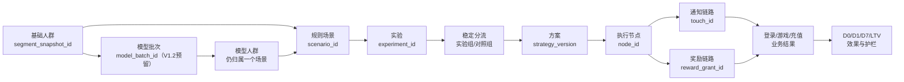
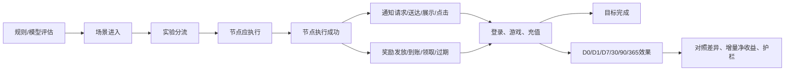

# 用户分层与场景运营 V1.1：观测指标与埋点规划

> 本文是《用户分层&场景运营需求 1.1.0》的数据实施摘要，面向产品、数据、研发和 QA。PRD 当前状态为产品定义与交互原型，本文中的“新增事件”和“目标字段”均需研发评审后实施，不代表已经上线。

## 1. 先看结论

V1.1 的核心不是增加更多奖励，而是把一次运营动作变成可验证的实验：

```text
基础人群/模型批次
→ 冻结人群快照
→ 进入一个用户场景
→ 稳定分到实验组或对照组
→ 按节点发送通知、发放奖励
→ 关联登录、游戏、充值和留存
→ 计算方案相对对照组的增量与净收益
```

因此，数据设计必须优先保证四件事：

1. **分母固定：** 留存、ARPU、LTV 和收益使用首次分流人数，不能改用点击、领取或充值人数。
2. **分组稳定：** 同一用户在同一实验中只能属于一个方案或对照组，后续节点不能重新抽样。
3. **链路可追溯：** 场景、实验、方案、节点、通知、奖励和业务结果必须能通过 ID 串联。
4. **效果可归因：** 先记录服务端分流事实，再用客户端行为和支付/游戏事实解释结果。

## 2. 产品机制拆解

### 2.1 V1.0 到 V1.1 的关键变化

| 维度 | V1.0 | V1.1 数据含义 |
|---|---|---|
| 人群 | 场景内直接配置条件 | 基础人群快照，可扩展模型人群 |
| 场景 | 不同参数容易生成多个场景 | 一个场景作为一个实验容器 |
| 分组 | 运营策略整体触发 | 多实验方案 + 固定对照组 |
| 执行 | 策略整体执行 | 每个方案可有多个有序节点 |
| 触达 | 通知、弹窗、奖励明细 | 请求、送达、展示、点击、领取、到账全链路 |
| 复盘 | 发放、领取、通知结果 | 对照组、留存、ARPU、LTV、增量净收益 |

### 2.2 业务对象关系



### 2.3 必须固化的业务规则

| 规则 | 埋点/数据要求 |
|---|---|
| 一个模型人群只生成一个场景 | 保存 `model_batch_id`、`segment_snapshot_id`、`scenario_id`，禁止按 3/7/15 天预测值拆成多个场景 |
| 方案与对照组流量合计 100% | 发布前校验；记录配置比例和实际分流比例 |
| 用户进入场景时只分流一次 | 以 `scenario_id + experiment_id + user_id` 做幂等键 |
| 后续节点沿用首次分组 | 每个节点事件必须携带同一 `group_id` 和 `allocation_version` |
| 对照组不发通知、不发奖励 | 对照组可有业务结果，但不得出现成功触达或奖励账本 |
| 发布时冻结配置 | 保存规则、快照、方案、节点、流量、通知和奖励版本 |
| 场景目标完成后退出后续节点 | 记录 `exit_reason=goal_completed`，不能把跳过当执行失败 |

## 3. 观测漏斗



## 4. 核心观测指标

### 4.1 P0：必须上线的指标

| 指标 | 口径 | 公式/判断 | 主要维度 |
|---|---|---|---|
| 评估用户数 | 完成一次场景规则评估的去重用户 | `COUNT(DISTINCT user_id)` | 场景、规则版本、日期 |
| 场景命中率 | 满足准入条件的用户比例 | 命中人数 ÷ 评估人数 | 场景类型、来源 |
| 场景进入人数 | 成功写入场景的去重用户 | `COUNT(DISTINCT entry_id)` | 场景、快照、日期 |
| 分流完整率 | 完成实验/对照分组的比例 | 分流人数 ÷ 场景进入人数 | 实验、配置版本 |
| 实际分流比例 | 各组真实人数占比 | 组人数 ÷ 场景进入人数 | `group_id` |
| 节点执行率 | 实际成功执行占理论应执行 | 成功执行人数 ÷ 应执行人数 | 方案、节点、日期 |
| 通知送达率 | 送达占成功提交 | 送达次数 ÷ 提交次数 | 渠道、模板、节点 |
| 奖励到账率 | 成功到账占发放成功 | 到账人数 ÷ 发放人数 | 资产类型、奖励策略 |
| 奖励领取率 | 成功领取占需领取奖励 | 领取人数 ÷ 需领取人数 | 方案、节点、奖励类型 |
| 目标完成率 | 完成目标占首次分流 | 目标完成用户 ÷ 初始分流人数 | 方案、对照组、窗口 |
| D1/D7 留存率 | 成熟 cohort 的回访率 | N 日活跃用户 ÷ 初始分流人数 | 方案、对照组、平台 |
| N 日充值转化率 | 窗口内成功充值用户比例 | 充值用户 ÷ 初始分流人数 | 7/30/90/365 日 |
| N 日 ARPU/LTV | 窗口内实际到账充值均值 | 累计到账金额 ÷ 初始分流人数 | 方案、对照组、窗口 |
| 增量净收益 | 相对对照组收入增量扣除奖励成本 | 方案增量收入 − 已确认奖励成本 | 方案、窗口 |

### 4.2 P1：用于优化和诊断

| 指标 | 用途 |
|---|---|
| 通知展示率、点击率 | 区分“送达但未看到”和“看到但未点击” |
| 节点跳过率及跳过原因 | 识别目标完成、频控、资格失效和系统失败 |
| 奖励过期率、领取失败率 | 识别奖励设计和领取流程问题 |
| 首充/首局时延 | 观察新用户和首充后用户转化速度 |
| pLTV 预测偏差 | 评估模型人群是否被正确分层 |
| 分组偏差 | 检查组间国家、平台、渠道、价值分布是否失衡 |
| 重复发奖率 | 保护资产和奖励成本 |
| 支付—资产对账差异 | 保护收入和净收益口径 |
| `GAMEEND` 有效率 | 防止游戏异常数据污染运营效果 |

### 4.3 核心效果公式

```text
对照组人均收入 = 对照组窗口充值金额 ÷ 对照组初始分流人数
方案自然收入 = 对照组人均收入 × 方案初始分流人数
方案收入增量 = 方案实际收入 − 方案自然收入
增量净收益 = 方案收入增量 − 已确认奖励成本
奖励 ROI = 方案收入增量 ÷ 已确认奖励成本
```

观察期支持 D0、D1、D7、D15、D30、D90、D365。未达到完整观察窗口时标记为“未成熟”，不得填 0。

## 5. 结合现有埋点的复用与缺口

### 5.1 可直接复用的现有事件

| 已有事件 | 在用户分层中的用途 | 现状/限制 |
|---|---|---|
| `REGISTER`、`LOGIN` | 注册后未首充、活跃用户、回流 | 需补统一版本、渠道和场景上下文 |
| `PV`、`PD`、`MV`、`MC` | 运营页面、弹窗、奖励入口曝光和点击 | 只能证明客户端行为，不能代替服务端执行事实 |
| `PUSHRECEIVED`、`PUSHCLICK` | Push 送达、点击 | 当前送达数据待补证，必须关联 `touch_id` |
| `GETITEM`、`USEITEM`、`RECEIVETASK`、`FINISHTASK` | 奖励到账、使用、任务领取和完成 | 需补 `reward_grant_id`、场景和方案上下文 |
| `ORDER` | 充值/订单链路 | 当前描述混合订单创建与支付成功，必须拆状态 |
| `ASSET` | 奖励和资产账本事实 | 作为奖励成本和到账对账主事实之一 |
| `GAMESTART`、`GAMEEND`、`BETREWARD` | 首局、游戏行为、下注结算 | `GAMEEND` 当前存在异常，修复前不能作为唯一游戏结果源 |
| `AL`、`AQ`、`CRASH`、`PAGELOAD` | 活跃、退出、稳定性和体验护栏 | H5/APP、版本和设备字段需统一 |

### 5.2 必须新增的服务端事件

| 优先级 | 事件 | 触发时机 | 最小用途 |
|---|---|---|---|
| P0 | `SCENE_EVALUATED` | 每次场景规则评估完成 | 统计评估规模、命中和排除原因 |
| P0 | `SCENE_ENTERED` | 用户成功进入场景 | 固定场景分母和幂等入组事实 |
| P0 | `EXPERIMENT_ASSIGNED` | 完成实验/对照分流 | 固定 `group_id` 和 ITT 分母 |
| P0 | `OPERATION_NODE_EXECUTED` | 节点实际执行或跳过 | 核对节点应执行、成功、失败和跳过 |
| P0 | `REWARD_GRANTED` | 奖励成功生成并写入账本 | 核对奖励成本和资产到账 |
| P0 | `TOUCH_REQUESTED` | 请求 Push/站内信/弹窗 | 统计计划发送和渠道请求 |
| P0 | `TOUCH_DELIVERED` | 渠道返回最终状态 | 统计送达、失败和供应商错误 |
| P0 | `SCENE_CONFIG_CHANGED` | 场景/方案/奖励配置变更 | 版本、审批和审计追踪 |
| P1 | `REWARD_PRESENTED` | 客户端真正展示奖励/弹窗 | 区分送达与用户实际看到 |
| P1 | `REWARD_CLAIM_CLICKED` | 用户点击领取 | 定位 UI 和领取接口问题 |
| P1 | `SCENE_EXITED` | 达成目标、过期、封禁或人工停止 | 解释后续节点未执行 |

## 6. 统一事件字段契约

所有新增服务端事件和扩展后的客户端事件，至少携带以下上下文：

| 字段组 | 字段 |
|---|---|
| 事件身份 | `event_name`、`event_version`、`event_uid`、`server_ts`、`client_ts` |
| 用户身份 | `user_id`、`uuid`、`session_id`、`trace_id` |
| 人群 | `segment_snapshot_id`、`model_batch_id`、`scenario_id`、`rules_version` |
| 实验 | `experiment_id`、`group_id`、`allocation_version`、`allocation_bucket` |
| 执行 | `strategy_id`、`strategy_version`、`node_id`、`node_version` |
| 触达 | `touch_id`、`touch_batch_id`、`channel`、`template_id` |
| 奖励 | `reward_grant_id`、`reward_type`、`asset_type`、`amount`、`ledger_id` |
| 环境 | `platform`、`app_version`、`web_version`、`package_name`、`channel`、`country` |
| 质量 | `status`、`reason_code`、`error_code`、`request_id`、`is_retry`、`retry_count` |

约束：

- 经营分析使用 `user_id` 去重，匿名 `uuid` 只用于体验诊断。
- 方案与对照组必须保留同一 `experiment_id`，不能只保存展示名称。
- 完整用户画像、模型输出和明细仅留在受控服务端事实层；客户端只传必要的快照 ID、版本和原因码。
- 不采集或上报密码、Token、完整手机号、证件号、生物特征和人脸图片。

## 7. 最小看板设计

### 看板一：场景运行健康

```text
评估人数 → 命中人数 → 场景进入 → 完成分流 → 节点执行 → 通知/奖励成功
```

核心卡片：命中率、分流完整率、实际分流偏差、节点执行率、奖励重复率、数据延迟。

### 看板二：实验效果对比

核心维度：场景、实验、方案/对照组、平台、版本、渠道、国家、观察窗口。

核心指标：初始分流人数、目标完成率、首充率、首局率、D1/D7 留存、ARPU、LTV、增量收入、奖励成本、增量净收益。

### 看板三：触达与奖励链路

核心指标：计划发送、请求成功、送达、展示、点击、发放、到账、领取、过期、失败；按渠道、模板、奖励类型和节点下钻。

### 看板四：数据质量与风险

核心指标：事件入库率、必填字段空值率、分流重复率、重复发奖率、支付—资产差异、`GAMEEND` 异常率、未成熟 cohort 占比。

## 8. 上线验收标准

- 场景进入、实验分流和节点执行能够通过唯一键去重。
- 同一用户同一实验重复触发不会改变组别，不会重复发奖。
- 方案和对照组人数之和等于场景进入人数，分流比例误差可配置并可监控。
- 对照组不产生通知和奖励成功记录。
- `REWARD_GRANTED` 可与 `ASSET` 账本流水对账，`ORDER` 成功状态可与充值事实对账。
- D1/D7/LTV 只对成熟 cohort 计算，未成熟显示 `N/A` 或“预估”。
- `GAMEEND` 异常时看板自动标记数据质量阻断，不把异常结果直接纳入效果结论。
- 每个事件具备类型、枚举、必填性、版本、失败原因和责任人。
- 支持按 `scenario_id`、`experiment_id`、`group_id`、`strategy_version`、`node_id` 回溯单条业务链路。
- 普通运营看板只展示聚合结果，用户和奖励明细遵循最小权限与导出审计。

## 9. 实施优先级

| 优先级 | 事项 | 责任方 |
|---|---|---|
| P0 | 场景进入、稳定分流、节点执行、奖励到账、通知请求/送达服务端事实 | 运营后台、奖励、通知、数据开发 |
| P0 | `ORDER` 状态拆分、`ASSET` 奖励账本关联、`GAMEEND` 异常治理 | 支付/账务、游戏后端、数据开发 |
| P0 | 场景效果看板的固定分母、成熟窗口和对照组口径 | 数据产品、数据分析 |
| P1 | 弹窗展示、领取点击、节点跳过、场景退出事件 | H5/APP、运营后台 |
| P1 | 模型批次、pLTV/流失预测结果和预测偏差 | 算法、数据开发 |
| P2 | 自动显著性、运营结论记录、策略推荐 | 数据产品、算法、运营 |

## 10. 关联资料与证据边界

- 需求来源：[用户分层&场景运营需求 1.1.0](https://ksg964l11fam.sg.larksuite.com/wiki/NnV6wGf1FiTdf0kZuBxlSCZigEh?from=from_copylink)。
- 继承需求：[用户分层&场景运营需求 1.0.0](https://ksg964l11fam.sg.larksuite.com/wiki/PzkdwIXmYi4rcHkI5EPlP2vagjh?from=from_copylink)。
- 既有埋点字典：[[Waje埋点事件与属性字典-2026-08-11]]。
- 既有上报地图：[[埋点与数据上报地图]]。
- 全链路规范：[[Waje全链路数据需求与埋点设计总表-2026-08-11]]。
- 用户分层 V1.0–V1.1 历史设计：[[../01-产品/用户分层与场景运营V1.0-V1.1-数据观测与埋点设计-2026-08-10]]。

> 证据边界：PRD 明确的功能、口径和流程作为设计输入；起源现有事件只表示平台已见配置，不表示已经具备场景运营全链路能力。`SCENE_*`、`EXPERIMENT_*`、`OPERATION_*` 和 `TOUCH_*` 为本规划的新增建议，需研发实现与数据验收后才能进入正式看板。
