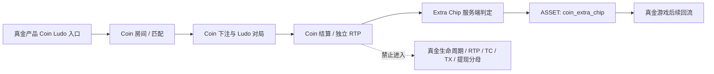

# 真金内嵌 Ludo 金币场｜Android/H5 数据指标与埋点设计 V2

> 本文只覆盖当前真金产品内嵌的 Coin Ludo 游戏：Android 为实施主端、H5 全量同构、iOS 仅保留公共契约和待补证标记。独立金币包 APP 的 IAA、广告、签到、任务、转盘、礼包和广告收入均不在本方案范围内。

## 1. 范围更正与证据状态

### 1.1 本次纳入与排除

| 范围 | 纳入 | 排除 |
|---|---|---|
| 产品形态 | 当前真金产品内嵌 Coin Ludo；Android、H5 | 独立 WajeCoins/金币包 APP |
| 玩法链路 | Coin 页签/入口、房间、匹配、局内、结算、Extra Chip、真金回流 | 广告请求、广告收入、签到、任务、抽奖、时长礼包 |
| 数据层 | 起源/Ares 页面模块事件、服务端游戏与资产事实、BQ 认证指标 | 以广告平台回调作为 Ludo 事实源 |
| iOS | 公共事件契约和字段保留 | 本轮实际验收和发布结论 |

### 1.2 当前历史基线

- Android 历史主链可复用：`MC → GAMESTART → GAMEEND → BETREWARD → ASSET`。
- H5 已有手动页面/模块采集能力：`PV/PD/MC/MV`，并采用固定 `page_id/module_id/event_id`。
- H5 自动事件 `AUTOPV/AUTOMC/AUTOPD/PAGELOAD` 历史入库接近 0，V2 不以自动采集作为 Ludo 验收前提。
- 现有金币场 AB 表仅有“有/无金币场”、累计 TX、留存、游戏人数/局数/下注/产出/Extra Cash 等历史口径；缺少 Ludo 匹配、房间、局、机器人、结算和奖励判定。
- 当前 Ares/BQ 实测连接尚未完成。本 V2 以 `historical_inventory` 为设计依据；Android/H5 实际事件、属性、质量和 BQ 映射均为 `actual_validation_pending`。

## 2. 产品与货币边界



### 2.1 货币口径

| 资产/事实 | 允许用途 | 统计约束 |
|---|---|---|
| `coin` | Coin Ludo 房间入场、下注、返还、结算 | 不进入正常真金生命周期、真实盈利、提现额度、真金流水或 TC/TX 分母 |
| `chip` | 真金游戏资产 | 若来自 Coin Ludo，必须在 `ASSET.flow_type=coin_extra_chip` 独立记录 |
| `coin_extra_chip` | Coin Ludo 满足规则后的服务端奖励 | 受规则版本、概率、累计上限和账本幂等控制 |

本轮按“服务端 Extra Chip 奖励”实现，不实现用户主动 Coin→Chip 兑换。若产品后续确认主动兑换，必须新建独立业务事件、汇率、额度和账本类型，不能复用 `coin_extra_chip`。

## 3. Android/H5 实现矩阵

| 层级 | Android | H5 | iOS |
|---|---|---|---|
| 页面 | Ares SDK `PV/PD` | 手动 `PV/PD`；不依赖 autoTrack | 契约预留，待实测 |
| 模块 | Ares SDK `MV/MC` | 手动 `MV/MC`，固定实际 `event_id` | 契约预留，待实测 |
| 游戏事实 | 服务端 `GAMESTART/GAMEEND/BETREWARD/ASSET` | 同一服务端事实，不以 H5 客户端结算为准 | 同一服务端事实 |
| 容器/客户端关联 | 原生 SDK 传公共上下文 | H5 壳与 Ludo 客户端桥接传上下文 | 待补证 |
| 发布验收 | 本轮主验收端 | 本轮全量验收端 | `pending_actual_validation` |

### 3.1 H5 桥接契约

H5 壳、Ludo 客户端和游戏服务端必须统一传递以下键：

```text
session_id
match_id
round_id / unique_id
game_id / play_id / mode_id / room_id
currency_type = coin
platform / surface_type
web_version / package_name
config_version / rtp_config_version / reward_rule_version
trace_id
```

壳层负责页面和模块事件；游戏服务端负责开局、下注、结束、结算、奖励和资产。H5 客户端不可单独确认金额到账或 Extra Chip 发放成功。

## 4. Ares 页面与模块埋点

### 4.1 逻辑页面映射

实际 `page_id` 由 Ares 创建后回填；本设计不硬编码随机生成的平台 ID。

| 逻辑页面键 | Android | H5 | 事件 | 必填字段 |
|---|---|---|---|---|
| `coin_ludo_tab` | 新增/复用 Coin 页签页 | 新增手动页 | `PV/PD` | `currency_type`、`game_id`、`config_version` |
| `coin_ludo_room_list` | 新增 | 新增手动页 | `PV/PD` | `game_id`、`player_count_option`、`coin_balance` |
| `coin_ludo_matching` | 新增 | 新增手动页 | `PV/PD` | `match_id`、`room_id`、`entry_fee` |
| `coin_ludo_game` | 新增 | 新增手动页 | `PV/PD` | `match_id`、`round_id`、`room_id` |
| `coin_ludo_settlement` | 新增 | 新增手动页 | `PV/PD` | `round_id`、`rank`、`end_reason` |
| `coin_ludo_insufficient` | 新增 | 新增手动页 | `PV/PD` | `room_id`、`entry_fee`、`coin_balance` |

`PD.event_duration` 沿用现有页面采集约定，单位统一为秒；同时以服务端时间衡量实际对局时长，不用页面停留替代游戏时长。

### 4.2 逻辑模块映射

| 逻辑模块键 | 事件 | 触发 | 条件字段 |
|---|---|---|---|
| `coin_ludo_tab_entry` | `MC` | 点击 Coin Ludo 页签/入口 | `entry_source`、`game_id` |
| `coin_ludo_card` | `MV/MC` | Ludo 卡片曝光/点击 | `placement_id`、`game_id` |
| `coin_ludo_room_select` | `MC` | 选择 2/4 人及房间 | `room_id`、`player_count_option`、`entry_fee`、`coin_balance` |
| `coin_ludo_quick_match` | `MC` | 点击快速匹配 | `room_id`、`entry_fee` |
| `coin_ludo_match_cancel` | `MC` | 匹配取消 | `match_id`、`wait_ms`、`cancel_reason` |
| `coin_ludo_insufficient_action` | `MV/MC` | 余额不足提示曝光/操作 | `room_id`、`entry_fee`、`coin_balance`、`action` |
| `coin_ludo_leave` | `MC` | 主动退出确认 | `round_id`、`leave_stage` |
| `coin_ludo_trustee` | `MV/MC` | 托管开始/取消提示 | `round_id`、`trustee_reason` |
| `coin_ludo_reconnect` | `MV/MC` | 重连提示/恢复 | `round_id`、`reconnect_result` |
| `coin_ludo_play_again` | `MC` | 点击再来一局 | `round_id`、`rank` |

公共字段固定为：`platform`、`surface_type`、`app_version/web_version`、`package_name`、`page_id`、`module_id`、`event_id`、`session_id`、`trace_id`、`game_id`、`play_id`、`mode_id`、`room_id`、`currency_type=coin`、`scenario_id`、`experiment_id`。

## 5. 服务端游戏与资产事实

### 5.1 复用事件链

```text
MC / PV
  → GAMESTART
  → GAMEEND
  → BETREWARD
  → ASSET
```

`GAMESTART/GAMEEND/BETREWARD/ASSET` 是唯一游戏与金额事实链；不能另建平行 `COIN_GAME_START/END/SETTLEMENT` 来重复计算局数与资产。

### 5.2 现有事件的 Ludo 条件字段

| 事件 | 必填/条件字段 | 实现要求 |
|---|---|---|
| `GAMESTART` | `event_uid`、`round_id/unique_id`、身份、`game_id`、`play_id`、`mode_id`、`room_id`、`match_id`、`entry_fee`、`player_num`、`human_count`、`robot_count`、`currency_type=coin`、版本/来源 | 匹配成功且服务端确认扣除入场 Coin 后上报；重试复用业务键 |
| `GAMEEND` | 现有 `status/end_action_state/game_time/is_robot` + `end_reason`、`rank`、`match_id`、`coin_bet_amount`、`coin_return_amount`、`player_num/human_count/robot_count`、规则版本 | 覆盖正常结算、主动退出、超时托管、断线、重连后结束和匹配取消；不适用字段按玩法矩阵标 N/A |
| `BETREWARD` | `round_id`、`settlement_id`、`rank`、`pool_amount`、`service_charge`、`coin_return_amount`、`currency_type=coin`、服务端时间 | 结算不得无对应局；金额单位、正负方向和资产类型可对账 |
| `ASSET` | `ledger_id`、`round_id`、`settlement_id/reward_id`、`asset_type`、`flow_type`、`amount`、`balance_before/after`、服务端时间 | 记录 `coin_bet`、`coin_return`、`coin_extra_chip`；同一账本键仅一次成功 |

### 5.3 新增服务端判定事件

新增 `COIN_LUDO_EXTRA_CHIP_DECISION`，用于记录奖励命中和未命中，避免只从 `ASSET` 看到已发奖用户。

```text
event_name: COIN_LUDO_EXTRA_CHIP_DECISION
required: event_uid, round_id, user_id, game_id, room_id,
          eligible, trigger_rule_id, reward_rule_version,
          probability, random_result, cap_before, cap_remaining,
          decision_result, block_reason, event_time_server
```

`decision_result` 枚举：`granted | not_hit | not_eligible | cap_reached | rule_disabled | invalid_state`。

真实发奖只通过 `ASSET` 表达：`asset_type=chip`、`flow_type=coin_extra_chip`、`reward_id`、`ledger_id`。`reward_id` 与 `ledger_id` 必须可幂等关联。

### 5.4 不采集的高频动作

不将每次掷骰、每步棋子移动、每个机器人评分路径作为全量生产 Ares 事件。仅保留托管、超时、退出、重连、结算和关键异常；机器人算法诊断使用受控采样服务日志，并带 `sample_rate` 与 `sample_reason`。

## 6. 指标与看板

### 6.1 指标体系

| 主题 | 指标 | 公式/口径 |
|---|---|---|
| 入口激活 | 资格用户、入口曝光率、入口点击率、首局率 | `exposed/eligible`、`entry_click/exposed`、`first_game_start/eligible` |
| 对局体验 | 匹配成功率、P50/P95 等待、完局率、退出/托管/断线/重连率 | 按 `match_id/round_id` 服务端事实和 UI 事件关联 |
| 机器人 | 机器人座位占比、机器人局占比、机器人局完局率 | `robot_seats/total_seats`；单独拆真人局与混合局 |
| Coin 经济 | Coin 下注、返还、余额变化、场次/模式分布 | 仅 `currency_type=coin` 的账本与结算 |
| RTP | `coin_rtp_core`、`coin_rtp_total` | `return/bet`；`(return+extra_chip_equivalent)/bet` |
| Extra Chip | 资格率、命中率、发放额、上限利用/阻断、重复率 | 以 `DECISION` 和 `ASSET` 双表核验 |
| 真金护栏 | 真金污染行、Coin 用户 7 日真金回流 | Coin 不入真金分母；回流只作为后续行为观察 |

### 6.1.1 活跃与复玩指标定义

统一约定：以首个有效 Coin Ludo `GAMESTART` 的服务端日期作为 `cohort_date`；仅统计 `is_robot=false` 的真人用户；同一用户同一天只计 1 个活跃用户；对局使用服务端 `round_id` 去重；主报表日界线为 `Asia/Hong_Kong`。

| 指标名称 | 指标编码 | 定义与算法 | 成熟/过滤规则 |
|---|---|---|---|
| Coin Ludo DAU | `coin_ludo_dau` | 当日有效 `GAMESTART` 的去重真人 `user_id` 数 | 排除机器人、无 `round_id`、`currency_type!=coin` |
| Coin Ludo 对局数 | `coin_ludo_rounds` | `COUNT(DISTINCT round_id)` | 仅服务端有效开局；重试复用同一键 |
| 人均对局数 | `rounds_per_dau` | `coin_ludo_rounds / coin_ludo_dau` | 分母为 0 返回 NULL，不补 0 |
| 首次对局用户数 | `coin_ludo_first_users` | 观察窗口内首次有效 `GAMESTART` 的真人用户数 | 需回看历史窗口，不能只按当天首次事件判断 |
| 首局进入率 | `coin_ludo_first_start_rate` | `coin_ludo_first_users / coin_ludo_eligible_users` | 资格用户口径需固定版本和人群规则 |
| 完局率 | `coin_ludo_completion_rate` | 有有效 `GAMEEND` 的 `round_id / 有效 GAMESTART round_id` | 按 `end_reason` 拆正常、退出、托管、断线 |
| 当日复玩率 | `coin_ludo_same_day_replay_rate` | 当日完成首局后又完成至少 1 局的用户 / 当日首局用户 | 首局和复玩均按 `round_id` 去重 |
| D1 复玩率 | `coin_ludo_d1_replay_rate` | `cohort_date+1` 有有效 `GAMESTART` 的 cohort 用户 / cohort 用户 | 仅使用成熟 ≥1 天 cohort |
| D3 复玩率 | `coin_ludo_d3_replay_rate` | `cohort_date+3` 有有效 `GAMESTART` 的 cohort 用户 / cohort 用户 | 仅使用成熟 ≥3 天 cohort |
| D7 复玩率 | `coin_ludo_d7_replay_rate` | `cohort_date+7` 有有效 `GAMESTART` 的 cohort 用户 / cohort 用户 | 仅使用成熟 ≥7 天 cohort |
| D1/D3/D7 活跃天数 | `coin_ludo_active_days_n` | cohort 用户在首局日起至 N 日内发生有效 `GAMESTART` 的不同日期数 | 记录窗口上限；未成熟标记 `immature` |
| 七日人均对局数 | `coin_ludo_7d_rounds_per_user` | cohort 首局日起 7 个自然日有效对局数 / cohort 用户数 | 仅成熟 ≥7 天 cohort |
| 复玩深度 | `coin_ludo_replay_depth_bucket` | 用户窗口内有效对局数分层：1、2–3、4–9、≥10 局 | 统计用户数和用户占比 |
| 真金回流率 | `coin_ludo_real_game_return_rate_n` | Coin Ludo cohort 在 D1/D3/D7 进入真金游戏的用户 / cohort 用户 | Coin 行为不得进入真金分母；只观察后续行为 |

未成熟 D1/D3/D7 cohort 必须标记 `maturity_status=immature`，不得用 0 代表没有复玩；完整日、时区和数据截止时间必须展示在看板上。

### 6.1.2 对局、匹配与奖励指标定义

| 指标名称 | 指标编码 | 算法 | 主要拆分 |
|---|---|---|---|
| 匹配成功率 | `coin_ludo_match_success_rate` | 成功生成有效 `GAMESTART` 的 `match_id / 匹配开始 match_id` | 端、房间、人数、版本、人机 |
| 匹配等待 P50/P95 | `coin_ludo_match_wait_p50/p95` | `match_result_server_ts - match_start_server_ts` 的分位数 | 端、房间、2/4 人、真人/机器人 |
| 取消匹配率 | `coin_ludo_match_cancel_rate` | 取消匹配 `match_id / MATCH_START match_id` | 取消原因、端、房间 |
| 真人占比 | `coin_ludo_human_seat_rate` | `human_seats / total_seats` | 房间、人数、时段、版本 |
| 机器人占比 | `coin_ludo_robot_seat_rate` | `robot_seats / total_seats` | 房间、人数、匹配等待 |
| 主动退出率 | `coin_ludo_surrender_rate` | `end_reason in (surrender,leave) 的局 / 有效局` | 退出阶段、端、版本 |
| 托管率 | `coin_ludo_trustee_rate` | 进入托管的局 / 有效局 | `trustee_reason`、真人/机器人 |
| 重连成功率 | `coin_ludo_reconnect_success_rate` | 重连恢复成功次数 / 重连次数 | 网络、端、版本 |
| 中位对局时长 | `coin_ludo_game_time_p50` | `GAMEEND.game_time` P50 | 游戏、房间、端、版本 |
| 结算完成率 | `coin_ludo_settlement_rate` | 有 `BETREWARD` 的结束局 / 有效 `GAMEEND` | 结算状态、版本、来源 |
| Coin 基础 RTP | `coin_ludo_rtp_core` | `SUM(coin_return_amount) / SUM(coin_bet_amount)` | 完整日、游戏、房间、端、RTP 配置版本 |
| Coin 总价值 RTP | `coin_ludo_rtp_total` | `(Coin返还 + Extra Chip折算价值) / Coin下注` | 同上，额外按充值区间拆分 |
| Extra Chip 资格率 | `coin_ludo_extra_eligible_rate` | `eligible=true 的判定数 / 判定总数` | 规则版本、游戏、房间 |
| Extra Chip 命中率 | `coin_ludo_extra_grant_rate` | `decision_result=granted / eligible 判定数` | 规则版本、概率区间 |
| 上限利用率 | `coin_ludo_cap_utilization` | 用户累计发放额 / 配置累计上限 | 用户充值区间、规则版本 |
| 上限阻断率 | `coin_ludo_cap_block_rate` | `decision_result=cap_reached / 奖励尝试数` | 用户层、版本、游戏 |
| 重复奖励率 | `coin_ludo_duplicate_reward_rate` | 重复 `reward_id/ledger_id` / 发放尝试数 | 来源、重试次数、版本 |
| 账本差异率 | `coin_ludo_ledger_diff_rate` | `ABS(流水变化-余额变化) / 流水金额` | 用户、资产、日期、版本 |
| 真金污染行数 | `coin_ludo_real_money_pollution_rows` | 真金事实表中 `currency_type=coin` 或 `settlement_scope=coin_ludo` 的行数 | 目标值为 0 |

### 6.2 看板与系统分工

| 系统 | 交付 |
|---|---|
| Ares | Android/H5 页面、模块、入口和体验漏斗；事件接收/入库/异常质量 |
| BigQuery | 游戏、结算、账本、RTP、Extra Chip、Coin→真金回流认证指标 |
| GM | 单用户 Coin 资格、余额、消耗、奖励、局与账本排障 |
| Metabase | 日常运营看板：活跃、体验、Coin 经济、RTP、奖励、质量护栏 |

统一筛选：完整日期、`platform`、`surface_type`、`app_version/web_version`、`package_name`、`channel`、`game_id`、`play_id`、`mode_id`、`room_id`、`is_robot`、`coin_rule_version`、`rtp_config_version`、`reward_rule_version`。

## 7. 数据质量与验收 SQL

### 7.1 游戏链完整性

```sql
SELECT
  target_day,
  platform,
  game_id,
  COUNT(DISTINCT s.round_id) AS started_rounds,
  COUNT(DISTINCT e.round_id) AS ended_rounds,
  COUNT(DISTINCT r.round_id) AS rewarded_rounds,
  COUNT(DISTINCT a.round_id) AS asset_rounds
FROM fact_game_start s
LEFT JOIN fact_game_end e USING (round_id)
LEFT JOIN fact_bet_reward r USING (round_id)
LEFT JOIN fact_asset a USING (round_id)
WHERE target_day BETWEEN :start_day AND :end_day
  AND s.currency_type = 'coin'
  AND s.game_id = :coin_ludo_game_id
GROUP BY target_day, platform, game_id;
```

### 7.2 RTP 与 Extra Chip

```sql
SELECT
  target_day,
  platform,
  room_id,
  rtp_config_version,
  SAFE_DIVIDE(SUM(coin_return_amount), SUM(coin_bet_amount)) AS coin_rtp_core,
  SAFE_DIVIDE(SUM(coin_return_amount) + SUM(extra_chip_equivalent), SUM(coin_bet_amount)) AS coin_rtp_total,
  COUNT(DISTINCT round_id) AS rounds
FROM fact_coin_ludo_round
WHERE target_day BETWEEN :start_day AND :end_day
GROUP BY target_day, platform, room_id, rtp_config_version;
```

### 7.3 奖励上限与货币污染

```sql
-- 上限不得突破
SELECT user_id, reward_rule_version,
       SUM(grant_amount) AS granted_amount,
       MAX(configured_cap) AS configured_cap
FROM fact_coin_ludo_extra_reward
WHERE grant_status = 'success'
GROUP BY user_id, reward_rule_version
HAVING granted_amount > configured_cap;

-- Coin 不得进入真金事实表
SELECT COUNT(*) AS polluted_rows
FROM fact_real_money_game
WHERE currency_type = 'coin'
   OR settlement_scope = 'coin_ludo';
```

### 7.4 质量门禁

| 规则 | 阈值/结果 | 处置 |
|---|---|---|
| 核心事件入库率 | `>= 99%` | 低于阈值为 P1，按端/版本/来源排查 |
| `GAMEEND` 异常率 | `>1%` 预警，`>3%` P1 | 暂停将该窗口用作 Ludo 业务基线 |
| 链路完整率 | `GAMESTART → GAMEEND → BETREWARD → ASSET >=99%` | 缺失局进入隔离和根因分类 |
| 账本对账 | 同 `ledger_id/reward_id` 不重复，余额差异为 0 | 差异为 P0 |
| Extra Chip 上限 | 永不超过配置上限 | 超发为 P0 |
| 真金污染 | `polluted_rows = 0` | 非 0 为 P0 |

## 8. 研发测试与回归

Android 和 H5 必须分别验证以下场景：

1. 2 人真人局、4 人真人局。
2. 机器人补位、匹配取消、余额不足。
3. 主动退出、超时托管、托管取消、断线重连、重连后结束。
4. 正常结算、Extra Chip 命中、未命中、不符合资格、达到上限。
5. 同一奖励回调重试、同一局重复上报、客户端重连重复请求。

每个场景必须提供：Ares `PV/PD/MC/MV` 测试轨迹、服务端事件样本、BQ/账本聚合对账、版本/包/配置版本和预期结果。上线后 24 小时进行 Android/H5 实测审计，连续 7 个完整日复核 RTP、奖励成本、机器人占比和真金干扰护栏。

## 9. Ares 实际映射待回填

| 逻辑对象 | Android 实际 ID | H5 实际 ID | 状态 |
|---|---|---|---|
| Coin Ludo 页面/模块 | 待 Ares 实测导出 | 待 Ares 实测导出 | `actual_validation_pending` |
| `GAMESTART` 字段实际 schema | 待 Ares/BQ 核验 | 服务端共用 | `actual_validation_pending` |
| `GAMEEND` Ludo 条件字段 | 待 Ares/BQ 核验 | 服务端共用 | `actual_validation_pending` |
| `BETREWARD/ASSET` Coin 字段 | 待 BQ 账本核验 | 服务端共用 | `actual_validation_pending` |
| Extra Chip 判定事件 | 待研发注册 | 待研发注册 | `new_required` |

## 10. 来源与历史资料

- 团队阅读版：[飞书原生文档](https://ksg964l11fam.sg.larksuite.com/docx/SmDndnMovoLCTfxSYrVl6bEDgEf)。
- [金币场 Ludo 游戏产品需求文档](https://ksg964l11fam.sg.larksuite.com/wiki/VZfswPRggiIWI4k8wQEliNJ7gTf)：玩法、匹配、机器人、房间和结算。
- [Coin 金币场需求](https://ksg964l11fam.sg.larksuite.com/wiki/TBBwwbu9zitqCOkZvvhlQZf2grf)：Coin 资产边界、Extra Chip 与统计约束。
- [金币场玩家身份打点](https://ksg964l11fam.sg.larksuite.com/wiki/ZBGnwiZLQiVoYwkXpielLtxUg3c)：Android/iOS 包、时间戳和用户 ID 规则。
- [模块采集方案](https://ksg964l11fam.sg.larksuite.com/wiki/JoHBwnONVi15DxkbVZ2lBVWDgse)：现有 H5 手动 `MC/MV` 和 Android 模块事件规范。
- [页面采集方案](https://ksg964l11fam.sg.larksuite.com/wiki/OdIUweqY0ivlDhk7Xj6ljXvhgGc)：现有 H5/Android `PV/PD` 及停留时长规范。
- 历史宽范围资料：[[金币包与金币场产品机制、指标与埋点设计-2026-08-17]]，仅保留为独立金币包 APP/广告业务背景，不作为本 V2 实施依据。

## 11. 指标 SQL 模板

### 11.1 D1/D3/D7 复玩率

```sql
WITH first_coin_ludo AS (
  SELECT
    user_id,
    MIN(DATE(event_time_server, 'Asia/Hong_Kong')) AS cohort_date
  FROM fact_game_start
  WHERE game_id = :coin_ludo_game_id
    AND currency_type = 'coin'
    AND is_robot = FALSE
    AND round_id IS NOT NULL
  GROUP BY user_id
),
cohort_activity AS (
  SELECT
    f.user_id,
    f.cohort_date,
    DATE_DIFF(DATE(s.event_time_server, 'Asia/Hong_Kong'), f.cohort_date, DAY) AS day_n
  FROM first_coin_ludo f
  JOIN fact_game_start s USING (user_id)
  WHERE s.game_id = :coin_ludo_game_id
    AND s.currency_type = 'coin'
    AND s.is_robot = FALSE
    AND s.round_id IS NOT NULL
    AND DATE(s.event_time_server, 'Asia/Hong_Kong') >= f.cohort_date
)
SELECT
  cohort_date,
  COUNT(DISTINCT user_id) AS cohort_users,
  COUNT(DISTINCT IF(day_n = 1, user_id, NULL)) AS d1_users,
  COUNT(DISTINCT IF(day_n = 3, user_id, NULL)) AS d3_users,
  COUNT(DISTINCT IF(day_n = 7, user_id, NULL)) AS d7_users,
  SAFE_DIVIDE(COUNT(DISTINCT IF(day_n = 1, user_id, NULL)), COUNT(DISTINCT user_id)) AS d1_rate,
  SAFE_DIVIDE(COUNT(DISTINCT IF(day_n = 3, user_id, NULL)), COUNT(DISTINCT user_id)) AS d3_rate,
  SAFE_DIVIDE(COUNT(DISTINCT IF(day_n = 7, user_id, NULL)), COUNT(DISTINCT user_id)) AS d7_rate,
  CASE
    WHEN DATE_DIFF(:data_cutoff, cohort_date, DAY) >= 7 THEN 'mature'
    ELSE 'immature'
  END AS maturity_status
FROM cohort_activity
GROUP BY cohort_date;
```

### 11.2 对局数与完局率

```sql
SELECT
  target_day,
  platform,
  game_id,
  COUNT(DISTINCT s.round_id) AS started_rounds,
  COUNT(DISTINCT e.round_id) AS ended_rounds,
  SAFE_DIVIDE(COUNT(DISTINCT e.round_id), COUNT(DISTINCT s.round_id)) AS completion_rate,
  COUNT(DISTINCT s.user_id) AS active_users,
  SAFE_DIVIDE(COUNT(DISTINCT s.round_id), COUNT(DISTINCT s.user_id)) AS rounds_per_user
FROM fact_game_start s
LEFT JOIN fact_game_end e USING (round_id)
WHERE s.target_day BETWEEN :start_day AND :end_day
  AND s.game_id = :coin_ludo_game_id
  AND s.currency_type = 'coin'
  AND s.is_robot = FALSE
GROUP BY target_day, platform, game_id;
```

### 11.3 事件质量与链路完整率

```sql
SELECT
  target_day,
  platform,
  app_version,
  web_version,
  package_name,
  event_name,
  COUNT(*) AS received_count,
  COUNTIF(is_valid = TRUE) AS valid_count,
  COUNTIF(error_type IS NOT NULL) AS invalid_count,
  COUNTIF(event_uid IS NULL OR round_id IS NULL) AS missing_key_count,
  COUNTIF(is_duplicate = TRUE) AS duplicate_count,
  SAFE_DIVIDE(COUNTIF(error_type IS NOT NULL), COUNT(*)) AS invalid_rate
FROM fact_event_quality
WHERE target_day BETWEEN :start_day AND :end_day
  AND event_name IN ('GAMESTART','GAMEEND','BETREWARD','ASSET')
GROUP BY target_day, platform, app_version, web_version, package_name, event_name;
```

## 12. 埋点详细附录：公共字段

所有事件继承以下公共字段；原始层保留平台原类型，规范化层按 `normalized_type` 使用。

| 字段 | 原始类型 | 规范化类型 | 必填 | 说明/枚举 |
|---|---|---|---|---|
| `event_name` | string | STRING | 是 | `PV/PD/MV/MC/GAMESTART/GAMEEND/BETREWARD/ASSET/COIN_LUDO_EXTRA_CHIP_DECISION` |
| `event_version` | string | STRING | 是 | 例如 `v2` |
| `event_uid` | string | STRING | 是 | 事件幂等键，重试复用 |
| `ingest_id` | string | STRING | 是 | 接收层记录键 |
| `event_time_client` | string/int | TIMESTAMP | 条件 | 客户端行为时间 |
| `event_time_server` | string/int | TIMESTAMP | 是 | 服务端事实时间 |
| `received_at` | string/int | TIMESTAMP | 是 | 入库接收时间 |
| `source` | enum | STRING | 是 | `client/server/bridge/retry/unknown` |
| `platform` | enum | STRING | 是 | `android/h5/ios/server` |
| `app_version` | string | STRING | Android 条件 | APP 版本 |
| `web_version` | string | STRING | H5 条件 | H5 版本 |
| `package_name` | string | STRING | 条件 | 包名/分包 |
| `channel` | string | STRING | 条件 | 渠道 |
| `user_id` | string | STRING | 条件 | 登录用户 ID |
| `uuid` | string | STRING | 条件 | 设备/匿名身份 |
| `session_id` | string | STRING | 条件 | 会话键 |
| `trace_id` | string | STRING | 建议 | 跨端链路键 |
| `game_id` | int/string | STRING | 游戏事件必填 | 游戏维表 ID |
| `play_id` | int/string | STRING | 游戏事件必填 | 玩法 ID |
| `mode_id` | int/string | STRING | 条件 | 模式 ID |
| `room_id` | int/string | STRING | 条件 | 场次 ID |
| `match_id` | string | STRING | 匹配/游戏必填 | 匹配业务键 |
| `round_id`/`unique_id` | string | STRING | 游戏事件必填 | 对局唯一键 |
| `currency_type` | enum | STRING | 游戏/资产必填 | 固定 `coin` |
| `config_version` | string | STRING | 条件 | 通用配置版本 |
| `rtp_config_version` | string | STRING | RTP 相关必填 | RTP 配置版本 |
| `reward_rule_version` | string | STRING | 奖励相关必填 | Extra Chip 规则版本 |
| `is_robot` | bool/int | BOOL | 游戏事件条件 | `true/false` |
| `is_retry` | bool | BOOL | 是 | 是否重试 |
| `retry_count` | int | INT64 | 是 | 非负整数 |
| `result_code` | string | STRING | 结果条件 | 业务结果码 |
| `error_code` | string | STRING | 异常条件 | 错误码 |

## 13. 埋点详细附录：页面与模块事件

### 13.1 页面事件 `PV/PD`

| 事件 | 触发时机 | 字段 | 类型 | 必填/枚举 |
|---|---|---|---|---|
| `PV` | 进入 Coin Ludo 页签 | `page_id`、`scene`、`entry_source` | STRING、STRING、STRING | `page_id/scene` 必填；scene=`coin_tab` |
| `PD` | 离开 Coin Ludo 页签 | `page_id`、`event_duration` | STRING、INT64 | `event_duration>=0`，单位秒 |
| `PV` | 进入房间列表 | `page_id`、`game_id`、`coin_balance` | STRING、STRING、NUMERIC | `game_id` 必填 |
| `PD` | 离开房间列表 | `page_id`、`event_duration` | STRING、INT64 | 单位秒 |
| `PV` | 进入匹配页 | `page_id`、`match_id`、`room_id`、`entry_fee` | STRING、STRING、STRING、NUMERIC | 匹配键和场次必填 |
| `PD` | 离开匹配页 | `page_id`、`event_duration`、`match_result` | STRING、INT64、ENUM | match_result=`success/cancel/timeout` |
| `PV` | 进入游戏页 | `page_id`、`match_id`、`round_id`、`room_id` | STRING、STRING、STRING、STRING | 游戏上下文必填 |
| `PD` | 离开游戏页 | `page_id`、`event_duration`、`leave_stage` | STRING、INT64、ENUM | leave_stage=`playing/ended/reconnect` |
| `PV` | 进入结算页 | `page_id`、`round_id`、`rank`、`end_reason` | STRING、STRING、INT64、ENUM | rank 条件必填 |
| `PD` | 离开结算页 | `page_id`、`event_duration` | STRING、INT64 | 单位秒 |
| `PV` | 余额不足提示出现 | `page_id`、`room_id`、`entry_fee`、`coin_balance` | STRING、STRING、NUMERIC、NUMERIC | 余额和场次必填 |

### 13.2 模块事件 `MV/MC`

| 事件 | 模块 | 字段 | 类型 | 必填/枚举 |
|---|---|---|---|---|
| `MV` | Ludo 游戏卡片曝光 | `module_id`、`event_id`、`placement_id`、`game_id` | STRING、STRING、STRING、STRING | 4 字段必填 |
| `MC` | 点击 Ludo 入口/卡片 | `module_id`、`event_id`、`entry_source`、`game_id` | STRING、STRING、ENUM、STRING | entry_source=`tab/banner/game_card/deeplink/other` |
| `MC` | 选择房间 | `module_id`、`event_id`、`room_id`、`player_count_option`、`entry_fee`、`coin_balance` | STRING、STRING、STRING、INT64、NUMERIC、NUMERIC | player_count=`2/4` |
| `MC` | 快速匹配 | `module_id`、`event_id`、`room_id`、`entry_fee` | STRING、STRING、STRING、NUMERIC | 场次字段必填 |
| `MC` | 取消匹配 | `module_id`、`event_id`、`match_id`、`wait_ms`、`cancel_reason` | STRING、STRING、STRING、INT64、ENUM | reason=`user/timeout/network/system` |
| `MV` | 余额不足提示曝光 | `module_id`、`event_id`、`room_id`、`entry_fee`、`coin_balance` | STRING、STRING、STRING、NUMERIC、NUMERIC | 金额字段必填 |
| `MC` | 余额不足操作 | `module_id`、`event_id`、`action`、`room_id` | STRING、STRING、ENUM、STRING | action=`close/get_coin/other` |
| `MC` | 主动退出确认 | `module_id`、`event_id`、`round_id`、`leave_stage` | STRING、STRING、STRING、ENUM | stage=`matching/playing/settlement` |
| `MV` | 托管提示曝光 | `module_id`、`event_id`、`round_id`、`trustee_reason` | STRING、STRING、STRING、ENUM | reason=`timeout/disconnect/user` |
| `MC` | 托管开始/取消 | `module_id`、`event_id`、`round_id`、`action` | STRING、STRING、STRING、ENUM | action=`start/cancel` |
| `MV` | 重连提示曝光 | `module_id`、`event_id`、`round_id`、`reconnect_result` | STRING、STRING、STRING、ENUM | result=`pending/success/fail/game_over` |
| `MC` | 重连操作 | `module_id`、`event_id`、`round_id`、`action` | STRING、STRING、STRING、ENUM | action=`retry/close` |
| `MC` | 再来一局 | `module_id`、`event_id`、`round_id`、`rank` | STRING、STRING、STRING、INT64 | rank 1–4 |

Android 使用 Ares SDK；H5 使用手动 `PV/PD/MV/MC`。实际 `page_id/module_id/event_id` 由 Ares 导出后回填，当前不虚构 ID。

## 14. 埋点详细附录：服务端事件

### 14.1 `GAMESTART`

| 字段 | 类型 | 必填 | 规则 |
|---|---|---|---|
| `event_uid` | STRING | 是 | 重试复用 |
| `round_id`/`unique_id` | STRING | 是 | 一局唯一 |
| `match_id` | STRING | 是 | 匹配业务键 |
| `game_id`/`play_id`/`mode_id`/`room_id` | STRING | 是 | 规范化 ID；原始字段可为 Integer |
| `entry_fee` | NUMERIC | 是 | Coin 入场费，非负 |
| `player_num` | INT64 | 是 | 2 或 4 |
| `human_count`/`robot_count` | INT64 | 是 | 非负，合计不超过 player_num |
| `currency_type` | ENUM | 是 | 固定 `coin` |
| `config_version` | STRING | 条件 | 生效配置版本 |
| `rtp_config_version` | STRING | 是 | 使用的 RTP 配置 |
| `is_robot` | BOOL | 条件 | 座位级机器人标记 |

### 14.2 `GAMEEND`

| 字段 | 类型 | 必填 | 规则 |
|---|---|---|---|
| `event_uid` | STRING | 是 | 事件幂等键 |
| `round_id`/`unique_id` | STRING | 是 | 必须关联 GAMESTART |
| `status` | ENUM | 是 | `completed/failed/quit/timeout/disconnected/cancelled` |
| `end_reason` | ENUM | 是 | `normal/surrender/trustee/timeout/reconnect/game_over` |
| `rank` | INT64 | 条件 | 1–4；2 人/4 人按规则 |
| `game_time` | INT64 | 是 | 服务端毫秒，非负 |
| `coin_bet_amount` | NUMERIC | 是 | Coin 下注金额 |
| `coin_return_amount` | NUMERIC | 是 | Coin 返还金额 |
| `player_num`/`human_count`/`robot_count` | INT64 | 是 | 与 GAMESTART 一致 |
| `is_robot` | BOOL | 条件 | 真人/机器人 |
| `config_version`/`rtp_config_version` | STRING | 是 | 规则可追溯 |

### 14.3 `BETREWARD`

| 字段 | 类型 | 必填 | 规则 |
|---|---|---|---|
| `event_uid` | STRING | 是 | 事件幂等键 |
| `round_id`/`settlement_id` | STRING | 是 | 结算唯一关联 |
| `rank` | INT64 | 条件 | 1–4 |
| `pool_amount`/`service_charge` | NUMERIC | 是 | Coin 奖池和平台抽成 |
| `coin_return_amount` | NUMERIC | 是 | Coin 返还 |
| `currency_type` | ENUM | 是 | 固定 `coin` |
| `event_time_server` | TIMESTAMP | 是 | 服务端结算时间 |

### 14.4 `ASSET`

| 字段 | 类型 | 必填 | 规则 |
|---|---|---|---|
| `event_uid`/`ledger_id` | STRING | 是 | 单笔账本唯一 |
| `round_id` | STRING | 条件 | 游戏相关变更必填 |
| `settlement_id`/`reward_id` | STRING | 条件 | 结算/奖励关联 |
| `asset_type` | ENUM | 是 | `coin/chip` |
| `flow_type` | ENUM | 是 | `coin_bet/coin_return/coin_extra_chip/rollback` |
| `amount` | NUMERIC | 是 | 非法负数需按方向校验 |
| `balance_before`/`balance_after` | NUMERIC | 是 | 余额可解释 |
| `is_retry`/`is_duplicate` | BOOL | 是 | 幂等质量字段 |

### 14.5 `COIN_LUDO_EXTRA_CHIP_DECISION`

| 字段 | 类型 | 必填 | 规则 |
|---|---|---|---|
| `event_uid`/`round_id` | STRING | 是 | 判定和对局关联 |
| `user_id`/`game_id`/`room_id` | STRING | 是 | 真人用户、游戏和场次 |
| `eligible` | BOOL | 是 | 是否满足资格 |
| `trigger_rule_id`/`reward_rule_version` | STRING | 是 | 规则版本 |
| `probability`/`random_result` | NUMERIC | 是 | 服务端判定值 |
| `cap_before`/`cap_remaining` | NUMERIC | 是 | 上限前后余额 |
| `decision_result` | ENUM | 是 | `granted/not_hit/not_eligible/cap_reached/rule_disabled/invalid_state` |
| `block_reason` | ENUM | 条件 | `none/not_eligible/cap_reached/rule_disabled/duplicate/invalid_state` |
| `event_time_server` | TIMESTAMP | 是 | 服务端判定时间 |

## 15. 验收标准

- D1/D3/D7 指标能按 cohort 输出成熟状态，未成熟不补 0。
- 活跃、复玩、真金回流分母排除机器人；对局数按有效 `round_id` 去重。
- 每个事件字段均有类型、必填性和枚举/示例。
- `GAMESTART → GAMEEND → BETREWARD → ASSET` 可按 `session_id + match_id + round_id` 关联。
- `reward_id/ledger_id` 不重复，Extra Chip 不超上限，Coin 不污染真金事实表。
- Android/H5 各完成 2 人、4 人、机器人补位、取消匹配、余额不足、退出、托管、重连、结算和奖励边界测试。
- 实际 Ares/BQ 审计完成后回填 page/module/event ID 和物理表名；在此之前保留 `actual_validation_pending`。
