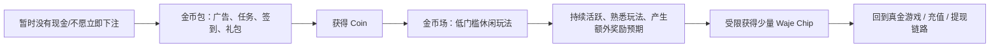
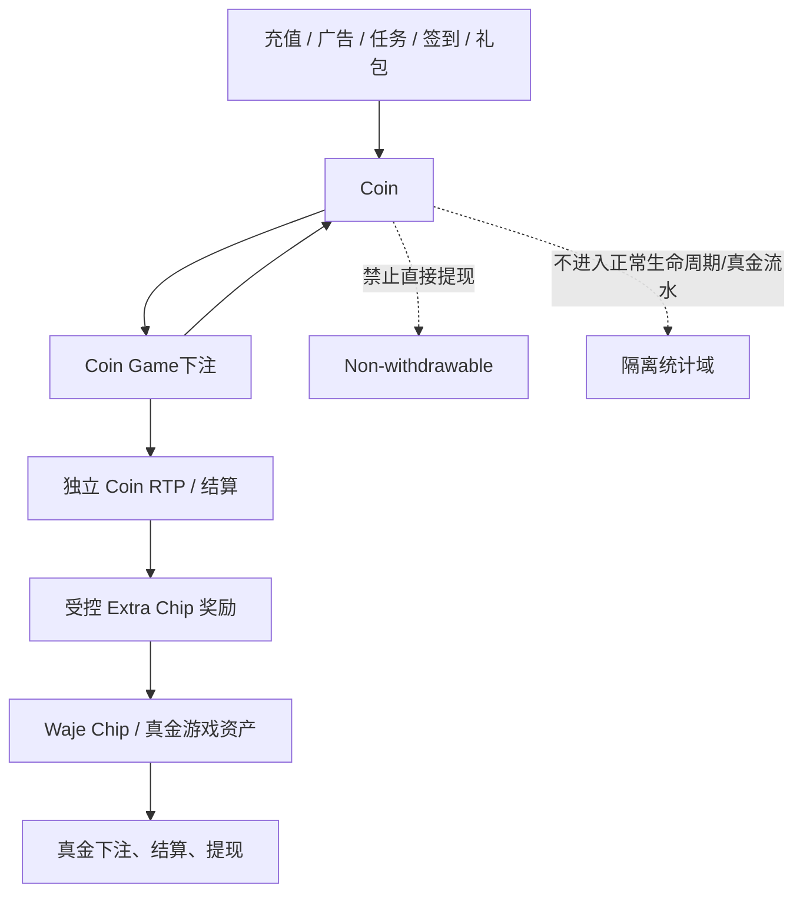
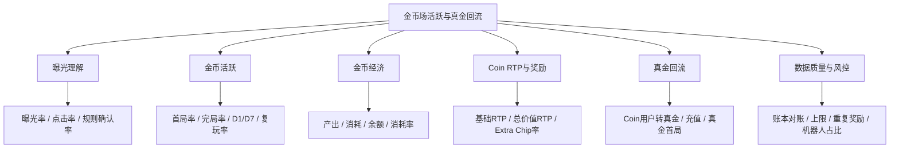

# 金币包与金币场产品机制、指标与埋点设计

> 本文基于 Lincy 系列产品文档、相关金币场 PRD/需求/埋点文档，以及产品与 BOSS 沟通结论整理。产品定位和货币边界已作为业务设计输入；RTP、兑换比例、上限和生效版本仍需以正式配置与服务端事实验收。

> **范围更正：** 本文保留“独立金币包 APP + 广告/任务/签到/抽奖 + Coin 游戏”的历史宽范围资料。它不再作为当前真金产品内嵌 Ludo 金币场的研发实施依据；请改用 [[真金内嵌Ludo金币场-APP-H5数据指标与埋点设计-V2-2026-08-19]]。

## 1. 来源与证据范围

| 来源 | 作用 | 证据状态 |
|---|---|---|
| [金币包与真金包金币场-Lincy](https://ksg964l11fam.sg.larksuite.com/wiki/XJnxwAqAhidzzlkUYDRlvtKTggb?from=from_copylink) | 总导航页 | revision 20；子页导航，正文较少 |
| [金币包 APP 产品需求文档](https://ksg964l11fam.sg.larksuite.com/wiki/Tn7iwtrk6i7z1Ek3eoPl3t6Zgrg) | 金币包定位、广告/任务/签到/抽奖、游客和新手路径 | revision 5137；已读取正文 |
| [金币场 Ludo 游戏产品需求文档](https://ksg964l11fam.sg.larksuite.com/wiki/VZfswPRggiIWI4k8wQEliNJ7gTf) | 场次、匹配、局内玩法、机器人、结算和额外奖励表现 | revision 2468；已读取正文 |
| [Coin 金币场需求](https://ksg964l11fam.sg.larksuite.com/wiki/TBBwwbu9zitqCOkZvvhlQZf2grf) | Coin 货币边界、游戏范围、额外 Chip、上限和统计口径 | revision 6633；已读取正文 |
| [金币场玩家身份打点](https://ksg964l11fam.sg.larksuite.com/wiki/ZBGnwiZLQiVoYwkXpielLtxUg3c) | 平台、包名、时间戳和用户 ID 尾数的人群规则 | revision 9；已读取正文 |
| [金币场 V2 优化点](https://ksg964l11fam.sg.larksuite.com/wiki/RgsSwuk60iQpt1khcIqlTDrugAe) | 曝光、规则解释、充值后提示和金币理解 | 已读取正文 |

原文包含图片授权链接和产品配置细节，本文不复制授权码、用户标识或测试数据。

## 2. 产品定位与核心判断

### 2.1 产品定位

金币包和金币场不是第二套真金业务，而是围绕真金产品建立的“低门槛活跃与召回层”：



### 2.2 产品功能模块的业务约束

以下属于利益相关方提出的产品定位，不能直接视为已验证线上事实：

- 主要目标是活跃和临时娱乐，不是替代真金游戏的收入主路径。
- Coin 场 RTP 可以略高于真金游戏，但必须小于 1；最终以配置版本和成熟样本验证。
- Coin 赢得的价值可通过受限规则转化为少量 Waje Chip，用于真金游戏。
- Coin 和 Chip 的转化、奖励和上限必须隔离，不能干扰真金游戏的正常 RTP、生命周期、提现和资产体系。

## 3. 货币体系与边界

### 3.1 推荐货币关系



### 3.2 货币口径表

| 资产 | 可从哪里来 | 可用于哪里 | 是否可提现 | 是否进入真金统计 |
|---|---|---|---|---|
| Coin | 广告、任务、签到、礼包、Coin 游戏返还/胜利 | Coin Game | 否 | 不进入正常真金生命周期、下注流水和提现口径 |
| Waje Chip / Cash | 真金充值、真金结算、Coin 额外奖励 | 真金游戏、提现相关链路 | 按现有规则 | 进入真金资产和提现口径 |
| Extra Chip | Coin 游戏满足额外奖励条件 | 真金游戏 | 按 Chip 规则 | 单独记为 `coin_extra_chip`，不可混入普通充值或普通奖励 |
| Bonus/历史奖励 | 历史配置或存量用户 | 按迁移策略处理 | 以旧规则为准 | 迁移期间单独隔离，不与 Coin 混算 |

### 3.3 必须先确认的货币问题

当前文档同时出现“Coin 赢得额外 Chip”和“金币兑换少量 Chip”两种表述。研发必须明确这是：

1. **额外奖励模式**：Coin 下注后满足条件，系统直接发放 Chip；还是
2. **兑换模式**：用户主动将 Coin 按比例兑换为 Chip。

建议数据模型将两者拆为不同 `flow_type`，禁止用同一个 `COIN_CONVERT` 事件混合记录。

## 4. 用户与玩法机制

### 4.1 金币包功能模块

| 模块 | 机制 | 主要目标 |
|---|---|---|
| 新手路径 | 游客进入、抽奖券、新手奖励、首局引导、每日任务 | 降低首次体验门槛 |
| 金币资产 | 余额、流水、产出和消耗 | 建立可感知的非现金资产 |
| 时长礼包 | 首次即时领取，后续按间隔倒计时，看广告可翻倍 | 提升回访和广告曝光 |
| 每日签到 | 连续 7 日、自然日重置、可看广告膨胀 | 建立日活习惯 |
| 每日任务 | 登录、广告、对局、胜利、时长等任务 | 驱动行为和广告变现 |
| 转盘抽奖 | 抽奖券消耗或看广告获得抽奖机会 | 提供短期反馈和奖励期待 |
| Coin Game | 进入金币场游戏进行消费和娱乐 | 金币消耗、玩法活跃和真金回流 |

### 4.2 Coin Game 玩法特点

- 金币场拥有独立页签和独立游戏集合。
- Coin 场游戏不能进入普通 `often game` 或真金游戏推荐统计。
- 真人匹配类游戏原则上只匹配 Coin 玩家；若真人不足，可按配置使用机器人。
- 入口场次根据玩家 Coin 余额选择，余额不足时阻断进入。
- Ludo 支持 2/4 人、房间入场费、匹配、机器人托管、退出/挂机、排名和结算。
- Ludo 典型链路为：场次选择 → 匹配 → 开局 → 掷骰/移动 → 结算 → 额外 Chip 判定。
- 机器人策略会枚举合法走法并按终点推进、击杀收益和被击风险评分，必须单独标记真人/机器人结果。

### 4.3 Ludo 结算口径

文档设计为：

```text
奖池 = 入场金额 × 实际参赛人数
平台抽成 = 奖池 × 配置抽成比例
可分配奖池 = 奖池 - 平台抽成
```

2 人模式为赢家获得扣除平台抽成后的奖池；4 人模式按排名比例分配。文档示例中存在“亚军/季军对应金额文字与比例标签不完全一致”的问题，需研发在结算配置和验收用例中确认。

## 5. 指标体系

### 5.1 指标树



### 5.2 核心指标定义

| 指标 | 公式/口径 | 主要拆分 |
|---|---|---|
| 金币场曝光率 | `coin_exposed_users / eligible_users` | 平台、版本、渠道、用户资格规则 |
| 金币场点击率 | `coin_tab_or_entry_click_users / exposed_users` | 入口位置、弹窗、专题页 |
| 规则理解率 | `rule_ack_users / rule_view_users` | 文案版本、端、场景 |
| 首局进入率 | `first_coin_game_start_users / coin_acquired_users` | 来源、游戏、用户生命周期 |
| 完局率 | `coin_game_end_count / coin_game_start_count` | 游戏、房间、机器人、网络 |
| Coin D1/D7 | 首次 Coin Game 用户在 D1/D7 再次活跃 | 新老包、端、渠道、游戏 |
| Coin 消耗率 | `coin_spend / (opening_coin_balance + coin_earn)` | 账户、来源、游戏、时间 |
| Coin 余额沉淀 | `end_coin_balance / active_coin_users` | 用户分层、来源、游戏 |
| Coin 基础 RTP | `sum(coin_return) / sum(coin_bet)` | 游戏、场次、模式、生命周期 |
| Coin 总价值 RTP | `(coin_return + extra_chip_equivalent) / coin_bet` | 游戏、用户充值区间、配置版本 |
| Extra Chip 触发率 | `extra_chip_grant_rounds / eligible_coin_rounds` | 游戏、条件、充值区间 |
| 上限利用率 | `granted_chip / configured_chip_cap` | 用户、充值区间、规则版本 |
| 上限阻断率 | `cap_blocked_attempts / extra_reward_attempts` | 用户层、版本、游戏 |
| 真金回流率 | `coin_users_start_real_game_7d / coin_active_users` | D1/D7、游戏、渠道 |
| 账本对账差异率 | `abs(sum(flow)-delta(balance)) / sum(flow)` | 资产类型、来源、版本 |
| 机器人占比 | `robot_seats / total_coin_game_seats` | 游戏、场次、时段、匹配等待 |

### 5.3 RTP 观测原则

业务目标为“Coin 场 RTP 略高于真金游戏但低于 1”，应同时监控：

```text
coin_rtp_core = Coin返还 / Coin下注
coin_rtp_total = (Coin返还 + Extra Chip折算价值) / Coin下注
```

- `coin_rtp_core` 用于判断游戏本体水位。
- `coin_rtp_total` 用于判断用户获得的总价值。
- Extra Chip 不应直接混入 Coin 返还字段。
- 低样本、未成熟日、机器人主导局和配置切换日必须单独标记。
- 告警只针对成熟窗口；不以单日极端值直接调整 RTP 配置。

## 6. 埋点上报设计

### 6.1 统一事件信封

所有核心事件至少包含：

```text
event_name, event_version, event_id
event_time_client, event_time_server, received_at
source, platform, app_version/web_version, package_name
channel, attribution_media, user_id, uuid, session_id, trace_id
game_id, game_type, mode_id, room_id, match_id, battle_id, unique_id
asset_type, currency_type, amount, balance_before, balance_after
config_version, rtp_config_version, reward_rule_version
is_robot, is_retry, retry_count, result_code, error_code
```

金融和资产事件以服务端事件为准；客户端事件只说明曝光、点击和体验路径。

### 6.2 事件清单

| 事件名 | 触发时机 | 关键业务字段 | 来源 | 优先级 |
|---|---|---|---|---|
| `COIN_ELIGIBILITY_DECISION` | 判定用户是否可见/可用金币场 | `eligible、reason、rule_version、effective_at` | 服务端 | P0 |
| `COIN_EXPOSURE` | 金币入口、页签、弹窗、专题页曝光 | `scene、placement_id、exposure_id、rule_version` | 客户端 | P1 |
| `COIN_ENTRY_CLICK` | 点击金币场入口/Play Now/Get Coins | `scene、target、entry_id` | 客户端 | P1 |
| `COIN_RULE_VIEW` | 查看金币规则说明 | `rule_version、scene、content_version` | 客户端 | P1 |
| `COIN_RULE_ACK` | 关闭/确认规则说明 | `action、rule_version` | 客户端 | P1 |
| `COIN_ACQUIRE_ATTEMPT` | 尝试获得金币 | `source、reward_id、amount_expected` | 服务端 | P1 |
| `COIN_ACQUIRE_RESULT` | 金币到账或失败 | `source、amount、balance_after、result_code、idempotency_key` | 服务端 | P0 |
| `COIN_LEDGER_CHANGE` | 每笔 Coin 账本变更 | `flow_type、direction、amount、before/after、ref_id` | 服务端 | P0 |
| `COIN_LOBBY_VIEW` | 进入金币游戏页签/大厅 | `game_count、available_balance、config_version` | 客户端 | P1 |
| `COIN_ROOM_SELECT` | 选择人数和场次 | `game_id、player_count、room_id、entry_fee、balance` | 客户端/服务端 | P1 |
| `COIN_MATCH_START` | 开始匹配 | `match_id、room_id、player_count、currency_type` | 服务端 | P1 |
| `COIN_MATCH_RESULT` | 匹配成功/超时/取消 | `match_id、real_count、robot_count、wait_ms、result_code` | 服务端 | P1 |
| `COIN_GAME_START` | Coin 游戏正式开局 | `unique_id、game_id、mode_id、room_id、entry_fee、is_robot` | 服务端 | P0 |
| `COIN_BET` | 单次 Coin 下注/扣除 | `unique_id、bet_no、bet_amount、balance_before/after` | 服务端 | P0 |
| `COIN_GAME_END` | 单局/单场结束 | `unique_id、status、rank、duration、is_robot` | 服务端 | P0 |
| `COIN_SETTLEMENT` | 结算 Coin 返还和排名奖金 | `settlement_id、pool、fee、return_amount、rank` | 服务端 | P0 |
| `COIN_EXTRA_REWARD_DECISION` | 判断是否获得额外 Chip | `trigger、win_count、win_amount、probability、random_result、cap_remaining` | 服务端 | P0 |
| `COIN_EXTRA_REWARD_GRANT` | 额外 Chip 发放 | `reward_id、asset_type、amount、grant_status、cap_before/after` | 服务端 | P0 |
| `COIN_CONVERSION` | 若存在主动 Coin→Chip 兑换 | `coin_amount、chip_amount、rate、cap、status` | 服务端 | P0 |
| `COIN_LIMIT_BLOCK` | 余额、次数、上限或资格阻断 | `limit_type、rule_version、current、limit、reason` | 服务端 | P0 |
| `COIN_VIEW_RECORD` | 查看金币/额外 Chip 记录 | `record_type、page、record_id` | 客户端 | P2 |
| `COIN_AD_REWARD` | 看广告后金币/抽奖券到账 | `ad_id、placement_id、reward_type、reward_amount、status` | 服务端 | P1 |
| `COIN_REAL_GAME_RETURN` | Coin 用户进入真金游戏 | `source_coin_game、days_since_coin_first、real_game_id` | 服务端 | P1 |

### 6.3 资产事件的关键枚举

```text
asset_type:
  coin | chip | cash | bonus

flow_type:
  ad_reward | task_reward | sign_in | time_gift | recharge_gift
  coin_bet | coin_return | coin_win | coin_adjustment
  coin_extra_chip | coin_conversion | refund | rollback

result_code:
  success | insufficient_balance | daily_limit | cap_reached
  duplicate_request | config_disabled | invalid_state | server_error
```

## 7. 推荐数据模型与看板

### 7.1 BigQuery 事实层

建议建立或映射以下事实表：

```text
fact_coin_ledger             -- Coin / Chip 资产流水
fact_coin_game_round         -- 开局、下注、结束、结算
fact_coin_extra_reward       -- 额外奖励判断、发放、上限
fact_coin_exposure           -- 曝光、点击、规则理解
fact_coin_ad_reward          -- 广告与奖励到账
dim_coin_game                -- Coin 游戏、场次、平台、供应商
dim_coin_config              -- 货币、RTP、奖励、上限和生效版本
agg_coin_daily               -- 日粒度认证指标
```

### 7.2 Ares / GM / Metabase 分工

| 平台 | 建议职责 |
|---|---|
| Ares | Coin 页面、入口、玩法路径和埋点漏斗；查看事件质量 |
| BigQuery | Coin 账本、游戏、RTP、Extra Chip 和真金回流认证事实 |
| GM | 单用户剩余 Coin、消耗 Coin、Extra Chip、资格和风控排障 |
| Metabase | 日常运营看板、游戏对比、余额分布、RTP、上限和回流分析 |

### 7.3 看板主题

1. **金币活跃看板**：曝光、入口点击、金币获取、首局、完局、D1/D7、复玩。
2. **金币经济看板**：产出、消耗、余额、沉淀、来源、消耗率和负余额。
3. **Coin 游戏看板**：游戏/场次、下注、完局、排名、真人/机器人、匹配等待。
4. **RTP 与奖励看板**：核心 RTP、总价值 RTP、Extra Chip 触发率、金额和上限利用率。
5. **真金回流看板**：Coin 用户进入真金、充值、真金首局、提现行为变化。
6. **数据质量与风控看板**：账本差异、重复奖励、上限超发、跨货币污染和配置切换。

统一筛选器：日期、平台、版本、包体、渠道、国家、用户资格规则、生命周期、游戏、场次、货币、配置版本、RTP 版本、真人/机器人。

## 8. 验收 SQL / 伪代码

### 8.1 Coin 账本对账

```sql
SELECT
  user_id,
  asset_type,
  SUM(CASE WHEN direction = 'in' THEN amount ELSE -amount END) AS flow_delta,
  MAX(balance_after) KEEP (DENSE_RANK LAST ORDER BY event_time_server) -
    MIN(balance_before) KEEP (DENSE_RANK FIRST ORDER BY event_time_server) AS balance_delta,
  SUM(CASE WHEN is_duplicate = 1 THEN 1 ELSE 0 END) AS duplicate_rows
FROM fact_coin_ledger
WHERE target_day BETWEEN :start_day AND :end_day
GROUP BY user_id, asset_type
HAVING ABS(flow_delta - balance_delta) > :tolerance OR duplicate_rows > 0;
```

### 8.2 Coin RTP 与总价值 RTP

```sql
SELECT
  target_day,
  game_id,
  room_id,
  rtp_config_version,
  SUM(coin_return_amount) / NULLIF(SUM(coin_bet_amount), 0) AS coin_rtp_core,
  (SUM(coin_return_amount) + SUM(extra_chip_equivalent)) /
    NULLIF(SUM(coin_bet_amount), 0) AS coin_rtp_total,
  COUNT(DISTINCT unique_id) AS rounds,
  COUNT(DISTINCT user_id) AS users
FROM fact_coin_game_round
WHERE target_day BETWEEN :start_day AND :end_day
GROUP BY target_day, game_id, room_id, rtp_config_version;
```

验收：成熟样本下 `coin_rtp_core < 1` 且 `coin_rtp_total < 1`；若出现超阈值，先检查配置版本、样本量、重复结算和 Extra Chip 是否重复计入。

### 8.3 Extra Chip 上限

```sql
SELECT
  user_id,
  reward_rule_version,
  SUM(grant_amount) AS granted_amount,
  MAX(configured_cap) AS configured_cap,
  MAX(cap_after) AS last_cap_after
FROM fact_coin_extra_reward
WHERE grant_status = 'success'
GROUP BY user_id, reward_rule_version
HAVING granted_amount > configured_cap OR last_cap_after < 0;
```

### 8.4 Coin 是否污染真金统计

```sql
SELECT COUNT(*) AS polluted_rows
FROM fact_real_money_game
WHERE currency_type = 'coin'
   OR settlement_scope = 'coin_game';
```

该查询应返回 0；Coin 必须在独立事实层和独立报表口径中统计。

## 9. 优先级与研发验收

### P0：必须先完成

- Coin 与 Chip/Cash 账本彻底隔离。
- `COIN_GAME_START → COIN_BET → COIN_GAME_END → COIN_SETTLEMENT` 可完整对账。
- Extra Chip 奖励具备幂等键、上限、规则版本和发放状态。
- Coin 不进入正常真金生命周期、真金下注流水、普通奖励和提现分母。
- RTP 同时输出基础值和含 Extra Chip 的总价值值。

### P1：核心分析能力

- 曝光、规则理解、金币获取、首局、完局、复玩和真金回流漏斗。
- 按游戏/场次/端/版本/渠道/生命周期拆分 RTP 和奖励。
- 真人/机器人、匹配等待、挂机、退出和断线重连可观测。
- Metabase/Ares 看板具备统一筛选器和数据刷新时间。

### P2：体验与长期优化

- 金币规则弹窗、入口曝光、广告奖励、查看记录和多语言文案。
- Coin 游戏排序、推荐、玩法扩充和专题页转化优化。
- 老 Bonus 迁移和存量用户并行展示的历史兼容分析。

## 10. 待确认项

1. Coin→Chip 是主动兑换还是满足条件后的 Extra Chip 奖励，二者需拆成不同业务流程。
2. “Coin RTP 略高于真金但不高于 1”的目标值、容差、成熟窗口和最小下注样本量。
3. Extra Chip 是否允许直接进入提现、是否受正常提现/KYC/风控规则约束。
4. Ludo 四人结算示例中的亚军/季军金额标签与比例是否写反。
5. Coin 游戏的生命周期是否完全独立，还是只不进入“常规货币水位”而保留单独 Coin 生命周期。
6. Coin 用户与机器人匹配的比例上限、机器人行为是否计入 RTP 和活跃指标。
7. 充值赠送 Coin、广告 Coin、任务 Coin、游戏返还 Coin 是否使用同一余额，还是分来源冻结/限额。
8. H5 与 APP 的 Coin 游戏、包体、配置时间戳和用户身份规则是否完全一致。

## 11. 证据边界

- `source_document`：产品策划和 PRD 文档中的机制与页面设计。
- `stakeholder_statement`：活跃定位、临时娱乐、RTP 略高但小于 1、少量 Chip 回流和不干扰真金体系。
- `current_production_fact`：必须由 BQ 服务端事实、配置生效快照、GM 账本或埋点质量回执确认，本文不直接宣称已上线。
- 本文不复制原文中的账号、用户明细、授权码图片 URL 或测试数据。
