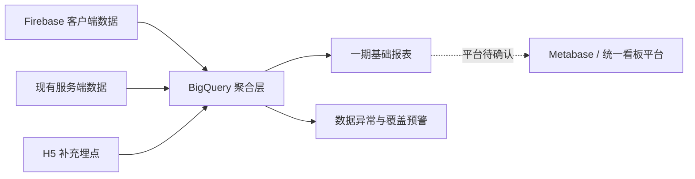

# 设备性能监控报表搭建推进会议：数据链路与验收行动

## 来源与证据

- 会议：设备性能监控报表搭建工作推进会议
- 时间：2026-09-11 14:01–15:03（GMT+8）
- [AI 智能纪要](https://ksg964l11fam.sg.larksuite.com/docx/P0FYdOuFso7EJAxu0w8lNHrBgug)，document token `P0FYdOuFso7EJAxu0w8lNHrBgug`，revision 4，SHA-256 `9810291d419e1b54e737a3b04f62638ab9bc08351c5ee8f393fd07cfa96ff03f`
- [逐字稿](https://ksg964l11fam.sg.larksuite.com/docx/Hg60doMmxoDoYjxS1volHrLugsh)，document token `Hg60doMmxoDoYjxS1volHrLugsh`，revision 3，SHA-256 `0bfd038d903a0169959fdd5d8b1de5e20ec85fe5510b43c2ec945d0e991fd687`
- 证据规则：逐字稿为事实主来源；AI 纪要只用于核对待办与结构。未保存参会人 ID、完整逐字稿、账号或设备明细。

## 摘要

一期目标是先打通设备与 H5 游戏性能数据链路，并以可核验的基础表承载数据健康、端侧覆盖和异常预警。当前方案仍有两项关键决策未闭环：看板最终使用 Metabase 还是纳入统一的 Ares 平台，以及不同自研游戏的 `ready / playable / bet-ready` 验收信号如何定义。

会议确认先从浏览器 H5 和重点自研游戏切入；APP 内打开 H5 游戏、联运游戏内部行为以及所有游戏一次性全覆盖均不属于一期可直接承诺的范围。

## 一期数据链路

### 已确认范围

- 数据源包含 Firebase 客户端数据、现有服务端事实和 H5 手工补充埋点。
- 埋点数据统一进入 BigQuery，报表层从聚合数据读取。
- H5 一期优先补充 `game load`、`ready`、`bet-ready / bet` 三段链路。
- 开发只上报关键节点及事件时间，持续时长由数据层基于关联键和时间戳计算。
- 一期先以基础表格呈现，预计包含三类状态表与一类异常/预警表；复杂可视化后置。

### 当前不纳入一期完整范围

- APP WebView 打开 H5 游戏的完整入口归因与防重复统计。
- 第三方联运游戏内部加载、控件和主玩法行为；只能观测外层框架。
- 所有自研游戏一次性全覆盖。
- 逐资源、逐控件的完整渲染质量监测。

## H5 游戏可玩信号

会议明确指出：框架或 HTML ready、资源加载完成、页面可见、控件可点击和真实可下注并不是同一个状态。不同游戏存在异步资源、新手教程、长短连接和控件先亮后灰等差异，不能用一个通用前端事件直接替代真实可玩性。

一期暂以“服务端必要配置已到达，且下注相关控件进入可操作状态”作为候选统一方向；但这仍需对每款试点游戏写出技术触发点和测试验收条件。捕鱼类控件状态反复、新手教程无下注按钮等场景必须单列，不能强套候选标准。

| 信号 | 含义 | 当前状态 |
|---|---|---|
| `H5_GAME_LOAD` | 框架/页面加载链路启动并完成基础加载 | 需接入 |
| `H5_GAME_READY` | 游戏关键配置、连接和必要资源达到定义状态 | 需按游戏定义 |
| `H5_BET_READY` | 用户进入可发起有效下注的状态 | 一期候选核心口径 |
| 首次下注成功 | 用户行为和服务端成功事实 | 不替代 ready，仅用于后续漏斗 |

## 试点游戏与验收模板

- 产品/数据先提供 2–3 款高流量或重点推广的自研游戏。
- 试点应覆盖不同技术形态，例如纯 H5、自研 Cocos/特殊框架、长连接和短连接。
- WHOT 被会议明确提及为必须考虑的重点候选；其余具体名单尚未确认。
- 每款游戏必须分别给出：入口点击、加载开始、关键配置完成、连接成功、可下注、首次下注成功、失败与恢复的触发条件。
- 研发、产品与测试共同确认触发点；测试按文档中的场景和可观察结果验收。

## 平台与职责

| 主题 | 会议状态 | 后续动作 |
|---|---|---|
| 数据底座 | BigQuery 作为聚合与交换层 | 梳理 Firebase 表、服务端表和 H5 事件映射 |
| 看板平台 | Metabase 是当前快速实现方案，但组织希望后续统一平台 | 与相关负责人确认 Metabase 是否作为正式交付入口 |
| Firebase 数据同步 | 需梳理表、同步和推送 | 数据团队补齐来源、刷新和限制说明 |
| H5 埋点 | 开发补充重点游戏三段事件 | 产品先交试点游戏和验收标准 |
| 报表与聚合 | 数据侧负责聚合、基础报表和异常表 | 先做可读表格和原型，再扩展可视化 |

## 关键风险与待验证项

1. **看板平台未定。** 会议没有形成 Ares 与 Metabase 的最终决策；不得把“当前先做 Metabase”解释为长期平台已经批准。
2. **ready 语义仍需逐游戏冻结。** 通用框架只能统一事件契约，不能自动保证每款游戏的技术触发点相同。
3. **APP 内 H5 可能重复上报。** APP 入口与 H5 页面可能各记一次加载，缺少 `surface_type / game_load_id / source` 时会重复计数。
4. **联运游戏观测有限。** 无法修改第三方游戏代码时，只能分析外层启动、容器和返回结果。
5. **Firebase 拉取上限待实测。** 会议提及每日约 100 万条的限制，应通过当前 Firebase/BigQuery 配置和运行日志核验，不能直接固化为平台事实。
6. **四周计划是工作安排，不是上线承诺。** 一周基础报表、二至三周扩展、第四周校验仍依赖埋点、数据同步和平台决策。

## 行动清单

- [ ] 提供一期重点游戏清单，并覆盖至少两到三种技术形态。
- [ ] 为每款试点游戏定义 `load / ready / bet-ready` 技术触发点和测试验收场景。
- [ ] 产出一期基础报表原型，明确四张表的字段、筛选维度、状态和异常展示。
- [ ] 用现有 Firebase 数据搭建可演示的基础看板，展示当前能力与数据缺口。
- [ ] 确认 Metabase 与统一看板平台的阶段性和长期定位。
- [ ] 核验 Firebase → BigQuery 的表、刷新、推送、日数据量和失败重跑机制。
- [ ] 对 APP WebView/H5 双重入口另立归因和去重方案，不混入浏览器 H5 一期结果。

## 对产品、数据、研发和测试的影响

- 产品：必须把“用户能看到页面”与“游戏真正可下注”拆开，并为重点游戏冻结验收定义。
- 数据：需维护统一事件契约、关联键、端形态和数据质量状态，不用客户端点击替代服务端事实。
- 研发：实现关键节点事件和稳定业务键；不同游戏允许不同触发实现，但输出字段保持一致。
- 测试：按正常网络、弱网、失败、恢复、新手教程和连接类型逐场景核验事件顺序与耗时。

## 相关知识资产

- [[../02-数据/Waje多端设备与性能报表看板需求-V3-六模块-2026-09-02]]
- [[../02-数据/Waje-H5设备与性能补充埋点需求-V3-2026-08-24]]
- [[../02-数据/Waje-H5设备与性能补充埋点需求-需求文档-V3-2026-08-24]]
- [[../02-数据/Waje自研游戏H5加载、可玩与可下注埋点上报需求-V2-2026-09-01]]
- [[../02-数据/Waje-H5起源埋点上报全量盘点-2026-08-28]]
- [[../02-数据/Waje多端设备性能事件会话看板实施方案V1-2026-08-27]]

## 证据状态

- `transcript_verified`：核心范围、争议和行动来自逐字稿。
- `ai_todo_cross_checked`：待办结构与AI纪要交叉核对。
- `decision_pending`：看板平台、试点游戏清单和逐游戏ready验收标准尚未最终确认。
- `data_not_verified`：本轮未读取 Firebase、BigQuery、Ares 或 Metabase 的实际数据与运行状态。

