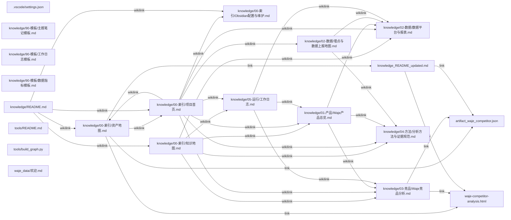

# 代码与资产图谱

由 `tools/build_graph.py` 生成。节点来自项目文件；边来自 Markdown 链接、Obsidian 双向链接以及 Python/JS/TS 的相对导入。

节点数：21；关系数：33。

```mermaid
flowchart LR
  n__vscode_settings_json_89aa4470[".vscode/settings.json"]
  n_artifact_waje_competitor_json_f3c40f0a["artifact_waje_competitor.json"]
  n_knowledge_00____Obsidian______md_31e5f11f["knowledge/00-索引/Obsidian配置与维护.md"]
  n_knowledge_00_________md_c2fd3c86["knowledge/00-索引/知识地图.md"]
  n_knowledge_00_________md_671ae03f["knowledge/00-索引/资产地图.md"]
  n_knowledge_00_________md_c589ef97["knowledge/00-索引/项目首页.md"]
  n_knowledge_01____Waje_____md_fdb04b4e["knowledge/01-产品/Waje产品总览.md"]
  n_knowledge_02______________md_a8b678a2["knowledge/02-数据/埋点与数据上报地图.md"]
  n_knowledge_02____________md_398ae481["knowledge/02-数据/数据平台与报表.md"]
  n_knowledge_03____Waje_____md_39804e5a["knowledge/03-竞品/Waje竞品分析.md"]
  n_knowledge_04______________md_44eb2405["knowledge/04-方法/分析方法与证据规范.md"]
  n_knowledge_05_________md_94c59b2d["knowledge/05-运行/工作日志.md"]
  n_knowledge_90___________md_74dc43df["knowledge/90-模板/主题笔记模板.md"]
  n_knowledge_90___________md_4e6798ac["knowledge/90-模板/工作日志模板.md"]
  n_knowledge_90___________md_14271f53["knowledge/90-模板/数据指标模板.md"]
  n_knowledge_README_md_40d54a8c["knowledge/README.md"]
  n_knowledge_README_updated_md_c9a48eac["knowledge_README_updated.md"]
  n_tools_README_md_016dda51["tools/README.md"]
  n_tools_build_graph_py_963a5d0f["tools/build_graph.py"]
  n_waje_competitor_analysis_html_4d677ff2["waje-competitor-analysis.html"]
  n_waje_data____md_b812607e["waje_data/欢迎.md"]
  n_knowledge_00_________md_c2fd3c86 -->|wikilink| n_knowledge_01____Waje_____md_fdb04b4e
  n_knowledge_00_________md_c2fd3c86 -->|wikilink| n_knowledge_02____________md_398ae481
  n_knowledge_00_________md_c2fd3c86 -->|wikilink| n_knowledge_03____Waje_____md_39804e5a
  n_knowledge_00_________md_c2fd3c86 -->|wikilink| n_knowledge_04______________md_44eb2405
  n_knowledge_00_________md_c2fd3c86 -->|wikilink| n_knowledge_05_________md_94c59b2d
  n_knowledge_00_________md_671ae03f -->|link| n_artifact_waje_competitor_json_f3c40f0a
  n_knowledge_00_________md_671ae03f -->|wikilink| n_knowledge_00_________md_c589ef97
  n_knowledge_00_________md_671ae03f -->|link| n_knowledge_README_updated_md_c9a48eac
  n_knowledge_00_________md_671ae03f -->|link| n_waje_competitor_analysis_html_4d677ff2
  n_knowledge_00_________md_c589ef97 -->|wikilink| n_knowledge_00____Obsidian______md_31e5f11f
  n_knowledge_00_________md_c589ef97 -->|wikilink| n_knowledge_00_________md_671ae03f
  n_knowledge_00_________md_c589ef97 -->|wikilink| n_knowledge_01____Waje_____md_fdb04b4e
  n_knowledge_00_________md_c589ef97 -->|wikilink| n_knowledge_02______________md_a8b678a2
  n_knowledge_00_________md_c589ef97 -->|wikilink| n_knowledge_02____________md_398ae481
  n_knowledge_00_________md_c589ef97 -->|wikilink| n_knowledge_03____Waje_____md_39804e5a
  n_knowledge_00_________md_c589ef97 -->|wikilink| n_knowledge_04______________md_44eb2405
  n_knowledge_00_________md_c589ef97 -->|wikilink| n_knowledge_05_________md_94c59b2d
  n_knowledge_01____Waje_____md_fdb04b4e -->|wikilink| n_knowledge_02____________md_398ae481
  n_knowledge_01____Waje_____md_fdb04b4e -->|wikilink| n_knowledge_03____Waje_____md_39804e5a
  n_knowledge_01____Waje_____md_fdb04b4e -->|wikilink| n_knowledge_04______________md_44eb2405
  n_knowledge_02______________md_a8b678a2 -->|wikilink| n_knowledge_02____________md_398ae481
  n_knowledge_02______________md_a8b678a2 -->|wikilink| n_knowledge_04______________md_44eb2405
  n_knowledge_03____Waje_____md_39804e5a -->|link| n_artifact_waje_competitor_json_f3c40f0a
  n_knowledge_03____Waje_____md_39804e5a -->|link| n_waje_competitor_analysis_html_4d677ff2
  n_knowledge_05_________md_94c59b2d -->|wikilink| n_knowledge_01____Waje_____md_fdb04b4e
  n_knowledge_05_________md_94c59b2d -->|wikilink| n_knowledge_02____________md_398ae481
  n_knowledge_05_________md_94c59b2d -->|wikilink| n_knowledge_03____Waje_____md_39804e5a
  n_knowledge_README_md_40d54a8c -->|wikilink| n_knowledge_00____Obsidian______md_31e5f11f
  n_knowledge_README_md_40d54a8c -->|wikilink| n_knowledge_00_________md_c2fd3c86
  n_knowledge_README_md_40d54a8c -->|wikilink| n_knowledge_00_________md_671ae03f
  n_knowledge_README_md_40d54a8c -->|wikilink| n_knowledge_00_________md_c589ef97
  n_knowledge_README_updated_md_c9a48eac -->|link| n_artifact_waje_competitor_json_f3c40f0a
  n_knowledge_README_updated_md_c9a48eac -->|link| n_waje_competitor_analysis_html_4d677ff2
```

> Mermaid 关系超过 250 条时仅展示前 250 条，完整数据见 `code-graph.json`。
